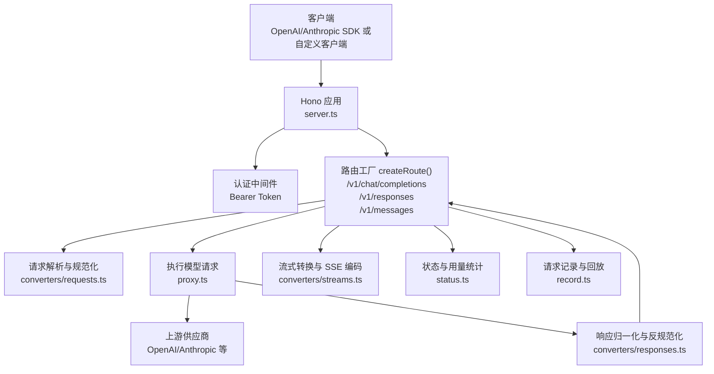
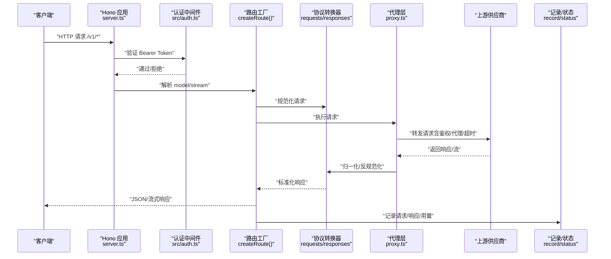
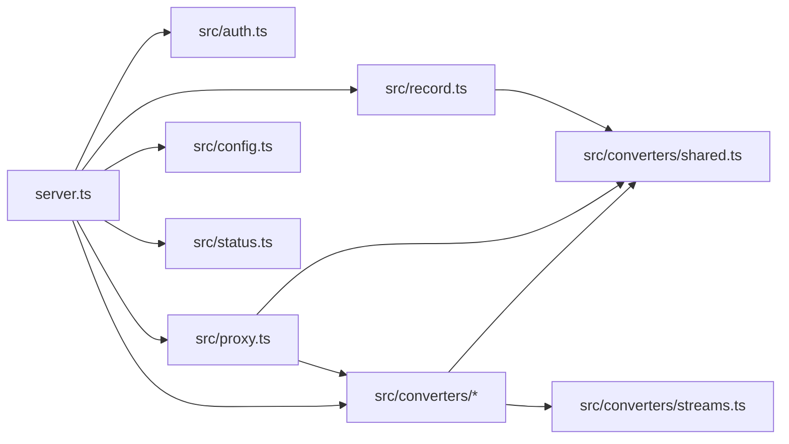

# API 参考

<cite>
**本文引用的文件**
- [README.md](file://README.md)
- [server.ts](file://server.ts)
- [src/auth.ts](file://src/auth.ts)
- [src/proxy.ts](file://src/proxy.ts)
- [src/config.ts](file://src/config.ts)
- [src/converters/index.ts](file://src/converters/index.ts)
- [src/converters/requests.ts](file://src/converters/requests.ts)
- [src/converters/responses.ts](file://src/converters/responses.ts)
- [src/converters/shared.ts](file://src/converters/shared.ts)
- [src/converters/streams.ts](file://src/converters/streams.ts)
- [src/status.ts](file://src/status.ts)
- [src/record.ts](file://src/record.ts)
</cite>

## 目录
1. [简介](#简介)
2. [项目结构](#项目结构)
3. [核心组件](#核心组件)
4. [架构总览](#架构总览)
5. [详细组件分析](#详细组件分析)
6. [依赖关系分析](#依赖关系分析)
7. [性能考量](#性能考量)
8. [故障排查指南](#故障排查指南)
9. [结论](#结论)
10. [附录](#附录)

## 简介
本文件为 nanollm 的完整 API 参考，涵盖其作为 LLM 模型代理服务提供的 HTTP 接口与统一抽象层。核心能力包括：
- 对外同时暴露三套接口规范：/v1/chat/completions（OpenAI Chat）、/v1/responses（OpenAI Responses）、/v1/messages（Anthropic Messages）
- 统一的请求/响应转换器，实现不同供应商接口之间的互操作
- Bearer Token 认证与访问控制
- 流式输出（SSE）与非流式输出
- 模型兜底策略与失败追踪
- 请求记录与调试工具

## 项目结构
- 服务器入口与路由：server.ts
- 认证与访问控制：src/auth.ts
- 上游代理与请求转换：src/proxy.ts
- 配置解析与模型解析：src/config.ts
- 协议转换器：src/converters/*
- 流式转换与事件编解码：src/converters/streams.ts
- 状态与用量统计：src/status.ts
- 请求记录与回放：src/record.ts

图表来源
- [server.ts:663-800](file://server.ts#L663-L800)
- [src/proxy.ts:569-630](file://src/proxy.ts#L569-L630)
- [src/converters/requests.ts:38-164](file://src/converters/requests.ts#L38-L164)
- [src/converters/responses.ts:26-162](file://src/converters/responses.ts#L26-L162)
- [src/converters/streams.ts:118-251](file://src/converters/streams.ts#L118-L251)
- [src/status.ts:84-172](file://src/status.ts#L84-L172)
- [src/record.ts:185-408](file://src/record.ts#L185-L408)

章节来源
- [server.ts:145-213](file://server.ts#L145-L213)
- [src/auth.ts:1-42](file://src/auth.ts#L1-L42)
- [src/proxy.ts:41-98](file://src/proxy.ts#L41-L98)
- [src/config.ts:57-60](file://src/config.ts#L57-L60)

## 核心组件
- 路由工厂与统一处理流程：针对三种协议格式构建路由，统一提取 model、stream、执行候选模型选择与失败回退，支持 passthrough 与转换两种路径。
- 协议转换器：将 OpenAI Chat、OpenAI Responses、Anthropic Messages 三种接口统一为内部 Normalized 数据结构，并在必要时进行反规范化回写。
- 代理与上游交互：根据模型配置构造上游 URL、鉴权头、代理、超时与请求体变换，支持 JSON 与 multipart/form-data。
- 认证与访问控制：Bearer Token 认证，支持 Cookie 回写与一次性 URL token 登录。
- 流式处理：SSE 解析与事件序列化，保证流式输出的完整性与正确性。
- 状态与用量：记录成功率、平均耗时、TTFB、Token 使用等指标。
- 请求记录：记录请求/响应、重放、调试。

章节来源
- [server.ts:663-800](file://server.ts#L663-L800)
- [src/converters/index.ts:27-77](file://src/converters/index.ts#L27-L77)
- [src/proxy.ts:274-407](file://src/proxy.ts#L274-L407)
- [src/auth.ts:11-22](file://src/auth.ts#L11-L22)
- [src/converters/streams.ts:27-90](file://src/converters/streams.ts#L27-L90)
- [src/status.ts:84-172](file://src/status.ts#L84-L172)
- [src/record.ts:185-408](file://src/record.ts#L185-L408)

## 架构总览
下图展示了从客户端请求到上游供应商再到响应返回的完整链路，包括认证、协议转换、流式处理与记录。

图表来源
- [server.ts:195-213](file://server.ts#L195-L213)
- [server.ts:663-800](file://server.ts#L663-L800)
- [src/proxy.ts:274-407](file://src/proxy.ts#L274-L407)
- [src/converters/requests.ts:38-164](file://src/converters/requests.ts#L38-L164)
- [src/converters/responses.ts:26-162](file://src/converters/responses.ts#L26-L162)
- [src/record.ts:256-408](file://src/record.ts#L256-L408)

## 详细组件分析

### /v1/chat/completions（OpenAI Chat）
- 方法与路径：POST /v1/chat/completions
- 认证：需要 Bearer Token（除 /health 外）
- 请求体字段：遵循 OpenAI Chat Completion 规范，常见字段包括 model、messages、temperature、top_p、max_completion_tokens、stream 等
- 响应体：遵循 OpenAI Chat Completion 规范，choices[0].message.content 为文本或内容数组，可能包含 refusal、tool_calls、thinking/reasoning/reasoning_content 等扩展字段
- 特殊行为：
  - 若模型配置 image=false，assistant 历史中的多模态内容会被降级为纯文本拼接
  - 支持流式输出（text/event-stream），SSE 事件经转换器解析后逐段返回
- 示例（请求/响应路径参考）：
  - 请求示例：[示例路径:1-309](file://README.md#L1-L309)
  - 成功响应示例：[示例路径:1-309](file://README.md#L1-L309)
  - 错误示例（401/404/5xx）：[示例路径:1-309](file://README.md#L1-L309)

章节来源
- [server.ts:663-800](file://server.ts#L663-L800)
- [src/converters/requests.ts:38-81](file://src/converters/requests.ts#L38-L81)
- [src/converters/responses.ts:26-54](file://src/converters/responses.ts#L26-L54)
- [src/converters/streams.ts:118-251](file://src/converters/streams.ts#L118-L251)
- [README.md:1-309](file://README.md#L1-L309)

### /v1/responses（OpenAI Responses）
- 方法与路径：POST /v1/responses
- 认证：需要 Bearer Token（除 /health 外）
- 请求体字段：遵循 OpenAI Responses 规范，常见字段包括 model、instructions、input、max_output_tokens、temperature、top_p、parallel_tool_calls、prompt_cache_key、reasoning、text、tools、tool_choice 等
- 响应体：遵循 OpenAI Responses 规范，output 为消息与工具调用的组合，支持 reasoning_summary_text、output_text、refusal 等
- 特殊行为：
  - 支持 item_reference 的解析与缓存引用解析
  - 默认禁用 store（除非显式开启），避免上游存储
  - 流式输出（text/event-stream），事件序列经转换器解析
- 示例（请求/响应路径参考）：
  - 请求示例：[示例路径:1-309](file://README.md#L1-L309)
  - 成功响应示例：[示例路径:1-309](file://README.md#L1-L309)
  - 错误示例（401/404/5xx）：[示例路径:1-309](file://README.md#L1-L309)

章节来源
- [server.ts:663-800](file://server.ts#L663-L800)
- [src/converters/requests.ts:83-115](file://src/converters/requests.ts#L83-L115)
- [src/converters/responses.ts:56-108](file://src/converters/responses.ts#L56-L108)
- [src/converters/streams.ts:255-410](file://src/converters/streams.ts#L255-L410)
- [README.md:1-309](file://README.md#L1-L309)

### /v1/messages（Anthropic Messages）
- 方法与路径：POST /v1/messages
- 认证：需要 Bearer Token（除 /health 外）
- 请求体字段：遵循 Anthropic Messages 规范，常见字段包括 model、messages、system、max_tokens、temperature、top_p、stop_sequences、tools、tool_choice、output_config、thinking、metadata 等
- 响应体：遵循 Anthropic Messages 规范，content 包含 text、thinking、tool_use 等块，stop_reason 表示结束原因
- 特殊行为：
  - 支持 thinking 与 signature 的处理，可配置忽略无效历史（ignore_invalid_history）
  - 流式输出（text/event-stream），事件序列经转换器解析
- 示例（请求/响应路径参考）：
  - 请求示例：[示例路径:1-309](file://README.md#L1-L309)
  - 成功响应示例：[示例路径:1-309](file://README.md#L1-L309)
  - 错误示例（401/404/5xx）：[示例路径:1-309](file://README.md#L1-L309)

章节来源
- [server.ts:663-800](file://server.ts#L663-L800)
- [src/converters/requests.ts:117-164](file://src/converters/requests.ts#L117-L164)
- [src/converters/responses.ts:119-162](file://src/converters/responses.ts#L119-L162)
- [src/converters/streams.ts:414-490](file://src/converters/streams.ts#L414-L490)
- [README.md:1-309](file://README.md#L1-L309)

### /v1/models
- 方法与路径：GET /v1/models
- 认证：需要 Bearer Token（除 /health 外）
- 功能：列出所有公开模型名称（包含 fallback 分组名与配置中的模型名）
- 返回：数组形式的模型名列表
- 示例（请求/响应路径参考）：
  - 成功响应示例：[示例路径:1-309](file://README.md#L1-L309)

章节来源
- [server.ts:663-800](file://server.ts#L663-L800)
- [src/config.ts:57-60](file://src/config.ts#L57-L60)
- [README.md:1-309](file://README.md#L1-L309)

### /health
- 方法与路径：GET /health
- 认证：无需 Bearer Token
- 功能：健康检查端点，返回服务可用性信息
- 示例（请求/响应路径参考）：
  - 成功响应示例：[示例路径:1-309](file://README.md#L1-L309)

章节来源
- [server.ts:191-193](file://server.ts#L191-L193)
- [README.md:1-309](file://README.md#L1-L309)

### 认证与访问控制（Bearer Token）
- 配置：server.auth.token
- 作用范围：除 /health 外的所有入口均受保护
- 支持方式：
  - Authorization: Bearer <token>
  - 查询参数 token=xxx
  - Cookie（登录成功后写入同源认证 Cookie）
- 行为：
  - 未配置 token 时关闭认证
  - 修改 token 需重启进程生效
- 示例（请求/响应路径参考）：
  - 认证使用示例：[示例路径:1-309](file://README.md#L1-L309)

章节来源
- [server.ts:195-213](file://server.ts#L195-L213)
- [src/auth.ts:1-42](file://src/auth.ts#L1-L42)
- [README.md:1-309](file://README.md#L1-L309)

### 统一抽象与协议转换
- 抽象层：将三种接口统一为 NormalizedRequest/NormalizedResponse，包含 roles、parts、toolCalls、finishReason、usage 等
- 转换函数：
  - chat -> responses / responses -> chat
  - chat -> anthropic / anthropic -> chat
  - responses -> anthropic / anthropic -> responses
- 图像兼容：openai-chat 在 image=false 时降级多模态内容为文本
- 思维块处理：支持 thinking、redacted_thinking、signature 等
- 示例（请求/响应路径参考）：
  - 转换函数示例：[示例路径:27-77](file://src/converters/index.ts#L27-L77)
  - 规范化/反规范化示例：[示例路径:38-164](file://src/converters/requests.ts#L38-L164), [示例路径:26-162](file://src/converters/responses.ts#L26-L162)

章节来源
- [src/converters/index.ts:27-77](file://src/converters/index.ts#L27-L77)
- [src/converters/requests.ts:38-164](file://src/converters/requests.ts#L38-L164)
- [src/converters/responses.ts:26-162](file://src/converters/responses.ts#L26-L162)
- [src/converters/shared.ts:63-109](file://src/converters/shared.ts#L63-L109)

### 流式处理（SSE）
- 解析：SSEParser 识别真实事件，过滤 ping 与 [DONE]
- 事件序列：start -> content_start/delta/done -> tool_start/delta/done -> end（含 finishReason 与 usage）
- 编码：各协议的 StreamEmitter 将 NormalizedStreamEvent 编码为对应协议的事件
- 示例（请求/响应路径参考）：
  - 解析器与编码器示例：[示例路径:27-90](file://src/converters/streams.ts#L27-L90), [示例路径:118-251](file://src/converters/streams.ts#L118-L251), [示例路径:255-410](file://src/converters/streams.ts#L255-L410), [示例路径:414-490](file://src/converters/streams.ts#L414-L490)

章节来源
- [src/converters/streams.ts:27-90](file://src/converters/streams.ts#L27-L90)
- [src/converters/streams.ts:118-251](file://src/converters/streams.ts#L118-L251)
- [src/converters/streams.ts:255-410](file://src/converters/streams.ts#L255-L410)
- [src/converters/streams.ts:414-490](file://src/converters/streams.ts#L414-L490)

### 请求记录与回放
- 记录内容：请求头（敏感头脱敏）、请求体、上游响应元数据与正文、错误信息
- 回放：基于记录的请求体与头部重建请求，支持 replay 标记
- 示例（请求/响应路径参考）：
  - 记录结构与回放示例：[示例路径:14-61](file://src/record.ts#L14-L61), [示例路径:584-620](file://src/record.ts#L584-L620)

章节来源
- [src/record.ts:14-61](file://src/record.ts#L14-L61)
- [src/record.ts:584-620](file://src/record.ts#L584-L620)

### 状态与用量统计
- 指标：成功率、平均耗时、TTFB、Token 使用（input/output/reasoning/cache）
- 存储：内存或 SQLite（可选），保留最近若干桶的数据
- 示例（请求/响应路径参考）：
  - 状态结构与计算示例：[示例路径:84-172](file://src/status.ts#L84-L172), [示例路径:227-363](file://src/status.ts#L227-L363)

章节来源
- [src/status.ts:84-172](file://src/status.ts#L84-L172)
- [src/status.ts:227-363](file://src/status.ts#L227-L363)

## 依赖关系分析

图表来源
- [server.ts:1-136](file://server.ts#L1-L136)
- [src/auth.ts:1-42](file://src/auth.ts#L1-L42)
- [src/proxy.ts:1-630](file://src/proxy.ts#L1-L630)
- [src/config.ts:1-307](file://src/config.ts#L1-L307)
- [src/converters/shared.ts:1-385](file://src/converters/shared.ts#L1-L385)
- [src/converters/streams.ts:1-800](file://src/converters/streams.ts#L1-L800)
- [src/status.ts:1-363](file://src/status.ts#L1-L363)
- [src/record.ts:1-961](file://src/record.ts#L1-L961)

章节来源
- [server.ts:1-136](file://server.ts#L1-L136)
- [src/proxy.ts:1-630](file://src/proxy.ts#L1-L630)
- [src/converters/index.ts:1-99](file://src/converters/index.ts#L1-L99)

## 性能考量
- 超时控制：每模型可配置 ttfb_timeout，上游 TTFB 超时将触发错误并记录
- 代理支持：优先使用模型级 proxy，其次 HTTPS_PROXY/HTTP_PROXY，最后直连
- 流式校验：SSE 流在一定字节阈值内必须包含真实内容，否则视为无效流并报错
- 用量统计：记录 input/output/reasoning/cache 等 Token 指标，便于成本与性能分析

章节来源
- [src/proxy.ts:274-407](file://src/proxy.ts#L274-L407)
- [src/proxy.ts:411-504](file://src/proxy.ts#L411-L504)
- [src/status.ts:84-172](file://src/status.ts#L84-L172)

## 故障排查指南
- 认证失败（401）：确认 Authorization 头、查询参数 token 或 Cookie 是否正确；检查 server.auth.token 是否已重启生效
- 模型不存在（404）：检查请求 model 是否在 /v1/models 列表中，或是否命中 fallback 分组
- 上游错误（5xx/HTML）：查看记录中的上游响应正文与状态码；确认 Content-Type 与 SSE 类型
- 流式问题：检查 SSEParser 是否识别到真实事件；关注缓冲区大小与 [DONE] 结束标记
- 调试工具：使用 /status 查看模型健康与用量，/record 查看最近请求记录与回放

章节来源
- [server.ts:195-213](file://server.ts#L195-L213)
- [server.ts:692-701](file://server.ts#L692-L701)
- [src/proxy.ts:361-404](file://src/proxy.ts#L361-L404)
- [src/record.ts:185-408](file://src/record.ts#L185-L408)

## 结论
nanollm 通过统一的协议转换层与代理机制，实现了对 OpenAI Chat、OpenAI Responses、Anthropic Messages 三大接口的无缝对接，配合认证、流式处理、状态统计与请求记录，为本地与私有部署场景提供了轻量、稳定、可观测的 LLM 代理能力。

## 附录

### API 定义汇总
- /v1/chat/completions
  - 方法：POST
  - 路径：/v1/chat/completions
  - 认证：Bearer Token（除 /health 外）
  - 请求体：OpenAI Chat Completion
  - 响应体：OpenAI Chat Completion
  - 流式：支持 text/event-stream
- /v1/responses
  - 方法：POST
  - 路径：/v1/responses
  - 认证：Bearer Token（除 /health 外）
  - 请求体：OpenAI Responses
  - 响应体：OpenAI Responses
  - 流式：支持 text/event-stream
- /v1/messages
  - 方法：POST
  - 路径：/v1/messages
  - 认证：Bearer Token（除 /health 外）
  - 请求体：Anthropic Messages
  - 响应体：Anthropic Messages
  - 流式：支持 text/event-stream
- /v1/models
  - 方法：GET
  - 路径：/v1/models
  - 认证：Bearer Token（除 /health 外）
  - 返回：模型名数组
- /health
  - 方法：GET
  - 路径：/health
  - 认证：无需
  - 返回：健康状态

章节来源
- [server.ts:663-800](file://server.ts#L663-L800)
- [src/config.ts:57-60](file://src/config.ts#L57-L60)
- [README.md:1-309](file://README.md#L1-L309)