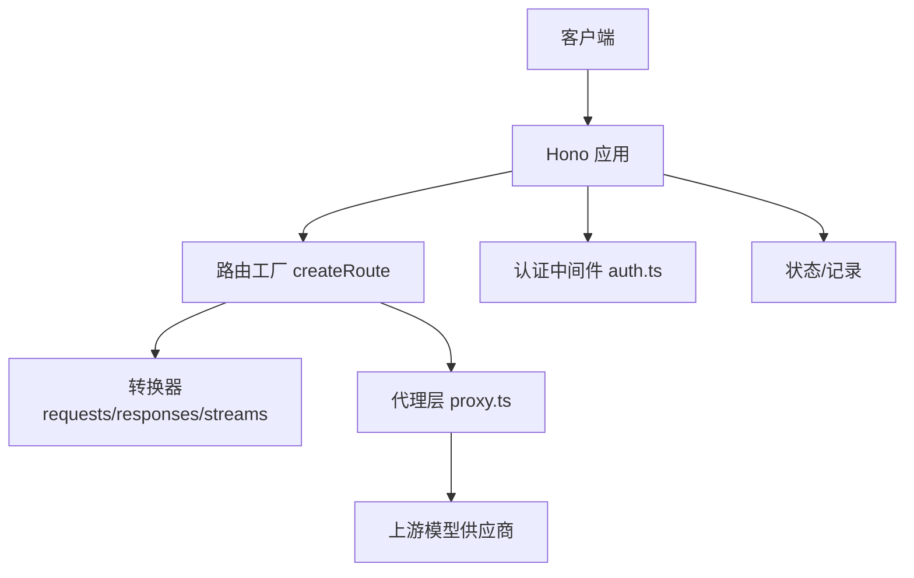
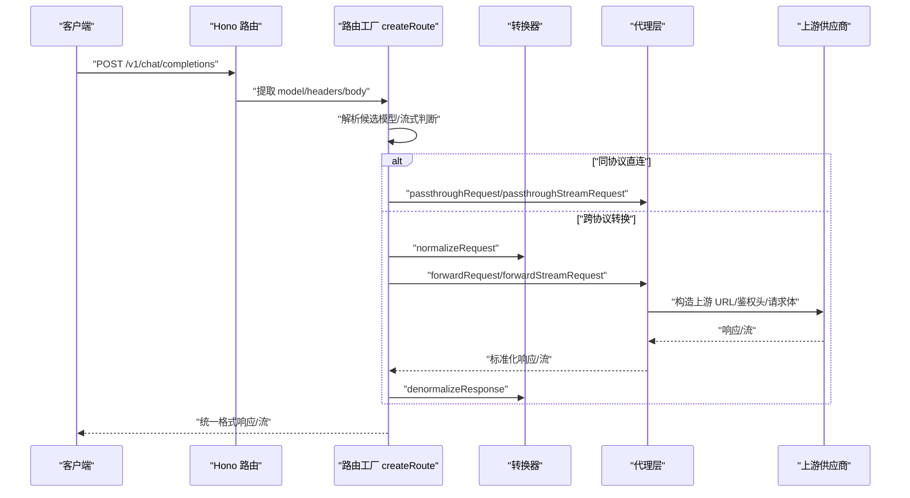
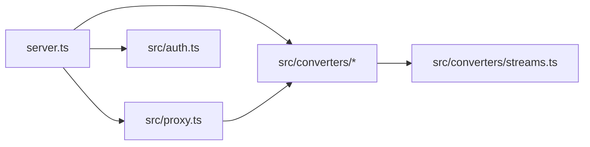

# 核心代理 API

<cite>
**本文引用的文件**
- [server.ts](file://server.ts)
- [proxy.ts](file://src/proxy.ts)
- [requests.ts](file://src/converters/requests.ts)
- [responses.ts](file://src/converters/responses.ts)
- [streams.ts](file://src/converters/streams.ts)
- [auth.ts](file://src/auth.ts)
- [README.md](file://README.md)
</cite>

## 目录
1. [简介](#简介)
2. [项目结构](#项目结构)
3. [核心组件](#核心组件)
4. [架构总览](#架构总览)
5. [详细组件分析](#详细组件分析)
6. [依赖关系分析](#依赖关系分析)
7. [性能考量](#性能考量)
8. [故障排查指南](#故障排查指南)
9. [结论](#结论)
10. [附录](#附录)

## 简介
本文件面向 nanollm 的核心代理 API，系统性说明其作为 LLM 模型代理服务的关键能力与接口设计。重点覆盖以下内容：
- 对外暴露的三个主要端点：/v1/chat/completions、/v1/responses、/v1/messages 的 HTTP 方法、URL 模式、请求/响应格式
- 统一抽象机制：OpenAI Chat、OpenAI Responses、Anthropic Messages 三种接口规范的差异与转换流程
- 流式与非流式响应处理、认证机制（Bearer Token）、模型选择逻辑、错误处理策略
- 实际使用场景与最佳实践

## 项目结构
nanollm 采用基于 Hono 的 Node.js 服务，通过统一的路由工厂 createRoute 生成各端点，借助转换器层实现多协议统一抽象，并通过代理层对接上游模型供应商。

图表来源
- [server.ts:145-178](file://server.ts#L145-L178)
- [server.ts:663-800](file://server.ts#L663-L800)
- [proxy.ts:41-59](file://src/proxy.ts#L41-L59)
- [auth.ts:195-213](file://src/auth.ts#L195-L213)

章节来源
- [server.ts:1205-1230](file://server.ts#L1205-L1230)
- [server.ts:1337-1339](file://server.ts#L1337-L1339)

## 核心组件
- 路由工厂 createRoute：根据请求体中的 model 字段解析候选模型，决定是否进行协议转换与流式处理，封装统一的执行流程。
- 转换器层：将不同供应商的请求/响应标准化为统一的中间表示（NormalizedRequest/NormalizedResponse），并支持双向转换。
- 代理层：负责上游 URL 构造、鉴权头注入、请求体改写、超时控制、SSE 校验与流式透传。
- 认证中间件：支持 Bearer Token 的统一认证，支持 Cookie 持久化与一次性 URL token 登录。

章节来源
- [server.ts:415-439](file://server.ts#L415-L439)
- [server.ts:500-530](file://server.ts#L500-L530)
- [proxy.ts:41-59](file://src/proxy.ts#L41-L59)
- [proxy.ts:265-272](file://src/proxy.ts#L265-L272)
- [auth.ts:3-18](file://src/auth.ts#L3-L18)

## 架构总览
下图展示了从客户端到上游供应商的完整链路，包括认证、路由、转换与代理的关键节点。

图表来源
- [server.ts:663-800](file://server.ts#L663-L800)
- [proxy.ts:569-593](file://src/proxy.ts#L569-L593)
- [proxy.ts:597-629](file://src/proxy.ts#L597-L629)
- [requests.ts:38-164](file://src/converters/requests.ts#L38-L164)
- [responses.ts:26-162](file://src/converters/responses.ts#L26-L162)

## 详细组件分析

### 端点定义与路由
- /v1/chat/completions：POST，OpenAI Chat 规范
- /v1/responses：POST，OpenAI Responses 规范
- /v1/messages：POST，Anthropic Messages 规范
- 路由通过 createRoute("openai-chat"/"openai-responses"/"anthropic") 统一接入，内部完成模型解析、转换与代理。

章节来源
- [server.ts:1205-1230](file://server.ts#L1205-L1230)
- [server.ts:1337-1339](file://server.ts#L1337-L1339)

### 认证机制（Bearer Token）
- 支持 Authorization: Bearer 头、查询参数 token、同源 Cookie 三种方式
- 成功认证后写入同源 HttpOnly Cookie，后续无需重复认证
- 未配置 token 时不强制认证；配置后除 /health 外均需认证

章节来源
- [auth.ts:3-18](file://src/auth.ts#L3-L18)
- [server.ts:195-213](file://server.ts#L195-L213)
- [README.md:91-124](file://README.md#L91-L124)

### 模型选择逻辑
- 若请求 model 属于 fallback 分组：按失败率与顺序排序，依次尝试
- 若为具体模型：直接命中
- 通配模型名支持（如 gpt-*、*），按最长前缀优先匹配
- 未找到模型：返回 404 并列出可用模型

章节来源
- [server.ts:487-498](file://server.ts#L487-L498)
- [README.md:185-238](file://README.md#L185-L238)

### 请求体改写与上游默认
- 支持模型级 body 深度合并与 bodyExpression 表达式同步改写
- OpenAI 系列默认 store=false，避免服务端存储 item_reference
- multipart/form-data 下可替换 model 字段并记录

章节来源
- [proxy.ts:115-151](file://src/proxy.ts#L115-L151)
- [proxy.ts:93-98](file://src/proxy.ts#L93-L98)
- [proxy.ts:235-248](file://src/proxy.ts#L235-L248)

### 统一抽象与协议转换
- 中间表示：NormalizedRequest/NormalizedResponse
- OpenAI Chat ↔ OpenAI Responses ↔ Anthropic Messages 三者之间可相互转换
- 转换时保留工具调用、推理内容、拒绝输出等语义

章节来源
- [requests.ts:38-164](file://src/converters/requests.ts#L38-L164)
- [responses.ts:26-162](file://src/converters/responses.ts#L26-L162)
- [streams.ts:10-22](file://src/converters/streams.ts#L10-L22)

### 流式与非流式处理
- 非流式：直接透传或转换后返回 JSON
- 流式：SSE 校验、事件解析与重写，确保真实内容到达后再透传
- 不同供应商的流事件类型分别由对应解析器/发射器处理

章节来源
- [server.ts:727-758](file://server.ts#L727-L758)
- [proxy.ts:583-593](file://src/proxy.ts#L583-L593)
- [proxy.ts:615-629](file://src/proxy.ts#L615-L629)
- [proxy.ts:441-504](file://src/proxy.ts#L441-L504)
- [streams.ts:118-251](file://src/converters/streams.ts#L118-L251)
- [streams.ts:255-410](file://src/converters/streams.ts#L255-L410)
- [streams.ts:414-490](file://src/converters/streams.ts#L414-L490)

### 错误处理策略
- 上游非 2xx：记录状态码与响应体，抛出带 status/upstream 的错误
- HTML 响应：识别并报错，避免将错误页面当作正常结果
- 非 SSE 流：校验 Content-Type，异常时记录并报错
- TTFB 超时：Abort 控制，记录超时并抛错
- 回退重试：按失败率与顺序尝试 fallback 分组内的其他模型

章节来源
- [proxy.ts:361-404](file://src/proxy.ts#L361-L404)
- [proxy.ts:321-347](file://src/proxy.ts#L321-L347)
- [server.ts:767-800](file://server.ts#L767-L800)

### 请求/响应示例（路径指引）
- OpenAI Chat 请求体字段映射与响应格式参考：
  - [requests.ts:38-81](file://src/converters/requests.ts#L38-L81)
  - [responses.ts:164-193](file://src/converters/responses.ts#L164-L193)
- OpenAI Responses 请求体字段映射与响应格式参考：
  - [requests.ts:83-115](file://src/converters/requests.ts#L83-L115)
  - [responses.ts:195-264](file://src/converters/responses.ts#L195-L264)
- Anthropic Messages 请求体字段映射与响应格式参考：
  - [requests.ts:117-164](file://src/converters/requests.ts#L117-L164)
  - [responses.ts:266-301](file://src/converters/responses.ts#L266-L301)
- 流式事件解析与发射参考：
  - [streams.ts:118-251](file://src/converters/streams.ts#L118-L251)
  - [streams.ts:255-410](file://src/converters/streams.ts#L255-L410)
  - [streams.ts:414-490](file://src/converters/streams.ts#L414-L490)

## 依赖关系分析
- 路由层依赖配置解析与模型选择逻辑
- 转换器层依赖共享中间表示与上下文工具
- 代理层依赖转换器与记录模块，向上游发起请求并进行流式校验
- 认证中间件贯穿所有受保护端点

图表来源
- [server.ts:23-35](file://server.ts#L23-L35)
- [proxy.ts:1-25](file://src/proxy.ts#L1-L25)
- [auth.ts:1-42](file://src/auth.ts#L1-L42)

章节来源
- [server.ts:145-178](file://server.ts#L145-L178)
- [proxy.ts:1-25](file://src/proxy.ts#L1-L25)

## 性能考量
- TTFB 超时：可按模型粒度配置，避免长时间占用连接
- 流式校验：限制缓冲大小，防止 ping-only 或空流导致资源浪费
- 回退策略：按失败率与顺序挑选候选模型，提升整体成功率
- 代理头过滤：去除 Hop-by-Hop 头，减少不必要的头部传递

章节来源
- [proxy.ts:297-300](file://src/proxy.ts#L297-L300)
- [proxy.ts:411-504](file://src/proxy.ts#L411-L504)
- [server.ts:487-498](file://server.ts#L487-L498)
- [server.ts:532-543](file://server.ts#L532-L543)

## 故障排查指南
- 401 未授权：检查 Bearer Token 是否正确、是否已写入 Cookie
- 404 模型不存在：确认 model 名称是否在配置中，是否命中 fallback 分组或通配
- 5xx 上游错误：查看记录中的 upstream 响应体，定位供应商侧问题
- 流式无内容：确认上游返回 Content-Type 为 text/event-stream，且包含真实事件
- TTFB 超时：适当提高 ttfb_timeout 或切换到更稳定的上游

章节来源
- [auth.ts:258-261](file://src/auth.ts#L258-L261)
- [server.ts:692-701](file://server.ts#L692-L701)
- [proxy.ts:361-404](file://src/proxy.ts#L361-L404)
- [proxy.ts:441-504](file://src/proxy.ts#L441-L504)
- [proxy.ts:321-347](file://src/proxy.ts#L321-L347)

## 结论
nanollm 通过统一的路由工厂与转换器层，实现了对 OpenAI Chat、OpenAI Responses、Anthropic Messages 三大接口规范的无缝抽象与互转，结合模型回退、流式校验与认证机制，为本地与私有化部署提供了轻量、稳定且易扩展的 LLM 代理能力。推荐在生产环境中配合 SQLite 存储与严格的超时配置，以获得更好的可观测性与稳定性。

## 附录

### 端点与方法对照
- /v1/chat/completions：POST（OpenAI Chat）
- /v1/responses：POST（OpenAI Responses）
- /v1/messages：POST（Anthropic Messages）

章节来源
- [server.ts:1205-1230](file://server.ts#L1205-L1230)
- [server.ts:1337-1339](file://server.ts#L1337-L1339)

### 认证与 Cookie
- Bearer Token：Authorization: Bearer {token}
- Cookie：登录成功后写入同源 HttpOnly Cookie
- 一次性 URL：?token={token}

章节来源
- [auth.ts:3-18](file://src/auth.ts#L3-L18)
- [README.md:91-124](file://README.md#L91-L124)

### 模型通配与回退
- 通配模型：gpt-*、*，按最长前缀优先
- 回退分组：按失败率与顺序尝试
- 未命中：返回 404 并列出可用模型

章节来源
- [README.md:185-238](file://README.md#L185-L238)
- [server.ts:487-498](file://server.ts#L487-L498)