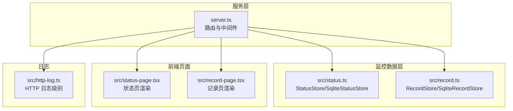
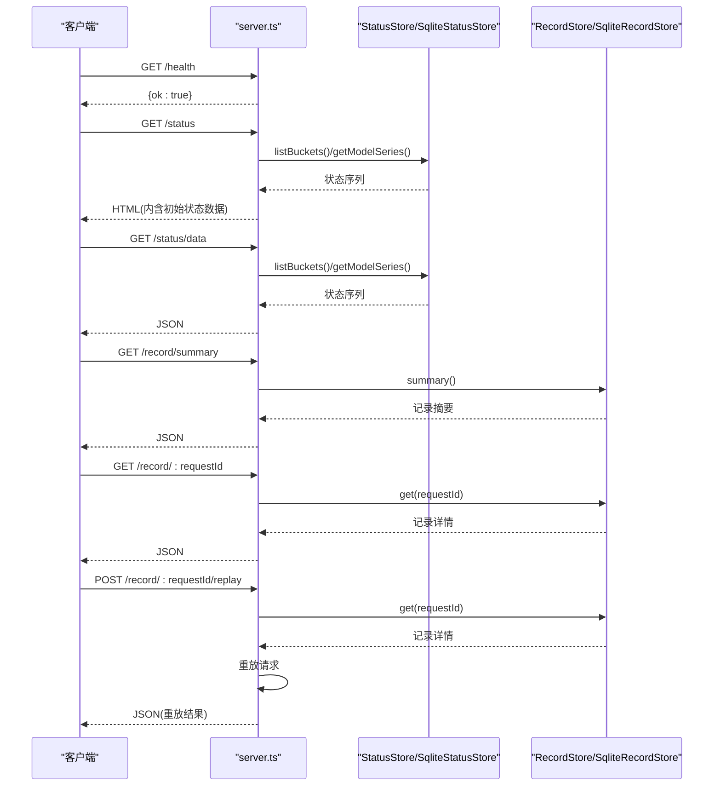
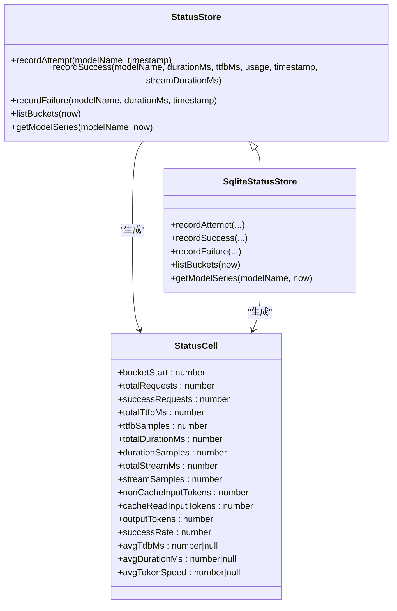
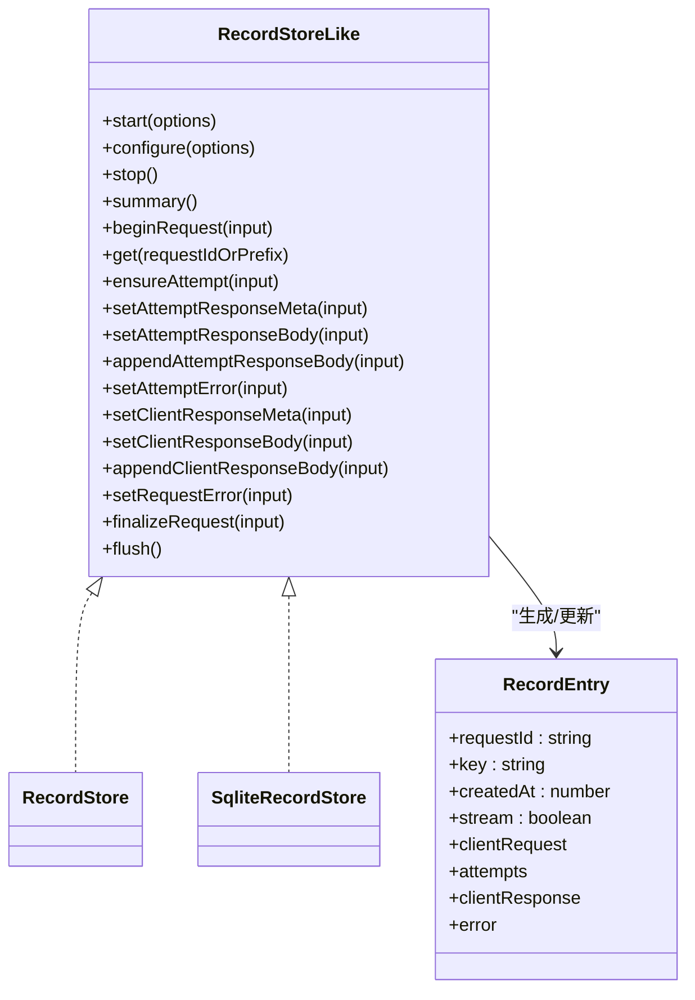
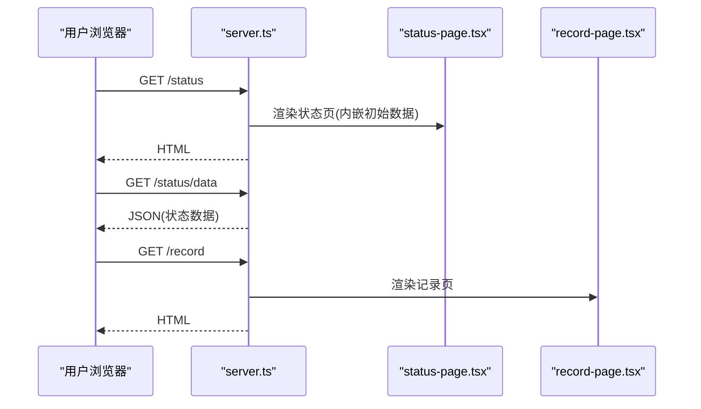
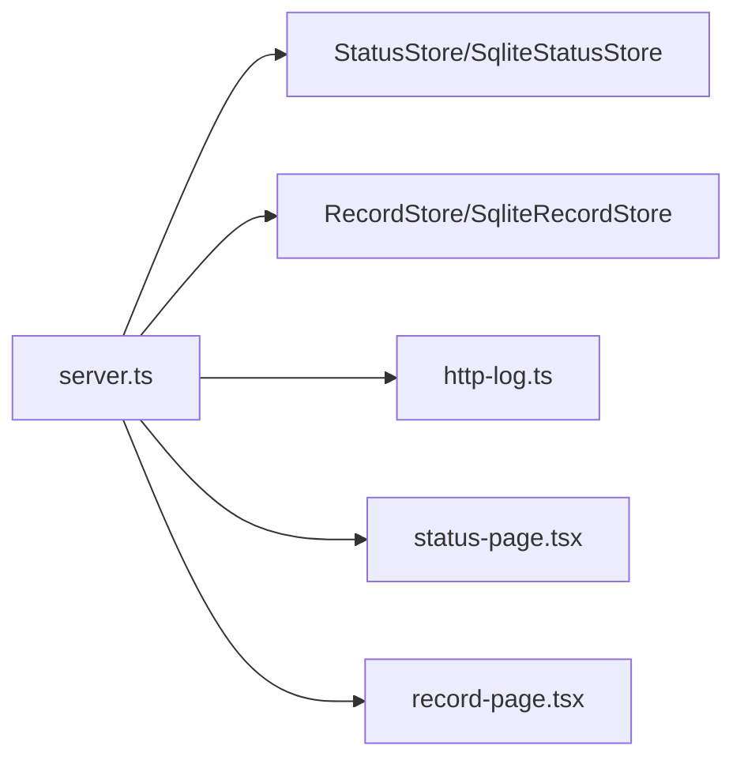

# 监控 API

<cite>
**本文引用的文件**
- [server.ts](file://server.ts)
- [status.ts](file://src/status.ts)
- [status-page.tsx](file://src/status-page.tsx)
- [record.ts](file://src/record.ts)
- [record-page.tsx](file://src/record-page.tsx)
- [http-log.ts](file://src/http-log.ts)
</cite>

## 目录
1. [简介](#简介)
2. [项目结构](#项目结构)
3. [核心组件](#核心组件)
4. [架构总览](#架构总览)
5. [详细组件分析](#详细组件分析)
6. [依赖关系分析](#依赖关系分析)
7. [性能考量](#性能考量)
8. [故障排查指南](#故障排查指南)
9. [结论](#结论)
10. [附录](#附录)

## 简介
本文件系统性地文档化 nanollm 的监控与可观测性能力，覆盖以下方面：
- 健康检查接口 /health 的响应格式与状态判断标准
- 模型健康状态与性能指标的监控数据接口（含时间窗口、聚合粒度）
- 请求记录与回放接口，支持查询历史请求、响应时间与错误信息
- 状态页面与记录页面的 API 接口说明
- 监控数据格式定义、时间范围查询与过滤条件
- 性能监控最佳实践与故障排查方法

## 项目结构
监控相关的后端逻辑集中在服务入口文件中，前端可视化页面由独立的 JSX 组件渲染。关键模块职责如下：
- 服务路由与鉴权：server.ts 定义 /health、/status、/status/data、/record、/record/summary、/record/:requestId、/record/:requestId/replay 等端点
- 健康状态与指标：src/status.ts 提供内存或 SQLite 存储的状态聚合器，按 5 分钟桶聚合请求指标
- 健康页渲染：src/status-page.tsx 将状态数据注入前端脚本，提供可视化面板
- 请求记录与回放：src/record.ts 提供内存或 SQLite 记录存储，支持分段追加与回放
- 记录页渲染：src/record-page.tsx 渲染记录列表、详情与回放控制
- 日志级别：src/http-log.ts 控制 HTTP 请求日志级别

**图表来源**
- [server.ts:1232-1260](file://server.ts#L1232-L1260)
- [status.ts:84-172](file://src/status.ts#L84-L172)
- [record.ts:71-112](file://src/record.ts#L71-L112)
- [status-page.tsx:691-744](file://src/status-page.tsx#L691-L744)
- [record-page.tsx:1-120](file://src/record-page.tsx#L1-L120)
- [http-log.ts:1-28](file://src/http-log.ts#L1-L28)

**章节来源**
- [server.ts:1232-1260](file://server.ts#L1232-L1260)
- [status.ts:1-363](file://src/status.ts#L1-L363)
- [record.ts:1-961](file://src/record.ts#L1-L961)
- [status-page.tsx:1-744](file://src/status-page.tsx#L1-L744)
- [record-page.tsx:1-800](file://src/record-page.tsx#L1-L800)
- [http-log.ts:1-28](file://src/http-log.ts#L1-L28)

## 核心组件
- 健康检查端点
  - 路径：/health
  - 方法：GET
  - 响应：JSON 对象，包含字段 ok: true
  - 鉴权：无需认证
- 状态数据端点
  - 路径：/status/data
  - 方法：GET
  - 响应：JSON，包含时间窗口、刷新时间、桶时间戳序列、各模型系列数据、降级分组
  - 鉴权：受统一中间件保护（见下节）
- 状态页面
  - 路径：/status
  - 方法：GET
  - 响应：HTML，内嵌 /status/data 的初始数据
- 请求记录端点
  - 列表：/record、/record/summary
  - 查询：/record/:requestId
  - 回放：/record/:requestId/replay
  - 鉴权：受统一中间件保护（见下节）

**章节来源**
- [server.ts:1232-1260](file://server.ts#L1232-L1260)
- [status.ts:174-180](file://src/status.ts#L174-L180)
- [status-page.tsx:691-744](file://src/status-page.tsx#L691-L744)
- [record.ts:883-961](file://src/record.ts#L883-L961)
- [record-page.tsx:1-120](file://src/record-page.tsx#L1-L120)

## 架构总览
监控数据的采集与展示分为两条主线：
- 指标采集与聚合：在请求处理过程中通过 StatusStore/SqliteStatusStore 记录请求总量、成功数、TTFB、总耗时、流式耗时与 Token 使用量，并按 5 分钟桶聚合
- 请求记录与回放：在请求生命周期中通过 RecordStore/SqliteRecordStore 记录客户端请求、上游尝试、响应与错误，支持按 requestId 查询与回放

**图表来源**
- [server.ts:1232-1260](file://server.ts#L1232-L1260)
- [status.ts:142-171](file://src/status.ts#L142-L171)
- [record.ts:883-961](file://src/record.ts#L883-L961)

## 详细组件分析

### 健康检查接口 /health
- 响应格式
  - 类型：JSON
  - 字段：ok: true
- 状态判断标准
  - 该端点仅用于存活探测，不反映业务健康度；业务健康度由 /status/data 中的成功率与桶数据体现
- 典型用法
  - 作为容器/负载均衡探针使用

**章节来源**
- [server.ts:1232-1233](file://server.ts#L1232-L1233)
- [status.ts:174-180](file://src/status.ts#L174-L180)

### 状态查询 API 与数据格式
- 端点
  - GET /status/data：返回 JSON 状态数据
  - GET /status：返回 HTML 页面，内嵌初始状态数据
- 数据结构
  - availableWindows：可用时间窗口（小时），如 [1, 3, 6]
  - defaultWindowHours：默认窗口小时数
  - refreshedAt：刷新时间戳
  - bucketStarts：桶起始时间数组（5 分钟粒度）
  - models：模型列表，每项包含 name 与 series
  - series：每个模型的指标序列，每条为一个状态桶
  - fallbackGroups：降级分组列表
- 状态桶字段（StatusCell）
  - bucketStart：桶起始时间戳
  - totalRequests：该桶总请求数
  - successRequests：成功请求数
  - totalTtfbMs：累计首字节时间（毫秒）
  - ttfbSamples：首字节样本数
  - totalDurationMs：累计总耗时（毫秒）
  - durationSamples：总耗时样本数
  - totalStreamMs：累计流式耗时（毫秒）
  - streamSamples：流式样本数
  - nonCacheInputTokens：非缓存输入 Token 数
  - cacheReadInputTokens：缓存读取输入 Token 数
  - outputTokens：输出 Token 数
  - successRate：成功率百分比
  - avgTtfbMs：平均首字节时间（毫秒，样本数为 0 时为 null）
  - avgDurationMs：平均总耗时（毫秒，样本数为 0 时为 null）
  - avgTokenSpeed：平均 Token 速率（tok/s，需同时满足 totalStreamMs>0 且 outputTokens>0，否则为 null）
- 时间范围与聚合
  - 默认保留最近 6 小时，按 5 分钟为一桶
  - 可通过 availableWindows 选择显示最近 1/3/6 小时
- 成功率与健康色
  - 依据 successRate 与 totalRequests 计算健康色：空数据(empty)、绿色(green)、浅绿(lightgreen)、橙色(orange)、红色(red)

**图表来源**
- [status.ts:84-172](file://src/status.ts#L84-L172)
- [status.ts:23-29](file://src/status.ts#L23-L29)
- [status.ts:227-362](file://src/status.ts#L227-L362)

**章节来源**
- [status.ts:9-29](file://src/status.ts#L9-L29)
- [status.ts:142-171](file://src/status.ts#L142-L171)
- [status.ts:174-180](file://src/status.ts#L174-L180)
- [status.ts:227-362](file://src/status.ts#L227-L362)
- [status-page.tsx:22-29](file://src/status-page.tsx#L22-L29)
- [status-page.tsx:619-636](file://src/status-page.tsx#L619-L636)

### 请求记录 API 与数据格式
- 端点
  - GET /record：返回记录页 HTML
  - GET /record/summary：返回记录摘要 JSON
  - GET /record/:requestId：返回指定记录详情 JSON
  - POST /record/:requestId/replay：基于记录重放请求，返回重放结果与新 requestId
- 记录摘要（RecordSummary）
  - enabled：是否启用记录
  - capturedCount：已捕获记录总数
  - limit：最大容量
  - sessionStartedAt：会话开始时间
  - size：当前有效记录数量
  - recentKeys：最近记录键列表（最多 N 条），包含 key、requestId、path、model、actualModel、source、status、responseStatus、createdAt
- 记录条目（RecordEntry）
  - requestId：请求 ID
  - key：内部键
  - createdAt：创建时间
  - stream：是否为流式响应
  - clientRequest：客户端请求元数据
    - path：路径
    - headers：头部（敏感头被脱敏）
    - body：请求体
    - model：推断的模型名
    - actualModel：实际使用的模型名
    - source：来源（claudecode/codex/opencode/other）
    - status：状态（in_progress/success/failure）
  - attempts：上游尝试列表（可能为空）
    - index：尝试序号
    - provider：上游提供商
    - modelName：尝试使用的模型名
    - url：上游请求地址
    - request：上游请求（headers/body）
    - response：上游响应（status/headers/body）
    - error：上游错误（message/status/upstream）
  - clientResponse：客户端响应（status/headers/body/truncated）
  - error：客户端错误（message）
- 过滤与查询
  - 支持按 requestId 前缀查询（后端自动规范化前后空白）
  - 敏感头（Authorization、X-API-Key、Cookie、Set-Cookie）会被脱敏
  - body 以 JSON 形式保存，字符串体尝试解析后再克隆，避免循环引用问题
- 回放
  - 重放时不会携带原始客户端敏感头，上游认证使用当前配置
  - 返回包含 ok、status、body、requestId 等字段

**图表来源**
- [record.ts:71-112](file://src/record.ts#L71-L112)
- [record.ts:185-408](file://src/record.ts#L185-L408)
- [record.ts:433-857](file://src/record.ts#L433-L857)

**章节来源**
- [record.ts:36-69](file://src/record.ts#L36-L69)
- [record.ts:71-112](file://src/record.ts#L71-L112)
- [record.ts:185-408](file://src/record.ts#L185-L408)
- [record.ts:433-857](file://src/record.ts#L433-L857)
- [record-page.tsx:15-21](file://src/record-page.tsx#L15-L21)
- [record-page.tsx:527-800](file://src/record-page.tsx#L527-L800)

### 状态页面与记录页面
- 状态页面（/status）
  - 后端渲染 HTML，内嵌初始状态数据（availableWindows/defaultWindowHours/bucketStarts/models/fallbackGroups）
  - 前端脚本周期性拉取 /status/data 并刷新可视化
- 记录页面（/record）
  - 后端渲染 HTML，包含记录摘要、最近请求列表、详情与回放控制
  - 前端脚本支持展开/折叠、复制 JSON、解析 SSE 流事件并重建响应

**图表来源**
- [server.ts:1234-1235](file://server.ts#L1234-L1235)
- [status-page.tsx:691-744](file://src/status-page.tsx#L691-L744)
- [record-page.tsx:1-120](file://src/record-page.tsx#L1-L120)

**章节来源**
- [status-page.tsx:691-744](file://src/status-page.tsx#L691-L744)
- [record-page.tsx:1-120](file://src/record-page.tsx#L1-L120)

## 依赖关系分析
- 鉴权与 CORS
  - 除 /admin/* 与 /health 外，所有 API 默认启用 CORS
  - 若配置了认证令牌，则对非 OPTIONS 请求进行鉴权
- 日志级别
  - HTTP 请求日志根据路径前缀与 LOG_LEVEL 环境变量决定级别
  - /v1 路径视为 LLM 请求，默认 info 级别
- 存储实现
  - StatusStore：内存实现，适合开发/测试
  - SqliteStatusStore：持久化实现，适合生产
  - RecordStore：内存实现，适合开发/测试
  - SqliteRecordStore：持久化实现，适合生产

**图表来源**
- [server.ts:180-185](file://server.ts#L180-L185)
- [server.ts:195-217](file://server.ts#L195-L217)
- [http-log.ts:1-28](file://src/http-log.ts#L1-L28)
- [status.ts:227-362](file://src/status.ts#L227-L362)
- [record.ts:433-857](file://src/record.ts#L433-L857)

**章节来源**
- [server.ts:180-185](file://server.ts#L180-L185)
- [server.ts:195-217](file://server.ts#L195-L217)
- [http-log.ts:1-28](file://src/http-log.ts#L1-L28)

## 性能考量
- 指标聚合
  - 5 分钟桶聚合降低存储与计算开销，建议按需选择时间窗口
  - avgTokenSpeed 仅在 totalStreamMs>0 且 outputTokens>0 时计算，避免除零
- 记录存储
  - 内存与 SQLite 实现均具备容量限制与逐出策略，避免无限增长
  - 重放时仅使用当前配置进行上游认证，避免泄露敏感信息
- 前端刷新
  - 状态页默认 5 秒轮询刷新，记录页默认 3 秒刷新，可根据网络与资源情况调整

[本节为通用指导，无需特定文件引用]

## 故障排查指南
- 健康检查失败
  - 检查 /health 是否返回 { ok: true }；若否，确认服务进程运行状态与监听端口
- 状态数据为空
  - 确认已启用 SQLite 存储（生产环境）或至少有请求经过
  - 检查 availableWindows 与默认窗口设置，确保选择了合适的显示范围
- 记录为空或缺失
  - 确认记录功能已启用且容量未达上限
  - 使用 /record/summary 查看最近记录键，再通过 /record/:requestId 获取详情
  - 注意敏感头已被脱敏，body 已进行 JSON 克隆
- 回放失败
  - 检查上游认证配置是否正确
  - 确认目标路径与请求体格式符合预期
  - 关注返回中的 note 说明（敏感头不会重放）
- 日志级别
  - 设置 LOG_LEVEL=debug/info/error 控制 HTTP 请求日志输出级别
  - /v1 路径默认 info 级别，便于观测 LLM 请求

**章节来源**
- [server.ts:1232-1260](file://server.ts#L1232-L1260)
- [record.ts:883-961](file://src/record.ts#L883-L961)
- [http-log.ts:1-28](file://src/http-log.ts#L1-L28)

## 结论
本文档梳理了 nanollm 的监控 API 体系，包括健康检查、状态数据、请求记录与回放、页面渲染以及日志级别控制。通过 /status/data 与 /record* 系列端点，用户可获得模型健康度、性能指标与历史请求的完整视图，并结合前端页面进行可视化分析与故障定位。

[本节为总结，无需特定文件引用]

## 附录

### API 端点一览
- /health：GET，返回 { ok: true }
- /status：GET，返回状态页 HTML
- /status/data：GET，返回状态数据 JSON
- /record：GET，返回记录页 HTML
- /record/summary：GET，返回记录摘要 JSON
- /record/:requestId：GET，返回记录详情 JSON
- /record/:requestId/replay：POST，返回重放结果 JSON

**章节来源**
- [server.ts:1232-1260](file://server.ts#L1232-L1260)

### 监控数据格式定义
- 状态桶（StatusCell）
  - 必填字段：bucketStart、totalRequests、successRequests、totalTtfbMs、ttfbSamples、totalDurationMs、durationSamples、totalStreamMs、streamSamples、nonCacheInputTokens、cacheReadInputTokens、outputTokens
  - 计算字段：successRate、avgTtfbMs、avgDurationMs、avgTokenSpeed
- 记录摘要（RecordSummary）
  - enabled、capturedCount、limit、sessionStartedAt、size、recentKeys
- 记录条目（RecordEntry）
  - requestId、key、createdAt、stream、clientRequest、attempts、clientResponse、error

**章节来源**
- [status.ts:9-29](file://src/status.ts#L9-L29)
- [status.ts:23-29](file://src/status.ts#L23-L29)
- [record.ts:36-69](file://src/record.ts#L36-L69)
- [record.ts:62-69](file://src/record.ts#L62-L69)

### 时间范围与过滤条件
- 时间范围
  - 默认保留最近 6 小时，按 5 分钟桶聚合
  - 可通过 availableWindows 选择 1/3/6 小时窗口
- 过滤条件
  - 记录查询支持按 requestId 前缀匹配（前后空白规范化）
  - 敏感头自动脱敏，body 自动 JSON 化

**章节来源**
- [status.ts:4-8](file://src/status.ts#L4-L8)
- [record.ts:177-183](file://src/record.ts#L177-L183)
- [record.ts:6-6](file://src/record.ts#L6-L6)