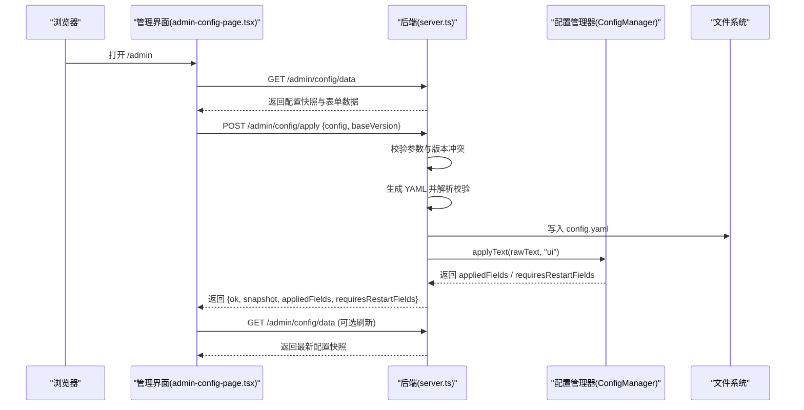
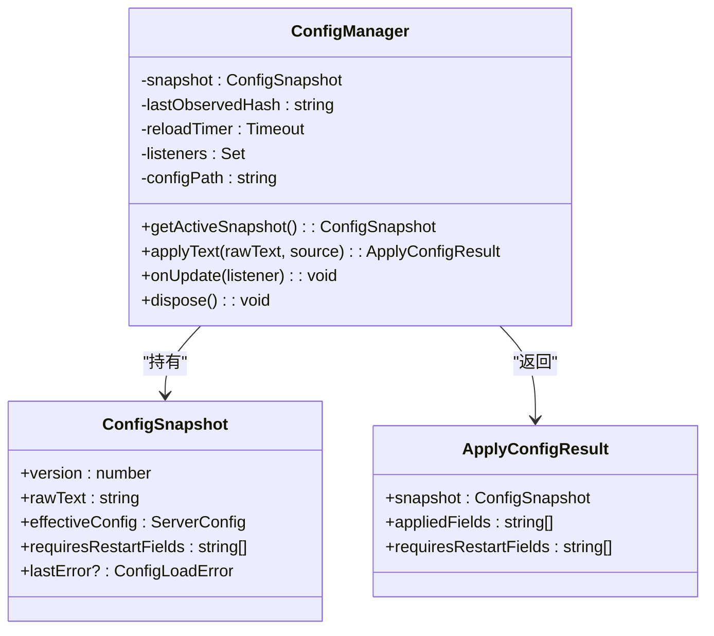
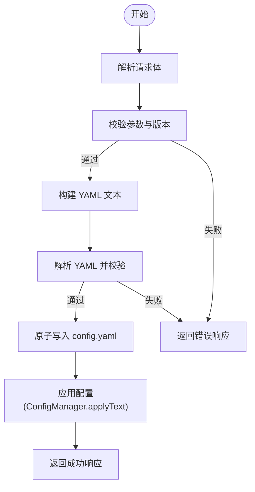
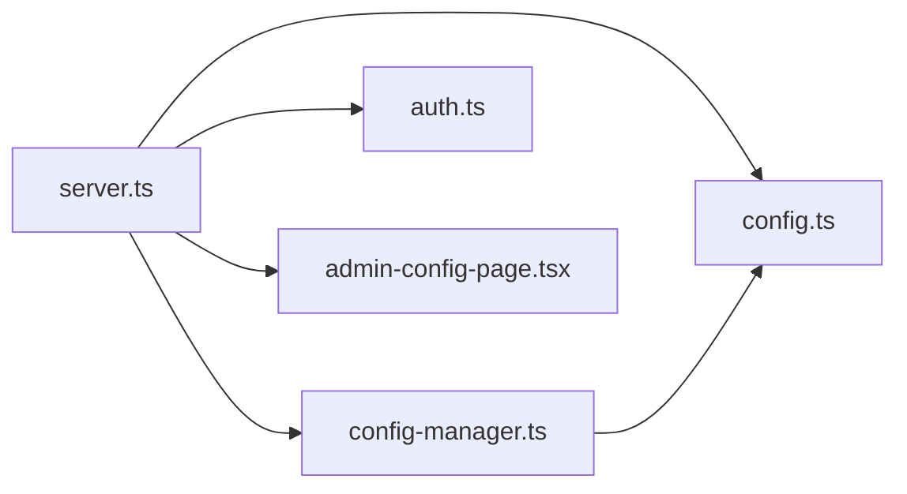

# 管理 API

<cite>
**本文引用的文件**
- [server.ts](file://server.ts)
- [config.ts](file://src/config.ts)
- [config-manager.ts](file://src/config-manager.ts)
- [auth.ts](file://src/auth.ts)
- [admin-config-page.tsx](file://src/admin-config-page.tsx)
- [status-page.tsx](file://src/status-page.tsx)
- [record-page.tsx](file://src/record-page.tsx)
</cite>

## 目录
1. [简介](#简介)
2. [项目结构](#项目结构)
3. [核心组件](#核心组件)
4. [架构总览](#架构总览)
5. [详细组件分析](#详细组件分析)
6. [依赖关系分析](#依赖关系分析)
7. [性能考量](#性能考量)
8. [故障排查指南](#故障排查指南)
9. [结论](#结论)
10. [附录](#附录)

## 简介
本文件系统性地文档化了 /admin 路径下的管理功能接口，涵盖：
- 配置管理 API：获取配置、更新配置、热重载等 HTTP 接口
- 管理界面 API 设计：配置表单的数据结构、验证规则与提交流程
- 配置文件读写接口说明：YAML 解析与序列化
- 认证与权限控制：基于 Bearer Token 的鉴权策略
- 前后端交互机制：前端表单如何与后端 API 协作完成配置变更
- 请求/响应示例与错误处理说明

## 项目结构
管理 API 主要由以下模块构成：
- 后端路由与中间件：负责鉴权、CORS、路由注册与业务处理
- 配置解析与热重载：负责 YAML 解析、配置校验、热应用与文件监听
- 前端管理页面：提供可视化配置表单与交互逻辑
- 辅助工具：认证工具、状态页、录制页等

```mermaid
graph TB
subgraph "后端"
S["server.ts<br/>路由与中间件"]
CM["config-manager.ts<br/>配置管理器"]
CFG["config.ts<br/>配置解析/校验"]
AUTH["auth.ts<br/>认证工具"]
end
subgraph "前端"
ADMIN["admin-config-page.tsx<br/>管理界面"]
STATUS["status-page.tsx<br/>状态页"]
RECORD["record-page.tsx<br/>录制页"]
end
ADMIN --> |"GET /admin/config/data"| S
ADMIN --> |"POST /admin/config/apply"| S
S --> CM
S --> CFG
S --> AUTH
STATUS --> |"GET /status/data"| S
RECORD --> |"GET /record/...| S
```

图表来源
- [server.ts:1262-1324](file://server.ts#L1262-L1324)
- [config-manager.ts:58-173](file://src/config-manager.ts#L58-L173)
- [config.ts:189-238](file://src/config.ts#L189-L238)
- [auth.ts:1-42](file://src/auth.ts#L1-42)
- [admin-config-page.tsx:1106-1191](file://src/admin-config-page.tsx#L1106-L1191)

章节来源
- [server.ts:1262-1324](file://server.ts#L1262-L1324)
- [config-manager.ts:58-173](file://src/config-manager.ts#L58-L173)
- [config.ts:189-238](file://src/config.ts#L189-L238)
- [auth.ts:1-42](file://src/auth.ts#L1-42)
- [admin-config-page.tsx:1106-1191](file://src/admin-config-page.tsx#L1106-L1191)

## 核心组件
- 配置管理器（ConfigManager）
  - 负责读取、解析、校验、应用配置，并提供热重载与监听能力
  - 提供快照（snapshot）与变更监听回调
- 配置解析器（config.ts）
  - 定义配置数据结构与校验规则（如端口、超时、模型字段等）
  - 支持 YAML 文档解析、环境变量替换、默认值处理
- 认证工具（auth.ts）
  - 提供 Bearer Token 提取、安全比较与 Cookie 读取
- 管理页面（admin-config-page.tsx）
  - 前端表单：全局设置、模型、fallback 分组
  - 表单数据结构与校验规则由后端生成与校验
- 路由与中间件（server.ts）
  - /admin 路由：管理页面、配置数据接口、配置应用接口
  - 鉴权中间件：对非 /admin 路由进行 Bearer Token 校验
  - CORS 中间件：允许跨域访问 API

章节来源
- [config-manager.ts:58-173](file://src/config-manager.ts#L58-L173)
- [config.ts:189-238](file://src/config.ts#L189-L238)
- [auth.ts:1-42](file://src/auth.ts#L1-42)
- [admin-config-page.tsx:1106-1191](file://src/admin-config-page.tsx#L1106-L1191)
- [server.ts:1262-1324](file://server.ts#L1262-L1324)

## 架构总览
管理 API 的整体交互流程如下：
- 前端访问 /admin 获取管理页面
- 前端通过 /admin/config/data 获取当前配置快照与表单数据
- 用户在前端表单中编辑配置，提交至 /admin/config/apply
- 后端校验表单、生成 YAML、写入磁盘并应用配置
- 配置管理器触发热重载，更新运行时配置
- 前端根据返回结果更新状态与提示



图表来源
- [server.ts:1262-1324](file://server.ts#L1262-L1324)
- [config-manager.ts:81-131](file://src/config-manager.ts#L81-L131)
- [admin-config-page.tsx:1005-1048](file://src/admin-config-page.tsx#L1005-L1048)

## 详细组件分析

### 配置管理器（ConfigManager）
- 职责
  - 读取初始配置并建立快照
  - 应用新配置文本（含热重载），计算需要重启的字段
  - 监听配置文件变化，自动重载
  - 暴露监听器以通知上层（如路由层）配置变更
- 关键方法
  - getActiveSnapshot()：获取当前快照
  - applyText(rawText, source)：应用配置文本，返回变更结果
  - onUpdate(listener)：订阅配置变更事件
  - dispose()：清理定时器与监听
- 热重载策略
  - 对于非启动来源的变更，仅在哈希变化时应用
  - 仅对部分字段进行热应用（如 models、fallback、server.ttfb_timeout、record.max_size）
  - 对于需要重启的字段（如 server.port、server.auth.token），返回提示



图表来源
- [config-manager.ts:19-173](file://src/config-manager.ts#L19-L173)

章节来源
- [config-manager.ts:58-173](file://src/config-manager.ts#L58-L173)

### 配置解析与校验（config.ts）
- 数据结构
  - ServerConfig：包含端口、超时、认证、模型数组、fallback 映射、记录配置
  - ModelConfig：模型名称、供应商、上游地址、API Key、真实模型名等
  - ParsedConfigDocument：解析后的 YAML 结构
- 校验规则
  - 字段类型与范围校验（正整数、URL、布尔等）
  - 模型必填字段校验（name/provider/base_url/model）
  - fallback 校验（非空数组、成员必须存在于模型列表、不允许重复）
  - 通配符模型名校验（仅允许末尾为 *）
- 环境变量与默认值
  - 支持 ${ENV_VAR} 形式环境变量替换
  - 默认 TTFB 超时、记录最大容量等

章节来源
- [config.ts:9-35](file://src/config.ts#L9-L35)
- [config.ts:189-238](file://src/config.ts#L189-L238)
- [config.ts:274-307](file://src/config.ts#L274-L307)

### 认证与权限控制（auth.ts + server.ts）
- 鉴权中间件
  - 对非 OPTIONS 且非 /health 的请求进行鉴权
  - 支持 Authorization Bearer、查询参数 token、Cookie 三种方式
  - 使用 timing-safe 比较避免时序攻击
- 管理页面例外
  - /admin/* 路由不受通用鉴权中间件限制
- Cookie 持久化
  - 成功鉴权后设置 HttpOnly 的认证 Cookie

章节来源
- [auth.ts:1-42](file://src/auth.ts#L1-L42)
- [server.ts:187-213](file://server.ts#L187-L213)

### 管理界面（admin-config-page.tsx）
- 页面结构
  - 全局设置区：server.ttfb_timeout、record.max_size 等
  - 模型区：增删改查模型，支持折叠展开
  - Fallback 分组区：为分组命名并选择成员，支持拖拽排序
- 表单数据结构
  - AdminConfigForm：包含 rootExtras、serverExtras、recordExtras、server、record、models、fallbackGroups
  - 后端通过 buildAdminConfigForm/buildAdminConfigFormFromEffectiveConfig 生成
- 交互流程
  - 刷新：GET /admin/config/data
  - 保存：POST /admin/config/apply，携带 baseVersion 与表单数据
  - 版本冲突检测：baseVersion 必须与服务端当前版本一致
  - 保存结果：返回 appliedFields 与 requiresRestartFields

章节来源
- [admin-config-page.tsx:1106-1191](file://src/admin-config-page.tsx#L1106-L1191)
- [server.ts:646-659](file://server.ts#L646-L659)
- [server.ts:1268-1324](file://server.ts#L1268-L1324)

### 配置应用流程（后端）
- GET /admin/config/data
  - 返回当前快照与表单数据
- POST /admin/config/apply
  - 参数校验：config 必须为对象，baseVersion 必须为整数
  - 版本冲突：baseVersion 必须等于当前快照版本
  - 表单转 YAML：buildYamlTextFromAdminForm
  - 校验 YAML：parseConfigText
  - 写入磁盘：writeConfigAtomic
  - 应用配置：configManager.applyText
  - 返回：ok、snapshot、appliedFields、requiresRestartFields



图表来源
- [server.ts:1269-1324](file://server.ts#L1269-L1324)
- [config-manager.ts:81-131](file://src/config-manager.ts#L81-L131)

章节来源
- [server.ts:1268-1324](file://server.ts#L1268-L1324)
- [config-manager.ts:81-131](file://src/config-manager.ts#L81-L131)

### 配置文件读写与热重载
- 读取与解析
  - 初始化时读取 config.yaml 并解析为 ServerConfig
  - 解析过程中支持环境变量替换与默认值
- 写入策略
  - 使用临时文件 + 原子重命名，确保写入一致性
- 热重载
  - 监听文件变更，去抖动后重新读取并应用
  - 仅对部分字段热应用，其他字段提示需要重启

章节来源
- [config-manager.ts:64-75](file://src/config-manager.ts#L64-L75)
- [config-manager.ts:146-171](file://src/config-manager.ts#L146-L171)
- [server.ts:252-256](file://server.ts#L252-L256)

## 依赖关系分析
- server.ts 依赖
  - config.ts：配置解析与校验
  - config-manager.ts：配置快照与热重载
  - auth.ts：鉴权工具
  - admin-config-page.tsx：管理页面渲染
- config-manager.ts 依赖
  - config.ts：解析 YAML、生成有效配置
  - node:fs：文件读取与监听
  - node:crypto：哈希与安全比较
- admin-config-page.tsx 依赖
  - 通过 /admin/config/data 与 /admin/config/apply 与后端交互



图表来源
- [server.ts:11-21](file://server.ts#L11-L21)
- [config-manager.ts:1-9](file://src/config-manager.ts#L1-L9)

章节来源
- [server.ts:11-21](file://server.ts#L11-L21)
- [config-manager.ts:1-9](file://src/config-manager.ts#L1-L9)

## 性能考量
- 热重载去抖动：文件变更后延迟加载，避免频繁重读
- 仅对必要字段热应用：减少重启需求
- 流式代理：在流式场景下最小化拷贝与转换
- 日志级别控制：按路径与响应类型输出日志，避免过度打印

## 故障排查指南
- 400 错误（参数或校验失败）
  - 检查请求体格式与字段类型（如正整数、URL、布尔）
  - 确认 fallback 成员是否存在于模型列表
- 409 错误（版本冲突）
  - 由于外部修改导致 baseVersion 不匹配，需先刷新页面再保存
- 500 错误（写入或应用失败）
  - 检查磁盘写权限与 YAML 语法
  - 查看后端日志中的具体错误信息
- 鉴权失败（401）
  - 确认 Authorization Bearer、查询参数 token 或 Cookie 是否正确
  - 确认服务端配置的认证令牌

章节来源
- [server.ts:1269-1324](file://server.ts#L1269-L1324)
- [auth.ts:11-18](file://src/auth.ts#L11-L18)

## 结论
管理 API 通过清晰的前后端职责划分与严格的配置校验，提供了安全、可靠的配置管理体验。前端表单直观易用，后端提供完善的校验与热重载能力，结合鉴权与文件原子写入，确保配置变更的安全与稳定。

## 附录

### 管理 API 接口定义

- 获取配置快照
  - 方法：GET
  - 路径：/admin/config/data
  - 认证：可选（受通用鉴权中间件影响）
  - 响应：包含当前快照与表单数据
  - 示例响应字段：version、rawText、effectiveConfig、requiresRestartFields、lastError、configPath、form

- 应用配置
  - 方法：POST
  - 路径：/admin/config/apply
  - 请求头：Content-Type: application/json
  - 请求体字段：
    - config: AdminConfigForm 对象
    - baseVersion: number（当前快照版本）
  - 响应：
    - 成功：{ ok, snapshot, appliedFields, requiresRestartFields }
    - 失败：{ error, currentSnapshot? }

- 管理页面入口
  - 方法：GET
  - 路径：/admin
  - 功能：返回管理界面 HTML

- 管理页面跳转
  - 方法：GET
  - 路径：/admin/config?token=...
  - 功能：重定向到 /admin 并附带 token 查询参数

章节来源
- [server.ts:1262-1324](file://server.ts#L1262-L1324)

### 配置表单数据结构（AdminConfigForm）
- 字段说明
  - rootExtras: 根级额外字段（保留）
  - serverExtras: server 段额外字段（保留）
  - recordExtras: record 段额外字段（保留）
  - server: { port: string, ttfb_timeout: string }
  - record: { max_size: string }
  - models: 数组，每项包含 name、provider、base_url、api_key、model、extras
  - fallbackGroups: 数组，每项包含 name、members（字符串数组）

- 表单到 YAML 的映射
  - 通过 buildYamlTextFromAdminForm 将表单数据序列化为 YAML
  - 保留未展开的高级字段（extras）
  - 对数值字段执行正整数校验

章节来源
- [server.ts:232-245](file://server.ts#L232-L245)
- [server.ts:357-413](file://server.ts#L357-L413)

### 认证与权限
- 鉴权方式
  - Authorization: Bearer <token>
  - 查询参数：token=<token>
  - Cookie：nanollm_auth=<token>
- 鉴权策略
  - 时序安全比较，避免时序攻击
  - 成功后设置 HttpOnly Cookie
- 管理页面例外
  - /admin/* 路由不受通用鉴权中间件限制

章节来源
- [auth.ts:1-42](file://src/auth.ts#L1-L42)
- [server.ts:187-213](file://server.ts#L187-L213)

### 热重载与文件监听
- 触发条件
  - 非启动来源的配置变更（哈希变化）
  - 文件被外部修改（监控到 mtime/size 变化）
- 应用范围
  - 仅对部分字段热应用（如 models、fallback、server.ttfb_timeout、record.max_size）
  - 对需要重启的字段（如 server.port、server.auth.token）返回提示

章节来源
- [config-manager.ts:81-131](file://src/config-manager.ts#L81-L131)
- [config-manager.ts:146-171](file://src/config-manager.ts#L146-L171)