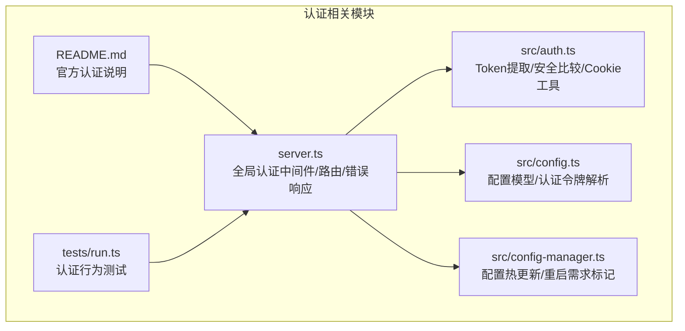
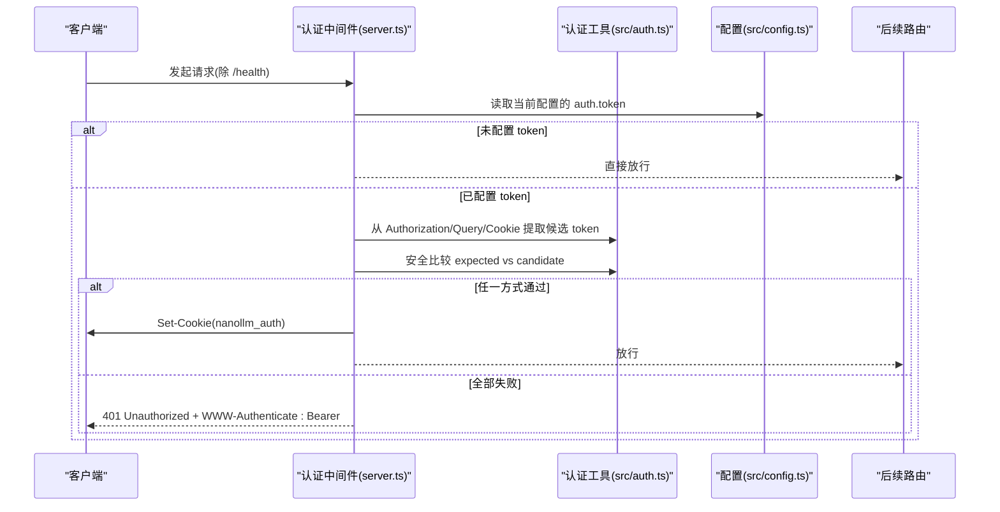
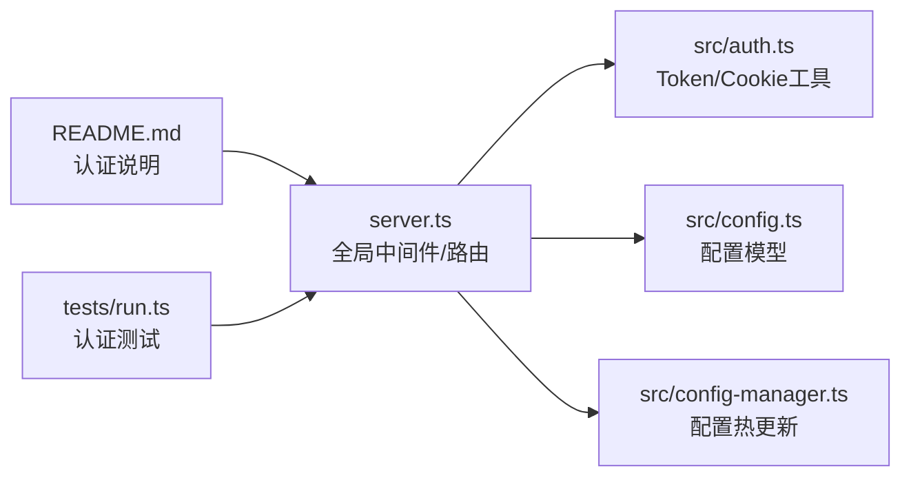

# 认证与授权

<cite>
**本文档引用的文件**
- [src/auth.ts](file://src/auth.ts)
- [server.ts](file://server.ts)
- [src/config.ts](file://src/config.ts)
- [src/config-manager.ts](file://src/config-manager.ts)
- [README.md](file://README.md)
- [tests/run.ts](file://tests/run.ts)
</cite>

## 目录
1. [简介](#简介)
2. [项目结构](#项目结构)
3. [核心组件](#核心组件)
4. [架构概览](#架构概览)
5. [详细组件分析](#详细组件分析)
6. [依赖关系分析](#依赖关系分析)
7. [性能考虑](#性能考虑)
8. [故障排查指南](#故障排查指南)
9. [结论](#结论)
10. [附录](#附录)

## 简介
本文件系统性地文档化 nanollm 的认证与授权机制，重点覆盖以下方面：
- Bearer Token 认证：Token 的提取、验证与安全比较
- Cookie 认证：认证 Cookie 的设置、传递与过期处理
- 多种认证方式：请求头认证、查询参数认证、Cookie 认证的优先级与使用场景
- 错误处理与响应格式：认证失败时的 WWW-Authenticate 与统一错误响应
- 安全最佳实践：Token 的存储、传输安全与权限控制
- 管理员权限与普通用户权限：认证对各路由的影响范围
- 完整认证流程示例与常见问题解决方案

## 项目结构
与认证相关的核心文件与职责如下：
- src/auth.ts：提供 Bearer Token 提取、安全比较与 Cookie 值构建/解析工具函数
- server.ts：全局认证中间件、路由定义、Cookie 设置与错误响应
- src/config.ts：配置模型与认证令牌的解析与物化
- src/config-manager.ts：配置热更新与变更检测，包含认证令牌字段的重启需求标记
- README.md：官方文档，包含认证配置与使用说明
- tests/run.ts：单元测试，覆盖认证中间件行为、Cookie 传递、OPTIONS 预检等

图表来源
- [src/auth.ts:1-42](file://src/auth.ts#L1-L42)
- [server.ts:146-213](file://server.ts#L146-L213)
- [src/config.ts:24-35](file://src/config.ts#L24-L35)
- [src/config-manager.ts:44-49](file://src/config-manager.ts#L44-L49)
- [README.md:91-124](file://README.md#L91-L124)
- [tests/run.ts:129-159](file://tests/run.ts#L129-L159)

章节来源
- [src/auth.ts:1-42](file://src/auth.ts#L1-L42)
- [server.ts:146-213](file://server.ts#L146-L213)
- [src/config.ts:24-35](file://src/config.ts#L24-L35)
- [src/config-manager.ts:44-49](file://src/config-manager.ts#L44-L49)
- [README.md:91-124](file://README.md#L91-L124)
- [tests/run.ts:129-159](file://tests/run.ts#L129-L159)

## 核心组件
- 认证中间件：在除 /health 外的所有路由上执行，支持 Bearer Header、查询参数 token 与 Cookie 三种方式
- Token 工具：提取 Bearer Token、安全比较、构建 Cookie 值、解析 Cookie
- 配置模型：ServerConfig.auth.token 控制是否启用认证
- 配置管理：识别认证令牌变更的重启需求，确保安全策略生效

章节来源
- [server.ts:195-213](file://server.ts#L195-L213)
- [src/auth.ts:3-41](file://src/auth.ts#L3-L41)
- [src/config.ts:24-35](file://src/config.ts#L24-L35)
- [src/config-manager.ts:44-49](file://src/config-manager.ts#L44-L49)

## 架构概览
认证流程在 Hono 应用的中间件层完成，认证通过后会设置 HttpOnly、SameSite=Lax 的认证 Cookie，后续同源请求无需再次携带 token。

图表来源
- [server.ts:195-213](file://server.ts#L195-L213)
- [src/auth.ts:3-18](file://src/auth.ts#L3-L18)
- [src/config.ts:24-35](file://src/config.ts#L24-L35)

## 详细组件分析

### 认证中间件与路由范围
- 作用范围：除 OPTIONS 预检、/health 外的所有路由均受认证保护
- 例外路径：/health 始终放行
- 影响范围：/、/status、/record、/admin、/v1/* 等

章节来源
- [server.ts:187-213](file://server.ts#L187-L213)
- [README.md:103](file://README.md#L103)

### Bearer Token 认证
- 提取方式：从 Authorization 请求头中提取 Bearer Token
- 安全比较：使用 timing-safe 比较，长度相等才进行常量时间比较
- 适用场景：标准 API 客户端、SDK、浏览器 Fetch

章节来源
- [src/auth.ts:3-18](file://src/auth.ts#L3-L18)
- [README.md:106-113](file://README.md#L106-L113)

### 查询参数认证
- 使用方式：在 /admin、/status、/record 等页面路径后附加 ?token=...
- 适用场景：浏览器直接访问管理页、临时调试入口
- 注意：首次成功后会写入认证 Cookie，后续同源请求无需重复带 token

章节来源
- [server.ts:200-202](file://server.ts#L200-L202)
- [README.md:115-123](file://README.md#L115-L123)

### Cookie 认证
- 设置：认证通过后设置 HttpOnly、SameSite=Lax 的 nanollm_auth Cookie
- 传递：后续同源请求自动携带 Cookie
- 过期：Cookie 由服务端设置，不包含过期时间（会话 Cookie）

章节来源
- [server.ts:263-268](file://server.ts#L263-L268)
- [src/auth.ts:20-41](file://src/auth.ts#L20-L41)

### 多种认证方式的优先级与使用场景
- 优先级：Header > Query > Cookie（任一通过即放行）
- Header：适用于标准 API 客户端
- Query：适用于浏览器直接访问管理页
- Cookie：适用于浏览器二次访问，无需重复携带 token

章节来源
- [server.ts:203-207](file://server.ts#L203-L207)
- [README.md:115-123](file://README.md#L115-L123)

### 认证失败的错误处理与响应格式
- 响应码：401 Unauthorized
- 响应头：WWW-Authenticate: Bearer
- 响应体：{ error: "Unauthorized" }

章节来源
- [server.ts:258-261](file://server.ts#L258-L261)

### 安全最佳实践
- 传输安全：建议通过 HTTPS 传输，避免明文泄露
- Token 存储：客户端不应持久化明文 token；浏览器端依赖 HttpOnly Cookie
- 权限控制：认证仅保护访问 nanollm 本身，不替代或覆盖上游模型供应商的鉴权
- 管理页限制：/admin/config 仅用于本机单用户管理，不建议暴露到公网

章节来源
- [README.md:104](file://README.md#L104)
- [README.md:300](file://README.md#L300)

### 管理员权限与普通用户权限
- 普通用户：通过 Header/Query/Cookie 认证后，可访问 /status、/record、/admin 等页面
- 管理员权限：/admin/config 用于编辑配置，保存后立即热更新（除 server.port 与 server.auth.token 需重启外）
- 权限边界：认证不改变上游模型供应商的鉴权策略

章节来源
- [README.md:286-300](file://README.md#L286-L300)
- [README.md:103](file://README.md#L103)

### 完整认证流程示例
- 步骤 1：配置 server.auth.token
- 步骤 2：首次访问 /admin?token=... 或 /status/Cookie: nanollm_auth=...，认证通过后设置 Cookie
- 步骤 3：后续同源请求无需携带 token
- 步骤 4：API 客户端使用 Authorization: Bearer <token> 访问 /v1/*

章节来源
- [README.md:91-124](file://README.md#L91-L124)
- [tests/run.ts:4200-4227](file://tests/run.ts#L4200-L4227)

### 常见问题与解决方案
- 问题：OPTIONS 预检被拒绝
  - 解决：OPTIONS 请求不受认证保护，可直接通过
- 问题：浏览器访问 /admin 一直 401
  - 解决：确认首次使用 ?token=... 成功后已写入 Cookie；检查 SameSite/Lax 与同源
- 问题：修改 server.auth.token 后无效
  - 解决：需重启进程后生效（配置管理器标记为需重启字段）

章节来源
- [server.ts:187-190](file://server.ts#L187-L190)
- [tests/run.ts:4200-4227](file://tests/run.ts#L4200-L4227)
- [src/config-manager.ts:44-49](file://src/config-manager.ts#L44-L49)

## 依赖关系分析
认证相关模块之间的依赖关系如下：

图表来源
- [server.ts:12-14](file://server.ts#L12-L14)
- [src/auth.ts:1-42](file://src/auth.ts#L1-L42)
- [src/config.ts:24-35](file://src/config.ts#L24-L35)
- [src/config-manager.ts:58-75](file://src/config-manager.ts#L58-L75)
- [README.md:91-124](file://README.md#L91-L124)
- [tests/run.ts:129-159](file://tests/run.ts#L129-L159)

章节来源
- [server.ts:12-14](file://server.ts#L12-L14)
- [src/auth.ts:1-42](file://src/auth.ts#L1-L42)
- [src/config.ts:24-35](file://src/config.ts#L24-L35)
- [src/config-manager.ts:58-75](file://src/config-manager.ts#L58-L75)
- [README.md:91-124](file://README.md#L91-L124)
- [tests/run.ts:129-159](file://tests/run.ts#L129-L159)

## 性能考虑
- 认证中间件开销极小：仅做字符串提取与常量时间比较
- Cookie 传递：减少重复 token 传输，降低头部体积
- 配置热更新：认证令牌变更需重启生效，避免运行时频繁切换策略

## 故障排查指南
- 401 Unauthorized 且 WWW-Authenticate: Bearer
  - 检查 Authorization 头是否为 Bearer <token>
  - 检查 /admin?token=... 是否正确传递
  - 检查 Cookie 是否随请求发送
- OPTIONS 预检失败
  - 确认 OPTIONS 请求不受认证保护
- 修改 server.auth.token 后无效
  - 确认已重启进程（配置管理器标记为需重启字段）

章节来源
- [server.ts:258-261](file://server.ts#L258-L261)
- [server.ts:187-190](file://server.ts#L187-L190)
- [src/config-manager.ts:44-49](file://src/config-manager.ts#L44-L49)

## 结论
nanollm 的认证与授权设计简洁而实用：通过 Bearer Token、查询参数与 Cookie 三种方式满足不同场景需求，采用常量时间比较保证安全性，并通过 HttpOnly Cookie 降低客户端存储风险。认证中间件覆盖除 /health 外的主要路由，既保障了服务访问安全，又不影响上游模型供应商的独立鉴权策略。配合配置热更新与重启需求标记，可在安全与运维之间取得平衡。

## 附录
- 配置示例与使用说明参见 README.md 的认证章节
- 认证行为测试参考 tests/run.ts 中的认证相关用例

章节来源
- [README.md:91-124](file://README.md#L91-L124)
- [tests/run.ts:4143-4156](file://tests/run.ts#L4143-L4156)
- [tests/run.ts:4180-4198](file://tests/run.ts#L4180-L4198)