# 错误处理与调试

<cite>
**本文档引用的文件**
- [src/startup-error.ts](file://src/startup-error.ts)
- [src/stream-errors.ts](file://src/stream-errors.ts)
- [src/http-log.ts](file://src/http-log.ts)
- [src/fallback.ts](file://src/fallback.ts)
- [src/status.ts](file://src/status.ts)
- [src/auth.ts](file://src/auth.ts)
- [src/proxy.ts](file://src/proxy.ts)
- [src/request-context.ts](file://src/request-context.ts)
- [src/record.ts](file://src/record.ts)
- [src/config.ts](file://src/config.ts)
- [src/config-manager.ts](file://src/config-manager.ts)
- [src/converters/shared.ts](file://src/converters/shared.ts)
- [src/converters/requests.ts](file://src/converters/requests.ts)
- [src/converters/responses.ts](file://src/converters/responses.ts)
- [src/converters/streams.ts](file://src/converters/streams.ts)
- [package.json](file://package.json)
- [README.md](file://README.md)
</cite>

## 目录
1. [简介](#简介)
2. [项目结构](#项目结构)
3. [核心组件](#核心组件)
4. [架构总览](#架构总览)
5. [详细组件分析](#详细组件分析)
6. [依赖关系分析](#依赖关系分析)
7. [性能考虑](#性能考虑)
8. [故障排查指南](#故障排查指南)
9. [结论](#结论)
10. [附录](#附录)

## 简介
本文件系统性梳理 nanollm 的错误处理与调试机制，覆盖启动错误、认证错误、配置错误、上游服务错误、流式响应异常、日志记录、性能诊断与优化建议，并提供完整的故障排查流程与实践示例路径。

## 项目结构
nanollm 是一个基于 Hono 的 LLM 代理服务，围绕“请求代理、协议转换、流式解析、记录与监控”构建。错误处理与调试相关的核心模块包括：
- 启动与配置：启动错误处理、配置热更新与校验
- 认证与鉴权：Bearer Token 提取与比对
- 上游代理：统一的上游请求封装、超时控制、错误归因
- 流式处理：SSE 解析、流式内容验证、读取异常忽略策略
- 记录与监控：请求记录、状态统计、健康度评估
- 日志：HTTP 日志级别与过滤

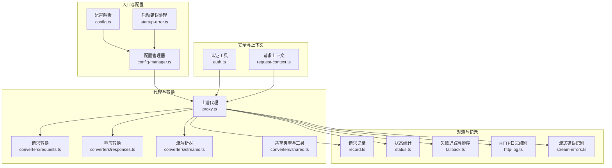

图表来源
- [src/config.ts:1-307](file://src/config.ts#L1-L307)
- [src/config-manager.ts:1-173](file://src/config-manager.ts#L1-L173)
- [src/startup-error.ts:1-23](file://src/startup-error.ts#L1-L23)
- [src/auth.ts:1-42](file://src/auth.ts#L1-L42)
- [src/request-context.ts:1-48](file://src/request-context.ts#L1-L48)
- [src/proxy.ts:1-630](file://src/proxy.ts#L1-L630)
- [src/converters/requests.ts:1-800](file://src/converters/requests.ts#L1-L800)
- [src/converters/responses.ts:1-318](file://src/converters/responses.ts#L1-L318)
- [src/converters/streams.ts:1-800](file://src/converters/streams.ts#L1-L800)
- [src/converters/shared.ts:1-385](file://src/converters/shared.ts#L1-L385)
- [src/record.ts:1-961](file://src/record.ts#L1-L961)
- [src/status.ts:1-363](file://src/status.ts#L1-L363)
- [src/fallback.ts:1-33](file://src/fallback.ts#L1-L33)
- [src/http-log.ts:1-28](file://src/http-log.ts#L1-L28)
- [src/stream-errors.ts:1-16](file://src/stream-errors.ts#L1-L16)

章节来源
- [src/config.ts:1-307](file://src/config.ts#L1-L307)
- [src/config-manager.ts:1-173](file://src/config-manager.ts#L1-L173)
- [src/startup-error.ts:1-23](file://src/startup-error.ts#L1-L23)
- [src/auth.ts:1-42](file://src/auth.ts#L1-L42)
- [src/request-context.ts:1-48](file://src/request-context.ts#L1-L48)
- [src/proxy.ts:1-630](file://src/proxy.ts#L1-L630)
- [src/converters/requests.ts:1-800](file://src/converters/requests.ts#L1-L800)
- [src/converters/responses.ts:1-318](file://src/converters/responses.ts#L1-L318)
- [src/converters/streams.ts:1-800](file://src/converters/streams.ts#L1-L800)
- [src/converters/shared.ts:1-385](file://src/converters/shared.ts#L1-L385)
- [src/record.ts:1-961](file://src/record.ts#L1-L961)
- [src/status.ts:1-363](file://src/status.ts#L1-L363)
- [src/fallback.ts:1-33](file://src/fallback.ts#L1-L33)
- [src/http-log.ts:1-28](file://src/http-log.ts#L1-L28)
- [src/stream-errors.ts:1-16](file://src/stream-errors.ts#L1-L16)

## 核心组件
- 启动错误处理：针对端口占用等启动期错误进行诊断与退出
- 配置与热更新：配置解析、校验、热重载与重启需求字段识别
- 认证与鉴权：Bearer Token 提取、安全比较、Cookie 读取
- 上游代理：统一发起上游请求、超时控制、错误归因与记录
- 流式处理：SSE 解析、流式内容验证、读取异常忽略策略
- 请求记录：请求/响应元数据与体记录、敏感头脱敏、错误归档
- 状态统计：5 分钟桶状指标、成功率、平均耗时、吞吐速度
- 失败追踪与降级：失败窗口内的失败计数、降级排序
- 日志：HTTP 日志级别、过滤与输出

章节来源
- [src/startup-error.ts:1-23](file://src/startup-error.ts#L1-L23)
- [src/config.ts:1-307](file://src/config.ts#L1-L307)
- [src/config-manager.ts:1-173](file://src/config-manager.ts#L1-L173)
- [src/auth.ts:1-42](file://src/auth.ts#L1-L42)
- [src/proxy.ts:1-630](file://src/proxy.ts#L1-L630)
- [src/stream-errors.ts:1-16](file://src/stream-errors.ts#L1-L16)
- [src/record.ts:1-961](file://src/record.ts#L1-L961)
- [src/status.ts:1-363](file://src/status.ts#L1-L363)
- [src/fallback.ts:1-33](file://src/fallback.ts#L1-L33)
- [src/http-log.ts:1-28](file://src/http-log.ts#L1-L28)

## 架构总览
下图展示了错误处理与调试在系统中的位置与交互：

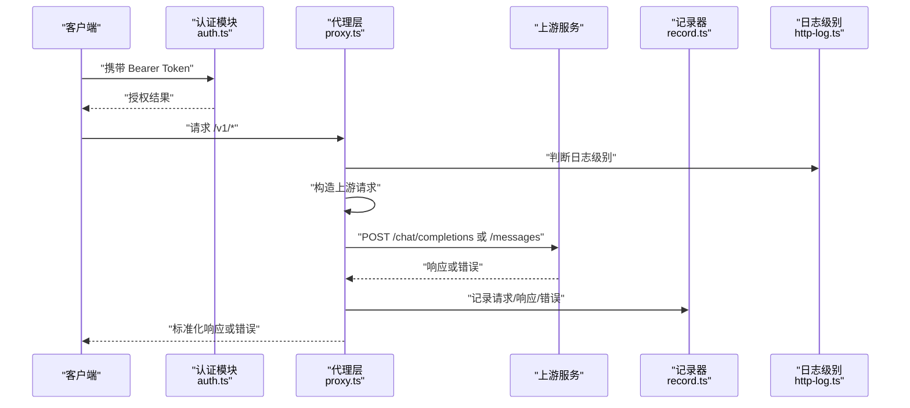

图表来源
- [src/auth.ts:1-42](file://src/auth.ts#L1-L42)
- [src/proxy.ts:1-630](file://src/proxy.ts#L1-L630)
- [src/record.ts:1-961](file://src/record.ts#L1-L961)
- [src/http-log.ts:1-28](file://src/http-log.ts#L1-L28)

## 详细组件分析

### 启动错误处理
- 场景：启动时端口被占用、其他启动异常
- 行为：根据错误码区分提示，记录日志，释放资源，退出进程
- 关键点：EADDRINUSE 专用提示；其他错误统一记录并退出

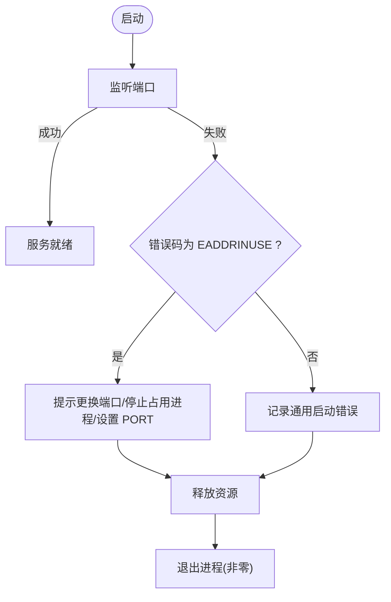

图表来源
- [src/startup-error.ts:1-23](file://src/startup-error.ts#L1-L23)

章节来源
- [src/startup-error.ts:1-23](file://src/startup-error.ts#L1-L23)

### 配置错误与热更新
- 配置解析与校验：字段类型、范围、必填项检查
- 热更新：文件变更监听、去抖重载、哈希对比、应用变更
- 重启需求：仅 server.port 与 server.auth.token 需要重启

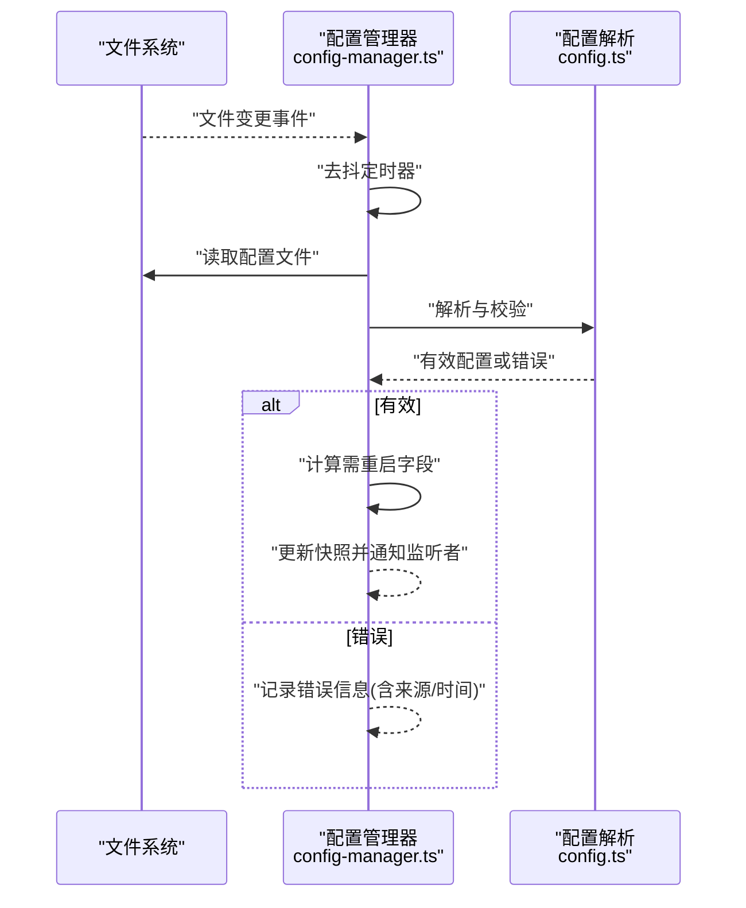

图表来源
- [src/config-manager.ts:1-173](file://src/config-manager.ts#L1-L173)
- [src/config.ts:1-307](file://src/config.ts#L1-L307)

章节来源
- [src/config-manager.ts:1-173](file://src/config-manager.ts#L1-L173)
- [src/config.ts:1-307](file://src/config.ts#L1-L307)

### 认证与鉴权
- Bearer Token 提取与安全比较，避免时序攻击
- Cookie 读取与解码，支持一次性 token 登录后写入同源 Cookie

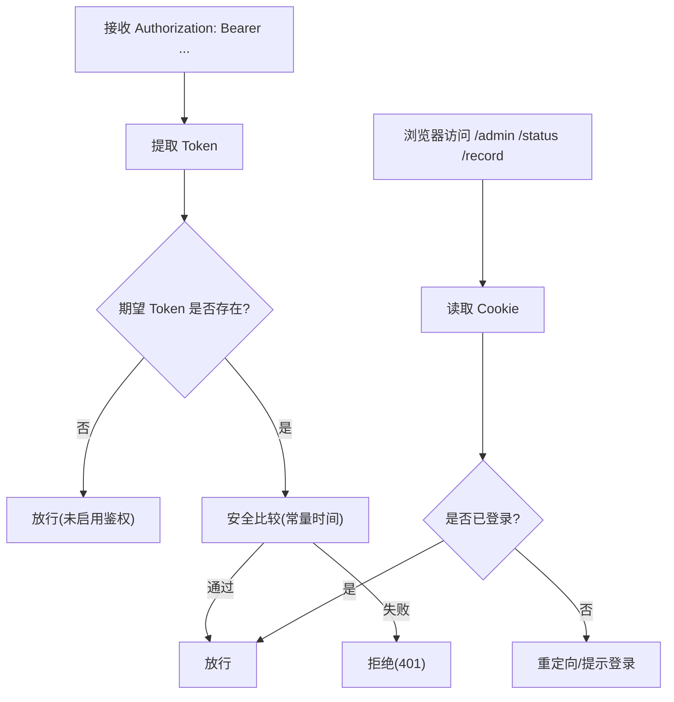

图表来源
- [src/auth.ts:1-42](file://src/auth.ts#L1-L42)

章节来源
- [src/auth.ts:1-42](file://src/auth.ts#L1-L42)
- [README.md:91-124](file://README.md#L91-L124)

### 上游代理与错误归因
- 统一发起上游请求，支持代理、超时、头部透传
- 对非 2xx 响应、HTML 返回、非 SSE 流类型进行错误包装
- 记录上游错误详情，便于后续诊断

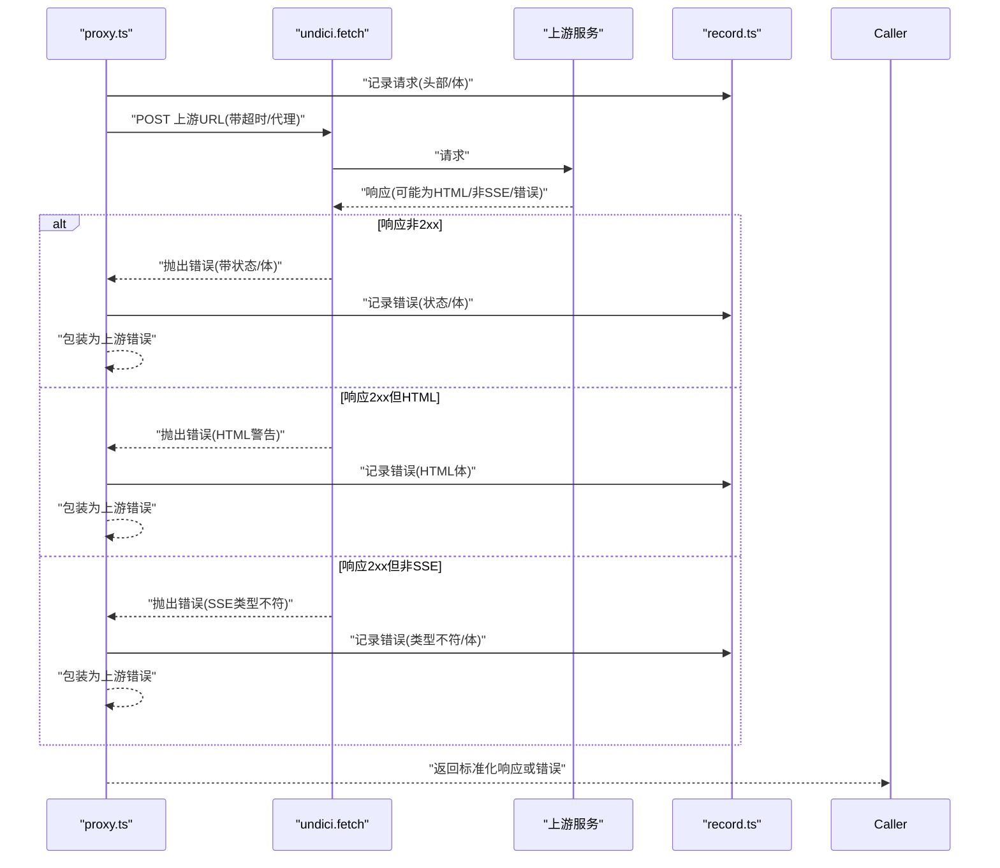

图表来源
- [src/proxy.ts:278-407](file://src/proxy.ts#L278-L407)
- [src/record.ts:300-408](file://src/record.ts#L300-L408)

章节来源
- [src/proxy.ts:278-407](file://src/proxy.ts#L278-L407)
- [src/record.ts:300-408](file://src/record.ts#L300-L408)

### 流式响应错误处理
- SSE 解析：缓冲、ping 过滤、真实数据判定
- 流式内容验证：超过阈值无真实内容则取消并报错
- 读取异常忽略：已完成/取消场景下的特定错误忽略策略

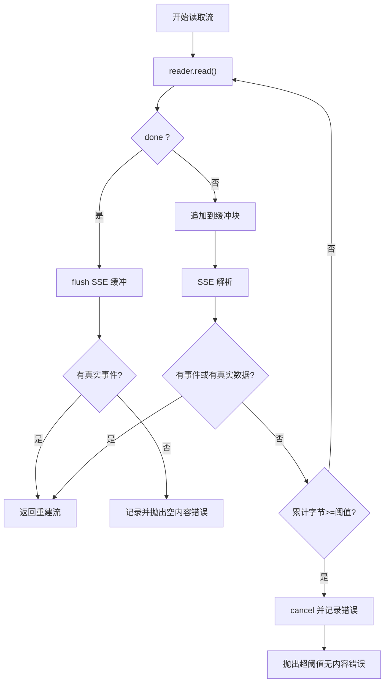

图表来源
- [src/proxy.ts:441-504](file://src/proxy.ts#L441-L504)
- [src/converters/streams.ts:27-90](file://src/converters/streams.ts#L27-L90)
- [src/stream-errors.ts:1-16](file://src/stream-errors.ts#L1-L16)

章节来源
- [src/proxy.ts:441-504](file://src/proxy.ts#L441-L504)
- [src/converters/streams.ts:27-90](file://src/converters/streams.ts#L27-L90)
- [src/stream-errors.ts:1-16](file://src/stream-errors.ts#L1-L16)

### 请求记录与敏感信息脱敏
- 记录请求/响应元数据与体，支持流式增量记录
- 敏感头脱敏：Authorization、x-api-key、Cookie、Set-Cookie
- 错误归档：上游错误、状态码、响应体

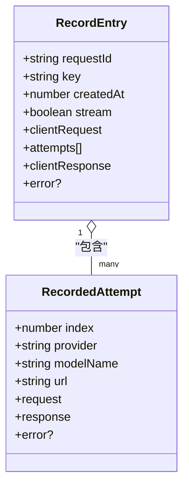

图表来源
- [src/record.ts:36-112](file://src/record.ts#L36-L112)

章节来源
- [src/record.ts:1-961](file://src/record.ts#L1-L961)

### 状态统计与健康度
- 5 分钟桶状指标：请求总量、成功数、TTFB/时延均值、流时长均值、Token 速度
- 成功率与健康色：空/绿/浅绿/橙/红
- SQLite 持久化：可选存储最近 1 个月的桶数据

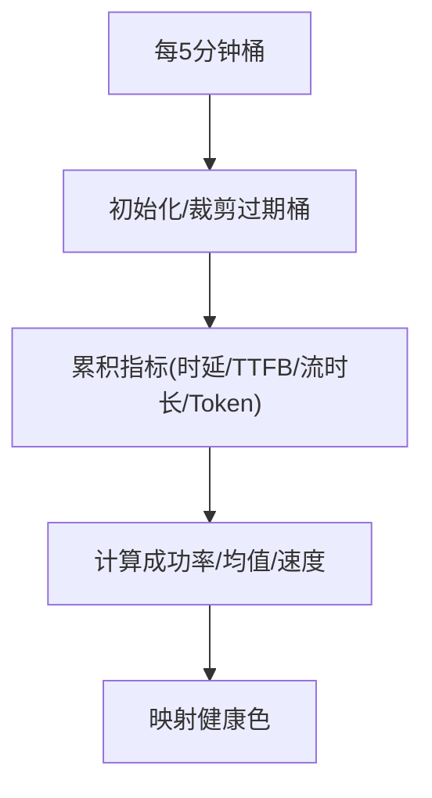

图表来源
- [src/status.ts:84-172](file://src/status.ts#L84-L172)
- [src/status.ts:174-180](file://src/status.ts#L174-L180)

章节来源
- [src/status.ts:1-363](file://src/status.ts#L1-L363)

### 失败追踪与降级
- 失败窗口：最近 5 分钟
- 失败计数：按模型名统计
- 降级排序：按 max(失败数-1, 0) 升序，相等时保持配置顺序

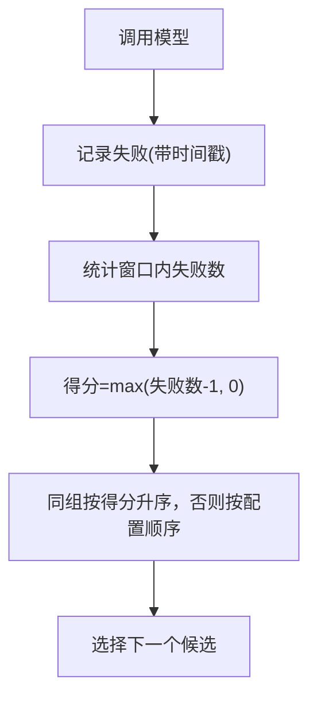

图表来源
- [src/fallback.ts:3-33](file://src/fallback.ts#L3-L33)

章节来源
- [src/fallback.ts:1-33](file://src/fallback.ts#L1-L33)

### 日志记录机制
- HTTP 日志级别：/v1 路径为 info，其他为 debug
- 全局日志级别：LOG_LEVEL=debug/info/error 控制输出
- 请求 ID 注入：统一时间戳与 requestId 前缀

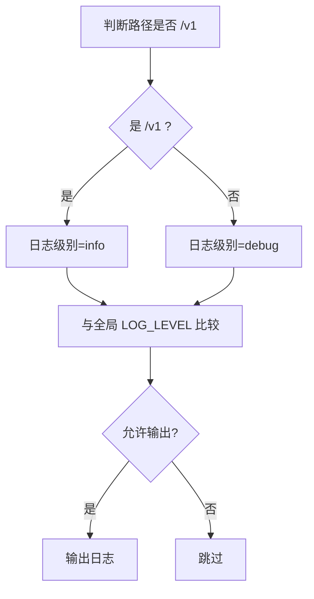

图表来源
- [src/http-log.ts:3-28](file://src/http-log.ts#L3-L28)
- [src/request-context.ts:43-48](file://src/request-context.ts#L43-L48)

章节来源
- [src/http-log.ts:1-28](file://src/http-log.ts#L1-L28)
- [src/request-context.ts:1-48](file://src/request-context.ts#L1-L48)

## 依赖关系分析
- 外部依赖：Hono、Undici、OpenAI、Anthropic SDK、dotenv、yaml
- 内部模块耦合：proxy.ts 依赖 converters/*、record.ts、status.ts、http-log.ts、stream-errors.ts；config.ts 与 config-manager.ts 协作完成配置生命周期管理

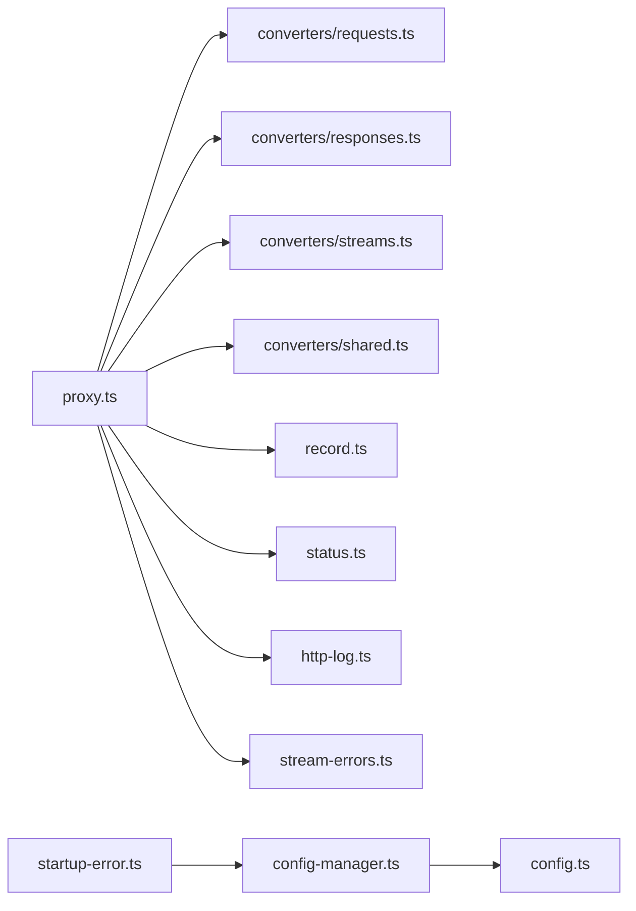

图表来源
- [src/proxy.ts:1-630](file://src/proxy.ts#L1-L630)
- [src/converters/requests.ts:1-800](file://src/converters/requests.ts#L1-L800)
- [src/converters/responses.ts:1-318](file://src/converters/responses.ts#L1-L318)
- [src/converters/streams.ts:1-800](file://src/converters/streams.ts#L1-L800)
- [src/converters/shared.ts:1-385](file://src/converters/shared.ts#L1-L385)
- [src/record.ts:1-961](file://src/record.ts#L1-L961)
- [src/status.ts:1-363](file://src/status.ts#L1-L363)
- [src/http-log.ts:1-28](file://src/http-log.ts#L1-L28)
- [src/stream-errors.ts:1-16](file://src/stream-errors.ts#L1-L16)
- [src/config-manager.ts:1-173](file://src/config-manager.ts#L1-L173)
- [src/config.ts:1-307](file://src/config.ts#L1-L307)
- [src/startup-error.ts:1-23](file://src/startup-error.ts#L1-L23)

章节来源
- [package.json:32-46](file://package.json#L32-L46)

## 性能考虑
- TTFB 超时：默认 5 秒，图像类接口默认 600 秒；可在模型级覆盖
- 流式验证阈值：超过 64KB 无真实内容则取消并报错，避免无效流占用
- 状态统计：5 分钟桶，保留 6 小时数据，SQLite 保留 30 天桶
- 失败降级：按失败数排序，减少热点失败模型的流量

章节来源
- [src/config.ts:5-8](file://src/config.ts#L5-L8)
- [src/proxy.ts:441-504](file://src/proxy.ts#L441-L504)
- [src/status.ts:4-8](file://src/status.ts#L4-L8)
- [src/fallback.ts:18-32](file://src/fallback.ts#L18-L32)

## 故障排查指南

### 启动错误
- 症状：启动失败，提示端口占用
- 处理：更换端口、停止占用进程、设置环境变量 PORT
- 参考路径
  - [启动错误处理实现:1-23](file://src/startup-error.ts#L1-L23)

章节来源
- [src/startup-error.ts:1-23](file://src/startup-error.ts#L1-L23)

### 认证错误
- 症状：401 未授权
- 排查：
  - 确认 server.auth.token 已配置
  - 使用 Bearer Token 访问，或通过一次性 token 获取同源 Cookie
- 参考路径
  - [Bearer Token 提取与安全比较:3-18](file://src/auth.ts#L3-L18)
  - [Cookie 读取与解码:24-41](file://src/auth.ts#L24-L41)
  - [认证说明与示例:91-124](file://README.md#L91-L124)

章节来源
- [src/auth.ts:1-42](file://src/auth.ts#L1-L42)
- [README.md:91-124](file://README.md#L91-L124)

### 配置错误
- 症状：配置非法导致热更新失败或启动失败
- 排查：
  - 查看配置管理器错误快照与来源
  - 修复字段类型/范围/必填项
  - 仅 server.port 与 server.auth.token 需要重启
- 参考路径
  - [配置解析与校验:146-230](file://src/config.ts#L146-L230)
  - [配置热更新与错误记录:81-131](file://src/config-manager.ts#L81-L131)

章节来源
- [src/config.ts:146-230](file://src/config.ts#L146-L230)
- [src/config-manager.ts:81-131](file://src/config-manager.ts#L81-L131)

### 上游服务错误
- 症状：返回非 2xx、HTML 错误页、非 SSE 流
- 排查：
  - 检查上游返回体与状态码
  - 确认 Content-Type 与流类型
  - 查看记录器中的错误条目
- 参考路径
  - [上游请求与错误包装:278-407](file://src/proxy.ts#L278-L407)
  - [请求记录与错误归档:359-408](file://src/record.ts#L359-L408)

章节来源
- [src/proxy.ts:278-407](file://src/proxy.ts#L278-L407)
- [src/record.ts:359-408](file://src/record.ts#L359-L408)

### 流式响应异常
- 症状：网络中断、超时、空流、长时间 ping
- 排查：
  - 检查 SSE 解析与缓冲
  - 观察流式验证阈值触发
  - 忽略已完成/取消场景下的特定读取错误
- 参考路径
  - [SSE 解析与缓冲:27-90](file://src/converters/streams.ts#L27-L90)
  - [流式验证与阈值:441-504](file://src/proxy.ts#L441-L504)
  - [读取异常忽略策略:1-16](file://src/stream-errors.ts#L1-L16)

章节来源
- [src/converters/streams.ts:27-90](file://src/converters/streams.ts#L27-L90)
- [src/proxy.ts:441-504](file://src/proxy.ts#L441-L504)
- [src/stream-errors.ts:1-16](file://src/stream-errors.ts#L1-L16)

### 日志与调试
- 症状：难以定位问题
- 排查：
  - 设置 LOG_LEVEL=debug/info/error
  - 区分 /v1 与其他路径的日志级别
  - 使用请求 ID 在日志中串联请求链路
- 参考路径
  - [HTTP 日志级别判断:7-27](file://src/http-log.ts#L7-L27)
  - [请求 ID 注入与格式化:23-48](file://src/request-context.ts#L23-L48)

章节来源
- [src/http-log.ts:1-28](file://src/http-log.ts#L1-L28)
- [src/request-context.ts:1-48](file://src/request-context.ts#L1-L48)

### 性能问题
- 症状：延迟高、吞吐低
- 排查：
  - 检查 TTFB 超时配置
  - 观察状态页的成功率与均值
  - 利用失败追踪与降级策略优化流量分配
- 参考路径
  - [TTFB 默认与模型级覆盖:5-8](file://src/config.ts#L5-L8)
  - [状态统计与健康度:84-172](file://src/status.ts#L84-L172)
  - [失败追踪与降级排序:18-32](file://src/fallback.ts#L18-L32)

章节来源
- [src/config.ts:5-8](file://src/config.ts#L5-L8)
- [src/status.ts:84-172](file://src/status.ts#L84-L172)
- [src/fallback.ts:18-32](file://src/fallback.ts#L18-L32)

## 结论
nanollm 在启动、配置、认证、代理、流式处理、记录与监控等方面建立了完善的错误处理与调试能力。通过统一的错误包装、详细的请求记录、可配置的日志级别与健康度统计，能够快速定位问题并采取降级与优化措施。建议在生产环境中结合 SQLite 存储与状态页持续观察，并合理设置 TTFB 超时与失败降级策略。

## 附录

### 错误类型与处理策略概览
- 启动错误
  - 端口占用：更换端口/停止占用进程/设置 PORT
  - 其他：记录错误并退出
- 配置错误
  - 字段非法：修正字段类型/范围/必填项
  - 热更新失败：保留上次有效配置并在 UI 显示错误
- 认证错误
  - 未提供或错误 Token：401，引导使用 Bearer 或一次性 token
- 上游错误
  - 非 2xx：记录状态码与响应体
  - HTML 错误页：识别并记录
  - 非 SSE 流：校验并报错
- 流式错误
  - 空流/超阈值：取消并报错
  - 读取异常：在已完成/取消场景下可忽略

章节来源
- [src/startup-error.ts:1-23](file://src/startup-error.ts#L1-L23)
- [src/config-manager.ts:116-131](file://src/config-manager.ts#L116-L131)
- [src/auth.ts:1-42](file://src/auth.ts#L1-L42)
- [src/proxy.ts:278-407](file://src/proxy.ts#L278-L407)
- [src/proxy.ts:441-504](file://src/proxy.ts#L441-L504)
- [src/stream-errors.ts:1-16](file://src/stream-errors.ts#L1-L16)