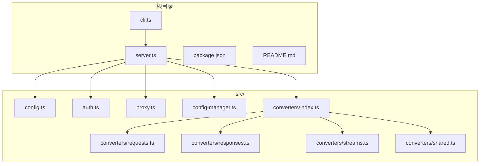
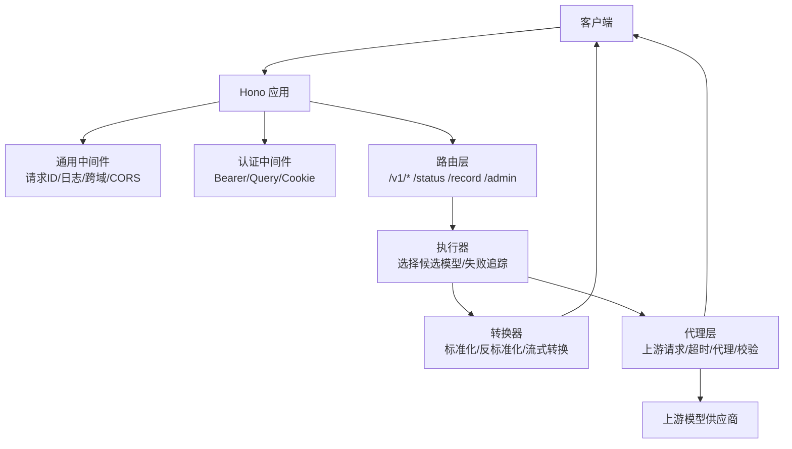
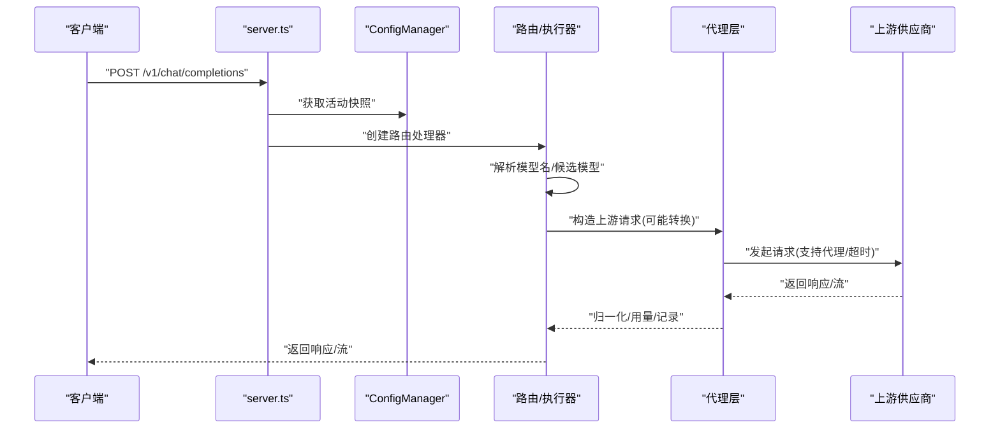
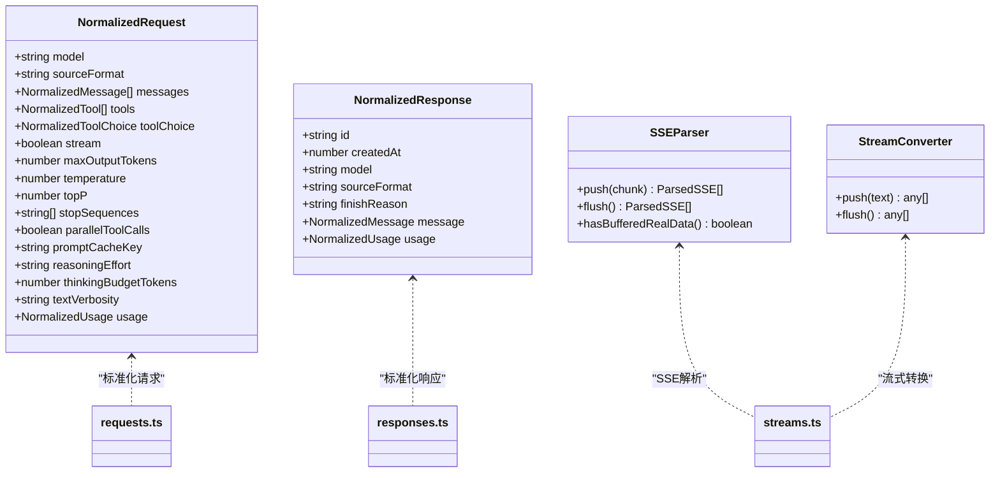
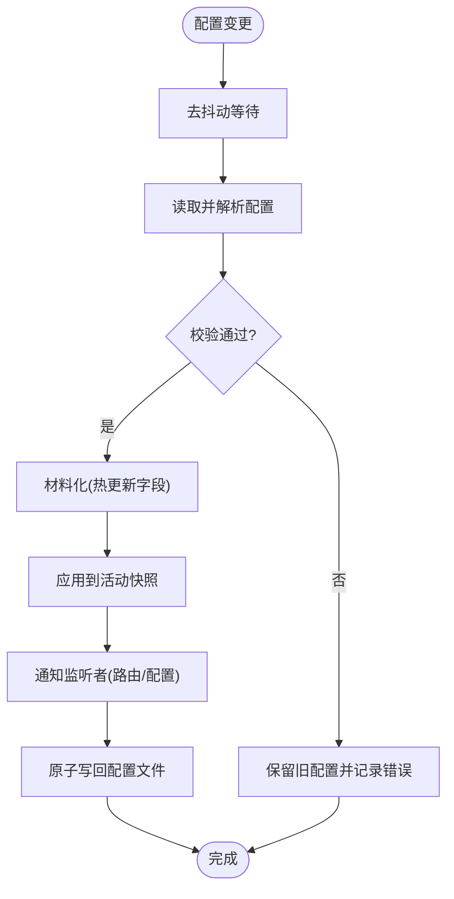
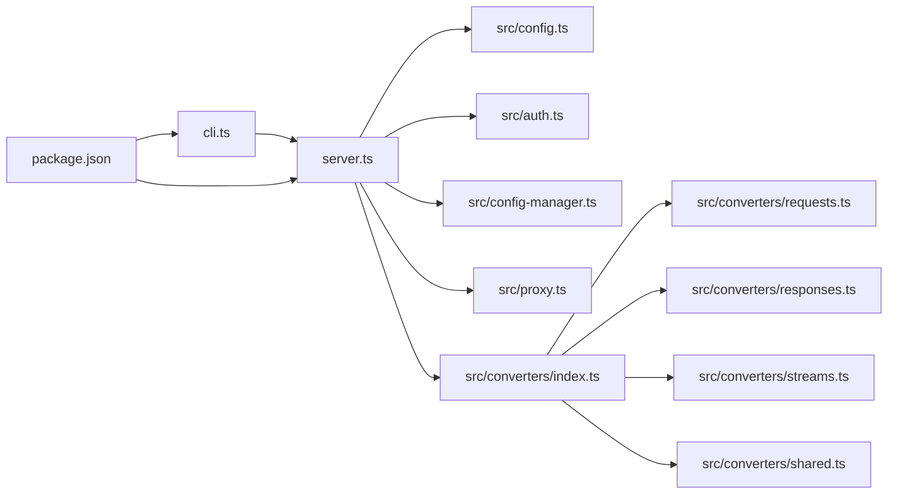

# 代码结构说明

<cite>
**本文档引用的文件**
- [server.ts](file://server.ts)
- [cli.ts](file://cli.ts)
- [converter.ts](file://converter.ts)
- [package.json](file://package.json)
- [README.md](file://README.md)
- [src/converters/index.ts](file://src/converters/index.ts)
- [src/config.ts](file://src/config.ts)
- [src/auth.ts](file://src/auth.ts)
- [src/proxy.ts](file://src/proxy.ts)
- [src/config-manager.ts](file://src/config-manager.ts)
- [src/converters/requests.ts](file://src/converters/requests.ts)
- [src/converters/responses.ts](file://src/converters/responses.ts)
- [src/converters/streams.ts](file://src/converters/streams.ts)
- [src/converters/shared.ts](file://src/converters/shared.ts)
</cite>

## 目录
1. [简介](#简介)
2. [项目结构](#项目结构)
3. [核心组件](#核心组件)
4. [架构总览](#架构总览)
5. [详细组件分析](#详细组件分析)
6. [依赖关系分析](#依赖关系分析)
7. [性能考虑](#性能考虑)
8. [故障排查指南](#故障排查指南)
9. [结论](#结论)
10. [附录](#附录)

## 简介
本项目是一个基于 Hono 的 LLM 模型代理服务，旨在轻量化地聚合多个模型供应商的接口，统一对外暴露 OpenAI 兼容的 /v1/* 接口，同时支持 Responses 和 Messages 两种协议格式，并提供图像生成/编辑能力。其核心特性包括：
- 统一的请求/响应协议转换与流式转换
- 模型级兜底策略与失败追踪
- 热更新配置与本地管理页
- 记录与重放调试能力
- 可选 SQLite 存储以跨进程保留状态

## 项目结构
项目采用“功能模块 + 层次化组织”的方式：
- 根目录包含入口脚本、CLI 入口、构建与发布配置、文档与脚本
- src/ 下按功能域划分：核心业务逻辑（config、proxy、auth）、转换器子系统（converters/）、UI 页面渲染（status-page.tsx、record-page.tsx、admin-config-page.tsx）、辅助模块（request-context、response-cache、http-log、stream-errors、status、record、startup-error）
- converters/ 子系统进一步细分为 requests、responses、streams、shared 等模块，实现协议标准化与转换

图表来源
- [server.ts](file://server.ts)
- [cli.ts](file://cli.ts)
- [converter.ts](file://converter.ts)
- [src/config.ts](file://src/config.ts)
- [src/auth.ts](file://src/auth.ts)
- [src/proxy.ts](file://src/proxy.ts)
- [src/config-manager.ts](file://src/config-manager.ts)
- [src/converters/index.ts](file://src/converters/index.ts)
- [src/converters/requests.ts](file://src/converters/requests.ts)
- [src/converters/responses.ts](file://src/converters/responses.ts)
- [src/converters/streams.ts](file://src/converters/streams.ts)
- [src/converters/shared.ts](file://src/converters/shared.ts)

章节来源
- [server.ts](file://server.ts)
- [cli.ts](file://cli.ts)
- [converter.ts](file://converter.ts)
- [package.json](file://package.json)
- [README.md](file://README.md)

## 核心组件
- 服务器入口与路由层：负责解析启动参数、初始化配置管理器、注册中间件与路由、启动 HTTP 服务
- 配置系统：解析 YAML 配置、校验与归一化、热更新监听、区分热更新字段与需重启字段
- 认证与授权：支持 Bearer Token 与 Cookie 认证，提供安全的管理页访问
- 代理与转换：根据请求格式进行协议标准化、上游请求构造、响应归一化、流式转换与缓存
- 记录与重放：记录请求/响应、支持重放与查询
- 状态与存储：维护模型成功率/失败率、TTFB/时延统计，支持内存与 SQLite 存储

章节来源
- [server.ts](file://server.ts)
- [src/config.ts](file://src/config.ts)
- [src/config-manager.ts](file://src/config-manager.ts)
- [src/auth.ts](file://src/auth.ts)
- [src/proxy.ts](file://src/proxy.ts)
- [src/converters/index.ts](file://src/converters/index.ts)

## 架构总览
整体架构围绕“请求进入 -> 配置解析 -> 认证校验 -> 协议标准化 -> 上游代理 -> 流式转换/缓存 -> 响应返回”的主链路展开，辅以记录、状态、重放与热更新机制。

图表来源
- [server.ts](file://server.ts)
- [src/proxy.ts](file://src/proxy.ts)
- [src/converters/index.ts](file://src/converters/index.ts)

## 详细组件分析

### 主服务器(server.ts)架构与启动流程
- 启动参数解析：支持 --config 与 --storage，解析配置路径与存储模式
- 初始化：创建 ConfigManager、根据存储模式初始化 SQLite、开启录制
- 中间件：
  - 请求上下文：注入/携带请求 ID，统一日志输出
  - CORS：除 OPTIONS 与 /health 外全放行
  - 认证：Bearer/Query/Cookie 任一通过即放行，否则 401
- 路由：
  - GET /、/health、/v1/models
  - POST /v1/chat/completions、/v1/responses、/v1/messages
  - POST /v1/images/generations、/v1/images/edits
  - /status、/record、/admin（含数据接口）
- 执行器：
  - 解析请求模型名，选择候选模型（支持通配与兜底组）
  - 若上游格式与请求格式一致，走直通路径；否则进行协议转换
  - 流式场景：构建可取消/可记录的 ReadableStream，支持 SSE 转换与用量收集
  - 成功/失败统计与记录，失败时按顺序尝试下一个候选模型
- 服务生命周期：启动监听、错误处理、关闭清理（释放配置监听、刷写录制、关闭数据库）

图表来源
- [server.ts](file://server.ts)
- [src/proxy.ts](file://src/proxy.ts)
- [src/config-manager.ts](file://src/config-manager.ts)

章节来源
- [server.ts](file://server.ts)
- [src/config-manager.ts](file://src/config-manager.ts)
- [src/proxy.ts](file://src/proxy.ts)

### CLI 入口(cli.ts)设计思路
- 作为二进制入口，导出 server 并在安装后可通过 nanollm 命令运行
- 与 package.json 的 bin 映射配合，实现 npm install -g 或 npx 使用

章节来源
- [cli.ts](file://cli.ts)
- [package.json](file://package.json)

### 转换器(converter.ts)模块化设计
- 通过导出 src/converters/index.js，形成统一入口，便于外部按需导入
- 转换器子系统内部按“请求标准化/响应标准化/流式转换/共享类型”分层，职责清晰

章节来源
- [converter.ts](file://converter.ts)
- [src/converters/index.ts](file://src/converters/index.ts)

### 转换器子系统详解
- requests.ts：将不同协议的请求标准化为统一的 NormalizedRequest，支持工具、消息、停止序列、温度、topP、并行工具调用、提示缓存键等
- responses.ts：将不同协议的响应标准化为统一的 NormalizedResponse，提取 finishReason、message.parts、toolCalls、usage
- streams.ts：实现 SSE 解析器、事件格式化、流式转换器、用量收集器、OpenAI/Responses/Anthropic 的流式解析与发射
- shared.ts：定义 NormalizedRequest/Response、消息/部件/工具/工具选择等核心类型与工具函数

图表来源
- [src/converters/shared.ts](file://src/converters/shared.ts)
- [src/converters/requests.ts](file://src/converters/requests.ts)
- [src/converters/responses.ts](file://src/converters/responses.ts)
- [src/converters/streams.ts](file://src/converters/streams.ts)

章节来源
- [src/converters/requests.ts](file://src/converters/requests.ts)
- [src/converters/responses.ts](file://src/converters/responses.ts)
- [src/converters/streams.ts](file://src/converters/streams.ts)
- [src/converters/shared.ts](file://src/converters/shared.ts)

### 配置系统与热更新
- 解析与校验：支持环境变量替换、字段类型校验、通配模型匹配、兜底组校验
- 归一化：默认端口、TTFB 超时、记录最大条数、认证令牌等
- 热更新：监听配置文件变更，去抖动加载，区分“立即生效”与“需重启”字段
- 管理页：表单驱动编辑 YAML，原子写回，支持从服务端刷新与冲突检测

图表来源
- [src/config.ts](file://src/config.ts)
- [src/config-manager.ts](file://src/config-manager.ts)

章节来源
- [src/config.ts](file://src/config.ts)
- [src/config-manager.ts](file://src/config-manager.ts)

### 代理与上游交互
- URL 构造：根据 provider 自动拼接 /chat/completions、/responses、/messages、/images/*
- 认证头：OpenAI/Responses 使用 Bearer，Anthropic 使用 x-api-key
- 请求体转换：深合并模型 body、执行 bodyExpression 表达式、strip 不存储的 item ids
- 代理与超时：支持模型级代理优先于环境变量，TTFB 超时控制
- 流式校验：SSE 首包校验、缓冲上限、空流检测
- 记录与追踪：记录上游 URL、请求头/体、响应元信息与体，支持重放

章节来源
- [src/proxy.ts](file://src/proxy.ts)

### 认证与授权
- 提取 Bearer Token：支持 Authorization 头、查询参数、Cookie
- 安全比较：使用 timingSafeEqual 对比令牌
- Cookie 持久化：登录成功后写入同源 HttpOnly Cookie

章节来源
- [src/auth.ts](file://src/auth.ts)

## 依赖关系分析
- server.ts 依赖 config.ts、auth.ts、config-manager.ts、proxy.ts、converters/*、status、record、http-log 等模块
- converter.ts 作为导出入口，统一暴露 converters/index.js
- package.json 定义了二进制映射与构建脚本，依赖 hono、@hono/node-server、yaml、openai、@anthropic-ai/sdk、undici 等

图表来源
- [server.ts](file://server.ts)
- [cli.ts](file://cli.ts)
- [converter.ts](file://converter.ts)
- [package.json](file://package.json)
- [src/config.ts](file://src/config.ts)
- [src/auth.ts](file://src/auth.ts)
- [src/proxy.ts](file://src/proxy.ts)
- [src/config-manager.ts](file://src/config-manager.ts)
- [src/converters/index.ts](file://src/converters/index.ts)
- [src/converters/requests.ts](file://src/converters/requests.ts)
- [src/converters/responses.ts](file://src/converters/responses.ts)
- [src/converters/streams.ts](file://src/converters/streams.ts)
- [src/converters/shared.ts](file://src/converters/shared.ts)

章节来源
- [server.ts](file://server.ts)
- [cli.ts](file://cli.ts)
- [converter.ts](file://converter.ts)
- [package.json](file://package.json)

## 性能考虑
- 流式处理：使用 ReadableStream 与 SSE 解析器，边解码边转换，降低内存占用
- 缓冲与校验：对上游 SSE 进行首包校验与缓冲上限控制，避免空流与过长 ping
- 用量收集：在流式转换过程中收集用量，减少二次解析成本
- 失败追踪与排序：基于失败次数与时间窗口对兜底组成员进行排序，提升成功率
- 代理与超时：支持模型级代理与 TTFB 超时，避免阻塞与资源浪费

## 故障排查指南
- 认证失败：检查 Authorization 头、查询参数 token 或 Cookie 是否正确
- 配置错误：查看管理页错误提示，确认字段类型与必填项；必要时回滚配置
- 上游异常：关注记录与重放功能，定位上游返回的 HTML 错误页或非 SSE 内容
- 流式中断：检查客户端是否提前取消，服务端会区分“完成取消”与“未完成取消”，并记录用量
- 端口占用：启动失败时检查端口占用与权限，必要时更换端口或以管理员身份运行

章节来源
- [src/auth.ts](file://src/auth.ts)
- [src/config-manager.ts](file://src/config-manager.ts)
- [src/proxy.ts](file://src/proxy.ts)
- [server.ts](file://server.ts)

## 结论
本项目通过清晰的模块划分与协议转换体系，实现了多供应商模型的统一接入与高效代理。其热更新配置、记录与重放、状态统计与可选 SQLite 存储，为生产部署提供了良好的可观测性与可维护性。建议在实际使用中结合 README 的配置示例与最佳实践，合理设置超时、代理与兜底策略，确保稳定性与性能。

## 附录
- 代码风格与命名规范
  - 文件命名：小写短横线或下划线，模块化拆分
  - 类型与接口：统一使用 PascalCase，如 NormalizedRequest
  - 函数命名：动词短语，如 normalizeOpenAIChatRequest
  - 常量：SCREAMING_SNAKE_CASE，如 DEFAULT_TTFB_TIMEOUT
  - 导出：统一在 converters/index.ts 汇总导出，便于外部按需引入
- 重要文件快速定位
  - 服务器入口：server.ts
  - CLI 入口：cli.ts
  - 转换器入口：converter.ts → src/converters/index.ts
  - 配置解析：src/config.ts
  - 热更新：src/config-manager.ts
  - 代理与上游：src/proxy.ts
  - 认证：src/auth.ts
  - 协议转换：src/converters/requests.ts、responses.ts、streams.ts、shared.ts

章节来源
- [server.ts](file://server.ts)
- [cli.ts](file://cli.ts)
- [converter.ts](file://converter.ts)
- [src/converters/index.ts](file://src/converters/index.ts)
- [src/config.ts](file://src/config.ts)
- [src/config-manager.ts](file://src/config-manager.ts)
- [src/proxy.ts](file://src/proxy.ts)
- [src/auth.ts](file://src/auth.ts)
- [src/converters/requests.ts](file://src/converters/requests.ts)
- [src/converters/responses.ts](file://src/converters/responses.ts)
- [src/converters/streams.ts](file://src/converters/streams.ts)
- [src/converters/shared.ts](file://src/converters/shared.ts)