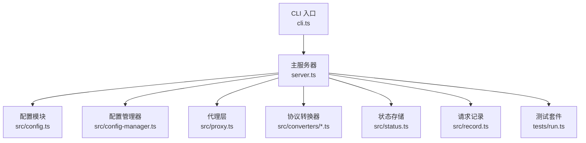
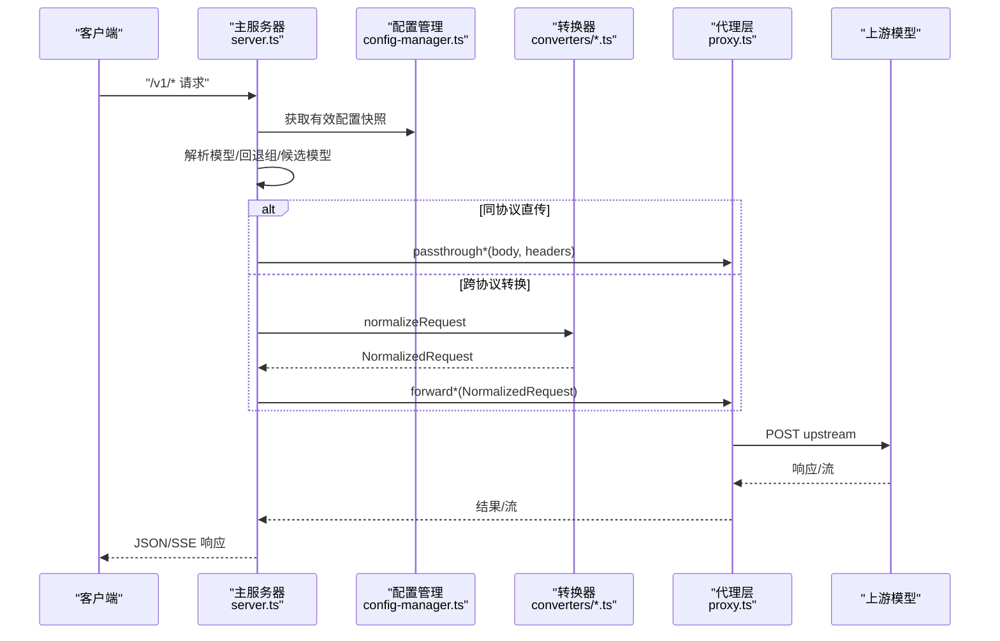
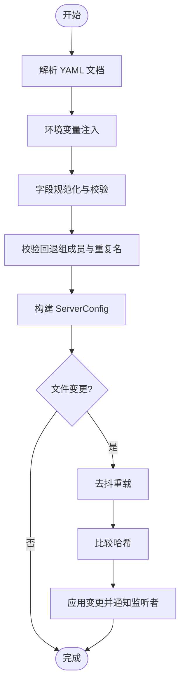
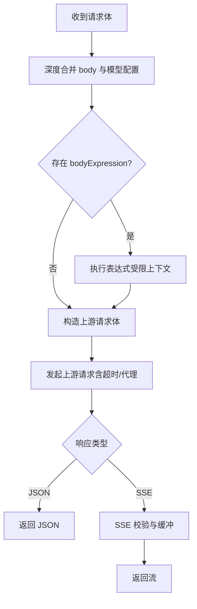
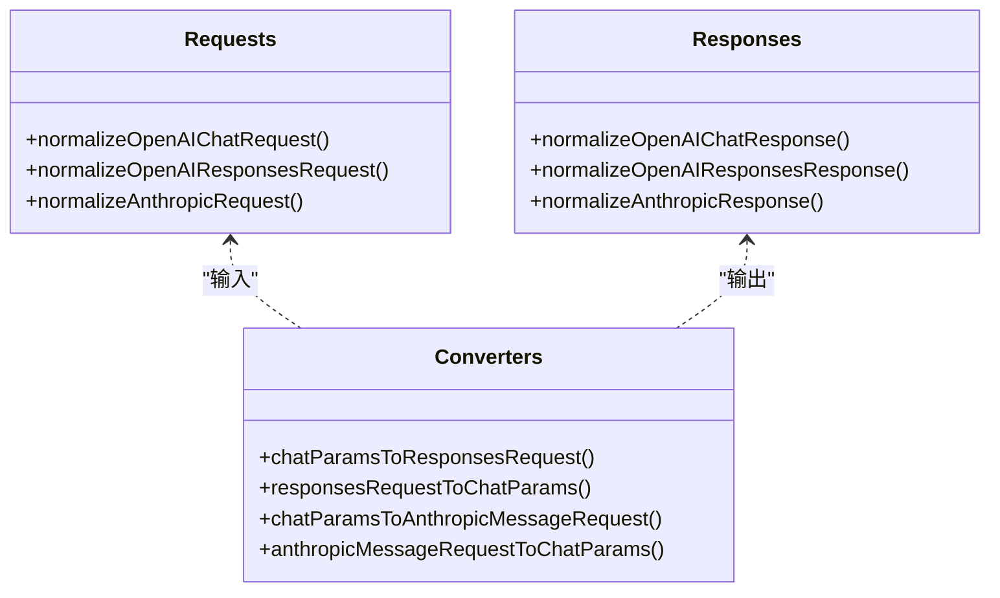
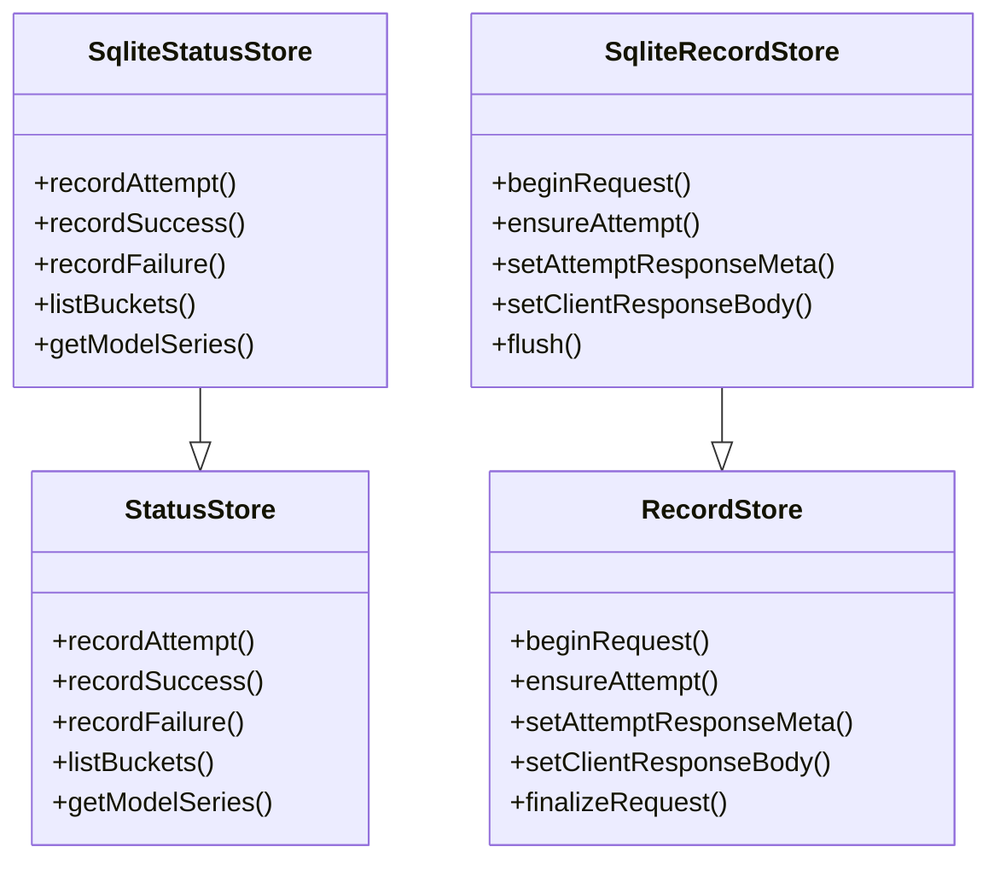
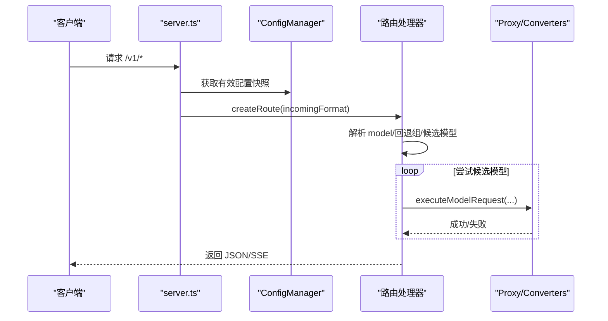
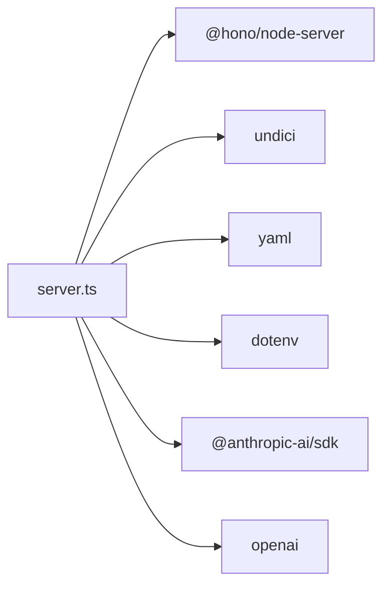

# 开发指南

<cite>
**本文档引用的文件**
- [README.md](file://README.md)
- [package.json](file://package.json)
- [tsconfig.json](file://tsconfig.json)
- [jsconfig.json](file://jsconfig.json)
- [cli.ts](file://cli.ts)
- [server.ts](file://server.ts)
- [src/config.ts](file://src/config.ts)
- [src/config-manager.ts](file://src/config-manager.ts)
- [src/proxy.ts](file://src/proxy.ts)
- [src/converters/index.ts](file://src/converters/index.ts)
- [src/converters/requests.ts](file://src/converters/requests.ts)
- [src/converters/responses.ts](file://src/converters/responses.ts)
- [src/status.ts](file://src/status.ts)
- [src/record.ts](file://src/record.ts)
- [tests/run.ts](file://tests/run.ts)
</cite>

## 目录
1. [简介](#简介)
2. [项目结构](#项目结构)
3. [核心组件](#核心组件)
4. [架构总览](#架构总览)
5. [详细组件分析](#详细组件分析)
6. [依赖关系分析](#依赖关系分析)
7. [性能考虑](#性能考虑)
8. [故障排查指南](#故障排查指南)
9. [结论](#结论)
10. [附录](#附录)

## 简介
本项目是一个轻量级 LLM 模型代理服务，面向个人本地聚合多模型场景，提供统一的 OpenAI 兼容接口（/v1/chat/completions、/v1/responses、/v1/messages），并支持协议转换、请求体表达式动态改写、模型级代理、超时控制、认证与热更新配置等功能。项目采用 Hono 作为 Web 框架，TypeScript 构建，内置内存/SQLite 可选存储，支持管理页与监控页。

## 项目结构
- 根目录脚本与配置
  - package.json：定义构建脚本、依赖与二进制入口
  - tsconfig.json/jsconfig.json：TypeScript/JavaScript 编译配置
  - cli.ts：命令行入口，导出 server
- 业务核心
  - server.ts：主服务器，路由、鉴权、配置热更新、代理转发、SSE 流处理、记录与状态
  - src/config.ts：配置解析、规范化、模型与回退组解析
  - src/config-manager.ts：配置文件监听与热更新
  - src/proxy.ts：上游请求封装、认证头、代理、超时、SSE 校验、请求体变换
  - src/converters/*：协议转换（OpenAI Chat/Responses、Anthropic）
  - src/status.ts：请求成功率、耗时、Token 速率等指标统计（内存/SQLite）
  - src/record.ts：请求记录与回放（内存/SQLite）
- 测试
  - tests/run.ts：集中式测试套件，覆盖转换器、代理、认证、记录、状态等

**图表来源**
- [cli.ts:1-5](file://cli.ts#L1-L5)
- [server.ts:1-1374](file://server.ts#L1-L1374)
- [src/config.ts:1-307](file://src/config.ts#L1-L307)
- [src/config-manager.ts:1-173](file://src/config-manager.ts#L1-L173)
- [src/proxy.ts:1-630](file://src/proxy.ts#L1-L630)
- [src/converters/index.ts:1-99](file://src/converters/index.ts#L1-L99)
- [src/status.ts:1-363](file://src/status.ts#L1-L363)
- [src/record.ts:1-961](file://src/record.ts#L1-L961)
- [tests/run.ts:1-800](file://tests/run.ts#L1-L800)

**章节来源**
- [README.md:1-309](file://README.md#L1-L309)
- [package.json:1-48](file://package.json#L1-L48)
- [tsconfig.json:1-15](file://tsconfig.json#L1-L15)
- [jsconfig.json:1-12](file://jsconfig.json#L1-L12)

## 核心组件
- 配置系统
  - 解析 YAML，环境变量注入，字段类型与范围校验，模型与回退组校验
  - 提供公开模型名集合、通配模型名匹配、回退组成员解析
- 配置管理器
  - 监听配置文件变更，去抖重载，区分热更新字段与需重启字段
- 代理层
  - 统一认证头、代理、超时、SSE 校验、请求体深度合并与表达式改写
  - 支持直传与转换两种模式（同协议直传、跨协议转换）
- 协议转换器
  - OpenAI Chat/Responses ↔ Anthropic 消息格式互转
  - SSE/流事件解析与格式化
- 状态与记录
  - 内存/SQLite 双实现的状态桶统计与健康色评估
  - 请求记录与回放（含敏感信息脱敏）

**章节来源**
- [src/config.ts:1-307](file://src/config.ts#L1-L307)
- [src/config-manager.ts:1-173](file://src/config-manager.ts#L1-L173)
- [src/proxy.ts:1-630](file://src/proxy.ts#L1-L630)
- [src/converters/index.ts:1-99](file://src/converters/index.ts#L1-L99)
- [src/status.ts:1-363](file://src/status.ts#L1-L363)
- [src/record.ts:1-961](file://src/record.ts#L1-L961)

## 架构总览
整体采用“路由层 → 配置解析 → 代理转发/转换 → 协议转换 → 上游”的链路，结合记录与状态模块提供可观测性与可恢复能力。

**图表来源**
- [server.ts:663-800](file://server.ts#L663-L800)
- [src/proxy.ts:569-630](file://src/proxy.ts#L569-L630)
- [src/converters/requests.ts:38-164](file://src/converters/requests.ts#L38-L164)
- [src/converters/responses.ts:26-162](file://src/converters/responses.ts#L26-L162)

## 详细组件分析

### 配置与配置管理
- 配置解析与规范化
  - 支持环境变量占位符解析、字段类型与范围校验、代理 URL 校验、布尔与数值归一化
  - 回退组校验：成员必须存在于已知模型集合，不允许重复公共名
- 模型与回退组
  - 支持通配模型名（仅末尾*），按前缀最长优先匹配
  - 公开模型名集合包含回退组名与所有模型名
- 配置热更新
  - 监控文件变更，去抖重载，区分热更新字段（models、fallback、server.ttfb_timeout、record.max_size）与需重启字段（server.port、server.auth.token）

**图表来源**
- [src/config.ts:189-307](file://src/config.ts#L189-L307)
- [src/config-manager.ts:146-173](file://src/config-manager.ts#L146-L173)

**章节来源**
- [src/config.ts:1-307](file://src/config.ts#L1-L307)
- [src/config-manager.ts:1-173](file://src/config-manager.ts#L1-L173)

### 代理层与请求体变换
- 认证与代理
  - 自动注入各供应商认证头（OpenAI 使用 Bearer，Anthropic 使用 x-api-key）
  - 支持模型级代理优先于环境变量代理
- 请求体变换
  - 深度合并 body 与模型级 body 配置
  - 执行 bodyExpression（同步上下文，限制超时），返回新 body
  - 对 OpenAI Responses 不存储条目 ID 的特殊处理
- 上游请求
  - 统一超时控制（TTFB），HTML 错误页检测，SSE 内容类型校验
  - 流式响应验证：缓冲上限、SSE 解析、空 ping 检测
- 原始请求透传
  - 支持 multipart/form-data 与 JSON 的原始体处理，模型名替换

**图表来源**
- [src/proxy.ts:104-174](file://src/proxy.ts#L104-L174)
- [src/proxy.ts:278-407](file://src/proxy.ts#L278-L407)
- [src/proxy.ts:441-504](file://src/proxy.ts#L441-L504)

**章节来源**
- [src/proxy.ts:1-630](file://src/proxy.ts#L1-L630)

### 协议转换器
- 请求转换
  - OpenAI Chat → NormalizedRequest：消息角色与内容归一化、工具/函数/思考/拒绝等
  - OpenAI Responses → NormalizedRequest：指令与输入归一化、命名空间工具扁平化
  - Anthropic → NormalizedRequest：系统提示、消息块、工具与思考
- 响应转换
  - NormalizedResponse → OpenAI Chat/Responses/Anthropic：消息内容、工具调用、思考与拒绝
- 流式转换
  - SSE 解析与格式化，事件分发

**图表来源**
- [src/converters/requests.ts:38-164](file://src/converters/requests.ts#L38-L164)
- [src/converters/responses.ts:26-162](file://src/converters/responses.ts#L26-L162)
- [src/converters/index.ts:27-77](file://src/converters/index.ts#L27-L77)

**章节来源**
- [src/converters/requests.ts:1-800](file://src/converters/requests.ts#L1-L800)
- [src/converters/responses.ts:1-318](file://src/converters/responses.ts#L1-L318)
- [src/converters/index.ts:1-99](file://src/converters/index.ts#L1-L99)

### 状态与记录
- 状态存储
  - 内存实现：按 5 分钟桶统计成功率、平均耗时、Token 速率
  - SQLite 实现：持久化 30 天桶数据，支持健康色评估与时间轴可视化
- 请求记录
  - 内存/SQLite 双实现，记录客户端请求、上游尝试、响应元数据与体，支持回放
  - 敏感头部脱敏，最大容量控制与逐出策略

**图表来源**
- [src/status.ts:84-172](file://src/status.ts#L84-L172)
- [src/status.ts:227-362](file://src/status.ts#L227-L362)
- [src/record.ts:185-408](file://src/record.ts#L185-L408)
- [src/record.ts:433-761](file://src/record.ts#L433-L761)

**章节来源**
- [src/status.ts:1-363](file://src/status.ts#L1-L363)
- [src/record.ts:1-961](file://src/record.ts#L1-L961)

### 主服务器路由与鉴权
- 路由工厂
  - 为每种协议创建路由处理器，统一提取 model、stream、构建候选模型列表
  - 通过回退组与失败追踪器排序候选模型，依次尝试
- 鉴权
  - 支持 Bearer Token、查询参数 token、同源 Cookie 三种入口
  - 除 /health 外均受保护，认证失败返回 401
- CORS 与日志
  - API 路由允许跨域，OPTIONS 预检放行
  - HTTP 日志级别按路径动态控制

**图表来源**
- [server.ts:663-800](file://server.ts#L663-L800)
- [src/config-manager.ts:77-115](file://src/config-manager.ts#L77-L115)

**章节来源**
- [server.ts:145-213](file://server.ts#L145-L213)
- [server.ts:663-800](file://server.ts#L663-L800)

## 依赖关系分析
- 运行时依赖
  - Hono：Web 框架与路由
  - Undici：HTTP/代理请求
  - Anthropic/OpenAI SDK：供应商 SDK
  - YAML：配置解析
  - dotenv：环境变量加载
- 开发依赖
  - TypeScript、tsx、@types/node：开发与运行时类型检查

**图表来源**
- [package.json:32-41](file://package.json#L32-L41)

**章节来源**
- [package.json:1-48](file://package.json#L1-L48)

## 性能考虑
- 流式处理
  - SSE 校验与缓冲上限，避免空 ping 占用资源
  - 流读取分片解码，及时释放锁
- 超时与代理
  - 模型级 TTFB 超时，避免长时间阻塞
  - 代理优先级与连接复用，减少网络延迟
- 状态与记录
  - 5 分钟桶统计，滑动窗口裁剪，降低内存占用
  - SQLite 持久化，支持跨进程保留近期数据

[本节为通用指导，无需特定文件引用]

## 故障排查指南
- 常见问题定位
  - 缺少配置文件：启动时需 --config 或当前目录 config.yaml
  - 配置非法：配置管理器会保留上次有效配置并在 UI 显示错误
  - 认证失败：确认 Bearer Token、Cookie 或查询参数 token 正确
  - 上游返回 HTML：代理层会检测并报错，检查 base_url 与鉴权
  - SSE 空内容：代理层会检测并报错，检查上游是否正确发送事件
- 调试建议
  - 使用 /status 与 /record 查看最近请求与健康状态
  - 启用 SQLite 存储以跨进程保留数据
  - 在本地管理页进行小步修改并“保存并应用”，观察热更新效果

**章节来源**
- [server.ts:126-136](file://server.ts#L126-L136)
- [src/proxy.ts:377-404](file://src/proxy.ts#L377-L404)
- [README.md:286-309](file://README.md#L286-L309)

## 结论
本项目以清晰的模块划分与强约束的配置系统为核心，结合协议转换器与代理层，实现了对多供应商模型的统一接入与可观测性。通过热更新与 SQLite 存储，兼顾了易用性与生产可用性。建议在开发与维护中遵循本文档的测试策略、贡献规范与最佳实践，确保系统的稳定性与可扩展性。

[本节为总结，无需特定文件引用]

## 附录

### 开发环境搭建
- 安装依赖
  - 使用 npm/yarn/pnpm 安装依赖
- 启动方式
  - 开发：npm run dev（tsx 监听热重启）
  - 直启：npm start（tsx 启动）
  - Railway 部署：npm run start:railway（参考脚本）
- 构建与打包
  - npm run build（TypeScript 编译至 dist）
  - npm pack/prepack（构建后打包）

**章节来源**
- [package.json:13-22](file://package.json#L13-L22)

### 配置与运行
- 配置文件位置
  - 通过 --config 指定路径，或设置 CONFIG_PATH，或当前目录存在 config.yaml
- 存储模式
  - --storage memory（默认）或 --storage sqlite（持久化）
- 管理与监控
  - /admin：本地配置管理页（本机单用户）
  - /status：健康状态与指标
  - /record：请求记录与回放

**章节来源**
- [server.ts:59-107](file://server.ts#L59-L107)
- [README.md:286-309](file://README.md#L286-L309)

### 测试策略与组织
- 测试入口
  - npm test：编译后运行 tests/run.ts
  - npm run converter:test：单独运行转换器测试
- 测试覆盖
  - 转换器：Chat/Responses/Anthropic 互转、命名空间工具、图像/文件处理、自定义工具降级
  - 代理：SSE 校验、超时、代理、原始请求透传
  - 认证：Bearer/查询参数/Cookie 三通道
  - 记录与状态：内存/SQLite 双实现、回放、健康色评估
- 断言与辅助
  - 统一断言包装、条件等待、HTTP 服务器搭建、临时配置生成

**章节来源**
- [tests/run.ts:1-800](file://tests/run.ts#L1-L800)
- [package.json:20-21](file://package.json#L20-L21)

### 贡献指南（基于仓库现状）
- 代码风格与类型
  - 使用 TypeScript，遵循 tsconfig/jsconfig 配置
- 提交流程
  - 本地开发与测试通过后，提交 PR 并确保 CI 通过
- 版本与发布
  - 版本号位于 package.json，发布前执行构建与测试

**章节来源**
- [tsconfig.json:1-15](file://tsconfig.json#L1-L15)
- [jsconfig.json:1-12](file://jsconfig.json#L1-L12)
- [package.json:1-48](file://package.json#L1-L48)

### 扩展开发指引
- 新增模型
  - 在 config.yaml 中添加模型条目，配置 provider/base_url/api_key/model 等
  - 如需回退组，配置 fallback 字段
- 新增协议支持
  - 在 converters 下新增协议转换逻辑，注册到 index 导出
  - 在 server 路由工厂中注册新格式的 createRoute
- Bug 修复与性能优化
  - 优先在 tests/run.ts 补充/回归测试
  - 关注流式处理与超时控制，避免阻塞与内存泄漏
  - 利用 /status 与 /record 辅助定位问题

**章节来源**
- [src/converters/index.ts:1-99](file://src/converters/index.ts#L1-L99)
- [server.ts:663-800](file://server.ts#L663-L800)
- [tests/run.ts:1-800](file://tests/run.ts#L1-L800)

### 代码质量保证
- 类型安全
  - 使用 TypeScript 强类型约束，避免运行时错误
- 单元与集成测试
  - tests/run.ts 覆盖关键路径，建议持续补充
- 观测性
  - HTTP 日志、状态桶、请求记录与回放，便于问题定位
- 配置健壮性
  - 配置热更新与错误回滚，保障线上变更安全

**章节来源**
- [tsconfig.json:1-15](file://tsconfig.json#L1-L15)
- [tests/run.ts:1-800](file://tests/run.ts#L1-L800)
- [src/config-manager.ts:116-131](file://src/config-manager.ts#L116-L131)