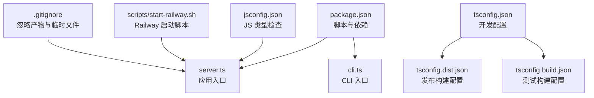
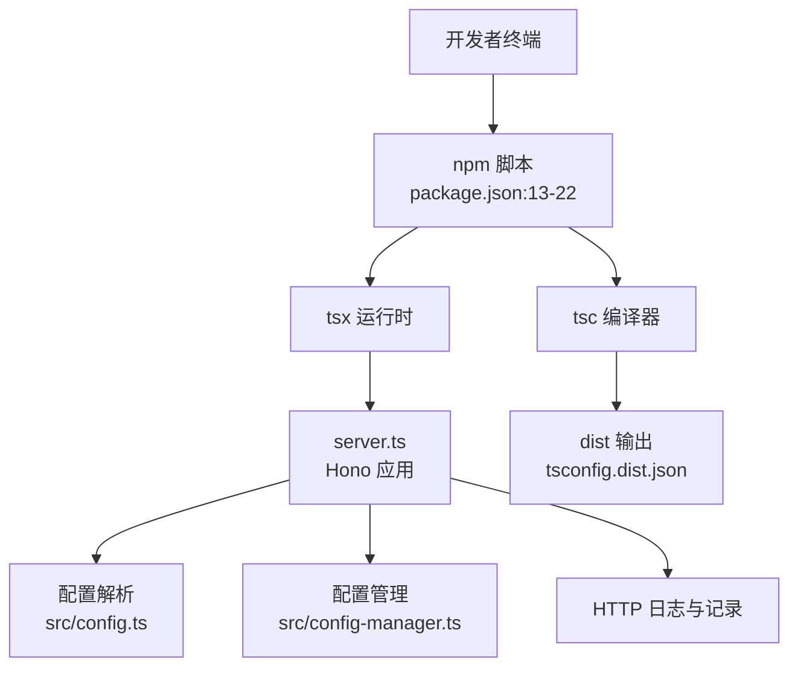
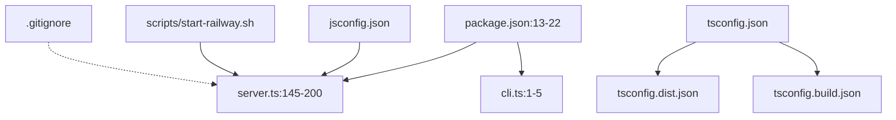

# 开发环境搭建

<cite>
**本文引用的文件**
- [package.json](file://package.json)
- [tsconfig.json](file://tsconfig.json)
- [jsconfig.json](file://jsconfig.json)
- [tsconfig.dist.json](file://tsconfig.dist.json)
- [tsconfig.build.json](file://tsconfig.build.json)
- [README.md](file://README.md)
- [server.ts](file://server.ts)
- [src/config.ts](file://src/config.ts)
- [src/config-manager.ts](file://src/config-manager.ts)
- [.gitignore](file://.gitignore)
- [scripts/start-railway.sh](file://scripts/start-railway.sh)
- [cli.ts](file://cli.ts)
</cite>

## 目录
1. [简介](#简介)
2. [项目结构](#项目结构)
3. [核心组件](#核心组件)
4. [架构总览](#架构总览)
5. [详细组件分析](#详细组件分析)
6. [依赖关系分析](#依赖关系分析)
7. [性能考虑](#性能考虑)
8. [故障排查指南](#故障排查指南)
9. [结论](#结论)
10. [附录](#附录)

## 简介
本指南面向开发者，帮助你快速搭建 nanollm 的本地开发环境。内容涵盖 Node.js 版本要求与兼容性、依赖安装流程与常见问题、TypeScript 编译配置与自定义方法、开发服务器启动与常用命令、IDE 配置与调试建议、环境变量与本地配置文件的使用，以及常见开发问题的排查与解决。

## 项目结构
该项目采用基于功能模块的组织方式，核心入口为服务端主程序与 CLI 入口，TypeScript 配置分为开发、构建与发布三套独立配置，配合测试与脚本工具，形成完整的开发与发布流水线。

图表来源
- [package.json:13-22](file://package.json#L13-L22)
- [server.ts:1-200](file://server.ts#L1-L200)
- [cli.ts:1-5](file://cli.ts#L1-L5)
- [tsconfig.json:1-15](file://tsconfig.json#L1-L15)
- [tsconfig.dist.json:1-11](file://tsconfig.dist.json#L1-L11)
- [tsconfig.build.json:1-9](file://tsconfig.build.json#L1-L9)
- [jsconfig.json:1-12](file://jsconfig.json#L1-L12)
- [scripts/start-railway.sh:1-29](file://scripts/start-railway.sh#L1-L29)
- [.gitignore:1-9](file://.gitignore#L1-L9)

章节来源
- [package.json:13-22](file://package.json#L13-L22)
- [tsconfig.json:1-15](file://tsconfig.json#L1-L15)
- [tsconfig.dist.json:1-11](file://tsconfig.dist.json#L1-L11)
- [tsconfig.build.json:1-9](file://tsconfig.build.json#L1-L9)
- [jsconfig.json:1-12](file://jsconfig.json#L1-L12)
- [.gitignore:1-9](file://.gitignore#L1-L9)

## 核心组件
- 应用入口与运行模式
  - 开发模式：通过脚本 dev 使用 tsx 监听 server.ts 并热重载。
  - 生产模式：通过脚本 start 使用 tsx 直接运行 server.ts。
  - 构建模式：通过脚本 build 使用 tsc 按 tsconfig.dist.json 输出至 dist。
- TypeScript 配置
  - 开发配置 tsconfig.json：启用 JSX、React JSX 导入源，严格性较低，便于快速迭代。
  - 测试构建 tsconfig.build.json：输出到 .test-dist，用于测试执行。
  - 发布构建 tsconfig.dist.json：输出到 dist，排除测试文件，供打包与发布使用。
  - JS 类型检查 jsconfig.json：允许检查 .js 文件，辅助混合 JS/TS 项目。
- CLI 与脚本
  - CLI 入口 cli.ts 导出 server，便于作为二进制入口使用。
  - Railway 启动脚本 scripts/start-railway.sh：在容器环境中初始化配置与存储模式。

章节来源
- [package.json:13-22](file://package.json#L13-L22)
- [tsconfig.json:1-15](file://tsconfig.json#L1-L15)
- [tsconfig.dist.json:1-11](file://tsconfig.dist.json#L1-L11)
- [tsconfig.build.json:1-9](file://tsconfig.build.json#L1-L9)
- [jsconfig.json:1-12](file://jsconfig.json#L1-L12)
- [cli.ts:1-5](file://cli.ts#L1-L5)
- [scripts/start-railway.sh:1-29](file://scripts/start-railway.sh#L1-L29)

## 架构总览
下图展示了开发与运行的关键路径：开发者通过 npm/yarn/pnpm 执行脚本，TypeScript 编译器或 tsx 运行时处理源码，应用读取配置并启动 Hono 服务器，支持认证、CORS、日志与记录等功能。

图表来源
- [package.json:13-22](file://package.json#L13-L22)
- [tsconfig.dist.json:1-11](file://tsconfig.dist.json#L1-L11)
- [server.ts:145-200](file://server.ts#L145-L200)
- [src/config.ts:189-200](file://src/config.ts#L189-L200)
- [src/config-manager.ts:91-131](file://src/config-manager.ts#L91-L131)

## 详细组件分析

### Node.js 版本要求与兼容性
- 运行时要求
  - 项目使用 ES2022 目标与 NodeNext 模块系统，确保在较新的 Node.js 版本上获得最佳兼容性。
  - SQLite 数据库能力依赖于 Node.js 的 node:sqlite 模块，若 Node.js 版本不支持该内置模块，将无法启用 SQLite 存储模式。
- 版本建议
  - 建议使用 Node.js LTS（如 18.x 或 20.x）进行开发与生产部署，以获得稳定性和生态支持。
  - 若需要使用 SQLite 存储，请确认 Node.js 版本支持 node:sqlite（通常 Node.js 20+ 提供更佳支持）。

章节来源
- [tsconfig.json:3-4](file://tsconfig.json#L3-L4)
- [server.ts:109-124](file://server.ts#L109-L124)

### 依赖安装与常见问题
- 安装流程
  - 使用 npm install 安装依赖与开发依赖。
  - 依赖清单包含运行时框架（Hono）、HTTP 服务器（@hono/node-server）、SDK（OpenAI、Anthropic）、代理与 YAML 解析等。
  - 开发依赖包含 TypeScript 与 tsx，用于类型检查与开发时热重载。
- 常见问题与解决
  - 依赖冲突：优先使用 npm，若遇到二进制扩展或原生模块编译失败，尝试清理缓存并重新安装。
  - Node.js 版本过低：若出现 node:sqlite 初始化失败，升级 Node.js 至支持该模块的版本。
  - Windows 用户：若遇到权限或符号链接问题，使用管理员权限或 WSL 环境。

章节来源
- [package.json:32-46](file://package.json#L32-L46)

### TypeScript 编译配置与自定义
- 开发配置（tsconfig.json）
  - 目标与模块：ES2022 与 NodeNext，保证现代语法与模块解析。
  - JSX：启用 react-jsx 并指定导入源为 hono/jsx，适配 Hono 的 JSX 渲染。
  - 严格性：严格性关闭，便于快速迭代；可在本地开启更严格的规则以提升质量。
  - 类型：包含 node 类型，确保 Node.js API 的类型提示。
- 测试构建（tsconfig.build.json）
  - 输出目录为 .test-dist，便于测试阶段编译与执行。
- 发布构建（tsconfig.dist.json）
  - 输出目录为 dist，根目录为工程根，排除测试文件，适配打包与发布。
- JS 类型检查（jsconfig.json）
  - 允许检查 .js 文件，提高混合项目的类型安全。
- 自定义建议
  - 如需启用严格模式，可在 tsconfig.json 中提高严格性；如需生成声明文件，可添加 declaration 选项并指定 outDir。
  - 如需支持装饰器或实验性特性，可在 compilerOptions 中添加相应插件与目标。

章节来源
- [tsconfig.json:2-12](file://tsconfig.json#L2-L12)
- [tsconfig.build.json:1-8](file://tsconfig.build.json#L1-L8)
- [tsconfig.dist.json:1-10](file://tsconfig.dist.json#L1-L10)
- [jsconfig.json:2-9](file://jsconfig.json#L2-L9)

### 开发服务器启动与常用命令
- 开发模式
  - npm run dev：使用 tsx 监听 server.ts，实现热重载，适合本地开发。
- 生产模式
  - npm start：使用 tsx 直接运行 server.ts，适合快速启动。
- 构建与打包
  - npm run build：清理并使用 tsc 按 tsconfig.dist.json 构建到 dist。
- 类型检查
  - npm run typecheck：仅做类型检查，不输出文件。
- 测试
  - npm test：按 tsconfig.build.json 构建后执行测试入口。
  - npm run converter:test：针对转换器模块的测试。
- Railway 部署
  - npm run start:railway：在 Railway 环境中初始化配置与存储模式后启动。

章节来源
- [package.json:13-22](file://package.json#L13-L22)
- [scripts/start-railway.sh:1-29](file://scripts/start-railway.sh#L1-L29)

### IDE 配置与调试建议
- VS Code 推荐设置
  - 使用 TypeScript 与 JavaScript 插件，启用“自动导入”与“格式化”。
  - 在工作区设置中启用“JavaScript/TypeScript 语言特性”，以获得更好的类型提示与诊断。
- 调试配置（VS Code）
  - 使用 Node.js 启动配置，选择 tsx 作为入口，参数指向 server.ts。
  - 设置断点于 server.ts 的中间件与路由处理处，观察请求上下文与配置变更事件。
- 代码风格与格式化
  - 统一使用 Prettier 或 ESLint（如已配置）进行格式化，减少团队差异。
- 多文件编辑体验
  - 利用 jsconfig.json 使 .js 文件也具备类型检查，提升混合项目开发效率。

（本节为通用建议，不直接分析具体文件）

### 环境变量与本地开发配置
- 环境变量
  - CONFIG_PATH：用于指定配置文件路径，优先级高于当前目录下的 config.yaml。
  - NANOLLM_AUTH_TOKEN：在 Railway 初始化脚本中用于生成初始配置的认证令牌。
  - RAILWAY_VOLUME_MOUNT_PATH：Railway 环境中挂载目录，用于存放配置文件。
  - NANOLLM_STORAGE：控制存储模式，memory 或 sqlite。
  - HTTPS_PROXY/HTTP_PROXY：模型级代理回退环境变量。
- 配置文件
  - 默认从当前目录加载 config.yaml；若不存在，需通过 --config 参数或 CONFIG_PATH 指定。
  - 首次启动时，Railway 脚本会根据 NANOLLM_AUTH_TOKEN 创建基础配置。
- 配置热更新
  - 应用启动后会监听配置文件变化，自动热更新部分字段；某些字段（如端口、认证令牌）需要重启进程才生效。

章节来源
- [server.ts:59-86](file://server.ts#L59-L86)
- [src/config.ts:61-76](file://src/config.ts#L61-L76)
- [scripts/start-railway.sh:4-28](file://scripts/start-railway.sh#L4-L28)
- [src/config-manager.ts:146-172](file://src/config-manager.ts#L146-L172)

## 依赖关系分析
下图展示关键文件之间的依赖关系，突出开发脚本、TypeScript 配置与应用入口之间的耦合。

图表来源
- [package.json:13-22](file://package.json#L13-L22)
- [server.ts:145-200](file://server.ts#L145-L200)
- [cli.ts:1-5](file://cli.ts#L1-L5)
- [tsconfig.json:1-15](file://tsconfig.json#L1-L15)
- [tsconfig.dist.json:1-11](file://tsconfig.dist.json#L1-L11)
- [tsconfig.build.json:1-9](file://tsconfig.build.json#L1-L9)
- [jsconfig.json:1-12](file://jsconfig.json#L1-L12)
- [scripts/start-railway.sh:1-29](file://scripts/start-railway.sh#L1-L29)
- [.gitignore:1-9](file://.gitignore#L1-L9)

章节来源
- [package.json:13-22](file://package.json#L13-L22)
- [tsconfig.json:1-15](file://tsconfig.json#L1-L15)
- [tsconfig.dist.json:1-11](file://tsconfig.dist.json#L1-L11)
- [tsconfig.build.json:1-9](file://tsconfig.build.json#L1-L9)
- [jsconfig.json:1-12](file://jsconfig.json#L1-L12)
- [scripts/start-railway.sh:1-29](file://scripts/start-railway.sh#L1-L29)
- [.gitignore:1-9](file://.gitignore#L1-L9)

## 性能考虑
- 编译与运行分离
  - 开发阶段使用 tsx 热重载，提升迭代速度；构建阶段使用 tsc 生成优化后的 dist，便于发布与部署。
- 配置热更新
  - 配置管理器对配置文件进行去抖与哈希校验，避免频繁重载带来的性能损耗。
- 日志与记录
  - HTTP 日志按路径级别控制输出，避免在高并发场景下产生过多日志开销。
- 存储模式
  - SQLite 模式可持久化状态与记录，但需权衡磁盘 IO 与锁竞争；内存模式适合轻量与快速验证。

（本节为通用建议，不直接分析具体文件）

## 故障排查指南
- 无法找到配置文件
  - 现象：启动时报缺少配置文件。
  - 排查：确认当前目录是否存在 config.yaml，或通过 --config 指定路径，或设置 CONFIG_PATH 环境变量。
- SQLite 初始化失败
  - 现象：提示无法初始化 SQLite 存储。
  - 排查：确认 Node.js 版本支持 node:sqlite；或切换为 --storage memory。
- 认证相关问题
  - 现象：访问受保护路由返回 401。
  - 排查：确认 server.auth.token 是否正确配置；确认 Authorization 头或一次性 token 是否有效。
- CORS 与跨域
  - 现象：前端跨域请求失败。
  - 排查：确认 API 路由是否正确设置 CORS；确认浏览器是否携带必要头。
- 环境变量未生效
  - 现象：配置中使用 ${VAR} 未被替换。
  - 排查：确认环境变量命名正确且在解析时可见；检查配置解析逻辑对环境变量的处理。

章节来源
- [server.ts:59-86](file://server.ts#L59-L86)
- [server.ts:109-124](file://server.ts#L109-L124)
- [src/config.ts:61-76](file://src/config.ts#L61-L76)
- [src/config-manager.ts:146-172](file://src/config-manager.ts#L146-L172)

## 结论
通过本指南，你可以完成 nanollm 的开发环境搭建与日常开发任务。建议在本地使用 npm run dev 快速迭代，结合 tsconfig.json 的 JSX 与类型配置提升开发体验；在需要时使用 npm run build 生成 dist 产物；合理利用环境变量与配置热更新机制，提升开发与运维效率。

## 附录
- 常用命令速查
  - 开发：npm run dev
  - 启动：npm start
  - 构建：npm run build
  - 类型检查：npm run typecheck
  - 测试：npm test
  - 转换器测试：npm run converter:test
  - Railway 启动：npm run start:railway
- 关键文件定位
  - 应用入口：server.ts
  - CLI 入口：cli.ts
  - 开发配置：tsconfig.json
  - 测试构建：tsconfig.build.json
  - 发布构建：tsconfig.dist.json
  - JS 类型检查：jsconfig.json
  - 配置解析：src/config.ts
  - 配置管理：src/config-manager.ts
  - 环境变量与启动脚本：scripts/start-railway.sh
  - 忽略文件：.gitignore