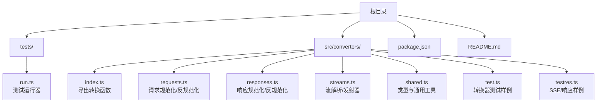
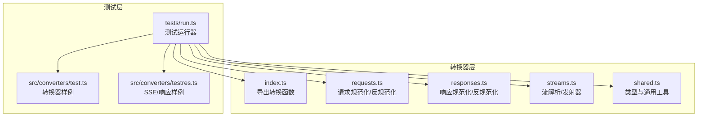
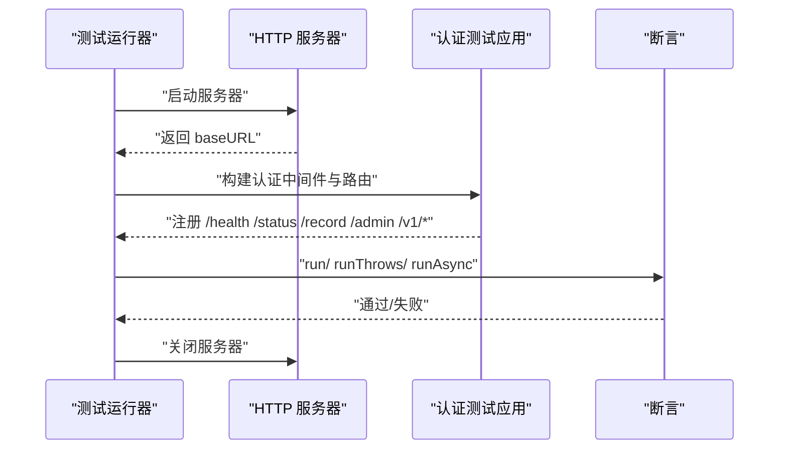
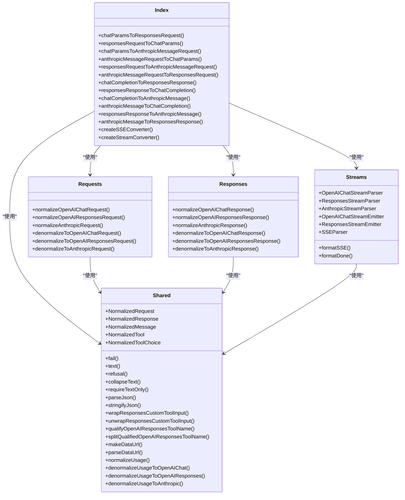
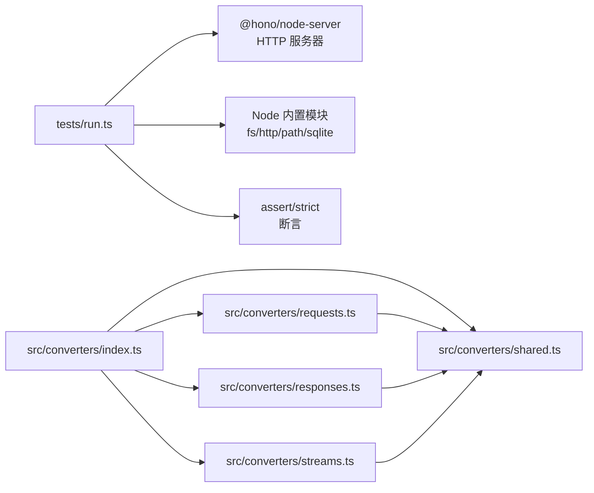

# 测试策略

<cite>
**本文档引用的文件**
- [package.json](file://package.json)
- [tests/run.ts](file://tests/run.ts)
- [src/converters/index.ts](file://src/converters/index.ts)
- [src/converters/requests.ts](file://src/converters/requests.ts)
- [src/converters/responses.ts](file://src/converters/responses.ts)
- [src/converters/shared.ts](file://src/converters/shared.ts)
- [src/converters/streams.ts](file://src/converters/streams.ts)
- [src/converters/test.ts](file://src/converters/test.ts)
- [src/converters/testres.ts](file://src/converters/testres.ts)
- [README.md](file://README.md)
</cite>

## 目录
1. [引言](#引言)
2. [项目结构](#项目结构)
3. [核心组件](#核心组件)
4. [架构总览](#架构总览)
5. [详细组件分析](#详细组件分析)
6. [依赖分析](#依赖分析)
7. [性能考虑](#性能考虑)
8. [故障排除指南](#故障排除指南)
9. [结论](#结论)
10. [附录](#附录)

## 引言
本测试策略文档面向开发者，系统性阐述 nanollm 项目的测试架构与测试用例组织方式，涵盖单元测试编写方法、测试覆盖率要求、集成测试设计思路与场景覆盖、测试辅助工具使用（测试服务器搭建与模拟数据准备）、测试运行命令与持续集成配置、测试最佳实践与常见模式、新功能测试用例编写流程，以及测试调试与问题排查方法。目标是帮助团队建立稳定、可维护、高覆盖率的测试体系。

## 项目结构
项目采用 TypeScript 编写，测试主要集中在以下位置：
- 根级测试运行器：tests/run.ts
- 转换器模块测试：src/converters/ 下的 index.ts、requests.ts、responses.ts、streams.ts、shared.ts，以及对应的测试文件 test.ts、testres.ts
- 包脚本与测试命令：package.json 中的 test、converter:test 脚本
- 文档与示例：README.md

图表来源
- [tests/run.ts:1-120](file://tests/run.ts#L1-L120)
- [src/converters/index.ts:1-99](file://src/converters/index.ts#L1-L99)
- [src/converters/requests.ts:1-120](file://src/converters/requests.ts#L1-L120)
- [src/converters/responses.ts:1-120](file://src/converters/responses.ts#L1-L120)
- [src/converters/streams.ts:1-120](file://src/converters/streams.ts#L1-L120)
- [src/converters/shared.ts:1-120](file://src/converters/shared.ts#L1-L120)
- [src/converters/test.ts:1-120](file://src/converters/test.ts#L1-L120)
- [src/converters/testres.ts:1-120](file://src/converters/testres.ts#L1-L120)

章节来源
- [package.json:13-22](file://package.json#L13-L22)
- [README.md:1-120](file://README.md#L1-L120)

## 核心组件
- 测试运行器：tests/run.ts 提供统一的测试运行框架，包含断言包装、异步测试、HTTP 服务器搭建、临时配置生成、SSE 解析与流读取等基础设施。
- 转换器模块：src/converters/ 下的 index.ts、requests.ts、responses.ts、streams.ts、shared.ts 组成了跨协议（OpenAI Chat、OpenAI Responses、Anthropic Messages）的请求/响应转换与流处理能力。
- 测试样例：src/converters/test.ts 与 src/converters/testres.ts 提供了丰富的协议转换与流事件样例，便于验证转换逻辑与流解析正确性。

章节来源
- [tests/run.ts:1-120](file://tests/run.ts#L1-L120)
- [src/converters/index.ts:1-99](file://src/converters/index.ts#L1-L99)
- [src/converters/requests.ts:1-120](file://src/converters/requests.ts#L1-L120)
- [src/converters/responses.ts:1-120](file://src/converters/responses.ts#L1-L120)
- [src/converters/streams.ts:1-120](file://src/converters/streams.ts#L1-L120)
- [src/converters/shared.ts:1-120](file://src/converters/shared.ts#L1-L120)
- [src/converters/test.ts:1-120](file://src/converters/test.ts#L1-L120)
- [src/converters/testres.ts:1-120](file://src/converters/testres.ts#L1-L120)

## 架构总览
测试架构围绕“测试运行器 + 模块转换器 + 协议样例”的三层设计：
- 测试运行器负责环境准备、HTTP 服务器生命周期、断言与错误处理。
- 转换器模块负责协议间的数据结构转换与流事件解析。
- 协议样例提供真实/边界场景的数据输入与期望输出，支撑单元与集成测试。

图表来源
- [tests/run.ts:1-120](file://tests/run.ts#L1-L120)
- [src/converters/index.ts:1-99](file://src/converters/index.ts#L1-L99)
- [src/converters/requests.ts:1-120](file://src/converters/requests.ts#L1-L120)
- [src/converters/responses.ts:1-120](file://src/converters/responses.ts#L1-L120)
- [src/converters/streams.ts:1-120](file://src/converters/streams.ts#L1-L120)
- [src/converters/shared.ts:1-120](file://src/converters/shared.ts#L1-L120)
- [src/converters/test.ts:1-120](file://src/converters/test.ts#L1-L120)
- [src/converters/testres.ts:1-120](file://src/converters/testres.ts#L1-L120)

## 详细组件分析

### 测试运行器（tests/run.ts）
- 断言与测试封装：run、runThrows、runAsync 提供统一的测试执行与错误报告机制。
- HTTP 服务器：withHTTPServer 自动启动/关闭本地 HTTP 服务器，支持异步测试场景。
- 临时配置：writeTempConfig 在临时目录生成配置文件，便于隔离测试。
- SSE/流处理：parseSSEObjects、readStreamText、waitForCondition 提供流式数据解析与等待条件。
- 认证与路由：buildAuthTestApp 构建最小化认证中间件与路由，便于测试鉴权逻辑。

图表来源
- [tests/run.ts:97-160](file://tests/run.ts#L97-L160)

章节来源
- [tests/run.ts:1-120](file://tests/run.ts#L1-L120)

### 转换器模块（src/converters/）
- 导出函数：index.ts 将请求/响应在三类协议间双向转换，并导出流解析/发射器。
- 请求规范化：requests.ts 将各协议的消息、工具、参数规范化为统一的 NormalizedRequest 结构，并支持反规范化回原协议。
- 响应规范化：responses.ts 将各协议的响应规范化为统一的 NormalizedResponse 结构，并支持反规范化回原协议。
- 流解析/发射：streams.ts 提供 SSE/流事件解析器与发射器，支持 OpenAI Chat、OpenAI Responses、Anthropic 三种格式。
- 共享类型与工具：shared.ts 定义 Normalized 类型、工具函数（如 JSON 解析、命名空间工具名处理、用量归一化）。

图表来源
- [src/converters/index.ts:1-99](file://src/converters/index.ts#L1-L99)
- [src/converters/requests.ts:1-120](file://src/converters/requests.ts#L1-L120)
- [src/converters/responses.ts:1-120](file://src/converters/responses.ts#L1-L120)
- [src/converters/streams.ts:1-120](file://src/converters/streams.ts#L1-L120)
- [src/converters/shared.ts:1-120](file://src/converters/shared.ts#L1-L120)

章节来源
- [src/converters/index.ts:1-99](file://src/converters/index.ts#L1-L99)
- [src/converters/requests.ts:1-120](file://src/converters/requests.ts#L1-L120)
- [src/converters/responses.ts:1-120](file://src/converters/responses.ts#L1-L120)
- [src/converters/streams.ts:1-120](file://src/converters/streams.ts#L1-L120)
- [src/converters/shared.ts:1-120](file://src/converters/shared.ts#L1-L120)

### 单元测试编写方法
- 使用 run/ runThrows/ runAsync 包装测试用例，确保统一的错误报告与日志输出。
- 利用 withHTTPServer 构造最小化 HTTP 服务，验证路由与中间件逻辑。
- 使用 writeTempConfig 生成临时配置文件，隔离测试环境。
- 对转换器函数进行输入-输出断言，覆盖正常路径与异常路径。
- 对流解析器/发射器使用 parseSSEObjects/readStreamText 验证事件序列与增量内容。

章节来源
- [tests/run.ts:1-120](file://tests/run.ts#L1-L120)

### 测试覆盖率要求
- 建议达到以下覆盖率目标（基于模块职责）：
  - 转换器模块：函数级 90%+，分支 80%+（重点保障请求/响应规范化与反规范化路径）。
  - 流处理模块：事件解析与发射路径 90%+，边界事件（[DONE]、ping、空数据）100%。
  - 测试运行器：基础设施函数（HTTP 服务器、SSE 解析、流读取）100%。
- 对于共享工具函数（JSON 解析、命名空间工具名处理、用量归一化），建议针对异常输入与边界值进行充分测试。

章节来源
- [src/converters/shared.ts:111-154](file://src/converters/shared.ts#L111-L154)
- [src/converters/requests.ts:705-722](file://src/converters/requests.ts#L705-L722)
- [src/converters/responses.ts:303-317](file://src/converters/responses.ts#L303-L317)

### 集成测试设计思路与场景覆盖
- 协议转换链路：从 OpenAI Chat/Responses/Anthropic 任一协议输入，经规范化与反规范化回到原协议，验证一致性与可逆性。
- 流式场景：使用 SSE/流事件样例（src/converters/testres.ts），验证流解析器与发射器的事件序列、增量内容与完成信号。
- 认证与路由：通过 buildAuthTestApp 验证 Bearer Token、查询参数与 Cookie 的认证逻辑，覆盖 /health 与受保护路由。
- 错误与边界：对无效 JSON、缺失字段、不支持的工具类型、空签名 thinking 历史等进行断言，确保抛出预期错误信息。

章节来源
- [src/converters/testres.ts:1-120](file://src/converters/testres.ts#L1-L120)
- [tests/run.ts:129-159](file://tests/run.ts#L129-L159)

### 测试辅助工具使用
- 测试服务器：withHTTPServer 自动分配端口并返回 baseURL，测试结束后自动关闭。
- 模拟数据：parseSSEObjects 用于解析 SSE 事件块；readStreamText 读取 ReadableStream 文本；waitForCondition 等待条件满足。
- 临时配置：writeTempConfig 在临时目录生成配置文件，避免污染工作区。

章节来源
- [tests/run.ts:97-186](file://tests/run.ts#L97-L186)

### 测试运行命令与持续集成配置
- 本地测试命令：
  - npm test：编译构建后运行 tests/run.ts，执行所有单元与集成测试。
  - npm run converter:test：编译构建后运行 src/converters/test.js，执行转换器专项测试。
- 持续集成建议：
  - 在 CI 中缓存 node_modules，使用 npm ci 安装依赖。
  - 并行执行 npm test 与 npm run converter:test，缩短流水线时间。
  - 将测试覆盖率上传至覆盖率平台（如 Codecov），设置阈值门禁。

章节来源
- [package.json:13-22](file://package.json#L13-L22)

### 测试最佳实践与常见模式
- 测试金字塔：单元测试（转换器函数）> 集成测试（HTTP 服务器 + 认证）> 端到端测试（真实上游）。
- 数据驱动：使用 src/converters/test.ts 与 src/converters/testres.ts 中的样例作为输入，减少手工构造成本。
- 边界与异常：对 JSON 解析失败、工具名命名空间、SSE 事件缺失、流提前结束等场景进行断言。
- 可重复性：使用临时目录与随机端口，避免测试间相互干扰。

章节来源
- [src/converters/test.ts:1-120](file://src/converters/test.ts#L1-L120)
- [src/converters/testres.ts:1-120](file://src/converters/testres.ts#L1-L120)

### 新功能测试用例编写流程
- 明确需求：确定涉及的协议与转换方向（请求/响应/流）。
- 编写样例：在 src/converters/test.ts 或 src/converters/testres.ts 中添加输入样例与期望输出。
- 实现断言：使用 run/ runThrows/ runAsync 包装测试，断言转换结果与错误信息。
- 集成验证：通过 withHTTPServer 验证路由与中间件逻辑。
- 覆盖边界：补充异常与边界场景，确保覆盖率达标。

章节来源
- [tests/run.ts:57-81](file://tests/run.ts#L57-L81)
- [src/converters/test.ts:1-120](file://src/converters/test.ts#L1-L120)
- [src/converters/testres.ts:1-120](file://src/converters/testres.ts#L1-L120)

### 测试调试与问题排查
- 日志与断言：利用测试运行器的日志输出定位失败点；使用 captureConsoleWarn 捕获警告信息。
- 流事件：使用 parseSSEObjects 逐块解析事件，结合 readStreamText 读取流文本，确认事件序列与增量内容。
- 等待条件：使用 waitForCondition 等待异步状态变化，避免竞态条件导致的不稳定。
- 配置隔离：通过 writeTempConfig 生成临时配置，避免配置污染导致的测试失败。

章节来源
- [tests/run.ts:83-168](file://tests/run.ts#L83-L168)

## 依赖分析
- 测试运行器依赖 Hono 作为最小化 HTTP 服务器框架，依赖 Node 内置模块（fs、http、path、sqlite）与 assert/strict 进行断言与错误处理。
- 转换器模块之间存在强耦合关系：index.ts 依赖 requests.ts、responses.ts、streams.ts、shared.ts；requests.ts 与 responses.ts 依赖 shared.ts；streams.ts 依赖 shared.ts 与 request-context（用于工具名标记）。
- 协议样例文件（test.ts、testres.ts）为测试提供输入数据，与转换器模块形成输入-输出关系。

图表来源
- [tests/run.ts:1-120](file://tests/run.ts#L1-L120)
- [src/converters/index.ts:1-99](file://src/converters/index.ts#L1-L99)
- [src/converters/requests.ts:1-120](file://src/converters/requests.ts#L1-L120)
- [src/converters/responses.ts:1-120](file://src/converters/responses.ts#L1-L120)
- [src/converters/streams.ts:1-120](file://src/converters/streams.ts#L1-L120)
- [src/converters/shared.ts:1-120](file://src/converters/shared.ts#L1-L120)

章节来源
- [tests/run.ts:1-120](file://tests/run.ts#L1-L120)
- [src/converters/index.ts:1-99](file://src/converters/index.ts#L1-L99)

## 性能考虑
- 测试并发：在本地与 CI 中并行执行多套测试（如 npm test 与 converter:test），提升反馈速度。
- 资源释放：确保 withHTTPServer 在测试结束后正确关闭服务器，避免端口占用。
- 流读取优化：readStreamText 使用 TextDecoder 与 Reader 流式解码，避免大对象一次性解码带来的内存压力。
- 临时文件清理：writeTempConfig 生成临时配置文件，测试完成后由操作系统回收。

## 故障排除指南
- 测试失败定位：使用测试运行器的日志输出与断言包装，快速定位失败用例与错误信息。
- HTTP 服务器问题：检查端口分配与地址解析，确保服务器监听成功后再发起请求。
- SSE/流解析问题：使用 parseSSEObjects 与 readStreamText 分步验证事件块与流文本，确认事件序列与增量内容。
- 配置污染：使用 writeTempConfig 生成临时配置，避免工作区配置影响测试稳定性。

章节来源
- [tests/run.ts:97-186](file://tests/run.ts#L97-L186)

## 结论
本测试策略文档建立了以测试运行器为核心、以转换器模块为基础、以协议样例为输入的测试体系。通过明确的测试编写方法、覆盖率目标、集成测试场景与辅助工具使用，能够有效保障 nanollm 在多协议转换与流处理方面的正确性与稳定性。建议在后续迭代中持续完善边界与异常场景的测试覆盖，并在 CI 中引入覆盖率门禁，确保代码质量稳步提升。

## 附录
- 测试命令参考：
  - npm test：执行完整测试套件
  - npm run converter:test：执行转换器专项测试
- 相关文件清单：
  - 测试运行器：tests/run.ts
  - 转换器模块：src/converters/index.ts、requests.ts、responses.ts、streams.ts、shared.ts
  - 协议样例：src/converters/test.ts、testres.ts
  - 包脚本：package.json
  - 项目说明：README.md