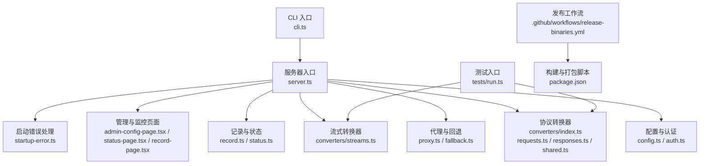
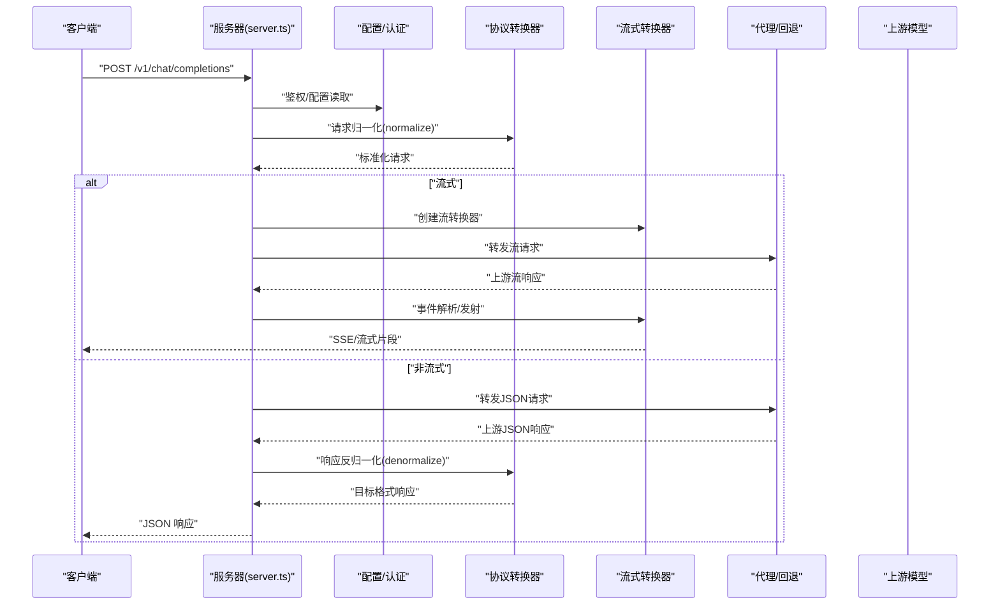
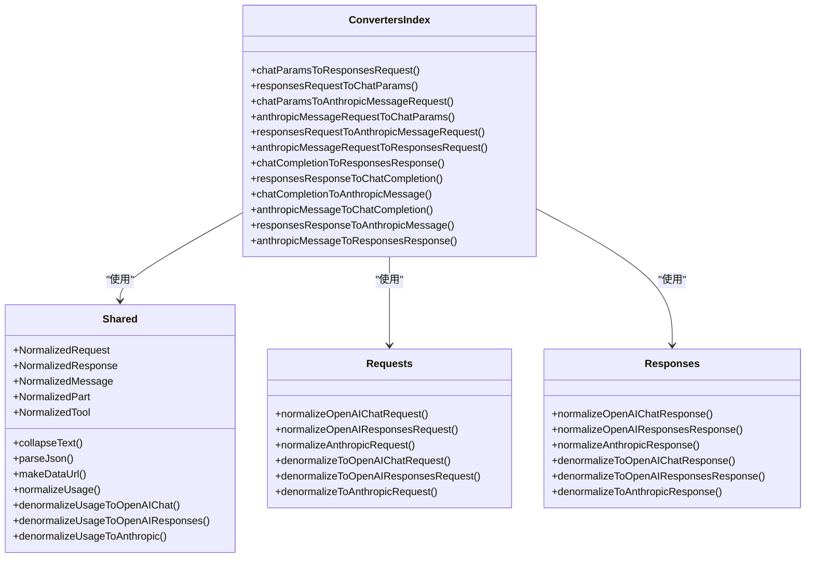
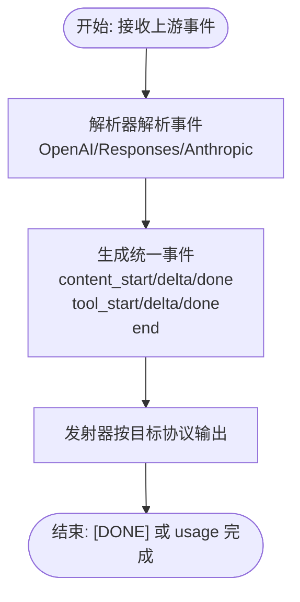
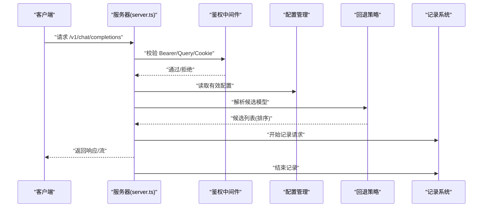
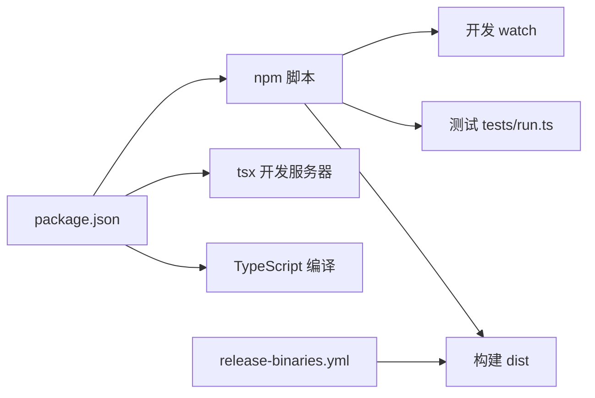

# 贡献指南

<cite>
**本文引用的文件**
- [README.md](file://README.md)
- [package.json](file://package.json)
- [server.ts](file://server.ts)
- [cli.ts](file://cli.ts)
- [tsconfig.json](file://tsconfig.json)
- [release-binaries.yml](file://.github/workflows/release-binaries.yml)
- [index.ts](file://src/converters/index.ts)
- [shared.ts](file://src/converters/shared.ts)
- [requests.ts](file://src/converters/requests.ts)
- [responses.ts](file://src/converters/responses.ts)
- [streams.ts](file://src/converters/streams.ts)
- [run.ts](file://tests/run.ts)
</cite>

## 目录
1. [简介](#简介)
2. [项目结构](#项目结构)
3. [核心组件](#核心组件)
4. [架构总览](#架构总览)
5. [详细组件分析](#详细组件分析)
6. [依赖关系分析](#依赖关系分析)
7. [性能考虑](#性能考虑)
8. [故障排查指南](#故障排查指南)
9. [结论](#结论)
10. [附录](#附录)

## 简介
本指南面向希望为 nanollm 项目做出贡献的开发者，覆盖从 Fork 到提交 Pull Request 的完整流程、分支与提交规范、代码审查与合并要求、Issue 报告标准、代码质量与编码规范、文档更新流程、社区行为准则与沟通规范、技术决策参与方式，以及新贡献者的入门路径。

## 项目结构
该项目采用基于功能模块的组织方式，核心由服务器入口、配置与认证、代理与回退、协议转换器（OpenAI/Anthropic/Responses）、流式转换器、记录与状态、测试与发布工作流组成。

图表来源
- [cli.ts](file://cli.ts)
- [server.ts](file://server.ts)
- [index.ts](file://src/converters/index.ts)
- [requests.ts](file://src/converters/requests.ts)
- [responses.ts](file://src/converters/responses.ts)
- [streams.ts](file://src/converters/streams.ts)
- [run.ts](file://tests/run.ts)
- [release-binaries.yml](file://.github/workflows/release-binaries.yml)
- [package.json](file://package.json)

章节来源
- [README.md](file://README.md)
- [package.json](file://package.json)

## 核心组件
- 服务器与路由：统一处理 /v1/*、/status、/record、/admin 等路径，内置 CORS、鉴权、日志与请求上下文。
- 协议转换器：在 OpenAI Chat/Responses 与 Anthropic Messages 之间双向转换请求与响应，支持工具调用、多模态、流式事件解析与发射。
- 流式转换器：标准化 SSE/流式事件，统一输出格式，便于跨协议复用。
- 配置与认证：支持配置文件热更新、管理页、Bearer Token 认证、Cookie 持久化。
- 代理与回退：根据模型配置与回退策略进行上游转发，支持失败追踪与排序。
- 记录与状态：记录请求摘要、重放、状态面板与 SQLite 存储（可选）。

章节来源
- [server.ts](file://server.ts)
- [index.ts](file://src/converters/index.ts)
- [shared.ts](file://src/converters/shared.ts)
- [requests.ts](file://src/converters/requests.ts)
- [responses.ts](file://src/converters/responses.ts)
- [streams.ts](file://src/converters/streams.ts)

## 架构总览
下图展示了从客户端请求到上游模型的典型链路，以及协议转换与流式处理的关键节点。

图表来源
- [server.ts](file://server.ts)
- [index.ts](file://src/converters/index.ts)
- [requests.ts](file://src/converters/requests.ts)
- [responses.ts](file://src/converters/responses.ts)
- [streams.ts](file://src/converters/streams.ts)

## 详细组件分析

### 组件A：协议转换器（Converters）
- 职责：在 OpenAI Chat/Responses 与 Anthropic Messages 之间双向转换请求与响应，处理工具调用、多模态、思维块、拒绝内容、命名空间工具等。
- 关键点：
  - 归一化：将不同协议的消息、工具、参数统一为内部 Normalized 结构。
  - 反归一化：将内部结构还原为目标协议格式。
  - 流式：通过 SSE/事件解析器与发射器实现跨协议流式输出。
- 数据结构复杂度：转换过程主要为线性扫描与映射，时间复杂度 O(n)，空间复杂度与消息与工具数量相关。

图表来源
- [index.ts](file://src/converters/index.ts)
- [shared.ts](file://src/converters/shared.ts)
- [requests.ts](file://src/converters/requests.ts)
- [responses.ts](file://src/converters/responses.ts)

章节来源
- [index.ts](file://src/converters/index.ts)
- [shared.ts](file://src/converters/shared.ts)
- [requests.ts](file://src/converters/requests.ts)
- [responses.ts](file://src/converters/responses.ts)

### 组件B：流式转换器（Streams）
- 职责：解析上游 SSE/事件流，统一为 NormalizedStreamEvent，再按目标协议发射。
- 关键点：
  - 解析器：OpenAI Chat、OpenAI Responses、Anthropic 三类解析器。
  - 发射器：将统一事件转换为目标协议的流片段。
  - 完整性：在结束事件中携带 finishReason 与 usage。

图表来源
- [streams.ts](file://src/converters/streams.ts)

章节来源
- [streams.ts](file://src/converters/streams.ts)

### 组件C：服务器与路由（Server）
- 职责：统一处理 /v1/*、/status、/record、/admin 等路径；鉴权中间件；CORS；请求日志；模型选择与回退；记录与状态。
- 关键点：
  - 鉴权：支持 Authorization Header、查询参数 token、Cookie 三种方式；成功后写入同源 Cookie。
  - 回退：根据回退组与失败追踪排序候选模型。
  - 记录：记录客户端请求与上游响应，支持重放与 SQLite 存储。

图表来源
- [server.ts](file://server.ts)

章节来源
- [server.ts](file://server.ts)

## 依赖关系分析
- 运行时依赖：Hono、@hono/node-server、openai、@anthropic-ai/sdk、yaml、undici、dotenv、https-proxy-agent 等。
- 开发依赖：TypeScript、tsx、@types/node。
- 构建与脚本：构建、类型检查、测试、开发模式、二进制发布。

图表来源
- [package.json](file://package.json)
- [release-binaries.yml](file://.github/workflows/release-binaries.yml)

章节来源
- [package.json](file://package.json)
- [release-binaries.yml](file://.github/workflows/release-binaries.yml)

## 性能考虑
- 流式处理：优先使用流式转发与 SSE 解析，降低内存峰值与延迟。
- 使用缓存：响应项缓存与记录缓存减少重复计算与存储开销。
- 日志级别：按路径与事件粒度控制日志输出，避免高频 IO。
- SQLite 存储：在需要持久化记录与状态时启用，注意 WAL 模式与并发控制。

## 故障排查指南
- 鉴权失败：确认 Authorization 头、查询参数 token 或 Cookie 是否正确；检查服务端日志中的 HTTP START/END 与错误码。
- 模型不可用：检查配置中是否存在该模型或回退组；查看回退失败追踪与排序结果。
- 流式异常：关注 SSE 解析器缓冲与 DONE 标记；确认上游是否正确发送 [DONE]。
- 记录与重放：确认记录存储模式（memory/sqlite）与最大条数；使用 /record/:id/replay 进行调试。

章节来源
- [server.ts](file://server.ts)
- [run.ts](file://tests/run.ts)

## 结论
本指南提供了从流程、规范、质量到协作的完整贡献路径。建议贡献者在提交前确保通过测试、遵循提交信息规范、更新相关文档与变更说明，并在讨论区或 Issue 中充分沟通设计与影响范围。

## 附录

### 代码贡献流程（Fork → PR）
- Fork 仓库至个人账号，创建特性分支（建议以 issue 编号命名，如 feature/xxx）。
- 在本地完成开发与测试（npm run test、npm run dev），确保通过类型检查与单元测试。
- 提交前执行构建（npm run build）与一致性检查（如必要）。
- 提交信息遵循下方“Git 提交规范”，推送分支并发起 Pull Request。
- PR 描述中引用相关 Issue（如 fixes #xxx），简述变更动机、实现要点与测试方法。
- 等待代码审查与 CI 通过，按反馈修改直至合入。

### 分支管理策略
- 主分支：master，仅接收经审查与测试的变更。
- 特性分支：feature/*、fix/*、chore/*，按功能/修复/杂项分类。
- 发布分支：release/*（如需要），用于预发布与回归测试。

### Git 提交规范
- 类型限定：feat、fix、docs、style、refactor、perf、test、build、ci、chore、revert。
- 标题格式：type(scope): subject（subject 控制在 50 字以内，首字母小写，末尾不加句号）。
- 正文：说明动机与影响，必要时引用 Issue 编号。
- 示例：
  - feat(converters): 新增 Anthropic 思维块转换逻辑
  - fix(server): 修正流式事件解析器对空数据的处理

### 代码审查与合并要求
- 至少一名维护者审查并通过。
- CI 通过（构建、类型检查、测试）。
- 变更影响评估：对性能、稳定性、兼容性的影响需在 PR 中说明。
- 文档与测试：新增/变更功能需补充测试与文档说明。

### Issue 报告标准
- 标题：简洁明确地描述问题。
- 环境：操作系统、Node 版本、nanollm 版本、依赖版本。
- 复现步骤：最小可复现示例与命令。
- 期望行为 vs 实际行为。
- 日志与截图（如适用）。
- 相关配置（如涉及认证、代理、回退等）。

### 代码质量与编码规范
- TypeScript：严格类型检查（tsconfig.json），避免 any/unknown。
- 命名：函数/变量使用清晰语义，组件类名大驼峰，文件名小写加连字符。
- 注释：公共 API 与复杂逻辑添加注释，说明输入输出与边界条件。
- 单元测试：覆盖关键转换器与流式解析器逻辑，使用 tests/run.ts 的断言风格。
- 构建与脚本：遵循 package.json 中脚本约定，确保构建产物与测试可执行。

### 文档更新要求
- 新功能或行为变更需同步更新 README 或新增文档。
- 文档示例尽量给出最小可运行片段路径而非完整代码。

### 社区行为准则与沟通规范
- 尊重与包容：保持友善与专业，避免人身攻击。
- 开放讨论：鼓励提问与建议，基于事实与数据进行判断。
- 透明协作：PR 与 Issue 保持公开沟通，必要时私下沟通敏感问题。

### 技术决策参与
- 参与讨论：关注 Issue/PR 讨论，提供技术背景与影响分析。
- 设计评审：对重大变更提出设计草案与兼容性方案。
- 文档与测试：协助完善文档与测试用例，保障质量。

### 新贡献者入门
- 环境准备：安装 Node.js 与包管理器，克隆仓库后执行安装与构建。
- 运行与调试：使用 npm run dev 启动开发服务器，访问 /status 与 /record 辅助调试。
- 测试：运行 npm run test 查看现有测试覆盖，新增功能补充测试。
- 贡献流程：参考“代码贡献流程”，从 Issue 开始，逐步推进到 PR。

章节来源
- [README.md](file://README.md)
- [package.json](file://package.json)
- [tsconfig.json](file://tsconfig.json)
- [run.ts](file://tests/run.ts)