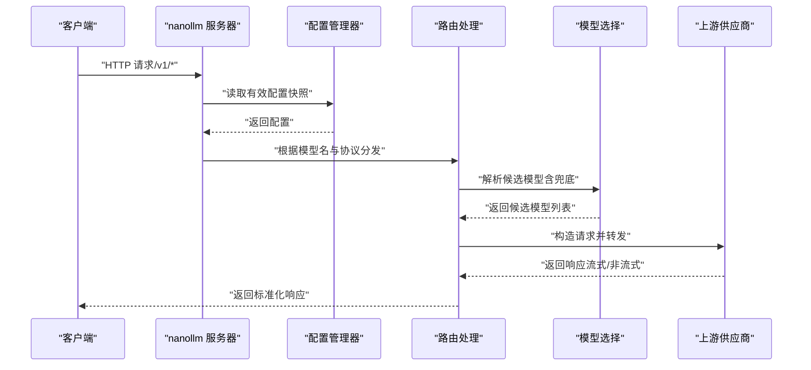

# 快速开始

<cite>
**本文引用的文件**
- [README.md](file://README.md)
- [package.json](file://package.json)
- [cli.ts](file://cli.ts)
- [server.ts](file://server.ts)
- [src/config.ts](file://src/config.ts)
- [src/proxy.ts](file://src/proxy.ts)
- [src/auth.ts](file://src/auth.ts)
- [src/config-manager.ts](file://src/config-manager.ts)
- [scripts/start-railway.sh](file://scripts/start-railway.sh)
</cite>

## 目录
1. [简介](#简介)
2. [系统要求](#系统要求)
3. [安装与运行](#安装与运行)
4. [创建基础配置文件](#创建基础配置文件)
5. [启动服务](#启动服务)
6. [验证服务是否正常运行](#验证服务是否正常运行)
7. [常见问题排查](#常见问题排查)
8. [架构概览](#架构概览)
9. [依赖关系分析](#依赖关系分析)
10. [性能与最佳实践](#性能与最佳实践)
11. [故障排查指南](#故障排查指南)
12. [结语](#结语)

## 简介
nanollm 是一个轻量级的 LLM 模型代理服务，支持统一接入多家模型供应商，并对外暴露标准化的 OpenAI 兼容接口（/v1/chat/completions、/v1/responses、/v1/messages）。它提供以下核心能力：
- 统一配置多个模型供应商，支持 chat/completions、responses、messages 三种协议
- 自定义请求头与请求体（支持深度合并）
- 兜底策略：当某模型失败时，按优先级在分组内自动切换
- 配置热更新与本地管理页：models、fallback、server.ttlb_timeout、record.max_size 热更新即时生效；server.port 与 server.auth.token 需重启进程生效

## 系统要求
- Node.js 运行时（支持内置 sqlite 数据库模块时可启用 SQLite 存储）
- npm（用于安装与运行）
- 可选：HTTP/HTTPS 代理环境变量（HTTP_PROXY、HTTPS_PROXY）

章节来源
- [package.json:13-22](file://package.json#L13-L22)
- [server.ts:109-124](file://server.ts#L109-L124)

## 安装与运行
支持两种方式快速启动：

- 使用 npx 直接运行（无需全局安装）
  - 在命令行中执行：npx nanollm --config /path/to/config.yaml
  - 若当前目录存在 config.yaml，也可直接运行：npx nanollm
  - 如需启用 SQLite 存储，追加参数：--storage sqlite

- 本地开发调试
  - 使用 npm 脚本启动开发模式：npm run dev
  - 构建产物后运行：npm run start

章节来源
- [README.md:76-84](file://README.md#L76-L84)
- [README.md:266-283](file://README.md#L266-L283)
- [package.json:13-22](file://package.json#L13-L22)
- [cli.ts:1-5](file://cli.ts#L1-L5)

## 创建基础配置文件
配置文件采用 YAML 格式，至少包含以下关键节点：
- server：监听端口、首字节超时时间（可选）
- record：记录条数上限（可选）
- models：模型列表（至少一个）
- fallback：兜底分组（可选）

示例结构要点（不含具体密钥）：
- server.port 默认 3000
- server.ttfb_timeout 默认 5000ms
- record.max_size 默认 10
- models[].provider 支持 openai-chat、openai-responses、anthropic、openai-image
- models[].base_url 为上游供应商的基础地址
- models[].api_key 为对应供应商的访问密钥
- models[].model 为目标上游的模型标识
- fallback.<分组名> 为一组候选模型名列表

章节来源
- [README.md:11-75](file://README.md#L11-L75)
- [src/config.ts:24-35](file://src/config.ts#L24-L35)
- [src/config.ts:9-22](file://src/config.ts#L9-L22)

## 启动服务
启动流程说明：
1. 解析启动参数与环境变量，确定配置文件路径与存储模式
2. 初始化配置管理器，加载并校验配置
3. 根据配置初始化日志、录制、认证与状态存储
4. 注册路由与中间件，启动 HTTP 服务器

关键启动逻辑与参数：
- 配置文件解析优先级：--config 参数 > CONFIG_PATH 环境变量 > 当前目录 config.yaml
- 存储模式：--storage memory（默认）或 --storage sqlite
- 认证：server.auth.token 配置后，除 /health 外均需 Bearer 认证
- 管理页：/admin 提供在线配置编辑与热更新

章节来源
- [server.ts:59-107](file://server.ts#L59-L107)
- [server.ts:126-144](file://server.ts#L126-L144)
- [server.ts:187-213](file://server.ts#L187-L213)
- [README.md:286-309](file://README.md#L286-L309)

## 验证服务是否正常运行
- 健康检查：访问 /health 返回 200 表示服务已就绪
- 列出模型：访问 /v1/models 查看已注册模型与分组
- 管理页：访问 /admin 查看与编辑配置
- 监控页：访问 /status 查看模型健康状态
- 记录页：访问 /record 查看最近请求记录（默认保留最新 10 条）

章节来源
- [server.ts:191-193](file://server.ts#L191-L193)
- [README.md:302-309](file://README.md#L302-L309)

## 常见问题排查
- 缺少配置文件
  - 现象：启动时报错提示缺少配置文件
  - 处理：通过 --config 指定路径，或设置 CONFIG_PATH，或在当前目录放置 config.yaml
- 端口占用
  - 现象：启动失败，提示端口冲突
  - 处理：修改 config.yaml 中的 server.port，或停止占用进程
- 认证失败
  - 现象：返回 401 Unauthorized
  - 处理：正确设置 server.auth.token 并在请求头添加 Authorization: Bearer <token>
- SQLite 初始化失败
  - 现象：启用 --storage sqlite 后报错
  - 处理：确认 Node.js 版本支持 node:sqlite，或改用 --storage memory
- 配置热更新无效
  - 现象：修改 config.yaml 后某些字段未生效
  - 处理：server.port 与 server.auth.token 需重启进程生效；其他字段应即时生效

章节来源
- [server.ts:83-85](file://server.ts#L83-L85)
- [server.ts:109-124](file://server.ts#L109-L124)
- [src/config-manager.ts:44-49](file://src/config-manager.ts#L44-L49)
- [README.md:91-104](file://README.md#L91-L104)

## 架构概览
下图展示了从请求进入、认证、路由分发、模型选择与上游转发的整体流程。

图表来源
- [server.ts:663-800](file://server.ts#L663-L800)
- [src/config-manager.ts:77-115](file://src/config-manager.ts#L77-L115)
- [src/proxy.ts:41-98](file://src/proxy.ts#L41-L98)

## 依赖关系分析
- 运行时依赖
  - Hono：Web 框架与路由
  - @hono/node-server：Node.js 服务器实现
  - yaml：YAML 解析与序列化
  - openai、@anthropic-ai/sdk：OpenAI 与 Anthropic SDK
  - undici：HTTP 客户端（支持代理与流式）
  - dotenv：环境变量加载
- 开发依赖
  - typescript、tsx：类型检查与开发调试

章节来源
- [package.json:32-46](file://package.json#L32-L46)

## 性能与最佳实践
- 超时控制
  - server.ttfb_timeout 控制首字节超时；模型级 ttfb_timeout 可覆盖
- 流式传输
  - 对于支持 SSE 的上游，服务会透传流式响应，减少延迟
- 兜底策略
  - 通过 fallback 分组提升可用性；失败次数越低优先级越高
- 代理支持
  - 支持模型级 proxy，优先于环境变量 HTTP_PROXY/HTTPS_PROXY
- 认证与安全
  - 启用 server.auth.token 后，除 /health 外均需认证
- 存储模式
  - --storage sqlite 适合跨进程保留状态与记录；默认 memory 适合单进程场景

章节来源
- [src/config.ts:6,8,24-35:6-35](file://src/config.ts#L6-L35)
- [src/proxy.ts:120-147](file://src/proxy.ts#L120-L147)
- [README.md:91-104](file://README.md#L91-L104)
- [README.md:271-277](file://README.md#L271-L277)

## 故障排查指南
- 启动阶段
  - 配置文件缺失：使用 --config 指定或放置 config.yaml
  - 端口占用：修改 server.port 或释放端口
  - SQLite 初始化失败：升级 Node.js 或禁用 SQLite
- 运行阶段
  - 认证失败：核对 Authorization 头与 server.auth.token
  - 模型不可用：检查 models 与 fallback 配置，确认上游密钥与 base_url 正确
  - 流式响应异常：确认上游支持 SSE，检查网络代理与超时设置
- 管理页与热更新
  - 修改配置后立即生效的字段：models、fallback、server.ttfb_timeout、record.max_size
  - 需重启生效的字段：server.port、server.auth.token

章节来源
- [server.ts:59-107](file://server.ts#L59-L107)
- [src/config-manager.ts:109-111](file://src/config-manager.ts#L109-L111)
- [src/auth.ts:3-18](file://src/auth.ts#L3-L18)

## 结语
通过以上步骤，您可以在几分钟内完成 nanollm 的安装与部署，并基于 OpenAI 兼容接口快速接入多个模型供应商。建议结合管理页进行可视化配置与热更新，配合 /status 与 /record 页面进行日常运维与问题定位。