# 响应转换机制

<cite>
**本文档引用的文件**
- [src/converters/index.ts](file://src/converters/index.ts)
- [src/converters/responses.ts](file://src/converters/responses.ts)
- [src/converters/shared.ts](file://src/converters/shared.ts)
- [src/converters/requests.ts](file://src/converters/requests.ts)
- [src/converters/streams.ts](file://src/converters/streams.ts)
- [docs/converters.md](file://docs/converters.md)
</cite>

## 目录
1. [简介](#简介)
2. [项目结构](#项目结构)
3. [核心组件](#核心组件)
4. [架构概览](#架构概览)
5. [详细组件分析](#详细组件分析)
6. [依赖关系分析](#依赖关系分析)
7. [性能考虑](#性能考虑)
8. [故障排除指南](#故障排除指南)
9. [结论](#结论)

## 简介

响应转换机制是 nanollm 项目中用于统一不同模型供应商响应格式的核心模块。该机制实现了 OpenAI Chat、OpenAI Responses 和 Anthropic Messages 三种响应格式之间的双向转换，确保应用程序能够以统一的内部格式处理来自不同供应商的响应。

该系统通过标准化中间格式（NormalizedResponse）来实现跨供应商的响应转换，提供了完整的请求和响应转换功能，包括数据验证、错误处理和兼容性保证。

## 项目结构

响应转换相关的文件组织结构如下：

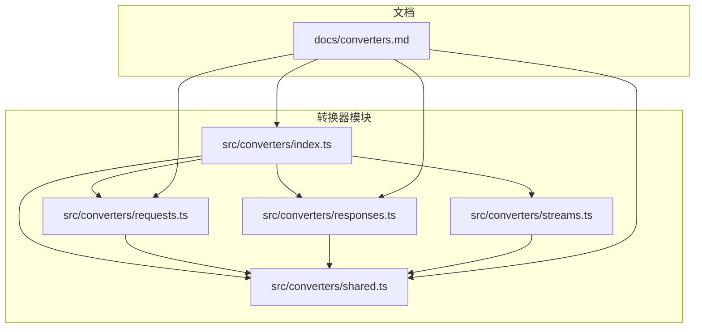

**图表来源**
- [src/converters/index.ts:1-99](file://src/converters/index.ts#L1-L99)
- [src/converters/requests.ts:1-800](file://src/converters/requests.ts#L1-L800)
- [src/converters/responses.ts:1-318](file://src/converters/responses.ts#L1-L318)
- [src/converters/shared.ts:1-385](file://src/converters/shared.ts#L1-L385)
- [src/converters/streams.ts:1-800](file://src/converters/streams.ts#L1-L800)

**章节来源**
- [src/converters/index.ts:1-99](file://src/converters/index.ts#L1-L99)
- [src/converters/requests.ts:1-800](file://src/converters/requests.ts#L1-L800)
- [src/converters/responses.ts:1-318](file://src/converters/responses.ts#L1-L318)
- [src/converters/shared.ts:1-385](file://src/converters/shared.ts#L1-L385)
- [src/converters/streams.ts:1-800](file://src/converters/streams.ts#L1-L800)

## 核心组件

### 标准化中间格式

系统定义了统一的中间表示格式，用于在不同供应商之间转换：

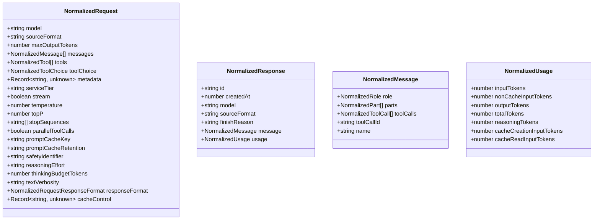

**图表来源**
- [src/converters/shared.ts:63-109](file://src/converters/shared.ts#L63-L109)

### 转换函数接口

系统提供了完整的双向转换函数集合：

| 转换类型 | 函数名称 | 描述 |
|---------|----------|------|
| 请求转换 | `chatParamsToResponsesRequest` | OpenAI Chat → OpenAI Responses |
| 请求转换 | `responsesRequestToChatParams` | OpenAI Responses → OpenAI Chat |
| 请求转换 | `chatParamsToAnthropicMessageRequest` | OpenAI Chat → Anthropic Messages |
| 请求转换 | `anthropicMessageRequestToChatParams` | Anthropic Messages → OpenAI Chat |
| 请求转换 | `responsesRequestToAnthropicMessageRequest` | OpenAI Responses → Anthropic Messages |
| 请求转换 | `anthropicMessageRequestToResponsesRequest` | Anthropic Messages → OpenAI Responses |
| 响应转换 | `chatCompletionToResponsesResponse` | OpenAI Chat → OpenAI Responses |
| 响应转换 | `responsesResponseToChatCompletion` | OpenAI Responses → OpenAI Chat |
| 响应转换 | `chatCompletionToAnthropicMessage` | OpenAI Chat → Anthropic Messages |
| 响应转换 | `anthropicMessageToChatCompletion` | Anthropic Messages → OpenAI Chat |
| 响应转换 | `responsesResponseToAnthropicMessage` | OpenAI Responses → Anthropic Messages |
| 响应转换 | `anthropicMessageToResponsesResponse` | Anthropic Messages → OpenAI Responses |

**章节来源**
- [src/converters/index.ts:27-77](file://src/converters/index.ts#L27-L77)

## 架构概览

响应转换机制采用分层架构设计，实现了清晰的职责分离：

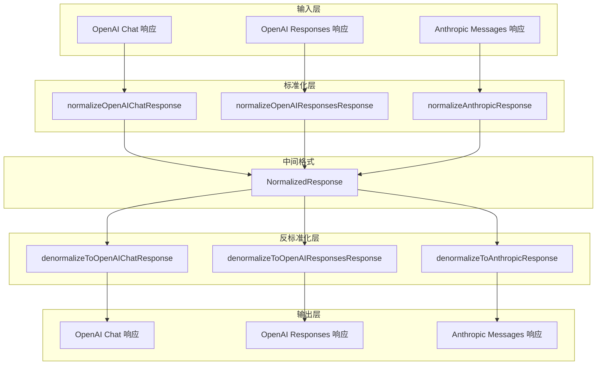

**图表来源**
- [src/converters/responses.ts:26-162](file://src/converters/responses.ts#L26-L162)
- [src/converters/responses.ts:164-301](file://src/converters/responses.ts#L164-L301)

## 详细组件分析

### 响应标准化组件

响应标准化过程负责将不同供应商的响应格式转换为统一的中间格式：

#### OpenAI Chat 响应标准化

OpenAI Chat 响应标准化处理多种内容类型：

```mermaid
flowchart TD
A[OpenAI Chat 响应] --> B[normalizeOpenAIChatResponse]
B --> C[提取 choices[0].message]
C --> D[处理 message.content]
D --> E{content 类型检查}
E --> |字符串| F[创建 text 部件]
E --> |数组| G[遍历部件类型]
G --> H[文本部件 → text]
G --> I[拒绝部件 → refusal]
G --> J[思维部件 → thinking]
E --> K[提取 tool_calls]
K --> L[转换为工具调用]
E --> M[提取 usage]
M --> N[normalizeUsage]
F --> O[构建 NormalizedResponse]
H --> O
I --> O
J --> O
L --> O
N --> O
```

**图表来源**
- [src/converters/responses.ts:26-54](file://src/converters/responses.ts#L26-L54)

#### OpenAI Responses 响应标准化

OpenAI Responses 响应标准化处理复杂的输出项目：

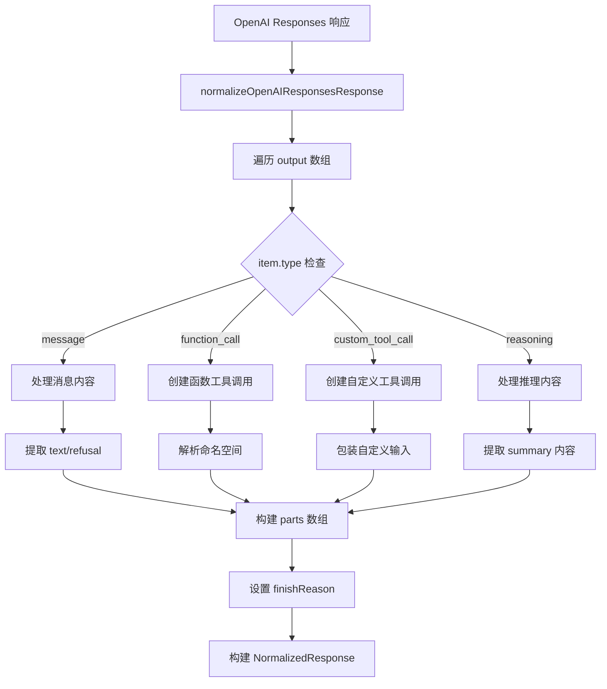

**图表来源**
- [src/converters/responses.ts:56-108](file://src/converters/responses.ts#L56-L108)

#### Anthropic 响应标准化

Anthropic 响应标准化处理独特的思维块：

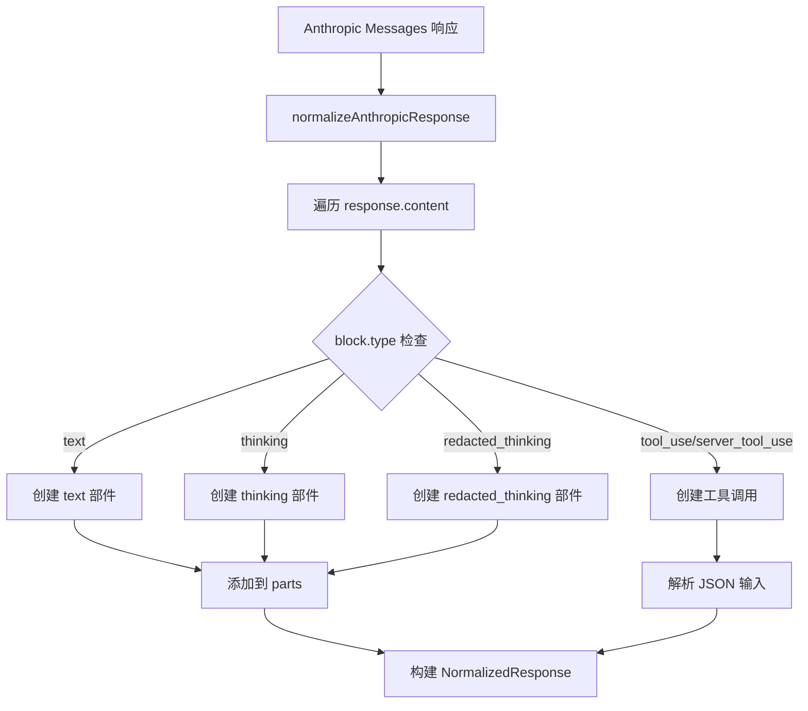

**图表来源**
- [src/converters/responses.ts:119-162](file://src/converters/responses.ts#L119-L162)

### 响应反标准化组件

响应反标准化过程将统一格式转换回特定供应商的响应格式：

#### OpenAI Chat 响应反标准化

OpenAI Chat 响应反标准化处理复杂的思维内容：

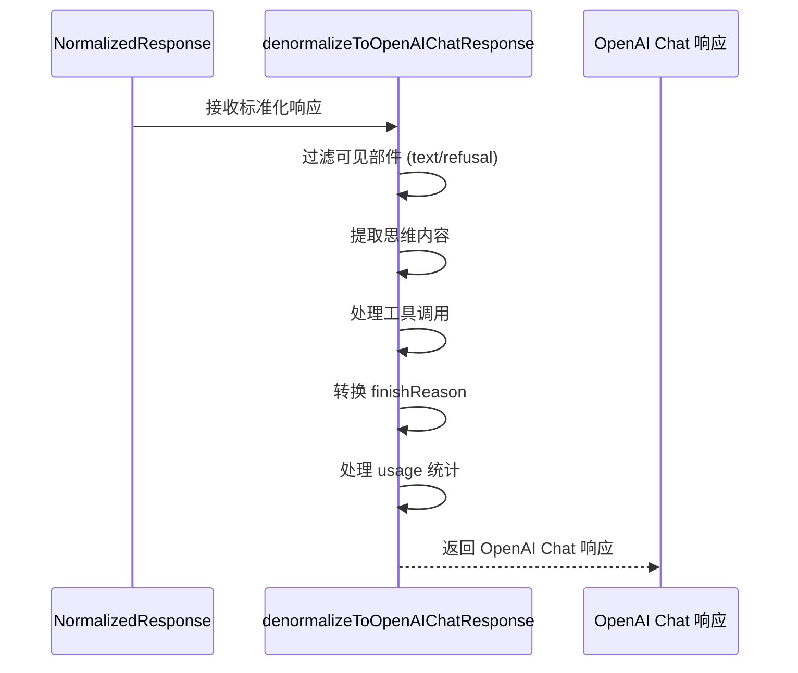

**图表来源**
- [src/converters/responses.ts:164-193](file://src/converters/responses.ts#L164-L193)

#### OpenAI Responses 响应反标准化

OpenAI Responses 响应反标准化处理推理和工具调用：

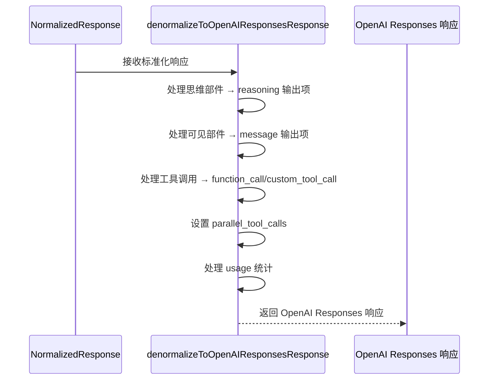

**图表来源**
- [src/converters/responses.ts:195-264](file://src/converters/responses.ts#L195-L264)

#### Anthropic 响应反标准化

Anthropic 响应反标准化处理工具调用的 JSON 解析：

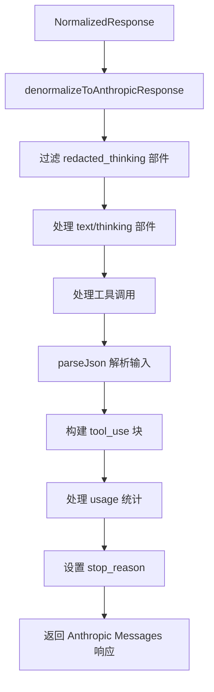

**图表来源**
- [src/converters/responses.ts:266-301](file://src/converters/responses.ts#L266-L301)

### 数据验证和错误处理

系统实现了全面的数据验证和错误处理机制：

#### 错误处理策略

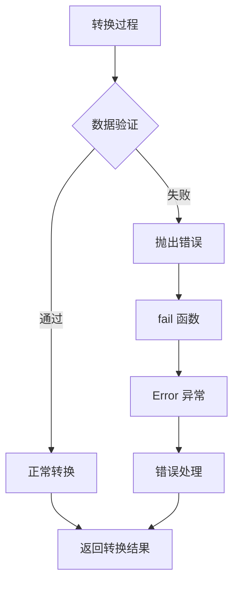

**图表来源**
- [src/converters/shared.ts:111-113](file://src/converters/shared.ts#L111-L113)

#### 支持的错误类型

系统支持以下错误处理场景：

| 错误类型 | 触发条件 | 处理方式 |
|---------|---------|---------|
| 不支持的角色 | OpenAI Chat 中的未知角色 | 抛出错误异常 |
| 不支持的用户内容部件 | 非 text/image_url/input_audio | 抛出错误异常 |
| 不支持的响应格式 | Anthropic 工具调用非函数风格 | 抛出错误异常 |
| JSON 解析错误 | 工具调用输入 JSON 无效 | 抛出错误异常 |
| 文档转换错误 | OpenAI Chat 文档降级失败 | 抛出错误异常 |

**章节来源**
- [src/converters/responses.ts:283](file://src/converters/responses.ts#L283)
- [src/converters/shared.ts:144-150](file://src/converters/shared.ts#L144-L150)

### 兼容性保证

系统确保不同供应商之间的兼容性：

#### Finish Reason 映射

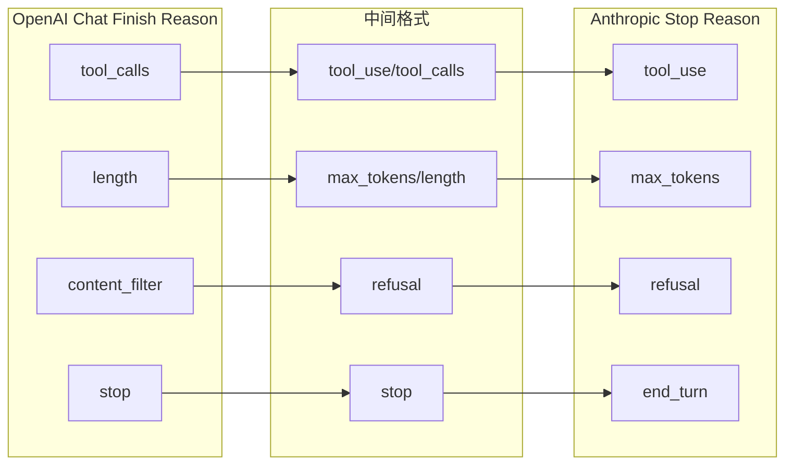

**图表来源**
- [src/converters/responses.ts:303-317](file://src/converters/responses.ts#L303-L317)

## 依赖关系分析

响应转换机制的依赖关系如下：

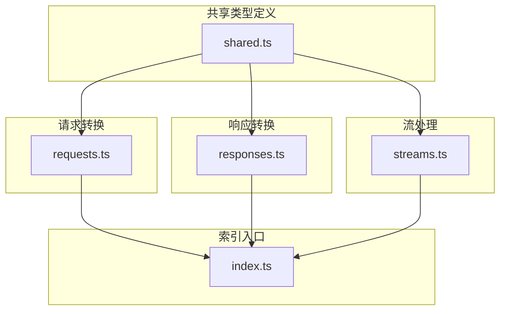

**图表来源**
- [src/converters/index.ts:1-25](file://src/converters/index.ts#L1-L25)
- [src/converters/requests.ts:1-32](file://src/converters/requests.ts#L1-L32)
- [src/converters/responses.ts:1-23](file://src/converters/responses.ts#L1-L23)
- [src/converters/streams.ts:1-6](file://src/converters/streams.ts#L1-L6)

**章节来源**
- [src/converters/index.ts:1-99](file://src/converters/index.ts#L1-L99)

## 性能考虑

响应转换机制在设计时充分考虑了性能优化：

### 时间复杂度分析

- **标准化过程**: O(n)，其中 n 是响应内容部件的数量
- **反标准化过程**: O(m)，其中 m 是标准化消息的长度
- **工具调用处理**: O(k)，其中 k 是工具调用的数量

### 空间复杂度分析

- **中间格式存储**: O(n + m + k)
- **流式处理**: O(1) 额外内存使用

### 优化策略

1. **批量处理**: 合并相邻的消息部件以减少对象创建
2. **延迟计算**: 只在需要时进行 JSON 解析
3. **缓存机制**: 复用已解析的工具调用参数
4. **流式转换**: 支持实时流式响应转换

## 故障排除指南

### 常见问题诊断

#### 转换失败排查

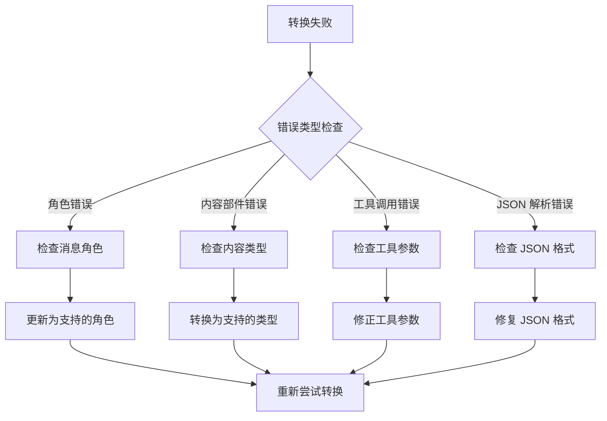

#### 性能问题排查

1. **内存使用过高**: 检查是否有大量中间对象未被垃圾回收
2. **转换速度慢**: 分析是否有多余的字符串拼接操作
3. **内存泄漏**: 确认所有事件监听器都正确清理

### 调试技巧

1. **启用详细日志**: 在转换过程中记录中间状态
2. **单元测试**: 为每个转换函数编写针对性测试
3. **性能监控**: 使用性能分析工具识别瓶颈
4. **边界测试**: 测试极端情况下的转换行为

**章节来源**
- [src/converters/shared.ts:111-113](file://src/converters/shared.ts#L111-L113)

## 结论

响应转换机制通过标准化中间格式成功实现了 OpenAI Chat、OpenAI Responses 和 Anthropic Messages 三种响应格式之间的无缝转换。该系统具有以下优势：

1. **完整性**: 支持所有主要的响应格式转换场景
2. **可靠性**: 实现了全面的数据验证和错误处理
3. **性能**: 优化的算法设计确保高效的转换性能
4. **可维护性**: 清晰的架构设计便于后续扩展和维护

该机制为构建多供应商 AI 应用程序提供了坚实的基础，使得开发者可以专注于业务逻辑而非供应商差异。通过持续的测试和优化，该系统将继续为用户提供稳定可靠的响应转换服务。