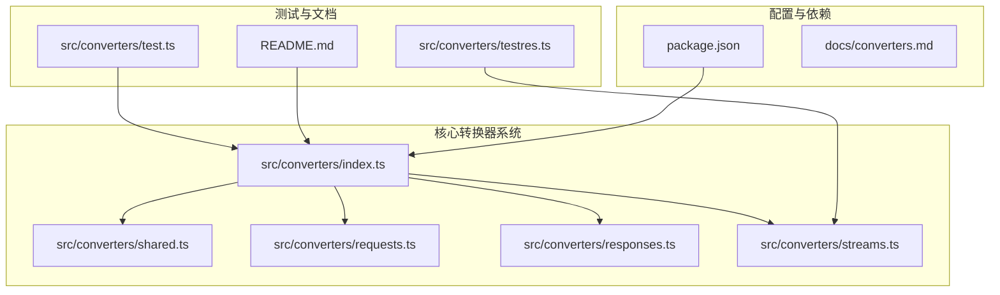
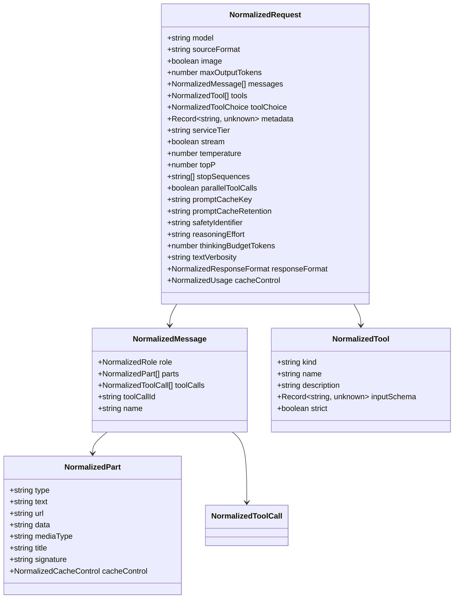
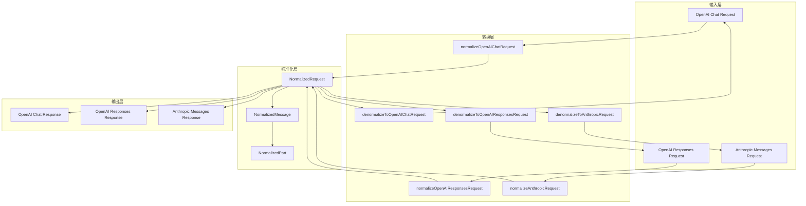
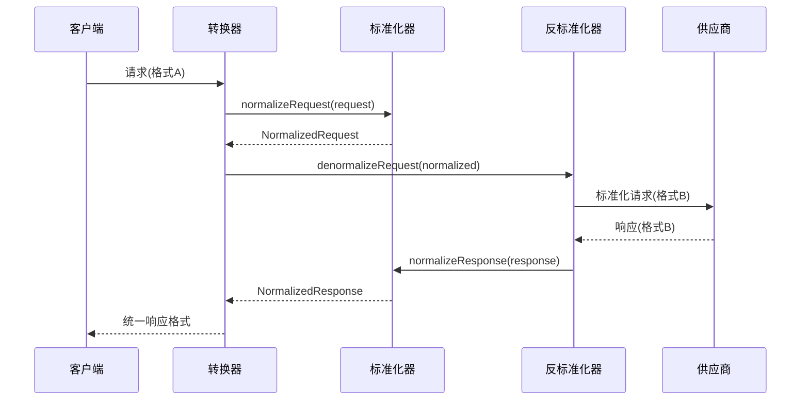
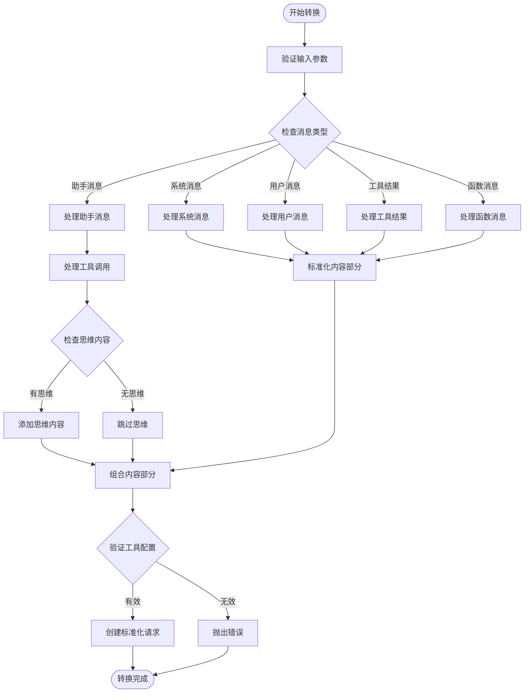
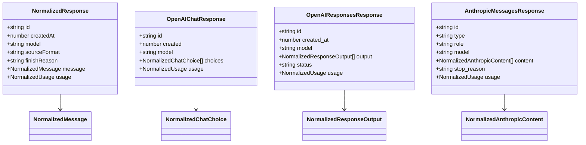
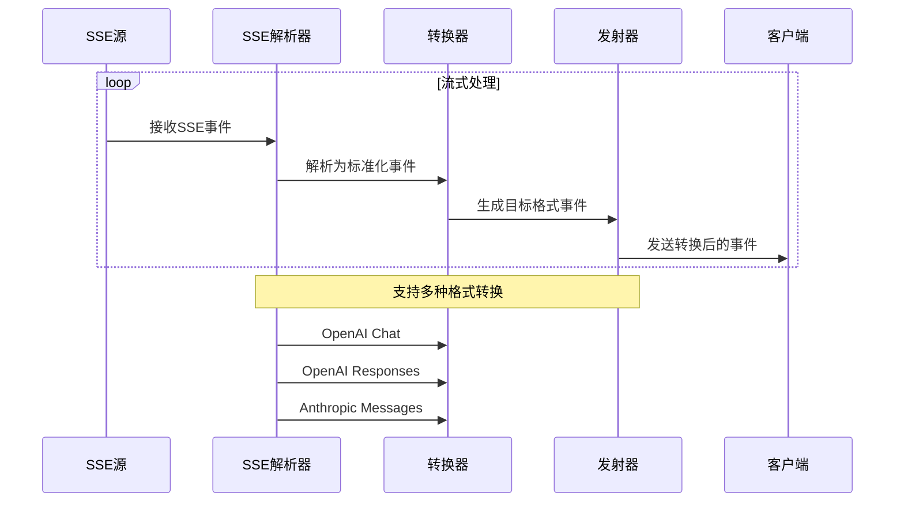
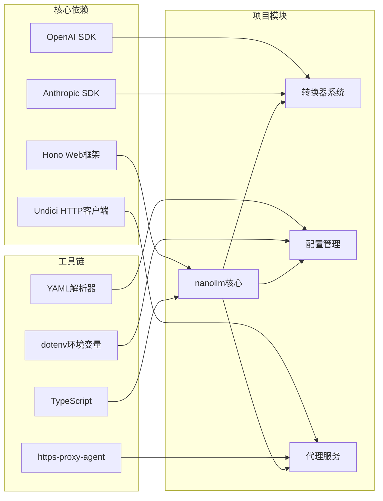
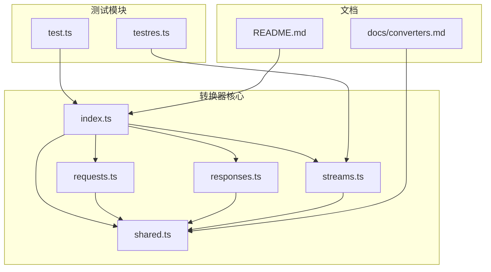
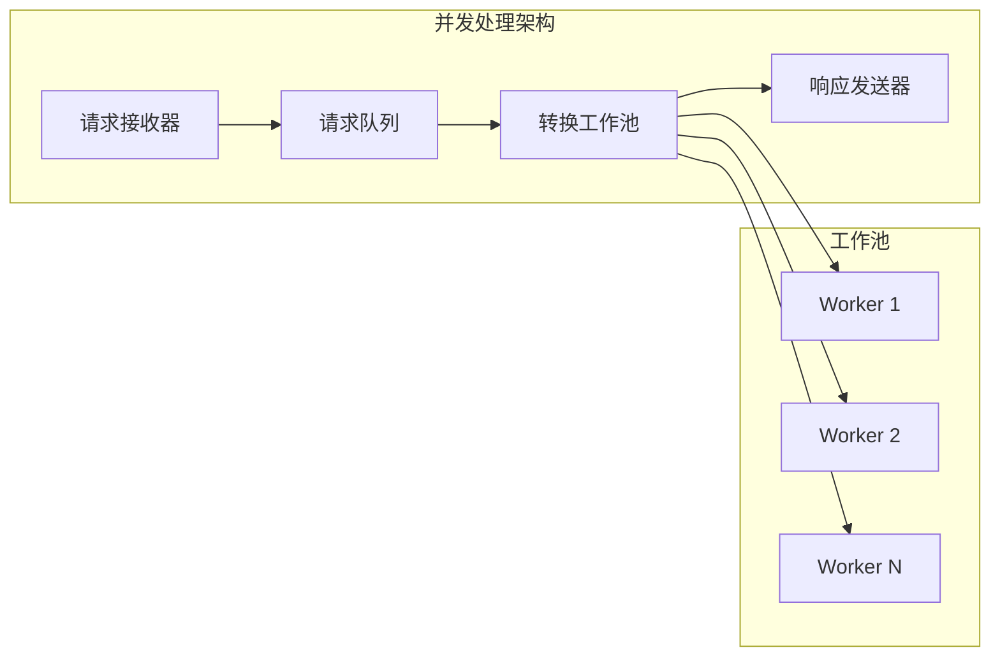

# 新供应商集成指南

<cite>
**本文档引用的文件**
- [README.md](file://README.md)
- [package.json](file://package.json)
- [src/converters/index.ts](file://src/converters/index.ts)
- [src/converters/shared.ts](file://src/converters/shared.ts)
- [src/converters/requests.ts](file://src/converters/requests.ts)
- [src/converters/responses.ts](file://src/converters/responses.ts)
- [src/converters/streams.ts](file://src/converters/streams.ts)
- [src/converters/test.ts](file://src/converters/test.ts)
- [src/converters/testres.ts](file://src/converters/testres.ts)
</cite>

## 目录
1. [简介](#简介)
2. [项目结构](#项目结构)
3. [核心组件](#核心组件)
4. [架构概览](#架构概览)
5. [详细组件分析](#详细组件分析)
6. [依赖关系分析](#依赖关系分析)
7. [性能考虑](#性能考虑)
8. [故障排除指南](#故障排除指南)
9. [结论](#结论)
10. [附录](#附录)

## 简介

nanollm 是一个类似 litellm 的 LLM 模型代理服务，专注于轻量化和本地化，适合个人本地聚合多个模型的场景。该项目的核心优势在于其强大的转换器系统，能够统一处理 OpenAI Chat、OpenAI Responses 和 Anthropic Messages 三种不同的接口格式。

本文档旨在为新模型供应商集成提供完整的开发指南，包括转换器开发步骤、接口规范和测试方法。通过深入分析现有的转换器系统，我们将展示如何扩展现有的转换器体系以支持新的模型供应商。

## 项目结构

项目采用模块化的架构设计，主要分为以下几个核心部分：



**图表来源**
- [src/converters/index.ts:1-99](file://src/converters/index.ts#L1-L99)
- [src/converters/shared.ts:1-385](file://src/converters/shared.ts#L1-L385)
- [src/converters/requests.ts:1-800](file://src/converters/requests.ts#L1-L800)

**章节来源**
- [README.md:1-309](file://README.md#L1-L309)
- [package.json:1-48](file://package.json#L1-L48)

## 核心组件

### 类型定义系统

转换器系统基于一套完整的类型定义，确保不同类型供应商之间的无缝转换：



**图表来源**
- [src/converters/shared.ts:55-109](file://src/converters/shared.ts#L55-L109)

### 转换函数体系

系统提供了完整的双向转换函数，涵盖三种主要的供应商格式：

| 转换方向 | 输入格式 | 输出格式 | 函数数量 |
|---------|---------|---------|---------|
| Chat ↔ Responses | OpenAI Chat | OpenAI Responses | 4个函数 |
| Chat ↔ Anthropic | OpenAI Chat | Anthropic Messages | 4个函数 |
| Responses ↔ Anthropic | OpenAI Responses | Anthropic Messages | 4个函数 |
| 响应转换 | 各种格式 | 统一格式 | 6个函数 |

**章节来源**
- [src/converters/index.ts:27-77](file://src/converters/index.ts#L27-L77)

## 架构概览

转换器系统的整体架构采用分层设计，确保了高度的模块化和可扩展性：



**图表来源**
- [src/converters/index.ts:1-99](file://src/converters/index.ts#L1-L99)
- [src/converters/requests.ts:38-164](file://src/converters/requests.ts#L38-L164)
- [src/converters/responses.ts:26-162](file://src/converters/responses.ts#L26-L162)

## 详细组件分析

### 请求转换器分析

请求转换器负责将不同格式的请求转换为统一的标准化格式：



**图表来源**
- [src/converters/requests.ts:38-81](file://src/converters/requests.ts#L38-L81)
- [src/converters/responses.ts:26-54](file://src/converters/responses.ts#L26-L54)

#### OpenAI Chat 请求转换流程

OpenAI Chat 请求转换是最复杂的转换之一，因为它需要处理多种内容类型和工具调用：



**图表来源**
- [src/converters/requests.ts:385-469](file://src/converters/requests.ts#L385-L469)

**章节来源**
- [src/converters/requests.ts:38-164](file://src/converters/requests.ts#L38-L164)

### 响应转换器分析

响应转换器负责将供应商的响应转换为统一格式，确保客户端获得一致的体验：



**图表来源**
- [src/converters/shared.ts:101-109](file://src/converters/shared.ts#L101-L109)
- [src/converters/responses.ts:26-162](file://src/converters/responses.ts#L26-L162)

**章节来源**
- [src/converters/responses.ts:26-162](file://src/converters/responses.ts#L26-L162)

### 流式传输转换器分析

流式传输转换器是系统中最复杂的一部分，负责处理实时的数据流转换：



**图表来源**
- [src/converters/streams.ts:27-90](file://src/converters/streams.ts#L27-L90)
- [src/converters/streams.ts:1068-1097](file://src/converters/streams.ts#L1068-L1097)

**章节来源**
- [src/converters/streams.ts:1-800](file://src/converters/streams.ts#L1-L800)

## 依赖关系分析

### 外部依赖分析

项目的主要外部依赖包括：



**图表来源**
- [package.json:32-41](file://package.json#L32-L41)

**章节来源**
- [package.json:1-48](file://package.json#L1-L48)

### 内部模块依赖

转换器系统的内部模块依赖关系清晰明确：



**图表来源**
- [src/converters/index.ts:1-99](file://src/converters/index.ts#L1-L99)
- [src/converters/shared.ts:1-30](file://src/converters/shared.ts#L1-L30)

**章节来源**
- [src/converters/index.ts:1-99](file://src/converters/index.ts#L1-L99)

## 性能考虑

### 转换性能优化

系统在设计时充分考虑了性能优化：

1. **内存优化**: 使用对象池和重用机制减少内存分配
2. **流式处理**: 支持流式转换，避免大对象的完整加载
3. **缓存策略**: 对常用的转换结果进行缓存
4. **异步处理**: 所有转换操作都是异步的，避免阻塞主线程

### 并发处理

系统支持高并发的请求处理：



## 故障排除指南

### 常见问题及解决方案

#### 1. 类型转换错误

**问题**: 在转换过程中出现类型不匹配错误

**解决方案**:
- 检查输入数据的结构是否符合预期
- 确保所有必需字段都已正确设置
- 使用类型守卫函数验证数据完整性

#### 2. 流式传输中断

**问题**: SSE 流式传输在转换过程中中断

**解决方案**:
- 检查 SSE 解析器的状态
- 验证事件格式的正确性
- 确保转换器的缓冲区足够大

#### 3. 性能问题

**问题**: 转换过程耗时过长

**解决方案**:
- 优化正则表达式的使用
- 减少不必要的对象创建
- 使用更高效的算法处理大量数据

**章节来源**
- [src/converters/streams.ts:27-90](file://src/converters/streams.ts#L27-L90)

## 结论

nanollm 的转换器系统为新模型供应商集成提供了完整的基础设施。通过深入分析现有的转换器实现，我们可以看到系统的设计具有以下特点：

1. **高度模块化**: 清晰的模块分离使得扩展新的供应商变得简单
2. **强类型安全**: 完整的 TypeScript 类型定义确保了类型安全
3. **灵活的转换机制**: 支持双向转换和流式处理
4. **完善的测试覆盖**: 提供了全面的测试用例和示例

对于新供应商的集成，开发者只需要遵循现有的模式和规范，就能快速地将新的模型供应商纳入到系统中。

## 附录

### 新供应商集成步骤

#### 步骤1: 定义类型

首先，需要在 `shared.ts` 中定义新的供应商类型：

```typescript
// 在 shared.ts 中添加新的类型定义
export type NewProviderRequest = NewProviderCreateParamsBase;
export type NewProviderResponse = NewProviderMessage;
```

#### 步骤2: 实现请求转换

在 `requests.ts` 中添加请求转换函数：

```typescript
export function normalizeNewProviderRequest(request: NewProviderRequest): NormalizedRequest {
  // 实现请求标准化逻辑
}

export function denormalizeToNewProviderRequest(request: NormalizedRequest): NewProviderRequest {
  // 实现反标准化逻辑
}
```

#### 步骤3: 实现响应转换

在 `responses.ts` 中添加响应转换函数：

```typescript
export function normalizeNewProviderResponse(response: NewProviderResponse): NormalizedResponse {
  // 实现响应标准化逻辑
}

export function denormalizeToNewProviderResponse(response: NormalizedResponse): NewProviderResponse {
  // 实现反标准化逻辑
}
```

#### 步骤4: 更新索引文件

在 `index.ts` 中导出新的转换函数：

```typescript
export {
  // ... 现有导出
  normalizeNewProviderRequest,
  denormalizeToNewProviderRequest,
  normalizeNewProviderResponse,
  denormalizeToNewProviderResponse,
}
```

#### 步骤5: 编写测试

在 `test.ts` 中添加测试用例：

```typescript
// 添加新的测试用例
describe('New Provider Integration', () => {
  it('should convert requests correctly', () => {
    // 测试请求转换
  });
  
  it('should convert responses correctly', () => {
    // 测试响应转换
  });
});
```

### 最佳实践建议

1. **保持向后兼容**: 新的转换器应该尽量保持与现有格式的兼容性
2. **错误处理**: 实现完善的错误处理机制，确保转换失败时能够优雅降级
3. **性能优化**: 注意转换过程中的性能影响，避免不必要的计算
4. **文档完善**: 为新的转换器编写详细的文档和注释
5. **测试覆盖**: 确保新功能有足够的测试覆盖

### 常见问题解决方案

#### 问题1: 如何处理不支持的特性？

**解决方案**: 在转换函数中添加特性检查，对不支持的特性发出警告或忽略

#### 问题2: 如何处理版本兼容性？

**解决方案**: 使用版本检查机制，根据不同的版本采用不同的转换策略

#### 问题3: 如何优化内存使用？

**解决方案**: 实现对象池和重用机制，避免频繁的对象创建和销毁

通过遵循这些指导原则和最佳实践，开发者可以成功地将新的模型供应商集成到 nanollm 系统中，享受其强大的转换能力和灵活的架构设计。