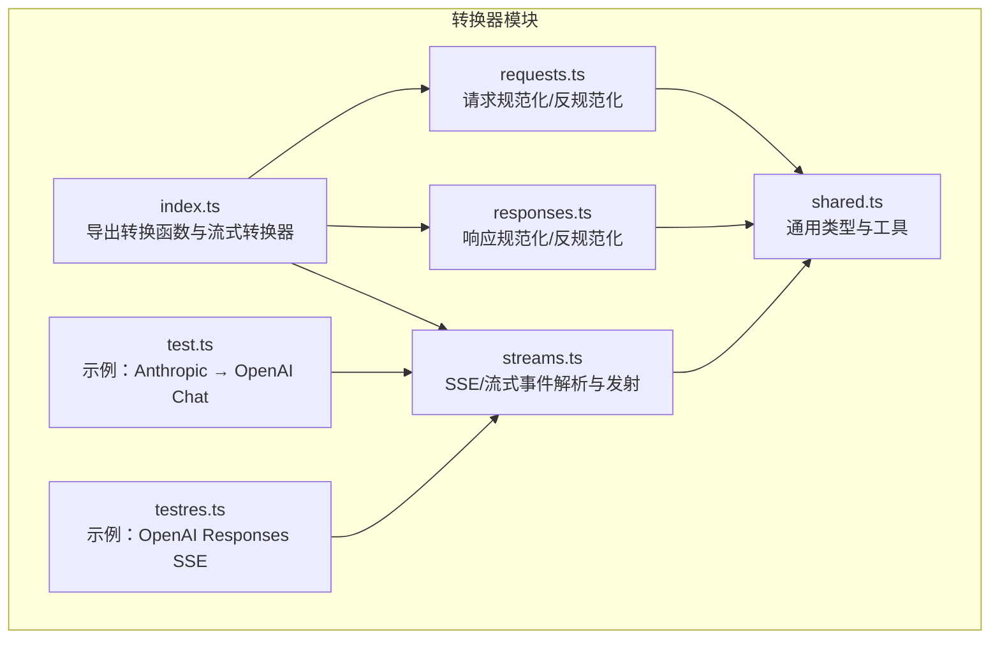
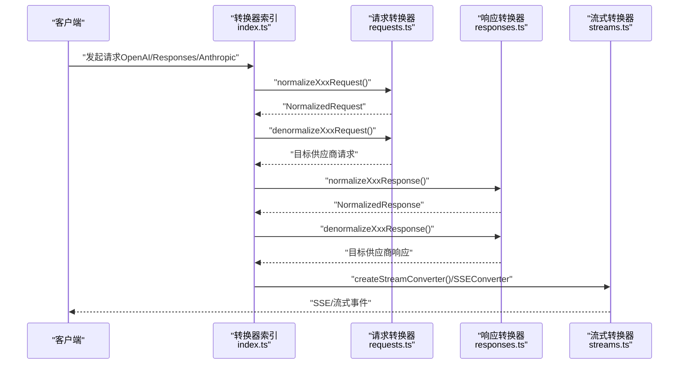
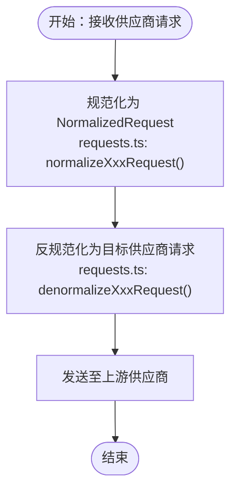
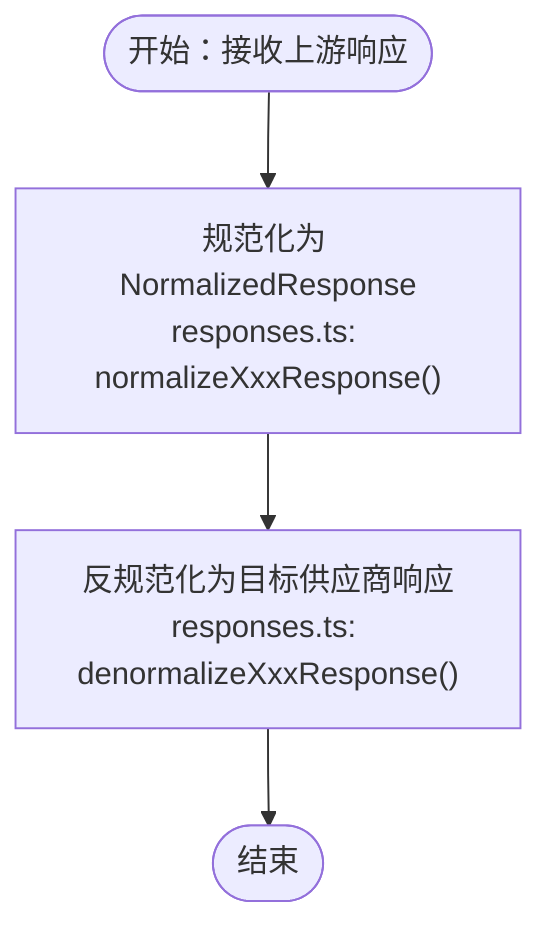
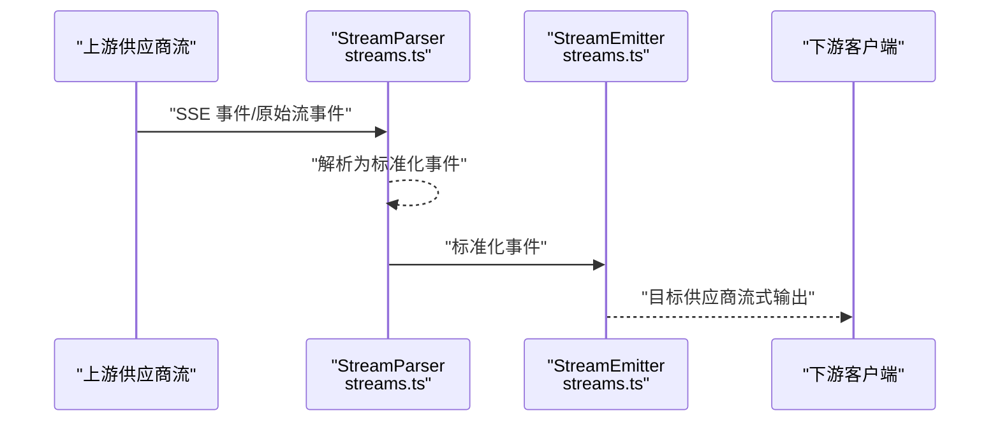
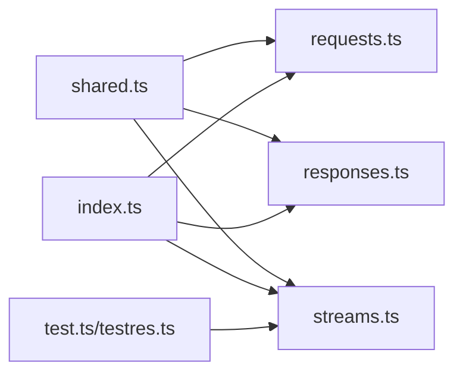

# 模型供应商集成

<cite>
**本文档引用的文件**
- [README.md](file://README.md)
- [docs/converters.md](file://docs/converters.md)
- [src/converters/index.ts](file://src/converters/index.ts)
- [src/converters/requests.ts](file://src/converters/requests.ts)
- [src/converters/responses.ts](file://src/converters/responses.ts)
- [src/converters/shared.ts](file://src/converters/shared.ts)
- [src/converters/streams.ts](file://src/converters/streams.ts)
- [src/converters/test.ts](file://src/converters/test.ts)
- [src/converters/testres.ts](file://src/converters/testres.ts)
</cite>

## 目录
1. [简介](#简介)
2. [项目结构](#项目结构)
3. [核心组件](#核心组件)
4. [架构总览](#架构总览)
5. [详细组件分析](#详细组件分析)
6. [依赖关系分析](#依赖关系分析)
7. [性能考虑](#性能考虑)
8. [故障排查指南](#故障排查指南)
9. [结论](#结论)
10. [附录](#附录)

## 简介
本项目提供了一个轻量级的多模型供应商代理服务，核心能力围绕「转换器系统」构建，负责在三种主流接口规范之间进行请求与响应的双向转换，以及流式事件的统一化处理：
- OpenAI Chat Completions（openai-chat）
- OpenAI Responses（openai-responses）
- Anthropic Messages（anthropic）

通过统一的中间表示（NormalizedRequest/NormalizedResponse 等），系统实现了跨供应商的参数映射、消息与工具的归一化、以及流式事件的解析与发射。本文档面向开发者，系统性阐述转换器的设计架构、请求/响应转换与流式处理机制，并提供新供应商集成的开发指南。

## 项目结构
转换器相关代码集中在 src/converters 目录，主要文件职责如下：
- index.ts：导出请求/响应转换函数与流式转换器工厂
- requests.ts：请求规范化与反规范化（含 OpenAI Chat、OpenAI Responses、Anthropic）
- responses.ts：响应规范化与反规范化（含 OpenAI Chat、OpenAI Responses、Anthropic）
- shared.ts：通用类型、常量与工具函数（Normalized* 结构、JSON 解析、用量归一化等）
- streams.ts：SSE/流式事件解析与发射（OpenAI Chat、OpenAI Responses、Anthropic）
- test.ts / testres.ts：示例与测试用例（演示 Anthropic 原始事件转换为 OpenAI Chat）

**图表来源**
- [src/converters/index.ts:1-99](file://src/converters/index.ts#L1-L99)
- [src/converters/requests.ts:1-1239](file://src/converters/requests.ts#L1-L1239)
- [src/converters/responses.ts:1-318](file://src/converters/responses.ts#L1-L318)
- [src/converters/shared.ts:1-385](file://src/converters/shared.ts#L1-L385)
- [src/converters/streams.ts:1-1270](file://src/converters/streams.ts#L1-L1270)
- [src/converters/test.ts:1-800](file://src/converters/test.ts#L1-L800)
- [src/converters/testres.ts:1-192](file://src/converters/testres.ts#L1-L192)

**章节来源**
- [README.md:1-309](file://README.md#L1-L309)
- [docs/converters.md:1-182](file://docs/converters.md#L1-L182)

## 核心组件
- 中间表示（Normalized*）：统一的消息、工具、请求与响应结构，确保跨供应商转换的一致性
- 请求转换器：将不同供应商的请求参数映射到中间表示，并在发送至上游前反规范化为目标供应商格式
- 响应转换器：将上游响应标准化为中间表示，并在返回客户端前反规范化为目标供应商格式
- 流式转换器：解析上游 SSE/流式事件，统一为中间事件流，再发射为目标供应商的流式格式

关键导出与工厂：
- 请求/响应转换函数：chatParamsToResponsesRequest、responsesRequestToChatParams、chatParamsToAnthropicMessageRequest、anthropicMessageRequestToChatParams 等
- 流式转换器工厂：createStreamConverter、createSSEConverter、createSSETransformStream
- SSE 工具：SSEParser、formatSSE、formatDone

**章节来源**
- [src/converters/index.ts:1-99](file://src/converters/index.ts#L1-L99)
- [src/converters/streams.ts:1031-1270](file://src/converters/streams.ts#L1031-L1270)

## 架构总览
转换器系统采用「中间表示 + 双向转换 + 流式桥接」的三层架构：
- 规范化层：requests.ts/responses.ts 将各供应商的请求/响应解析为统一的 Normalized* 结构
- 反规范化层：将 Normalized* 转换为具体供应商的请求/响应格式
- 流式层：streams.ts 统一解析上游流事件，生成标准化事件，再按目标格式发射

**图表来源**
- [src/converters/index.ts:27-77](file://src/converters/index.ts#L27-L77)
- [src/converters/requests.ts:38-164](file://src/converters/requests.ts#L38-L164)
- [src/converters/responses.ts:26-162](file://src/converters/responses.ts#L26-L162)
- [src/converters/streams.ts:1068-1163](file://src/converters/streams.ts#L1068-L1163)

## 详细组件分析

### 请求转换器（requests.ts）
- 角色：将 OpenAI Chat、OpenAI Responses、Anthropic 的请求统一规范化为 NormalizedRequest，再反规范化为目标供应商请求
- 关键流程：
  - 规范化：解析 messages、tools、tool_choice、metadata、service_tier、stream、temperature、topP、stopSequences、parallelToolCalls、promptCacheKey、reasoningEffort、thinkingBudgetTokens、textVerbosity、responseFormat、cacheControl 等
  - 反规范化：将 NormalizedRequest 转换为目标供应商请求（如 OpenAI Chat 的 messages、max_completion_tokens、stream_options、response_format 等）
- 特殊处理：
  - Anthropic：从 metadata.user_id.session_id 提取 promptCacheKey，若不存在则生成日期型 promptCacheKey
  - OpenAI Chat：根据 imageEnabled 控制是否保留多媒体内容，否则将相邻 user/assistant 消息合并
  - OpenAI Responses：将 instructions 与 input 合并为 messages，支持 custom tool 的 schema 包装与命名空间折叠
  - Anthropic：对 tool_choice.disable_parallel_tool_use 与 parallelToolCalls 进行互转

**图表来源**
- [src/converters/requests.ts:38-164](file://src/converters/requests.ts#L38-L164)
- [src/converters/requests.ts:166-376](file://src/converters/requests.ts#L166-L376)

**章节来源**
- [src/converters/requests.ts:1-1239](file://src/converters/requests.ts#L1-L1239)

### 响应转换器（responses.ts）
- 角色：将上游响应标准化为 NormalizedResponse，并在返回客户端前反规范化为目标供应商响应
- 关键流程：
  - 规范化：解析 choices/message/tool_calls/thinking/refusal/usage 等，生成 NormalizedMessage 与 NormalizedResponse
  - 反规范化：将 NormalizedResponse 转换为目标供应商响应（如 OpenAI Chat 的 choices[].message、usage；OpenAI Responses 的 output、status；Anthropic 的 content、usage）
- 特殊处理：
  - finish_reason 映射：如 OpenAI Chat 的 tool_use/tool_calls → tool_calls；Anthropic 的 end_turn → stop
  - usage 归一化：统一 input_tokens/output_tokens/cache_* 等字段，再按目标供应商格式反规范化

**图表来源**
- [src/converters/responses.ts:26-162](file://src/converters/responses.ts#L26-L162)
- [src/converters/responses.ts:164-301](file://src/converters/responses.ts#L164-L301)

**章节来源**
- [src/converters/responses.ts:1-318](file://src/converters/responses.ts#L1-L318)

### 流式转换器（streams.ts）
- 角色：统一解析上游 SSE/流式事件，生成标准化事件流，再按目标格式发射
- 关键组件：
  - SSEParser：解析 SSE 文本，过滤 ping 事件，提取 event 与 data
  - StreamParser：针对不同供应商（OpenAI Chat、OpenAI Responses、Anthropic）解析流事件，输出标准化 NormalizedStreamEvent
  - StreamEmitter：将标准化事件转换为目标供应商的流式输出（如 OpenAI Chat 的 ChatCompletionChunk、OpenAI Responses 的 ResponseStreamEvent、Anthropic 的 RawMessageStreamEvent）
  - 工厂：createStreamConverter、createSSEConverter、createSSETransformStream
- 特殊处理：
  - OpenAI Chat：支持 content_start/content_delta/content_done、tool_start/tool_delta/tool_done、end（含 finish_reason 与 usage）
  - OpenAI Responses：支持 response.created/response.output_item.added/response.content_part.added/response.output_text.delta/response.function_call_arguments.delta 等
  - Anthropic：支持 message_start/content_block_start/content_block_delta/content_block_stop/message_delta/message_stop

**图表来源**
- [src/converters/streams.ts:27-90](file://src/converters/streams.ts#L27-L90)
- [src/converters/streams.ts:118-251](file://src/converters/streams.ts#L118-L251)
- [src/converters/streams.ts:255-410](file://src/converters/streams.ts#L255-L410)
- [src/converters/streams.ts:414-490](file://src/converters/streams.ts#L414-L490)
- [src/converters/streams.ts:494-585](file://src/converters/streams.ts#L494-L585)
- [src/converters/streams.ts:589-826](file://src/converters/streams.ts#L589-L826)
- [src/converters/streams.ts:893-1029](file://src/converters/streams.ts#L893-L1029)

**章节来源**
- [src/converters/streams.ts:1-1270](file://src/converters/streams.ts#L1-L1270)

### 支持的模型供应商与接口差异
- OpenAI Chat（openai-chat）：支持 messages、tools、tool_choice、response_format、stream_options、reasoning/thinking 等
- OpenAI Responses（openai-responses）：支持 instructions/input、output、status、text/format、reasoning 等
- Anthropic Messages（anthropic）：支持 system/messages、tools、tool_choice、thinking/output_config、cache_control 等

字段映射与特殊处理详见 Converter Reference 文档。

**章节来源**
- [docs/converters.md:1-182](file://docs/converters.md#L1-L182)

### 示例与测试
- test.ts：演示将 Anthropic 原始消息转换为 OpenAI Chat 请求与响应
- testres.ts：演示 OpenAI Responses 的 SSE 事件流

**章节来源**
- [src/converters/test.ts:1-800](file://src/converters/test.ts#L1-L800)
- [src/converters/testres.ts:1-192](file://src/converters/testres.ts#L1-L192)

## 依赖关系分析
- index.ts 作为门面，组合 requests.ts、responses.ts、streams.ts 的能力
- requests.ts/responses.ts 依赖 shared.ts 的类型与工具函数
- streams.ts 依赖 shared.ts 的 usage 归一化与工具函数
- test.ts/testres.ts 展示了实际的转换与流式转换用法

**图表来源**
- [src/converters/index.ts:1-99](file://src/converters/index.ts#L1-L99)
- [src/converters/requests.ts:1-32](file://src/converters/requests.ts#L1-L32)
- [src/converters/responses.ts:1-24](file://src/converters/responses.ts#L1-L24)
- [src/converters/streams.ts:1-6](file://src/converters/streams.ts#L1-L6)
- [src/converters/test.ts:1-2](file://src/converters/test.ts#L1-L2)
- [src/converters/testres.ts:1-1](file://src/converters/testres.ts#L1-L1)

**章节来源**
- [src/converters/shared.ts:1-385](file://src/converters/shared.ts#L1-L385)

## 性能考虑
- 中间表示的统一减少了重复解析与映射开销
- 流式转换采用增量解析与事件发射，降低内存占用
- usage 归一化与反规范化在必要时才进行，避免不必要的计算
- SSE 解析器对 ping 与 [DONE] 进行快速过滤，减少无效处理

[本节为通用指导，无需特定文件引用]

## 故障排查指南
常见问题与定位要点：
- 请求/响应字段缺失或类型不符：检查 shared.ts 中的 fail 抛错点与 requests/responses 的输入校验
- 流式事件解析异常：确认 SSEParser 是否正确识别 event 与 data，以及是否遗漏 [DONE]
- finish_reason 映射错误：核对 responses.ts 中 finish_reason 与 Anthropic stop_reason 的映射
- usage 不一致：检查 shared.ts 中 normalizeUsage 与各供应商的 denormalize 函数

**章节来源**
- [src/converters/shared.ts:111-150](file://src/converters/shared.ts#L111-L150)
- [src/converters/streams.ts:27-90](file://src/converters/streams.ts#L27-L90)
- [src/converters/responses.ts:303-317](file://src/converters/responses.ts#L303-L317)

## 结论
转换器系统通过「中间表示 + 双向转换 + 流式桥接」，实现了对 OpenAI Chat、OpenAI Responses、Anthropic 三大供应商的统一接入。其设计具备良好的可扩展性与可维护性，为后续新增供应商提供了清晰的接口规范与实现路径。

[本节为总结，无需特定文件引用]

## 附录

### 新供应商集成开发指南
- 接口规范
  - 在 shared.ts 中定义供应商的请求/响应类型别名与 Normalized* 结构
  - 在 requests.ts 中添加 normalizeXxxRequest 与 denormalizeXxxRequest
  - 在 responses.ts 中添加 normalizeXxxResponse 与 denormalizeXxxResponse
  - 在 index.ts 中导出对应的转换函数
- 流式处理
  - 在 streams.ts 中添加 StreamParser 与 StreamEmitter 实现
  - 使用 createStreamConverter/createSSEConverter 工厂进行集成
- 测试与验证
  - 在 test.ts 中补充转换示例
  - 在 testres.ts 中补充 SSE 示例
  - 对照 converters.md 的字段映射与特殊处理规则进行回归测试

**章节来源**
- [src/converters/shared.ts:10-110](file://src/converters/shared.ts#L10-L110)
- [src/converters/requests.ts:38-164](file://src/converters/requests.ts#L38-L164)
- [src/converters/responses.ts:26-162](file://src/converters/responses.ts#L26-L162)
- [src/converters/index.ts:27-77](file://src/converters/index.ts#L27-L77)
- [src/converters/streams.ts:1033-1057](file://src/converters/streams.ts#L1033-L1057)
- [docs/converters.md:1-182](file://docs/converters.md#L1-L182)