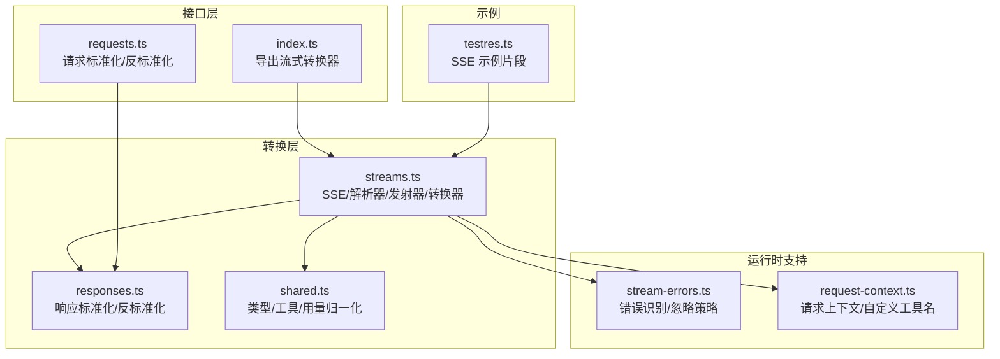
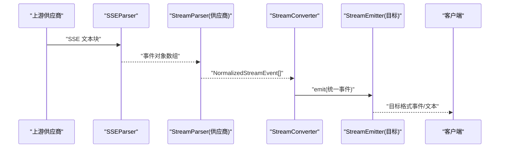
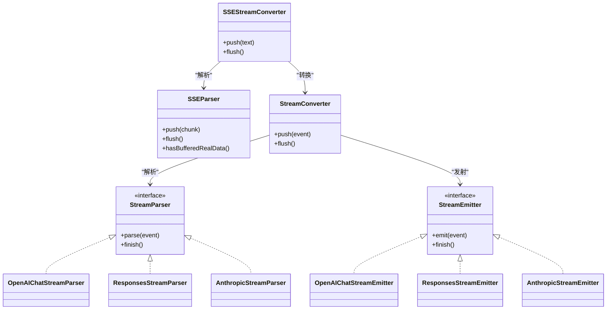

# 流式处理

<cite>
**本文引用的文件**
- [streams.ts](file://src/converters/streams.ts)
- [responses.ts](file://src/converters/responses.ts)
- [shared.ts](file://src/converters/shared.ts)
- [index.ts](file://src/converters/index.ts)
- [requests.ts](file://src/converters/requests.ts)
- [stream-errors.ts](file://src/stream-errors.ts)
- [request-context.ts](file://src/request-context.ts)
- [testres.ts](file://src/converters/testres.ts)
</cite>

## 目录
1. [简介](#简介)
2. [项目结构](#项目结构)
3. [核心组件](#核心组件)
4. [架构总览](#架构总览)
5. [详细组件分析](#详细组件分析)
6. [依赖关系分析](#依赖关系分析)
7. [性能考虑](#性能考虑)
8. [故障排查指南](#故障排查指南)
9. [结论](#结论)
10. [附录](#附录)

## 简介
本文件面向“流式处理”能力，系统性阐述多供应商流式响应的统一处理机制，涵盖：
- Server-Sent Events (SSE) 的解析与格式化
- OpenAI Chat、OpenAI Responses、Anthropic 三类流式协议的解析与发射
- 统一的事件模型 NormalizedStreamEvent 及其转换链路
- 错误处理、连接管理与性能优化策略
- 使用示例：StreamConverter、SSEStreamConverter、TransformStream

## 项目结构
流式处理相关代码集中在 converters 子模块中，核心文件如下：
- streams.ts：SSE 解析器、各供应商流式解析器/发射器、事件转换器、SSE 转换器与 TransformStream 工厂
- responses.ts：标准化/反标准化响应，统一文本/拒绝/思考/工具调用表示
- shared.ts：通用类型定义、工具函数、用量归一化/反归一化
- index.ts：导出流式转换器与解析器
- requests.ts：请求标准化/反标准化，支撑跨协议消息与工具定义转换
- stream-errors.ts：流读取错误识别与忽略策略
- request-context.ts：请求上下文（含 Responses 自定义工具名集合）
- testres.ts：示例 SSE 文本片段（OpenAI Responses）

图表来源
- [streams.ts](file://src/converters/streams.ts)
- [responses.ts](file://src/converters/responses.ts)
- [shared.ts](file://src/converters/shared.ts)
- [index.ts](file://src/converters/index.ts)
- [requests.ts](file://src/converters/requests.ts)
- [stream-errors.ts](file://src/stream-errors.ts)
- [request-context.ts](file://src/request-context.ts)
- [testres.ts](file://src/converters/testres.ts)

章节来源
- [streams.ts](file://src/converters/streams.ts)
- [responses.ts](file://src/converters/responses.ts)
- [shared.ts](file://src/converters/shared.ts)
- [index.ts](file://src/converters/index.ts)
- [requests.ts](file://src/converters/requests.ts)
- [stream-errors.ts](file://src/stream-errors.ts)
- [request-context.ts](file://src/request-context.ts)
- [testres.ts](file://src/converters/testres.ts)

## 核心组件
- SSE 解析与格式化
  - SSEParser：按块解析 SSE 文本，过滤 ping 与 [DONE]，输出事件数组
  - formatSSE/formatDone：将对象序列化为 SSE 行
- 事件模型
  - NormalizedStreamEvent：统一的流事件模型，覆盖 start/content/tool/end 等阶段
- 解析器
  - OpenAIChatStreamParser：解析 OpenAI Chat 流事件
  - ResponsesStreamParser：解析 OpenAI Responses 流事件
  - AnthropicStreamParser：解析 Anthropic 流事件
- 发射器
  - OpenAIChatStreamEmitter：将统一事件发射为 OpenAI Chat Chunk
  - ResponsesStreamEmitter：将统一事件发射为 OpenAI Responses 事件序列
  - AnthropicStreamEmitter：将统一事件发射为 Anthropic 内容块事件
- 转换器
  - StreamConverter：从指定格式到目标格式的事件级转换
  - SSEStreamConverter：对原始 SSE 文本进行转换
  - createSSETransformStream：在 Web/Node 环境中通过 TransformStream 进行字节级转换
- 辅助
  - createUsageCollector：仅消费 SSE 文本，收集最终用量
  - 工具函数：finish reason 归一化、用量归一化/反归一化

章节来源
- [streams.ts](file://src/converters/streams.ts)
- [shared.ts](file://src/converters/shared.ts)

## 架构总览
统一流式处理链路如下：
- 输入：来自不同供应商的原始 SSE 文本或事件对象
- 解析：SSEParser 将文本切分为事件；各 StreamParser 将事件映射为统一 NormalizedStreamEvent
- 转换：StreamConverter/Emitter 将统一事件转换为目标格式
- 输出：SSEStreamConverter 以 SSE 文本输出；TransformStream 在浏览器/Node 环境中以字节流输出

图表来源
- [streams.ts](file://src/converters/streams.ts)

## 详细组件分析

### SSE 解析与格式化
- SSEParser
  - 缓冲区增量拼接，按双换行符分割事件
  - 过滤 event=ping 与 data=[DONE] 或 [DONE]
  - 提供 flush() 收尾输出
- formatSSE/formatDone
  - 将任意对象序列化为 data 行
  - [DONE] 事件用于结束标记（OpenAI Chat）

章节来源
- [streams.ts](file://src/converters/streams.ts)

### 统一事件模型 NormalizedStreamEvent
- 阶段化事件
  - start：id/model/createdAt
  - content_start/delta/done：文本/拒绝/思考/脱敏思考
  - tool_start/delta/done：工具调用开始/增量/完成
  - end：finishReason + usage
- 用途：屏蔽供应商差异，统一转换链路

章节来源
- [streams.ts](file://src/converters/streams.ts)

### OpenAI Chat 流解析与发射
- OpenAIChatStreamParser
  - 解析 ChatCompletionChunk，拆分 content/refusal/reasoning/thinking
  - 跟踪 tool_calls，维护索引映射与块状态
  - finish_reason 归一化，usage 合并
- OpenAIChatStreamEmitter
  - 将统一事件还原为 OpenAI Chat Chunk
  - 处理自定义工具输入的转义与闭合

章节来源
- [streams.ts](file://src/converters/streams.ts)

### OpenAI Responses 流解析与发射
- ResponsesStreamParser
  - 解析 response.* 事件序列，构建 message/reasoning/function_call/custom_tool_call
  - 通过 blockMapping/blockTypes 维护块索引与类型
  - finishReason 归一化（基于是否出现工具调用）
- ResponsesStreamEmitter
  - 生成 response.created/in_progress/added/delta/done/completed 等事件序列
  - 自定义工具输入的包装/解包与增量发射

章节来源
- [streams.ts](file://src/converters/streams.ts)

### Anthropic 流解析与发射
- AnthropicStreamParser
  - 解析 message_start/content_block_start/delta/stop/delta 等事件
  - 区分 text/thinking/redacted_thinking/tool_use
  - usage 与 finishReason 归一化
- AnthropicStreamEmitter
  - 生成 message_start/content_block_start/delta/stop 等事件
  - 自定义工具输入的编码与闭合

章节来源
- [streams.ts](file://src/converters/streams.ts)

### 转换器与 SSE 转换器
- StreamConverter
  - 通过工厂选择对应解析器与发射器
  - push()/flush() 实现事件级转换
- SSEStreamConverter
  - 对原始 SSE 文本进行转换，支持 [DONE] 结束标记
- createSSETransformStream
  - 在浏览器/Node 环境中以 TransformStream 字节流转换

章节来源
- [streams.ts](file://src/converters/streams.ts)
- [index.ts](file://src/converters/index.ts)

### 用量收集与 finishReason 归一化
- createUsageCollector
  - 仅消费 SSE 文本，提取 end 事件中的 usage
- finishReason 归一化
  - Chat：tool_use/tool_calls/length/refusal/stop/error
  - Anthropic：tool_use/max_tokens/stop_sequence/pause_turn/end_turn/refusal

章节来源
- [streams.ts](file://src/converters/streams.ts)

### 供应商协议差异与统一策略
- 协议差异
  - OpenAI Chat：基于 choices[].delta 的增量字段
  - OpenAI Responses：基于 response.* 事件序列，支持 reasoning 与 custom_tool_call
  - Anthropic：基于 message_start/content_block_* 事件，支持 redacted_thinking/signature
- 统一策略
  - 通过统一事件模型 NormalizedStreamEvent 屏蔽差异
  - 通过 Responses 自定义工具名标记与包装/解包，兼容 OpenAI Responses 的自定义工具输入

章节来源
- [streams.ts](file://src/converters/streams.ts)
- [request-context.ts](file://src/request-context.ts)

### 使用示例

- 事件级转换（StreamConverter）
  - 创建转换器：createStreamConverter("anthropic", "openai-chat")
  - 推送事件：converter.push(event)
  - 收尾：converter.flush()

- SSE 文本转换（SSEStreamConverter）
  - 创建转换器：createSSEConverter("openai-responses", "anthropic")
  - 推送文本：converter.push(sseText)
  - 收尾：converter.flush()

- 字节流转换（TransformStream）
  - 创建转换器：createSSETransformStream("openai-chat", "openai-responses")
  - 在浏览器/Node 中通过 pipeThrough 使用

- 用量收集
  - createUsageCollector("openai-responses")
  - push()/finish() 获取最终 usage

章节来源
- [streams.ts](file://src/converters/streams.ts)
- [index.ts](file://src/converters/index.ts)

## 依赖关系分析

图表来源
- [streams.ts](file://src/converters/streams.ts)

章节来源
- [streams.ts](file://src/converters/streams.ts)

## 性能考虑
- SSE 解析
  - 增量缓冲与按块分割，避免大字符串全量解析
  - 过滤无效事件（ping/[DONE]），减少后续处理开销
- 事件映射
  - 使用 Map/Set 维护块索引与块类型，降低查找成本
  - finish() 阶段统一关闭开放块，避免遗漏
- 发射端
  - OpenAI Chat 自定义工具输入采用编码与增量拼接，减少 JSON 序列化次数
- 流式传输
  - TransformStream 按字节解码/编码，适合高吞吐场景
- 用量收集
  - createUsageCollector 仅消费 end 事件，避免重复解析

[本节为通用指导，不涉及具体文件分析]

## 故障排查指南
- 释放读取器状态错误
  - isReleasedReaderStateError：识别 ERR_INVALID_STATE 并匹配特定错误信息
  - shouldIgnoreStreamReadError：在取消/已完成且释放状态下可忽略错误
- 建议排查步骤
  - 检查上游 SSE 文本是否包含 [DONE] 或异常中断
  - 确认转换器 flush() 是否被正确调用
  - 在浏览器/Node 环境中确认 TransformStream 的解码/编码设置一致
  - 使用 createUsageCollector 验证最终用量是否正确提取

章节来源
- [stream-errors.ts](file://src/stream-errors.ts)

## 结论
该流式处理方案通过统一事件模型与解析/发射器抽象，有效屏蔽了 OpenAI Chat、OpenAI Responses、Anthropic 三大供应商的协议差异，提供了：
- 稳健的 SSE 解析与格式化
- 可扩展的事件转换链路
- 完整的错误识别与忽略策略
- 面向浏览器/Node 的字节流转换能力

建议在生产环境中结合 TransformStream 与 createUsageCollector，确保低延迟与可观测性。

[本节为总结性内容，不涉及具体文件分析]

## 附录

### 示例：SSE 文本片段（OpenAI Responses）
- 该文件包含典型的 OpenAI Responses SSE 事件序列，可用于验证 SSEStreamConverter 的转换逻辑

章节来源
- [testres.ts](file://src/converters/testres.ts)