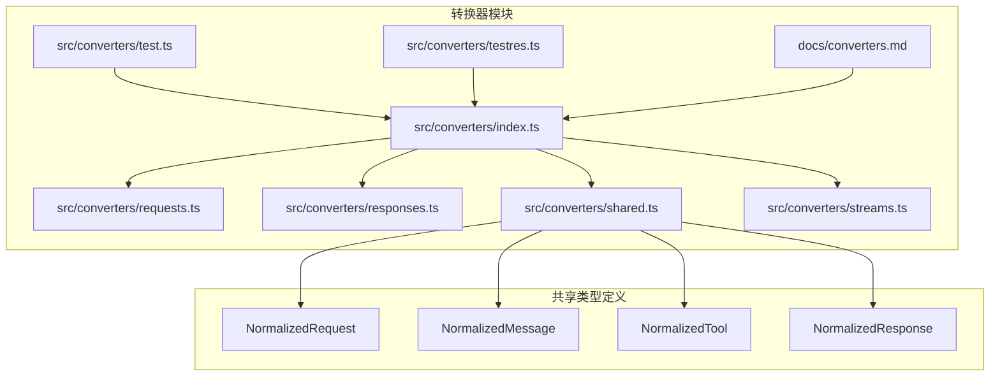
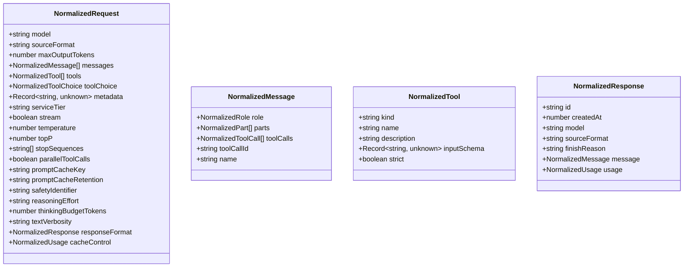
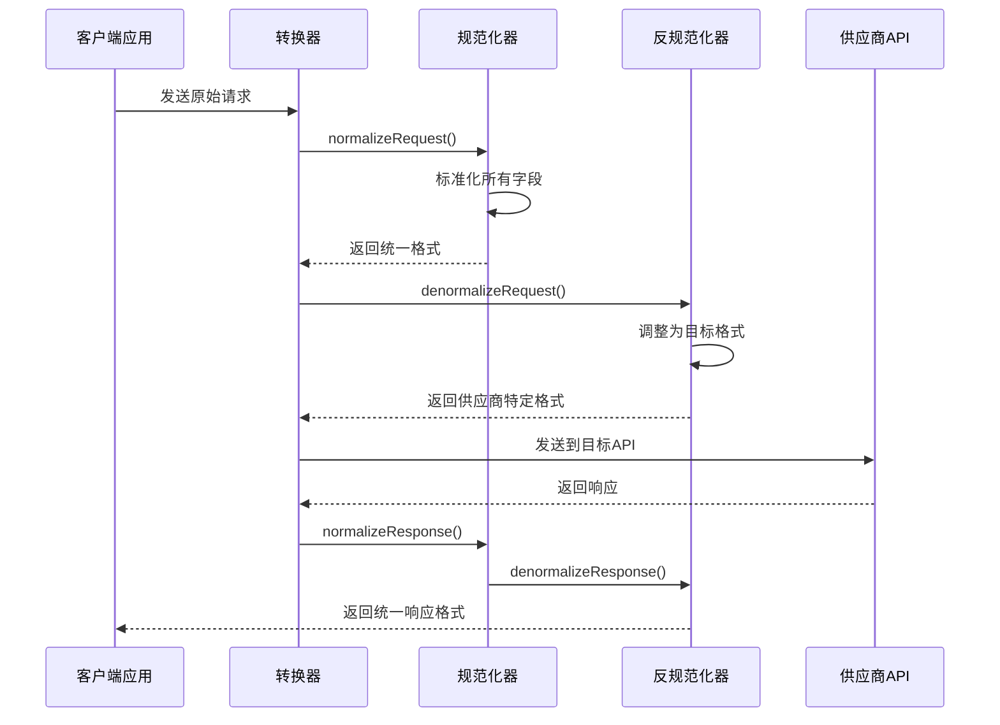
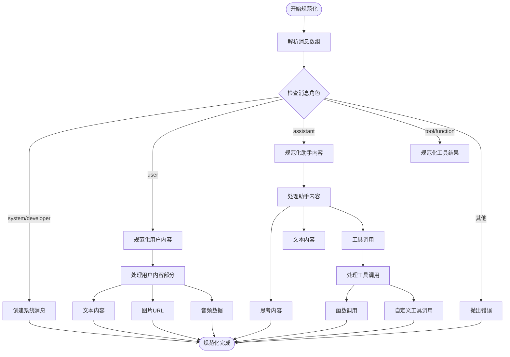
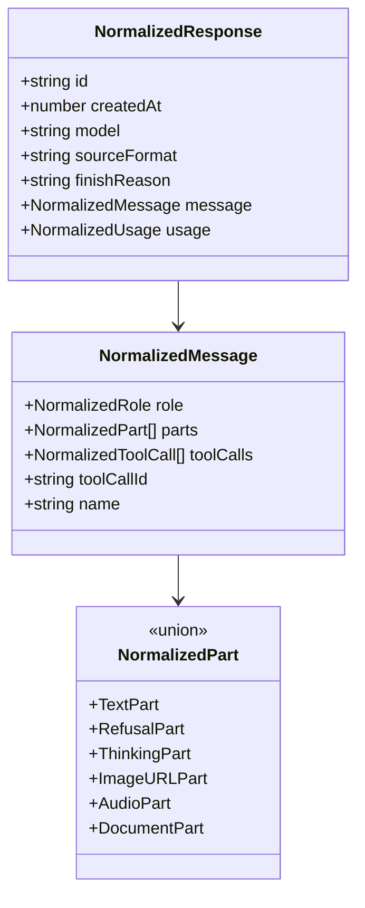
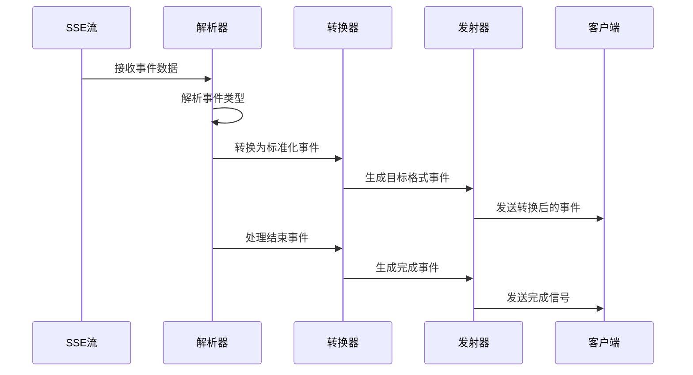

# 请求转换机制

<cite>
**本文档引用的文件**
- [src/converters/index.ts](file://src/converters/index.ts)
- [src/converters/requests.ts](file://src/converters/requests.ts)
- [src/converters/responses.ts](file://src/converters/responses.ts)
- [src/converters/shared.ts](file://src/converters/shared.ts)
- [src/converters/streams.ts](file://src/converters/streams.ts)
- [docs/converters.md](file://docs/converters.md)
</cite>

## 目录
1. [简介](#简介)
2. [项目结构](#项目结构)
3. [核心组件](#核心组件)
4. [架构概览](#架构概览)
5. [详细组件分析](#详细组件分析)
6. [依赖关系分析](#依赖关系分析)
7. [性能考虑](#性能考虑)
8. [故障排除指南](#故障排除指南)
9. [结论](#结论)

## 简介

请求转换机制是 nanollm 项目中的核心功能模块，负责在不同 AI 模型供应商之间进行请求和响应格式的标准化转换。该机制支持 OpenAI Chat API、OpenAI Responses API 和 Anthropic Messages API 之间的无缝转换，通过统一的中间表示层实现了跨平台的兼容性。

该系统采用"规范化-转换-反规范化"的设计模式，将来自不同供应商的请求参数转换为统一的内部格式，然后根据目标供应商的要求进行相应的格式调整。这种设计确保了应用程序可以透明地使用不同的 AI 服务提供商，而无需关心底层 API 差异。

## 项目结构

请求转换机制主要位于 `src/converters` 目录中，包含以下关键文件：



**图表来源**
- [src/converters/index.ts:1-99](file://src/converters/index.ts#L1-L99)
- [src/converters/shared.ts:1-385](file://src/converters/shared.ts#L1-L385)

**章节来源**
- [src/converters/index.ts:1-99](file://src/converters/index.ts#L1-L99)
- [src/converters/shared.ts:1-385](file://src/converters/shared.ts#L1-L385)

## 核心组件

### 统一中间表示层

系统的核心是统一的中间表示层，定义了标准化的数据结构：



**图表来源**
- [src/converters/shared.ts:63-109](file://src/convertfers/shared.ts#L63-L109)

### 转换函数接口

系统提供了完整的转换函数集合，支持双向转换：

| 转换方向 | 函数名称 | 描述 |
|---------|----------|------|
| OpenAI Chat ↔ OpenAI Responses | `chatParamsToResponsesRequest()` | 将 OpenAI Chat 参数转换为 Responses 请求 |
| OpenAI Chat ↔ Anthropic | `chatParamsToAnthropicMessageRequest()` | 将 OpenAI Chat 参数转换为 Anthropic 请求 |
| OpenAI Responses ↔ Anthropic | `responsesRequestToAnthropicMessageRequest()` | 在 Responses 和 Anthropic 之间转换 |

**章节来源**
- [src/converters/index.ts:27-53](file://src/converters/index.ts#L27-L53)

## 架构概览

请求转换机制采用分层架构设计，通过三个主要层次实现跨平台兼容：



**图表来源**
- [src/converters/index.ts:27-53](file://src/converters/index.ts#L27-L53)
- [src/converters/requests.ts:38-164](file://src/converters/requests.ts#L38-L164)

## 详细组件分析

### 请求规范化器

请求规范化器负责将不同供应商的请求参数转换为统一的内部格式：

#### OpenAI Chat 请求规范化

OpenAI Chat 请求规范化处理复杂的多模态内容和工具调用：



**图表来源**
- [src/converters/requests.ts:385-443](file://src/converters/requests.ts#L385-L443)
- [src/converters/requests.ts:441-449](file://src/converters/requests.ts#L441-L449)

#### OpenAI Responses 请求规范化

Responses API 的规范化处理历史记录和工具调用：

**章节来源**
- [src/converters/requests.ts:83-115](file://src/converters/requests.ts#L83-L115)
- [src/converters/requests.ts:471-508](file://src/converters/requests.ts#L471-L508)

#### Anthropic 请求规范化

Anthropic Messages API 的规范化处理独特的思维块和工具使用：

**章节来源**
- [src/converters/requests.ts:117-164](file://src/converters/requests.ts#L117-L164)
- [src/converters/requests.ts:596-644](file://src/converters/requests.ts#L596-L644)

### 响应规范化器

响应规范化器将不同供应商的响应转换为统一格式：



**图表来源**
- [src/converters/shared.ts:55-61](file://src/converters/shared.ts#L55-L61)
- [src/converters/shared.ts:20-28](file://src/converters/shared.ts#L20-L28)

**章节来源**
- [src/converters/responses.ts:26-108](file://src/converters/responses.ts#L26-L108)
- [src/converters/shared.ts:101-109](file://src/converters/shared.ts#L101-L109)

### 流式转换器

流式转换器处理实时数据流的转换：



**图表来源**
- [src/converters/streams.ts:1068-1097](file://src/converters/streams.ts#L1068-L1097)

**章节来源**
- [src/converters/streams.ts:118-1270](file://src/converters/streams.ts#L118-L1270)

## 依赖关系分析

请求转换机制的依赖关系呈现清晰的分层结构：

```mermaid
graph TB
subgraph "外部依赖"
A[@anthropic-ai/sdk]
B[openai]
C[typescript]
end
subgraph "内部模块"
D[index.ts]
E[requests.ts]
F[responses.ts]
G[shared.ts]
H[streams.ts]
end
subgraph "测试模块"
I[test.ts]
J[testres.ts]
end
A --> E
B --> E
C --> D
C --> E
C --> F
C --> G
C --> H
D --> E
D --> F
D --> G
D --> H
I --> D
J --> D
E --> G
F --> G
H --> G
```

**图表来源**
- [src/converters/shared.ts:1-8](file://src/converters/shared.ts#L1-L8)
- [src/converters/index.ts:1-26](file://src/converters/index.ts#L1-L26)

**章节来源**
- [src/converters/shared.ts:1-8](file://src/converters/shared.ts#L1-L8)
- [src/converters/index.ts:1-26](file://src/converters/index.ts#L1-L26)

## 性能考虑

请求转换机制在设计时充分考虑了性能优化：

### 内存管理
- 使用流式处理减少内存占用
- 批量处理消息以提高效率
- 避免不必要的对象复制

### 转换优化
- 缓存工具定义以避免重复解析
- 智能合并相邻消息以减少传输
- 条件处理避免不必要转换

### 错误处理
- 异常快速失败避免资源浪费
- 渐进式验证减少验证开销
- 错误恢复机制确保稳定性

## 故障排除指南

### 常见错误类型

#### 角色验证错误
当消息角色不在支持列表中时抛出异常：
- 支持的角色：system、developer、user、assistant、tool、function
- 不支持的角色会导致转换失败

#### 内容类型错误
当内容部分类型不受支持时：
- OpenAI Chat：仅支持 text、image_url、input_audio
- Anthropic：支持多种媒体类型但有严格限制
- OpenAI Responses：支持特定的输入输出格式

#### 工具调用错误
工具调用必须符合规范：
- 必须包含有效的工具名称
- 参数必须符合 JSON Schema
- 自定义工具需要正确的包装格式

**章节来源**
- [src/converters/requests.ts:396-400](file://src/converters/requests.ts#L396-L400)
- [src/converters/requests.ts:416-424](file://src/converters/requests.ts#L416-L424)

### 调试技巧

1. **启用详细日志**：检查转换过程中的中间状态
2. **验证输入格式**：确保输入符合各供应商的规范
3. **测试最小场景**：从简单的文本消息开始测试
4. **监控资源使用**：注意内存和 CPU 使用情况

## 结论

请求转换机制通过精心设计的规范化层和智能转换算法，成功实现了 OpenAI、OpenAI Responses 和 Anthropic 三大 AI 服务提供商之间的无缝互操作。该系统具有以下优势：

1. **高度兼容性**：支持多种供应商的请求和响应格式
2. **强类型安全**：通过 TypeScript 类型系统确保数据完整性
3. **性能优化**：采用流式处理和批量操作提升效率
4. **可扩展性**：模块化设计便于添加新的供应商支持
5. **错误处理**：完善的错误检测和恢复机制

该机制为构建跨平台 AI 应用程序提供了坚实的基础，使得开发者可以专注于业务逻辑而非底层 API 差异。随着新供应商的加入和现有功能的完善，该系统将继续演进以满足不断增长的需求。