# 转换器架构设计

<cite>
**本文档引用的文件**
- [src/converters/index.ts](file://src/converters/index.ts)
- [src/converters/requests.ts](file://src/converters/requests.ts)
- [src/converters/responses.ts](file://src/converters/responses.ts)
- [src/converters/shared.ts](file://src/converters/shared.ts)
- [src/converters/streams.ts](file://src/converters/streams.ts)
- [src/converters/test.ts](file://src/converters/test.ts)
- [src/converters/testres.ts](file://src/converters/testres.ts)
- [README.md](file://README.md)
</cite>

## 目录
1. [简介](#简介)
2. [项目结构](#项目结构)
3. [核心组件](#核心组件)
4. [架构概览](#架构概览)
5. [详细组件分析](#详细组件分析)
6. [依赖关系分析](#依赖关系分析)
7. [性能考虑](#性能考虑)
8. [故障排除指南](#故障排除指南)
9. [结论](#结论)

## 简介

转换器架构设计是nanollm项目中的核心模块，负责在不同的大模型供应商API之间进行标准化转换。该系统实现了统一的请求/响应格式，确保类型安全性和数据完整性，支持OpenAI Chat、OpenAI Responses和Anthropic Messages三种主要协议之间的无缝转换。

该架构采用"标准化中间格式"的设计理念，通过统一的数据结构来屏蔽不同供应商API的差异性，实现了高度的互操作性和类型安全性。

## 项目结构

转换器模块位于`src/converters/`目录下，包含以下核心文件：

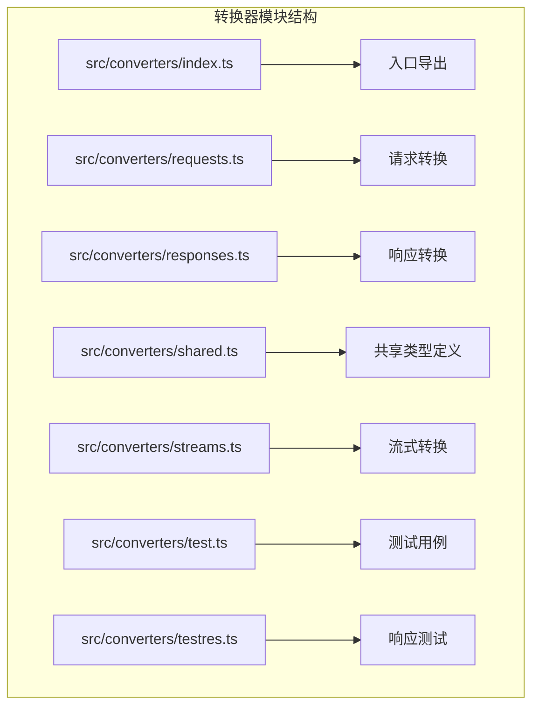

**图表来源**
- [src/converters/index.ts:1-99](file://src/converters/index.ts#L1-L99)
- [src/converters/requests.ts:1-800](file://src/converters/requests.ts#L1-L800)
- [src/converters/responses.ts:1-318](file://src/converters/responses.ts#L1-L318)
- [src/converters/shared.ts:1-385](file://src/converters/shared.ts#L1-L385)
- [src/converters/streams.ts:1-1270](file://src/converters/streams.ts#L1-L1270)

**章节来源**
- [src/converters/index.ts:1-99](file://src/converters/index.ts#L1-L99)
- [src/converters/requests.ts:1-800](file://src/converters/requests.ts#L1-L800)
- [src/converters/responses.ts:1-318](file://src/converters/responses.ts#L1-L318)
- [src/converters/shared.ts:1-385](file://src/converters/shared.ts#L1-L385)
- [src/converters/streams.ts:1-1270](file://src/converters/streams.ts#L1-L1270)

## 核心组件

### 标准化数据模型

转换器系统的核心是统一的标准化数据模型，定义了跨供应商通用的数据结构：

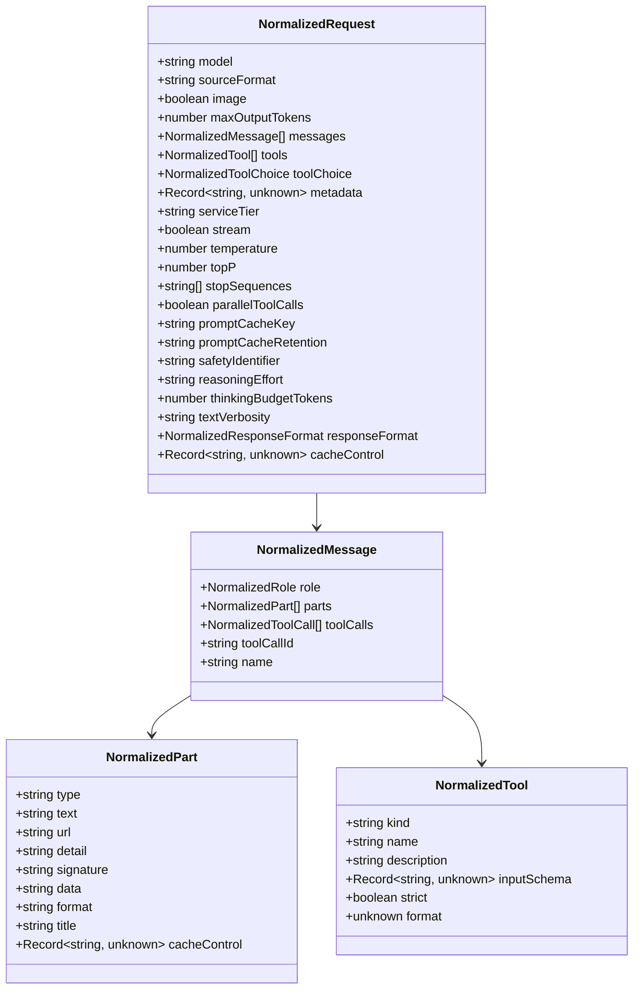

**图表来源**
- [src/converters/shared.ts:55-109](file://src/converters/shared.ts#L55-L109)

### 转换函数组织结构

系统提供了完整的转换函数集合，支持双向转换：

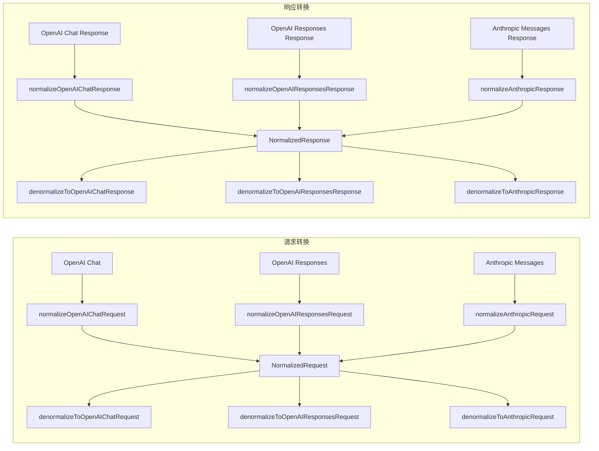

**图表来源**
- [src/converters/requests.ts:38-164](file://src/converters/requests.ts#L38-L164)
- [src/converters/responses.ts:26-162](file://src/converters/responses.ts#L26-L162)

**章节来源**
- [src/converters/shared.ts:18-109](file://src/converters/shared.ts#L18-L109)
- [src/converters/requests.ts:38-164](file://src/converters/requests.ts#L38-L164)
- [src/converters/responses.ts:26-162](file://src/converters/responses.ts#L26-L162)

## 架构概览

转换器系统采用分层架构设计，通过标准化中间格式实现不同模型供应商间的无缝转换：

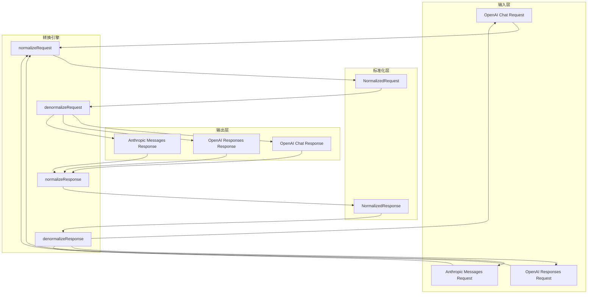

**图表来源**
- [src/converters/index.ts:27-77](file://src/converters/index.ts#L27-L77)
- [src/converters/requests.ts:38-164](file://src/converters/requests.ts#L38-L164)
- [src/converters/responses.ts:26-162](file://src/converters/responses.ts#L26-L162)

### 类型安全保证机制

系统通过严格的类型定义确保转换过程中的类型安全：

1. **编译时类型检查**：所有转换函数都有明确的输入输出类型定义
2. **运行时验证**：关键转换步骤包含数据验证和错误处理
3. **泛型约束**：使用TypeScript泛型确保类型一致性
4. **不可变数据结构**：转换后的数据结构保持不可变性

**章节来源**
- [src/converters/shared.ts:10-16](file://src/converters/shared.ts#L10-L16)
- [src/converters/shared.ts:111-150](file://src/converters/shared.ts#L111-L150)

## 详细组件分析

### 请求转换组件

请求转换组件负责将不同供应商的请求格式标准化为统一的中间格式：

#### OpenAI Chat请求转换

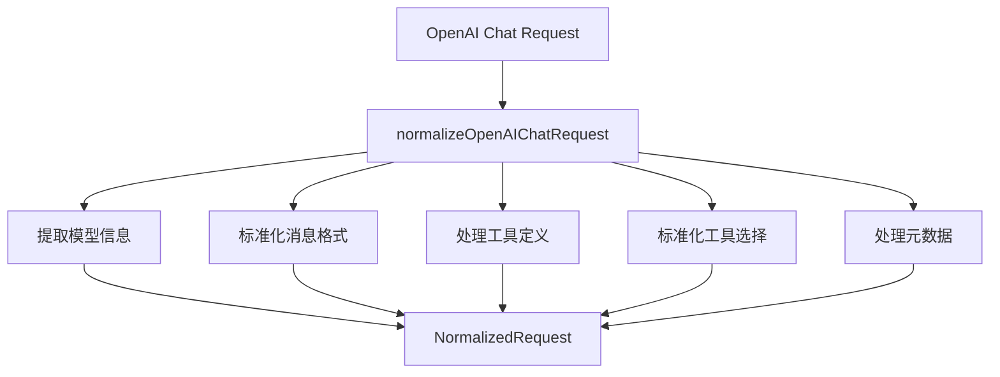

**图表来源**
- [src/converters/requests.ts:38-81](file://src/converters/requests.ts#L38-L81)

#### OpenAI Responses请求转换

OpenAI Responses协议的转换具有特殊性，因为它支持更丰富的多模态内容：

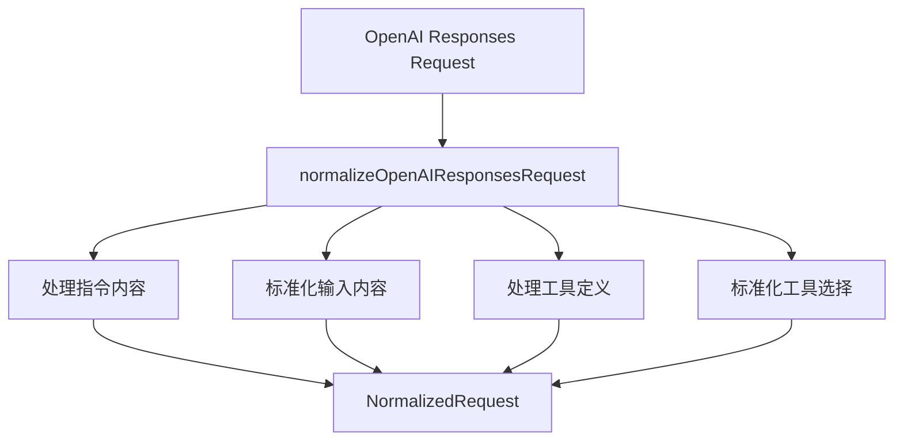

**图表来源**
- [src/converters/requests.ts:83-115](file://src/converters/requests.ts#L83-L115)

#### Anthropic Messages请求转换

Anthropic协议的转换需要特别处理思维过程和工具调用：

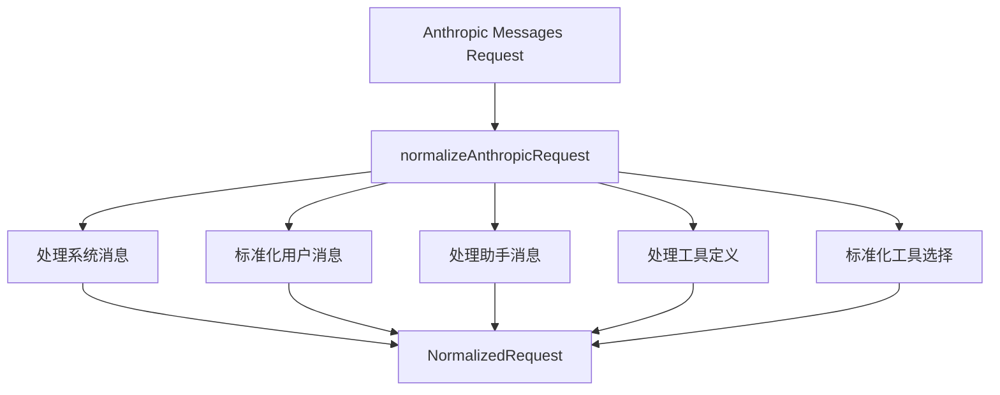

**图表来源**
- [src/converters/requests.ts:117-164](file://src/converters/requests.ts#L117-L164)

**章节来源**
- [src/converters/requests.ts:38-164](file://src/converters/requests.ts#L38-L164)

### 响应转换组件

响应转换组件负责将标准化的中间格式转换为不同供应商的响应格式：

#### OpenAI Chat响应转换

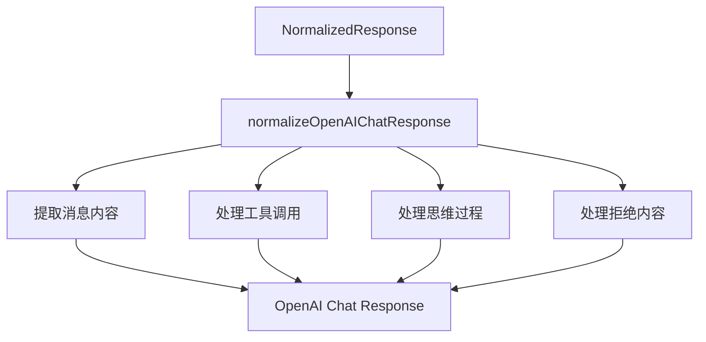

**图表来源**
- [src/converters/responses.ts:26-54](file://src/converters/responses.ts#L26-L54)

#### OpenAI Responses响应转换

OpenAI Responses协议的响应转换需要处理复杂的输出结构：

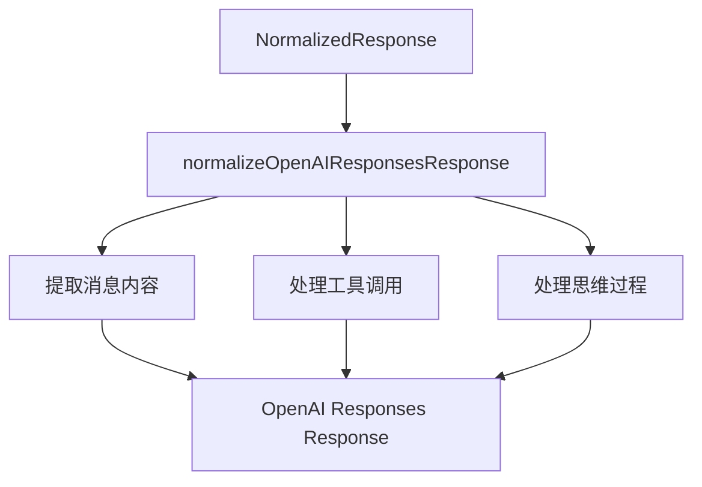

**图表来源**
- [src/converters/responses.ts:56-108](file://src/converters/responses.ts#L56-L108)

#### Anthropic Messages响应转换

Anthropic协议的响应转换需要特殊的思维过程处理：

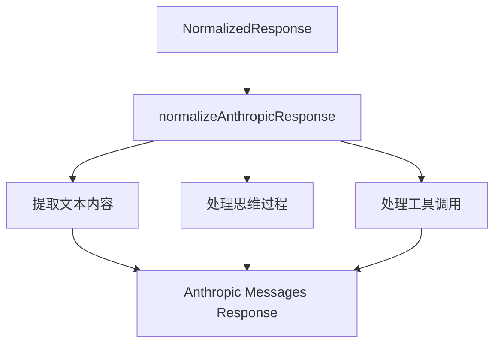

**图表来源**
- [src/converters/responses.ts:119-162](file://src/converters/responses.ts#L119-L162)

**章节来源**
- [src/converters/responses.ts:26-162](file://src/converters/responses.ts#L26-L162)

### 流式转换组件

流式转换组件处理实时数据流的转换，支持SSE事件格式：

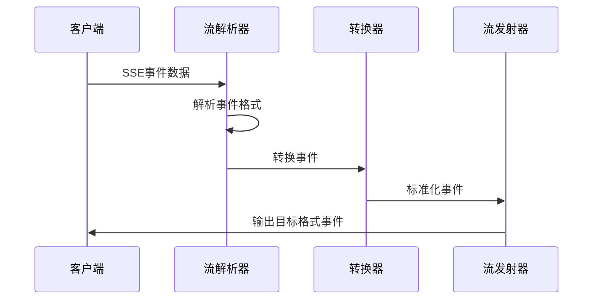

**图表来源**
- [src/converters/streams.ts:1068-1097](file://src/converters/streams.ts#L1068-L1097)

**章节来源**
- [src/converters/streams.ts:1-1270](file://src/converters/streams.ts#L1-L1270)

## 依赖关系分析

转换器系统的依赖关系呈现清晰的层次结构：

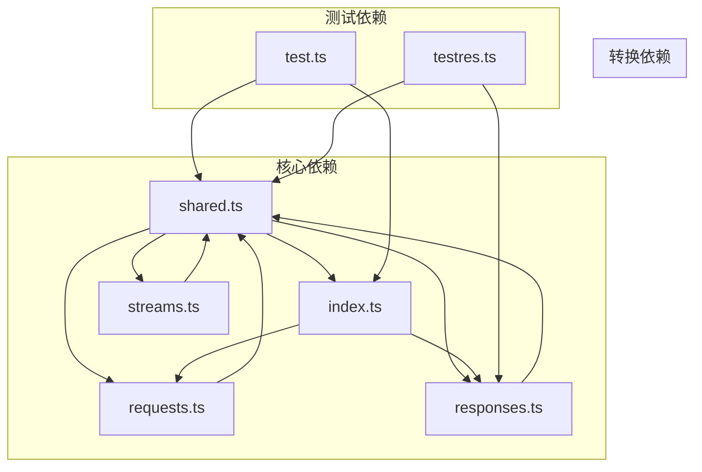

**图表来源**
- [src/converters/index.ts:1-26](file://src/converters/index.ts#L1-L26)
- [src/converters/shared.ts:1-16](file://src/converters/shared.ts#L1-L16)

### 关键依赖链

1. **类型定义依赖**：所有转换模块都依赖shared.ts中的类型定义
2. **转换函数依赖**：index.ts导出的转换函数依赖requests.ts和responses.ts中的具体实现
3. **流式处理依赖**：streams.ts依赖shared.ts中的类型定义和转换函数

**章节来源**
- [src/converters/index.ts:1-26](file://src/converters/index.ts#L1-L26)
- [src/converters/shared.ts:1-16](file://src/converters/shared.ts#L1-L16)

## 性能考虑

转换器系统在设计时充分考虑了性能优化：

### 内存效率
- 使用不可变数据结构减少内存分配
- 批量处理消息内容提高处理效率
- 智能缓存机制避免重复计算

### 处理速度
- 并行处理多个消息块
- 流式处理减少等待时间
- 智能队列管理优化处理流程

### 资源管理
- 及时释放临时资源
- 控制嵌套深度防止栈溢出
- 优化JSON序列化和反序列化

## 故障排除指南

### 常见转换错误

1. **类型不匹配错误**：检查输入数据是否符合预期格式
2. **工具调用错误**：验证工具定义和参数格式
3. **消息格式错误**：确认消息角色和内容类型正确

### 调试技巧

1. **启用详细日志**：查看转换过程中的中间状态
2. **单元测试**：使用现有测试用例验证转换逻辑
3. **边界条件测试**：测试极端情况下的转换行为

**章节来源**
- [src/converters/shared.ts:111-150](file://src/converters/shared.ts#L111-L150)
- [src/converters/test.ts:1-800](file://src/converters/test.ts#L1-L800)

## 结论

转换器架构设计通过标准化中间格式成功解决了多模型供应商API之间的兼容性问题。该系统具有以下优势：

1. **类型安全**：通过严格的类型定义确保转换过程的可靠性
2. **扩展性强**：新的供应商协议可以通过添加新的转换函数轻松集成
3. **性能优异**：优化的算法和数据结构确保高效的转换处理
4. **维护友好**：清晰的代码结构和完善的测试覆盖便于长期维护

该架构为构建高性能、可扩展的大模型代理服务奠定了坚实的基础，能够有效支持各种复杂的转换需求。