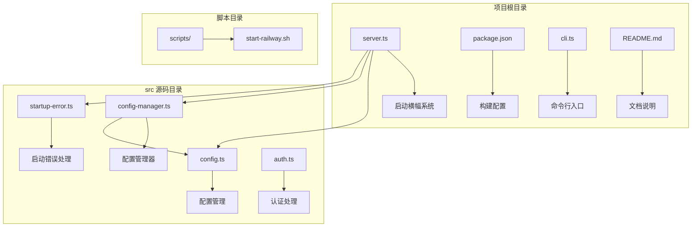
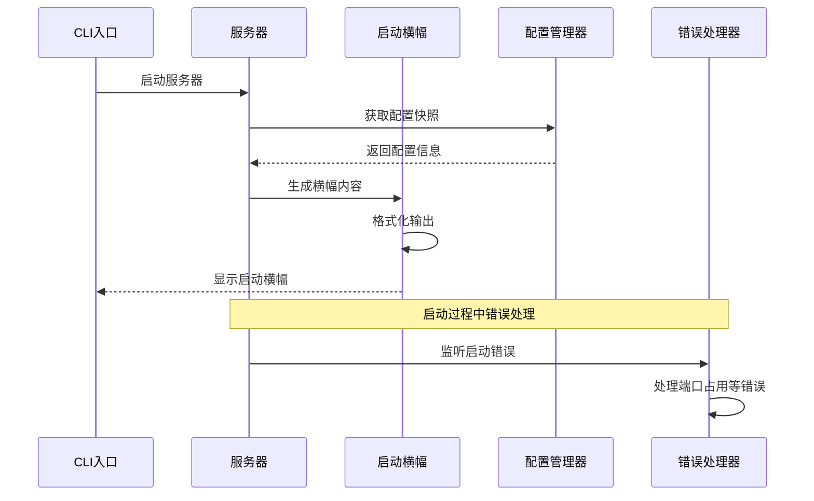
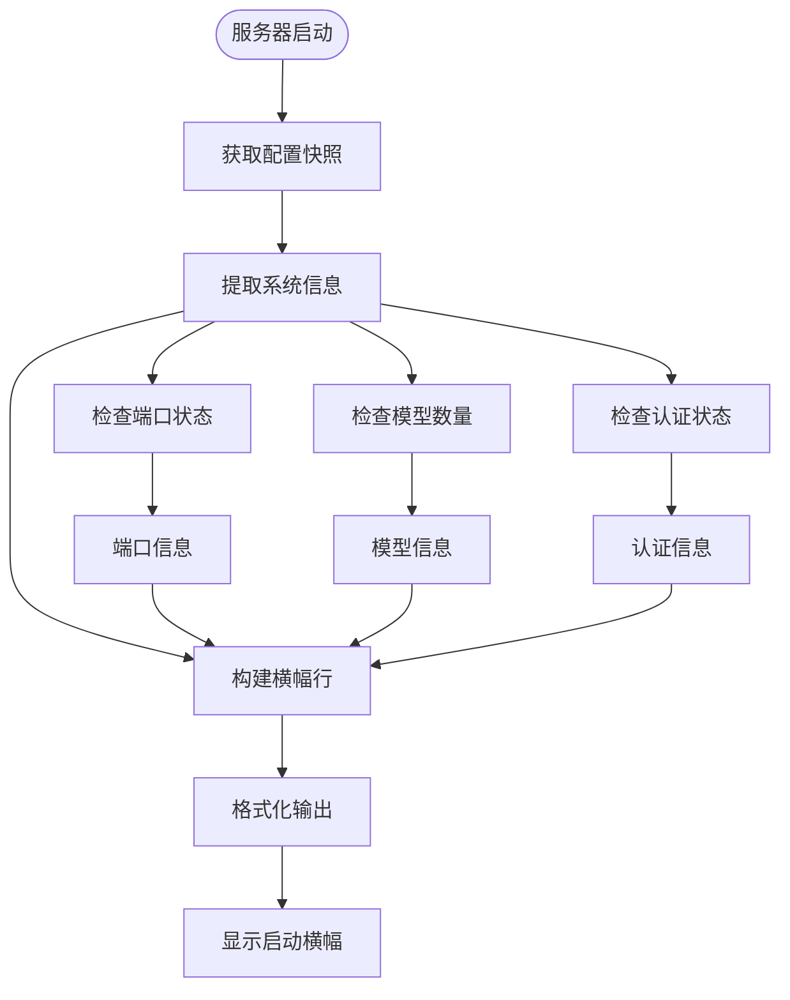
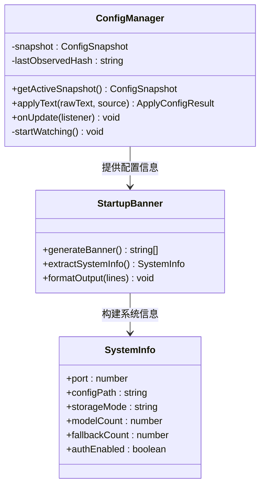
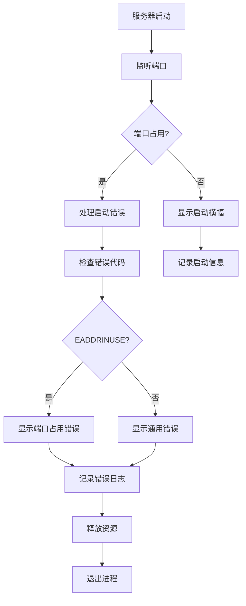
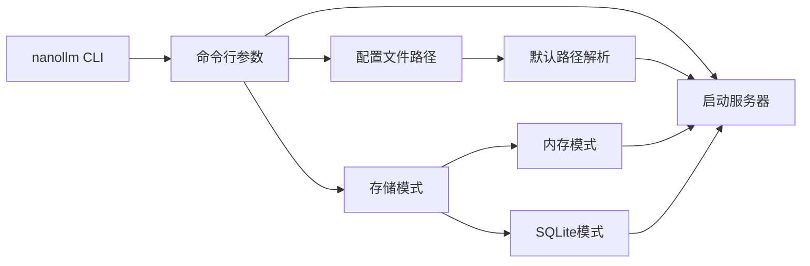
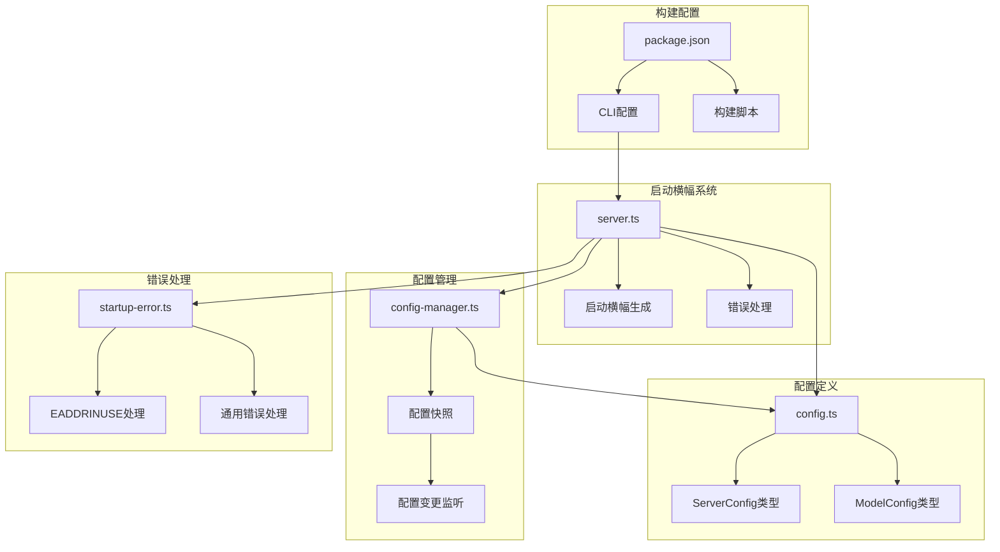

# 启动横幅系统

<cite>
**本文档引用的文件**
- [server.ts](file://server.ts)
- [startup-error.ts](file://src/startup-error.ts)
- [config-manager.ts](file://src/config-manager.ts)
- [config.ts](file://src/config.ts)
- [package.json](file://package.json)
- [cli.ts](file://cli.ts)
- [README.md](file://README.md)
- [start-railway.sh](file://scripts/start-railway.sh)
</cite>

## 目录
1. [简介](#简介)
2. [项目结构](#项目结构)
3. [核心组件](#核心组件)
4. [架构概览](#架构概览)
5. [详细组件分析](#详细组件分析)
6. [依赖关系分析](#依赖关系分析)
7. [性能考虑](#性能考虑)
8. [故障排除指南](#故障排除指南)
9. [结论](#结论)

## 简介

启动横幅系统是 nanollm 项目中的一个重要功能模块，负责在服务器启动时向用户展示详细的启动信息和系统状态。该系统提供了直观的启动横幅，包含了服务器配置、模型信息、认证状态等关键信息，帮助用户快速了解系统的运行状态。

nanollm 是一个类似 litellm 的 LLM 模型代理服务，主打轻量化和本地化，适合个人本地聚合多个模型的场景。启动横幅系统作为用户体验的重要组成部分，确保用户能够清晰地看到系统的启动状态和配置信息。

## 项目结构

该项目采用模块化的 TypeScript 架构，主要文件组织如下：

**图表来源**
- [server.ts:1352-1393](file://server.ts#L1352-L1393)
- [config-manager.ts:1-173](file://src/config-manager.ts#L1-173)
- [config.ts:1-307](file://src/config.ts#L1-L307)

**章节来源**
- [server.ts:1-1394](file://server.ts#L1-L1394)
- [package.json:1-48](file://package.json#L1-L48)

## 核心组件

启动横幅系统由以下几个核心组件构成：

### 1. 启动横幅生成器
负责创建和格式化启动时显示的横幅信息，包含服务器状态、配置详情、模型信息等。

### 2. 配置管理器
监控配置文件变化，提供实时的配置状态信息，支持热重载功能。

### 3. 错误处理机制
处理启动过程中的各种错误情况，特别是端口占用等常见问题。

### 4. CLI 入口点
提供命令行界面，支持不同的启动模式和配置选项。

**章节来源**
- [server.ts:1354-1378](file://server.ts#L1354-L1378)
- [config-manager.ts:58-75](file://src/config-manager.ts#L58-L75)
- [startup-error.ts:1-23](file://src/startup-error.ts#L1-L23)

## 架构概览

启动横幅系统采用事件驱动的架构模式，在服务器启动完成后触发横幅显示：

**图表来源**
- [server.ts:1354-1385](file://server.ts#L1354-L1385)
- [config-manager.ts:139-144](file://src/config-manager.ts#L139-L144)

## 详细组件分析

### 启动横幅生成器

启动横幅生成器位于服务器文件的最后部分，负责创建详细的启动信息：

**图表来源**
- [server.ts:1361-1377](file://server.ts#L1361-L1377)

启动横幅包含以下关键信息：
- 服务器监听地址和端口
- 配置文件路径和来源
- 存储模式（内存/SQLite）
- 模型配置详情
- 认证状态
- 快速访问链接

### 配置管理器集成

配置管理器与启动横幅系统紧密集成，提供实时的配置状态：

**图表来源**
- [config-manager.ts:58-75](file://src/config-manager.ts#L58-L75)
- [server.ts:1354-1378](file://server.ts#L1354-L1378)

### 错误处理机制

启动横幅系统集成了完整的错误处理机制，特别是针对端口占用等常见启动问题：

**图表来源**
- [server.ts:1380-1385](file://server.ts#L1380-L1385)
- [startup-error.ts:13-22](file://src/startup-error.ts#L13-L22)

**章节来源**
- [server.ts:1354-1393](file://server.ts#L1354-L1393)
- [startup-error.ts:1-23](file://src/startup-error.ts#L1-L23)

### CLI 入口点

CLI 入口点提供了灵活的启动方式，支持不同的配置参数：

**图表来源**
- [cli.ts:1-5](file://cli.ts#L1-L5)
- [server.ts:59-92](file://server.ts#L59-L92)

**章节来源**
- [cli.ts:1-5](file://cli.ts#L1-L5)
- [server.ts:59-113](file://server.ts#L59-L113)

## 依赖关系分析

启动横幅系统与其他组件的依赖关系如下：

**图表来源**
- [server.ts:1354-1393](file://server.ts#L1354-L1393)
- [config-manager.ts:58-75](file://src/config-manager.ts#L58-L75)
- [config.ts:24-35](file://src/config.ts#L24-L35)
- [startup-error.ts:1-23](file://src/startup-error.ts#L1-L23)

**章节来源**
- [server.ts:1-1394](file://server.ts#L1-L1394)
- [config-manager.ts:1-173](file://src/config-manager.ts#L1-L173)
- [config.ts:1-307](file://src/config.ts#L1-L307)

## 性能考虑

启动横幅系统在设计时考虑了以下性能因素：

1. **延迟最小化**: 横幅生成在服务器启动完成后立即执行，不影响请求处理性能
2. **内存效率**: 使用字符串数组构建横幅，避免复杂的对象操作
3. **异步处理**: 错误处理采用异步模式，不阻塞主程序流程
4. **资源清理**: 正确的资源清理机制，防止内存泄漏

## 故障排除指南

### 常见启动问题

1. **端口占用错误**
   - 症状: "Failed to start nanollm: port X is already in use."
   - 解决方案: 更改配置文件中的端口号或停止占用端口的进程

2. **配置文件错误**
   - 症状: 启动时显示配置解析错误
   - 解决方案: 检查 YAML 格式和语法，确保配置文件正确

3. **权限问题**
   - 症状: 启动失败或权限不足
   - 解决方案: 确保有足够的文件系统权限

**章节来源**
- [startup-error.ts:13-18](file://src/startup-error.ts#L13-L18)
- [server.ts:1380-1385](file://server.ts#L1380-L1385)

## 结论

启动横幅系统作为 nanollm 项目的重要组成部分，提供了直观、详细的系统启动信息展示。通过精心设计的架构和错误处理机制，该系统确保了良好的用户体验和可靠的系统监控能力。

系统的主要优势包括：
- 清晰的启动信息展示
- 实时的配置状态更新
- 完善的错误处理机制
- 灵活的配置管理
- 良好的性能表现

启动横幅系统不仅为用户提供了系统状态的即时反馈，也为开发者提供了调试和监控的重要工具，是整个 nanollm 生态系统中不可或缺的一环。