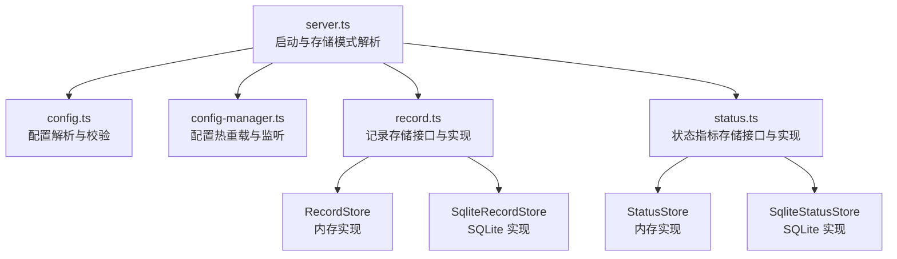
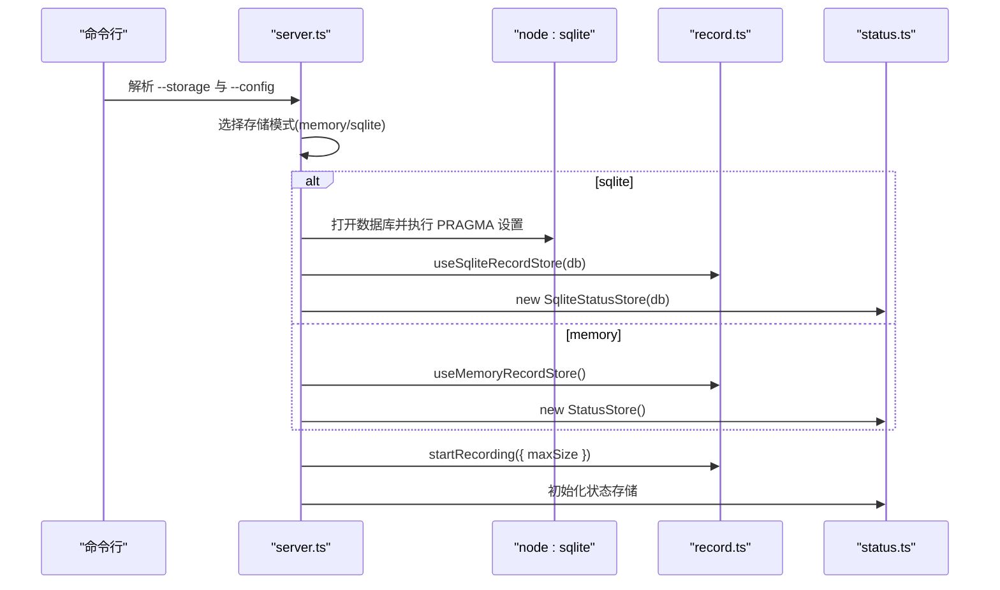
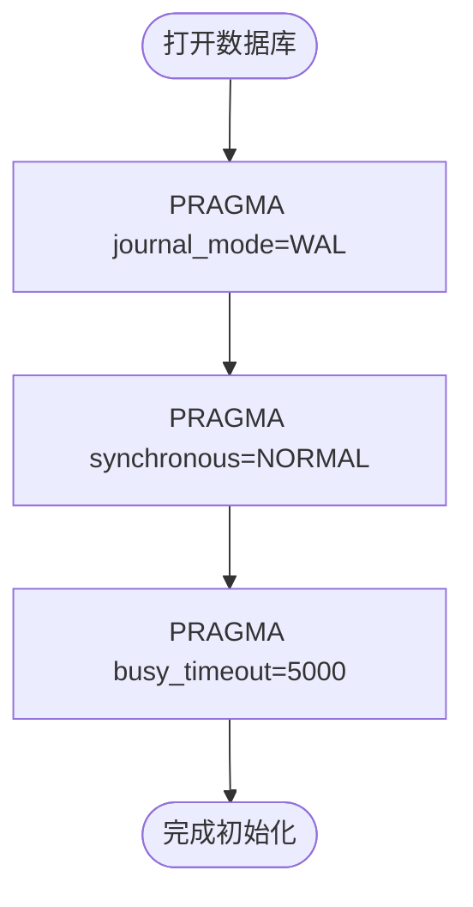
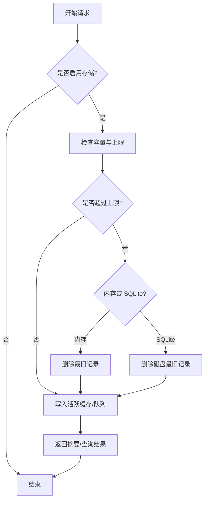
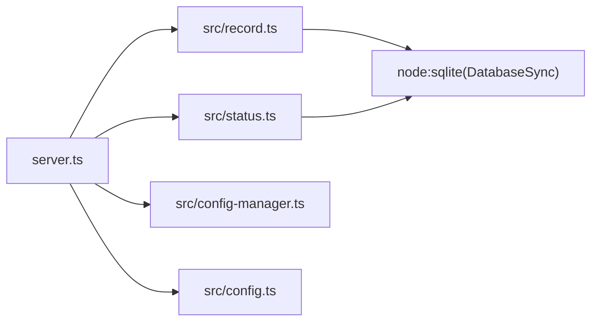

# 存储配置

<cite>
**本文档引用的文件**
- [server.ts](file://server.ts)
- [config.ts](file://src/config.ts)
- [config-manager.ts](file://src/config-manager.ts)
- [record.ts](file://src/record.ts)
- [status.ts](file://src/status.ts)
- [package.json](file://package.json)
</cite>

## 目录
1. [简介](#简介)
2. [项目结构](#项目结构)
3. [核心组件](#核心组件)
4. [架构总览](#架构总览)
5. [详细组件分析](#详细组件分析)
6. [依赖分析](#依赖分析)
7. [性能考虑](#性能考虑)
8. [故障排查指南](#故障排查指南)
9. [结论](#结论)
10. [附录](#附录)

## 简介
本文件聚焦于系统的存储配置与持久化策略，涵盖以下主题：
- SQLite 数据库的配置参数（事务模式、同步级别、超时等）
- 连接池与并发访问的处理方式
- 性能调优选项（WAL 模式、批量提交、索引）
- 数据持久化策略（内存与 SQLite 的选择依据）
- 存储空间管理（最大容量、淘汰机制、清理策略）
- 备份与恢复建议
- 数据迁移与版本升级的兼容性处理
- 存储性能监控与容量规划最佳实践

## 项目结构
与存储配置直接相关的模块分布如下：
- 启动与存储模式解析：server.ts
- 配置解析与热重载：config.ts、config-manager.ts
- 记录存储（内存/SQLite）：record.ts
- 状态指标存储（内存/SQLite）：status.ts

**图表来源**
- [server.ts:88-124](file://server.ts#L88-L124)
- [config.ts:202-230](file://src/config.ts#L202-L230)
- [config-manager.ts:58-75](file://src/config-manager.ts#L58-L75)
- [record.ts:185-210](file://src/record.ts#L185-L210)
- [status.ts:84-100](file://src/status.ts#L84-L100)

**章节来源**
- [server.ts:88-124](file://server.ts#L88-L124)
- [config.ts:202-230](file://src/config.ts#L202-L230)
- [config-manager.ts:58-75](file://src/config-manager.ts#L58-L75)
- [record.ts:185-210](file://src/record.ts#L185-L210)
- [status.ts:84-100](file://src/status.ts#L84-L100)

## 核心组件
- 存储模式选择
  - 支持内存与 SQLite 两种模式，通过命令行参数选择，默认内存模式。
  - SQLite 路径位于用户主目录下的专用子目录中。
- 记录存储
  - 提供统一接口，支持内存版与 SQLite 版，二者共享相同的 API。
  - 内存版适合临时调试或小规模运行；SQLite 版适合需要持久化与重启后可恢复的场景。
- 状态指标存储
  - 提供请求成功率、TTFB、时延、流式速率等指标的聚合与查询。
  - 同样提供内存版与 SQLite 版，便于在不同部署形态间切换。

**章节来源**
- [server.ts:88-124](file://server.ts#L88-L124)
- [record.ts:859-870](file://src/record.ts#L859-L870)
- [status.ts:227-249](file://src/status.ts#L227-L249)

## 架构总览
系统在启动阶段根据存储模式初始化相应的存储实现，并将记录与状态写入对应介质。配置热重载不会影响已启用的存储模式，但会动态调整记录上限等参数。

**图表来源**
- [server.ts:88-124](file://server.ts#L88-L124)
- [record.ts:866-869](file://src/record.ts#L866-L869)
- [status.ts:227-249](file://src/status.ts#L227-L249)

## 详细组件分析

### SQLite 数据库配置参数
- 事务与日志模式
  - 使用 WAL 模式提升并发读写性能，降低锁竞争。
- 同步级别
  - 设置为 NORMAL，平衡可靠性与性能。
- 并发与阻塞
  - 设置忙等待超时，避免因锁冲突导致的立即失败。
- 建表与索引
  - 记录表与状态表均建立必要索引，保障查询效率。

**图表来源**
- [server.ts:109-124](file://server.ts#L109-L124)

**章节来源**
- [server.ts:109-124](file://server.ts#L109-L124)

### 连接池设置与并发访问
- 当前实现
  - 使用 node:sqlite 的同步接口，每个进程内维护单一数据库连接。
  - 通过 BEGIN IMMEDIATE 包裹批量写入，确保原子性与一致性。
- 并发注意事项
  - 在高并发场景下，WAL 模式可显著改善读写并发；仍需注意避免长时间持有事务。
  - flush 采用微任务队列异步提交，减少主线程阻塞。

**章节来源**
- [record.ts:583-597](file://src/record.ts#L583-L597)

### 性能调优选项
- WAL 模式
  - 适用于多读少写的场景，提高吞吐量。
- 同步级别
  - NORMAL 在可靠性与性能之间取得平衡；如对数据安全要求极高可考虑 EXTRA。
- 忙等待超时
  - 适度的超时可避免频繁失败，提升稳定性。
- 批量提交
  - flush 将多个记录合并为一次事务提交，减少磁盘写放大。

**章节来源**
- [server.ts:114-118](file://server.ts#L114-L118)
- [record.ts:583-597](file://src/record.ts#L583-L597)

### 数据持久化策略：内存 vs 磁盘
- 内存存储
  - 优点：低延迟、零磁盘 IO、易清理。
  - 适用：开发调试、短期运行、资源受限环境。
- SQLite 存储
  - 优点：持久化、可跨进程/重启恢复、结构化查询。
  - 适用：生产环境、需要审计与回溯的场景。
- 切换机制
  - 通过命令行参数在启动时选择；运行中可通过 API 切换存储实现。

**章节来源**
- [server.ts:88-107](file://server.ts#L88-L107)
- [record.ts:859-870](file://src/record.ts#L859-L870)
- [status.ts:227-249](file://src/status.ts#L227-L249)

### 存储空间管理
- 最大容量限制
  - 通过记录上限控制内存与磁盘占用，超出时按“最老优先”策略淘汰。
- 淘汰策略
  - 对于 SQLite 实现，优先淘汰磁盘中的旧记录；内存实现则直接删除。
- 清理与修剪
  - 启动与配置变更时自动修剪至新上限。
- 查询与展示
  - 提供摘要接口，返回最近若干条记录，便于前端展示与检索。

**图表来源**
- [record.ts:192-209](file://src/record.ts#L192-L209)
- [record.ts:486-506](file://src/record.ts#L486-L506)
- [record.ts:607-613](file://src/record.ts#L607-L613)

**章节来源**
- [record.ts:192-209](file://src/record.ts#L192-L209)
- [record.ts:486-506](file://src/record.ts#L486-L506)
- [record.ts:607-613](file://src/record.ts#L607-L613)

### 备份与恢复方案
- 备份
  - 直接复制 SQLite 文件即可进行物理备份。
  - 建议在停机窗口或空闲时段执行，避免 WAL 日志滚动带来的不一致。
- 恢复
  - 将备份文件替换到原路径，重启服务后即可恢复。
- 注意事项
  - 确保服务停止后再替换文件，避免并发写入导致损坏。
  - 恢复后验证记录完整性与查询功能。

**章节来源**
- [server.ts:109-124](file://server.ts#L109-L124)

### 数据迁移与版本升级的兼容性处理
- 配置热重载
  - 支持在不重启服务的情况下应用部分配置变更，如记录上限、模型与回退组等。
  - 对于需要重启才能生效的字段（如端口），系统会标记并提示。
- 存储层兼容
  - 记录与状态存储接口保持稳定，新增字段通常向后兼容。
  - 如需破坏性变更，建议通过迁移脚本或双写过渡期处理。
- 建议流程
  - 升级前备份数据库与配置文件。
  - 先在测试环境验证升级包与配置变更。
  - 分批发布，观察健康指标与错误率。

**章节来源**
- [config-manager.ts:81-131](file://src/config-manager.ts#L81-L131)
- [config-manager.ts:44-49](file://src/config-manager.ts#L44-L49)

## 依赖分析
- node:sqlite
  - 提供同步接口用于数据库操作，简化并发模型。
- Hono 与 Undici
  - 作为 HTTP 服务器与上游代理，间接影响存储压力（请求量与响应体大小）。
- dotenv、yaml
  - 用于加载环境变量与解析配置文件。

**图表来源**
- [server.ts:1-55](file://server.ts#L1-L55)
- [record.ts:1-10](file://src/record.ts#L1-L10)
- [status.ts:1-6](file://src/status.ts#L1-L6)

**章节来源**
- [package.json:32-41](file://package.json#L32-L41)
- [server.ts:1-55](file://server.ts#L1-L55)

## 性能考虑
- 事务批处理
  - flush 使用微任务队列异步提交，减少主线程阻塞。
- 索引与查询
  - 记录与状态表均建立索引，查询与排序更高效。
- 容量控制
  - 严格的上限与淘汰策略避免内存/磁盘膨胀。
- 监控指标
  - 成功/失败率、平均时延、TTFB、流式速率等，便于容量规划与性能调优。

**章节来源**
- [record.ts:574-597](file://src/record.ts#L574-L597)
- [status.ts:227-249](file://src/status.ts#L227-L249)

## 故障排查指南
- SQLite 初始化失败
  - 可能原因：Node.js 版本不支持 node:sqlite 或权限不足。
  - 处理：降级为内存模式或升级运行环境。
- 记录丢失或不完整
  - 检查 flush 是否正常触发，确认未提前退出导致未落盘。
- 配置热重载异常
  - 查看配置管理器的错误快照与时间戳，定位具体字段与来源。

**章节来源**
- [server.ts:120-124](file://server.ts#L120-L124)
- [config-manager.ts:116-130](file://src/config-manager.ts#L116-L130)

## 结论
本系统提供了灵活的存储配置能力：既可在内存中快速迭代，也可在 SQLite 中实现持久化与跨重启恢复。通过 WAL 模式、批量提交与容量控制等手段，在性能与可靠性之间取得良好平衡。配合完善的监控指标与热重载机制，能够满足从开发到生产的多样化需求。

## 附录
- 命令行参数
  - --storage：选择存储模式（memory/sqlite）
  - --config：指定配置文件路径
- 默认行为
  - 未指定时默认使用内存模式，SQLite 数据库存放于用户主目录的专用子目录中。

**章节来源**
- [server.ts:59-107](file://server.ts#L59-L107)