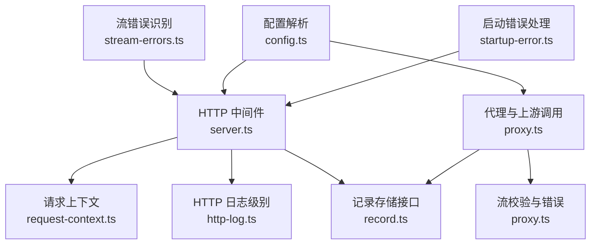
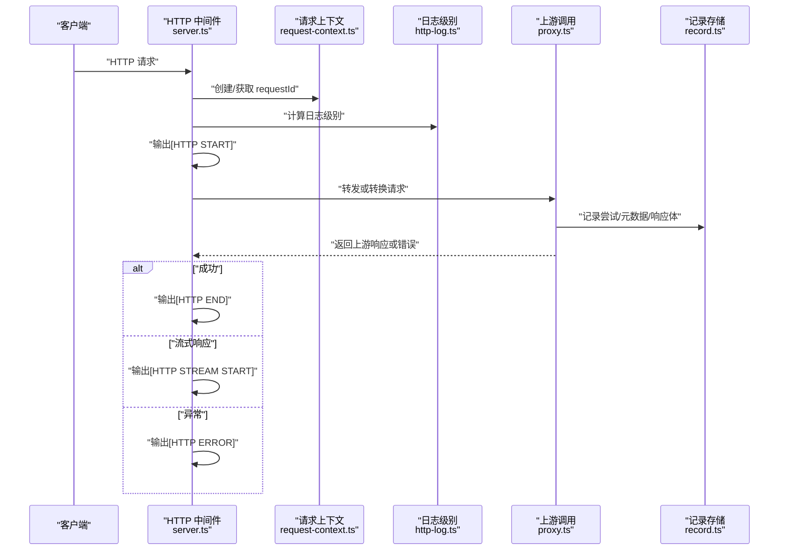
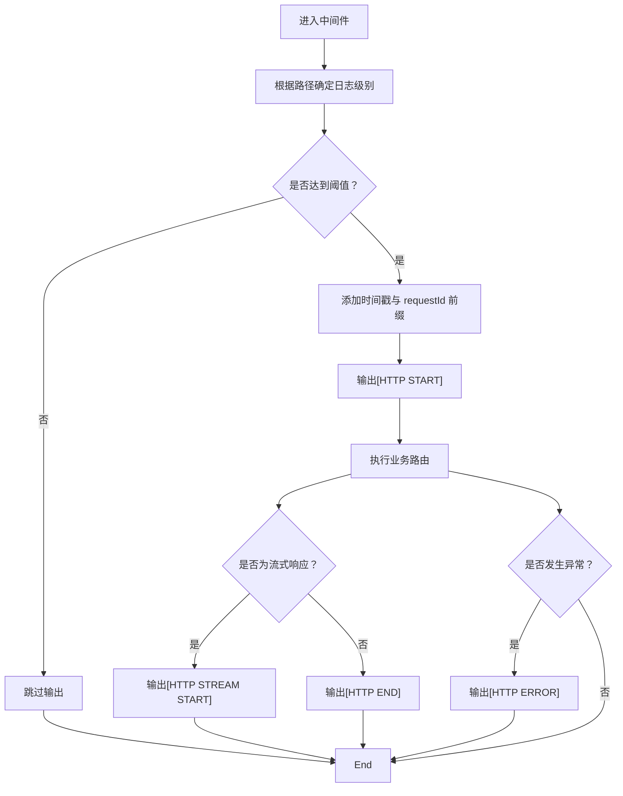
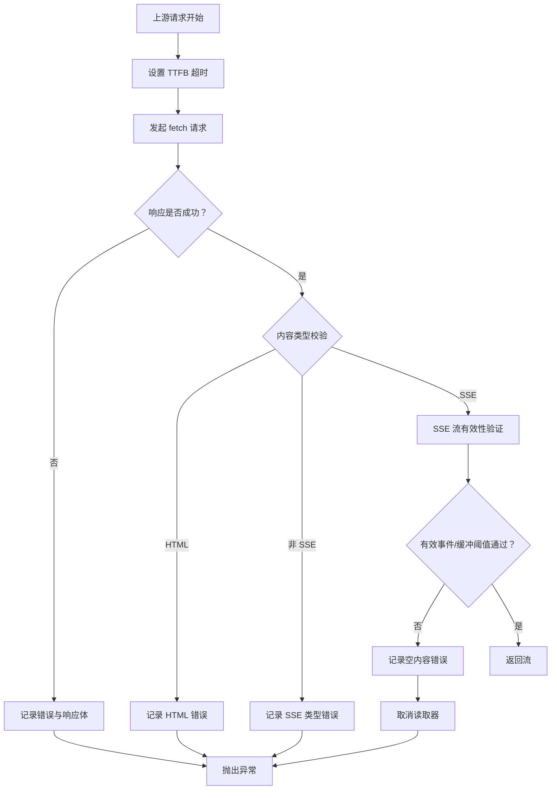
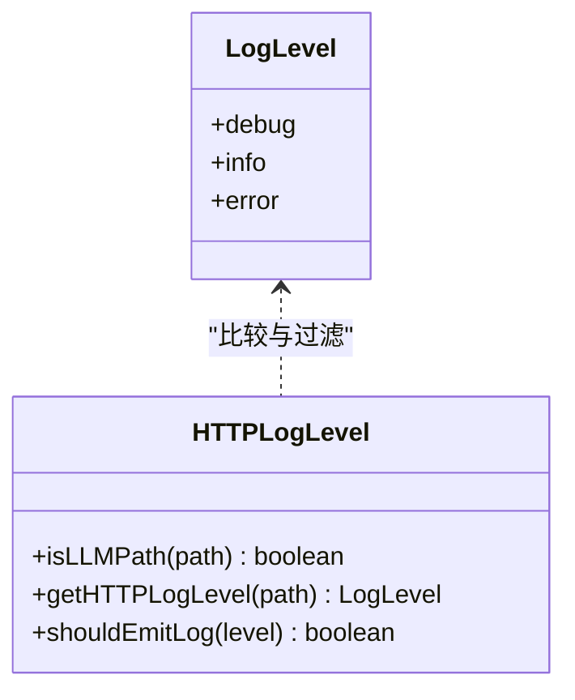
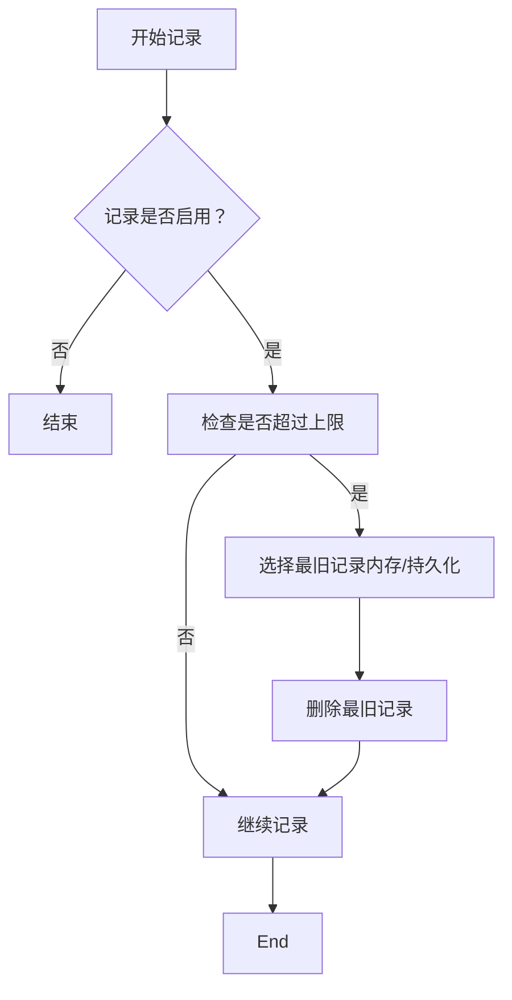
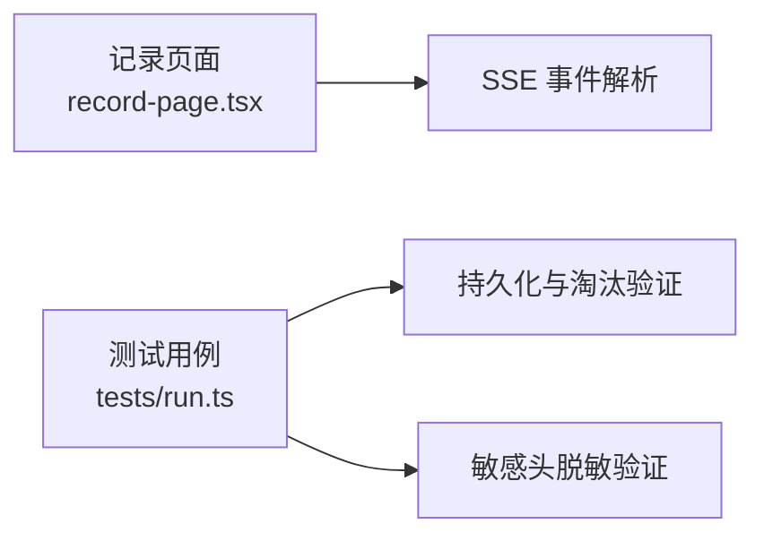
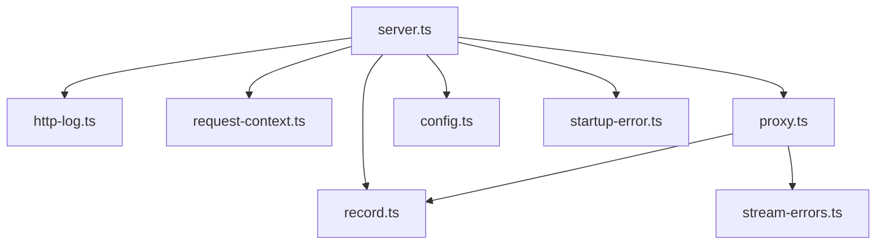

# 日志系统

<cite>
**本文档引用的文件**
- [server.ts](file://server.ts)
- [http-log.ts](file://src/http-log.ts)
- [request-context.ts](file://src/request-context.ts)
- [record.ts](file://src/record.ts)
- [proxy.ts](file://src/proxy.ts)
- [stream-errors.ts](file://src/stream-errors.ts)
- [config.ts](file://src/config.ts)
- [startup-error.ts](file://src/startup-error.ts)
- [record-page.tsx](file://src/record-page.tsx)
- [tests/run.ts](file://tests/run.ts)
</cite>

## 目录
1. [简介](#简介)
2. [项目结构](#项目结构)
3. [核心组件](#核心组件)
4. [架构总览](#架构总览)
5. [详细组件分析](#详细组件分析)
6. [依赖关系分析](#依赖关系分析)
7. [性能考量](#性能考量)
8. [故障排查指南](#故障排查指南)
9. [结论](#结论)
10. [附录](#附录)

## 简介
本文件面向日志系统，围绕以下目标展开：HTTP 请求日志的生成规则与格式、流式错误处理机制（连接中断、超时、重试策略）、日志级别分类与过滤、日志轮转与清理策略（大小限制与时间保留）、日志分析工具与常见模式解读，以及性能影响与优化建议。文档基于仓库中的实际实现进行梳理，并通过图示帮助读者快速理解。

## 项目结构
日志系统由多模块协同组成：
- HTTP 层日志与请求上下文：在中间件中按路径与级别输出请求开始、结束、错误等日志，并注入 requestId 以便串联请求全链路。
- 记录存储：统一记录客户端请求、上游尝试、响应元数据与错误信息，支持内存与 SQLite 存储两种模式。
- 上游代理与流校验：在上游调用过程中进行超时控制、内容类型校验、SSE 流有效性验证，并将异常写入记录。
- 错误处理：对流读取错误进行识别与忽略策略，避免非关键状态导致的噪音日志。
- 配置与启动：通过环境变量与配置文件控制日志级别、TTFB 超时、记录上限等参数；启动失败时输出可诊断信息。

**图表来源**
- [server.ts:153-178](file://server.ts#L153-L178)
- [request-context.ts:1-48](file://src/request-context.ts#L1-L48)
- [http-log.ts:1-27](file://src/http-log.ts#L1-L27)
- [record.ts:185-408](file://src/record.ts#L185-L408)
- [proxy.ts:278-407](file://src/proxy.ts#L278-L407)
- [stream-errors.ts:1-16](file://src/stream-errors.ts#L1-L16)
- [config.ts:1-307](file://src/config.ts#L1-L307)
- [startup-error.ts:1-23](file://src/startup-error.ts#L1-L23)

**章节来源**
- [server.ts:153-178](file://server.ts#L153-L178)
- [config.ts:1-307](file://src/config.ts#L1-L307)

## 核心组件
- HTTP 日志与级别控制：根据路径前缀决定日志级别，结合环境变量 LOG_LEVEL 进行过滤。
- 请求上下文与时间戳：为每条请求生成 requestId 并格式化时间戳，用于日志消息前缀。
- 记录存储：记录客户端请求、上游尝试、响应元数据、错误信息，支持内存与 SQLite 模式，具备容量限制与淘汰策略。
- 上游调用与流校验：执行上游请求、设置 TTFB 超时、校验响应内容类型、验证 SSE 流有效性。
- 流错误处理：识别特定“释放读取器”错误并允许在特定条件下忽略，减少噪音日志。
- 启动错误处理：针对端口占用等启动期错误给出明确提示与退出码。

**章节来源**
- [http-log.ts:1-27](file://src/http-log.ts#L1-L27)
- [request-context.ts:1-48](file://src/request-context.ts#L1-L48)
- [record.ts:185-408](file://src/record.ts#L185-L408)
- [proxy.ts:278-407](file://src/proxy.ts#L278-L407)
- [stream-errors.ts:1-16](file://src/stream-errors.ts#L1-L16)
- [startup-error.ts:1-23](file://src/startup-error.ts#L1-L23)

## 架构总览
下图展示从 HTTP 请求进入，到上游调用、流校验、记录写入与日志输出的整体流程。

**图表来源**
- [server.ts:153-178](file://server.ts#L153-L178)
- [request-context.ts:23-47](file://src/request-context.ts#L23-L47)
- [http-log.ts:7-27](file://src/http-log.ts#L7-L27)
- [proxy.ts:278-407](file://src/proxy.ts#L278-L407)
- [record.ts:300-408](file://src/record.ts#L300-L408)

## 详细组件分析

### HTTP 请求日志生成规则与格式
- 规则
  - 路径以特定前缀判定为 LLM 路径，默认使用较高日志级别；否则使用较低级别。
  - 日志级别可通过环境变量控制，低于阈值的日志会被过滤掉。
  - 中间件在请求开始、结束（含流式开始）与异常时输出相应日志。
- 格式
  - 每条日志包含时间戳、可选的 requestId 前缀与消息主体。
  - 结束日志包含方法、路径、状态码与耗时。
- 存储位置
  - 当前实现直接输出到标准输出/标准错误，未内置文件落盘逻辑。

**图表来源**
- [server.ts:153-178](file://server.ts#L153-L178)
- [http-log.ts:7-27](file://src/http-log.ts#L7-L27)
- [request-context.ts:43-47](file://src/request-context.ts#L43-L47)

**章节来源**
- [server.ts:153-178](file://server.ts#L153-L178)
- [http-log.ts:1-27](file://src/http-log.ts#L1-L27)
- [request-context.ts:1-48](file://src/request-context.ts#L1-L48)

### 流式错误处理机制
- 连接中断与超时
  - 上游调用阶段设置 TTFB 超时，超时后主动中止请求并记录错误。
- 内容类型校验
  - 对于流式请求，要求上游返回 SSE 内容类型；若返回 HTML 或非 SSE 类型，记录错误并抛出异常。
- SSE 流有效性验证
  - 在读取上游流时，对缓冲区大小与有效事件进行检查，防止空 ping 或无实质内容的流。
- 错误忽略策略
  - 识别特定“释放读取器”状态错误，并在已取消或已完成且满足条件时忽略，避免噪音日志。

**图表来源**
- [proxy.ts:278-407](file://src/proxy.ts#L278-L407)
- [proxy.ts:441-504](file://src/proxy.ts#L441-L504)
- [stream-errors.ts:1-16](file://src/stream-errors.ts#L1-L16)

**章节来源**
- [proxy.ts:278-407](file://src/proxy.ts#L278-L407)
- [proxy.ts:441-504](file://src/proxy.ts#L441-L504)
- [stream-errors.ts:1-16](file://src/stream-errors.ts#L1-L16)

### 日志级别分类与过滤方法
- 级别定义
  - debug、info、error 三档，权重数值用于比较。
- 过滤依据
  - 环境变量 LOG_LEVEL 控制输出阈值；低于阈值的日志被丢弃。
- 路径相关级别
  - LLM 路径默认使用 info 级别，其他路径使用 debug 级别。

**图表来源**
- [http-log.ts:1-27](file://src/http-log.ts#L1-L27)

**章节来源**
- [http-log.ts:1-27](file://src/http-log.ts#L1-L27)

### 日志轮转与清理策略
- 记录上限与淘汰
  - 支持通过配置设置记录最大数量；当超过上限时，按最旧优先策略淘汰。
  - 内存与 SQLite 两种存储均实现相同淘汰逻辑。
- 敏感信息脱敏
  - 记录头字段时对敏感键进行脱敏处理，避免泄露。
- 时间保留
  - 当前实现未内置基于时间的自动清理策略；如需时间维度保留，可在外部运维层配合实现。

**图表来源**
- [record.ts:192-209](file://src/record.ts#L192-L209)
- [record.ts:486-516](file://src/record.ts#L486-L516)

**章节来源**
- [record.ts:185-408](file://src/record.ts#L185-L408)
- [record.ts:433-516](file://src/record.ts#L433-L516)

### 日志分析工具与常见模式
- 记录页面
  - 提供前端页面展示最近记录摘要与详情，支持解析 SSE 事件块，便于人工分析。
- 测试用例
  - 包含对 SQLite 记录持久化、淘汰行为与脱敏的测试，可作为自动化分析参考。
- 常见模式
  - LLM 请求：通常包含模型名、用户代理来源、请求体与响应体片段。
  - 失败场景：上游 HTML 错误页、SSE 类型不符、空内容流、TTFB 超时等。

**图表来源**
- [record-page.tsx:935-965](file://src/record-page.tsx#L935-L965)
- [tests/run.ts:3922-3987](file://tests/run.ts#L3922-L3987)

**章节来源**
- [record-page.tsx:935-965](file://src/record-page.tsx#L935-L965)
- [tests/run.ts:3922-3987](file://tests/run.ts#L3922-L3987)

## 依赖关系分析
- server.ts 依赖 http-log.ts、request-context.ts、record.ts、proxy.ts、stream-errors.ts、config.ts、startup-error.ts。
- proxy.ts 依赖 record.ts 与 config.ts 的超时与认证配置。
- record.ts 提供统一的记录接口，支持内存与 SQLite 实现。
- stream-errors.ts 为 proxy.ts 的流读取错误识别提供辅助。

**图表来源**
- [server.ts:22-54](file://server.ts#L22-L54)
- [proxy.ts:1-24](file://src/proxy.ts#L1-L24)
- [record.ts:1-112](file://src/record.ts#L1-L112)
- [stream-errors.ts:1-16](file://src/stream-errors.ts#L1-L16)
- [config.ts:1-307](file://src/config.ts#L1-L307)
- [startup-error.ts:1-23](file://src/startup-error.ts#L1-L23)

**章节来源**
- [server.ts:22-54](file://server.ts#L22-L54)
- [proxy.ts:1-24](file://src/proxy.ts#L1-L24)

## 性能考量
- 日志级别过滤
  - 通过 LOG_LEVEL 将 debug 降级为 info，可显著降低高并发下的 I/O 压力。
- 流式校验成本
  - SSE 校验与缓冲阈值检查会带来额外 CPU 与内存开销；建议在生产中保持合理阈值。
- 记录存储
  - SQLite 模式具备持久化能力，但写入涉及事务与索引维护，应关注磁盘吞吐；内存模式适合短期调试。
- 超时控制
  - TTFB 超时可避免长时间挂起，但过短可能导致上游正常响应被误判；应结合上游 SLA 调整。

[本节为通用指导，无需具体文件分析]

## 故障排查指南
- 启动失败
  - 若端口被占用，输出明确提示并退出；检查端口占用或调整配置。
- 上游 HTML 错误页
  - 表明上游返回了错误页而非期望的 API 响应，检查上游地址与鉴权。
- 非 SSE 流
  - 流式请求必须返回 SSE 内容类型；确认上游兼容性或切换为非流式。
- 空内容流
  - 缓冲阈值内未出现有效事件，可能是上游仅发送心跳；检查上游实现。
- “释放读取器”错误
  - 可能由客户端提前取消或连接关闭引起；结合 shouldIgnoreStreamReadError 判断是否需要忽略。

**章节来源**
- [startup-error.ts:1-23](file://src/startup-error.ts#L1-L23)
- [proxy.ts:376-404](file://src/proxy.ts#L376-L404)
- [proxy.ts:441-504](file://src/proxy.ts#L441-L504)
- [stream-errors.ts:1-16](file://src/stream-errors.ts#L1-L16)

## 结论
该日志系统通过中间件统一输出 HTTP 日志、借助 requestId 串联请求生命周期，并以记录存储完整捕获上游交互细节。通过日志级别过滤、流式校验与错误忽略策略，既能保证可观测性，又能控制噪音与性能开销。建议在生产环境中：
- 使用 info 级别或更高，必要时开启 SQLite 记录存储；
- 合理设置 TTFB 超时与记录上限；
- 结合前端记录页面与测试用例进行问题定位与回归验证。

[本节为总结性内容，无需具体文件分析]

## 附录
- 环境变量
  - LOG_LEVEL：控制日志输出级别（debug/info/error）。
  - PORT：服务监听端口。
  - HTTPS_PROXY/HTTP_PROXY：上游代理配置。
- 关键配置项
  - record.max_size：记录最大数量。
  - server.ttfb_timeout：默认 TTFB 超时（毫秒）。
  - models[].ttfb_timeout：单个模型的 TTFB 超时覆盖。
  - models[].headers/body/bodyExpression：上游请求体定制与表达式变换。

**章节来源**
- [http-log.ts:11-17](file://src/http-log.ts#L11-L17)
- [config.ts:5-35](file://src/config.ts#L5-L35)
- [config.ts:146-175](file://src/config.ts#L146-L175)
- [proxy.ts:297-325](file://src/proxy.ts#L297-L325)