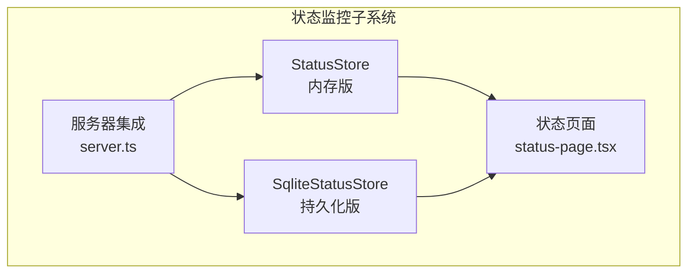
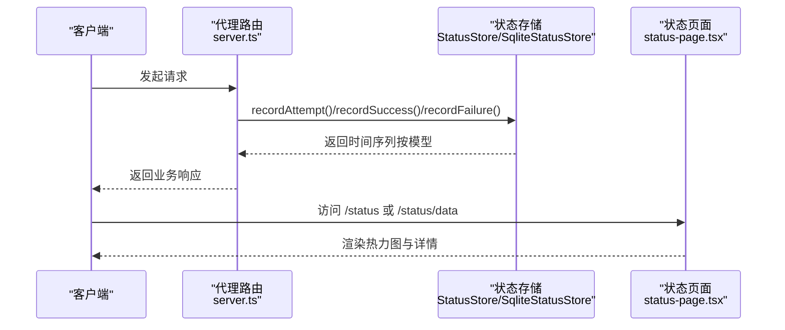
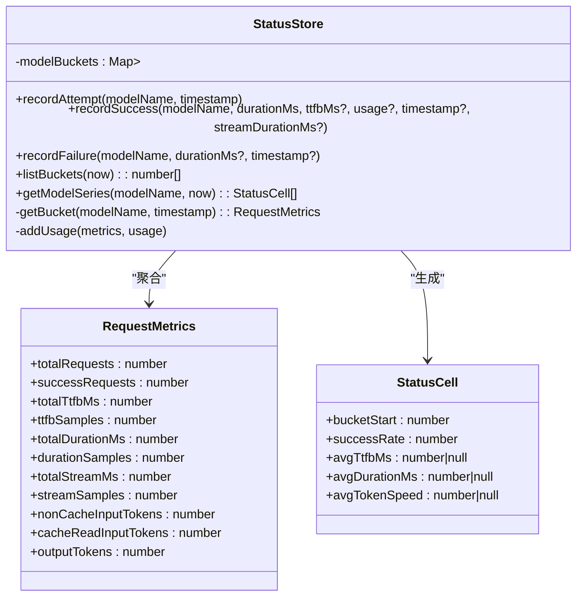
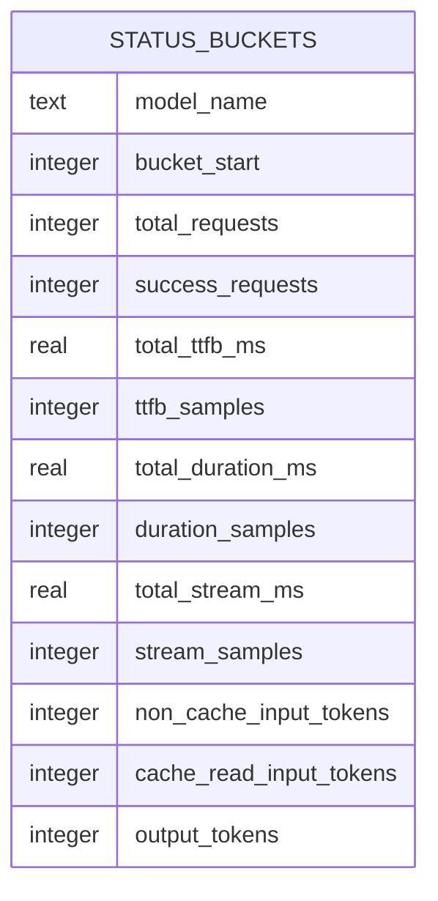
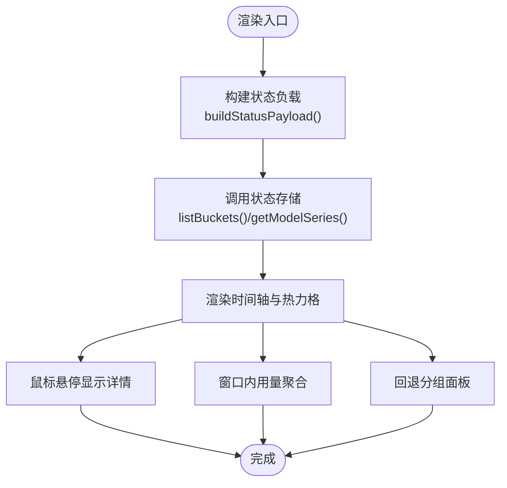
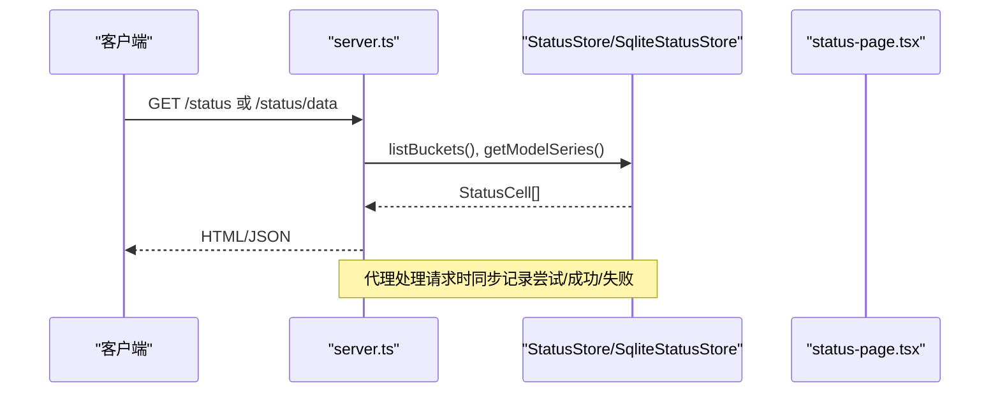
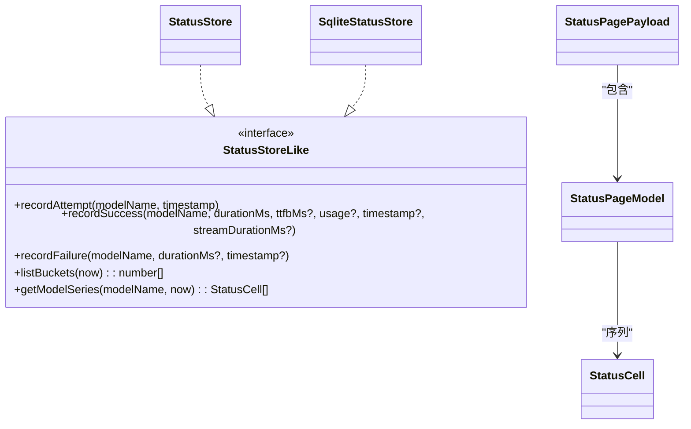

# 状态监控

<cite>
**本文引用的文件**
- [status.ts](file://src/status.ts)
- [status-page.tsx](file://src/status-page.tsx)
- [server.ts](file://server.ts)
- [record.ts](file://src/record.ts)
- [http-log.ts](file://src/http-log.ts)
</cite>

## 目录
1. [简介](#简介)
2. [项目结构](#项目结构)
3. [核心组件](#核心组件)
4. [架构总览](#架构总览)
5. [组件详解](#组件详解)
6. [依赖关系分析](#依赖关系分析)
7. [性能考量](#性能考量)
8. [故障排查指南](#故障排查指南)
9. [结论](#结论)
10. [附录](#附录)

## 简介
本文件面向状态监控系统，聚焦 StatusStore 与 SqliteStatusStore 的实现原理，阐述请求指标采集、时间桶管理与数据持久化机制；解释监控指标语义（总请求数、成功请求数、TTFB、平均持续时间、流式响应时间、令牌速度）；说明健康状态评估算法与颜色编码体系；给出监控页面的数据展示与性能分析方法；并提供 SQLite 表结构、索引设计与查询优化策略。

## 项目结构
状态监控相关代码主要分布在以下模块：
- 状态存储与计算：src/status.ts
- 监控页面渲染与交互：src/status-page.tsx
- 服务端集成与路由：server.ts
- 请求记录与回放（辅助理解上下文）：src/record.ts
- 日志级别控制（辅助理解上下文）：src/http-log.ts

图示来源
- [status.ts:84-172](file://src/status.ts#L84-L172)
- [status.ts:227-362](file://src/status.ts#L227-L362)
- [status-page.tsx:691-744](file://src/status-page.tsx#L691-L744)
- [server.ts:247-248](file://server.ts#L247-L248)

章节来源
- [status.ts:1-363](file://src/status.ts#L1-L363)
- [status-page.tsx:1-745](file://src/status-page.tsx#L1-L745)
- [server.ts:618-636](file://server.ts#L618-L636)

## 核心组件
- StatusStore：基于内存的请求指标聚合器，按 5 分钟桶组织数据，保留最近 6 小时。
- SqliteStatusStore：基于 SQLite 的持久化存储，按 5 分钟桶写入，保留最近 30 天。
- StatusCell：单个时间桶的聚合结果，包含各类指标与派生字段（如成功率、平均 TTFB、平均耗时、平均令牌速度）。
- 健康状态评估：根据成功率与总量映射到颜色编码（空/绿/浅绿/橙/红）。
- 监控页面：以网格热力图展示各模型在时间轴上的健康状态与关键指标。

章节来源
- [status.ts:9-29](file://src/status.ts#L9-L29)
- [status.ts:174-180](file://src/status.ts#L174-L180)
- [status-page.tsx:12-29](file://src/status-page.tsx#L12-L29)

## 架构总览
状态监控从上游代理请求路径进入，记录尝试、成功与失败事件，随后由状态存储生成时间序列，最终由状态页面进行可视化展示。

图示来源
- [server.ts:713-770](file://server.ts#L713-L770)
- [status.ts:108-140](file://src/status.ts#L108-L140)
- [status.ts:344-357](file://src/status.ts#L344-L357)
- [status-page.tsx:691-744](file://src/status-page.tsx#L691-L744)

## 组件详解

### StatusStore（内存版）
- 时间桶与保留策略
  - 桶粒度：5 分钟
  - 内存保留窗口：最近 6 小时（最多 72 个桶）
  - 过期清理：按最小桶起始时间裁剪，或按桶数量上限移除最旧桶
- 指标聚合
  - 总请求数、成功请求数、TTFB 总量与样本数、总耗时与样本数、流式耗时与样本数、输入/缓存命中输出令牌数
- 派生指标
  - 成功率 = 成功数/总数*100
  - 平均 TTFB = TTFB 总量/TTFB 样本数（若样本>0）
  - 平均耗时 = 总耗时/耗时样本数（若样本>0）
  - 平均令牌速度 = 输出令牌/(流式总毫秒/1000)，仅当流式总毫秒>0且输出令牌>0
- 查询接口
  - listBuckets(now)：生成当前可见时间桶列表
  - getModelSeries(modelName, now)：返回该模型的 StatusCell 序列

图示来源
- [status.ts:84-172](file://src/status.ts#L84-L172)
- [status.ts:9-29](file://src/status.ts#L9-L29)

章节来源
- [status.ts:84-172](file://src/status.ts#L84-L172)

### SqliteStatusStore（持久化版）
- 表结构与索引
  - 表名：status_buckets
  - 主键：(model_name, bucket_start)
  - 索引：idx_status_buckets_bucket_start(bucket_start)
  - 字段覆盖内存版 RequestMetrics 的全部聚合项
- 写入策略
  - 使用 UPSERT（ON CONFLICT）增量累加各桶计数
  - 每次写入后执行过期清理（保留最近 30 天）
- 查询策略
  - 生成可见时间桶范围，按模型名与桶范围查询
  - 对缺失桶用空指标补齐，统一生成 StatusCell 列表

图示来源
- [status.ts:229-246](file://src/status.ts#L229-L246)

章节来源
- [status.ts:227-362](file://src/status.ts#L227-L362)

### 监控页面（状态页）
- 数据结构
  - StatusPagePayload：包含可用窗口、默认窗口小时数、刷新时间、桶起始时间数组、模型序列、回退分组
  - StatusPageModel：模型名与对应 StatusCell 序列
- 展示逻辑
  - 时间轴刻度：每小时 12 个桶（5 分钟粒度）
  - 热力格：按成功率映射到颜色（空/绿/浅绿/橙/红）
  - 工具提示：显示总请求数、成功数、成功率、平均首包、平均总耗时、Input/Cache/Output、平均速度
  - 聚合统计：当前可视窗口内 Input/Cache/Output 总量（以 M 单位展示）

图示来源
- [server.ts:619-636](file://server.ts#L619-L636)
- [status-page.tsx:601-666](file://src/status-page.tsx#L601-L666)

章节来源
- [status-page.tsx:12-29](file://src/status-page.tsx#L12-L29)
- [status-page.tsx:601-666](file://src/status-page.tsx#L601-L666)

### 健康状态评估与颜色编码
- 规则
  - 无数据：totalRequests === 0 → "empty"
  - 绿色：successRate === 100 → "green"
  - 浅绿色：successRate >= 80 → "lightgreen"
  - 橙色：successRate >= 50 → "orange"
  - 红色：否则 → "red"
- 页面映射
  - 热力格类名与工具提示颜色一致，便于快速识别健康状况

章节来源
- [status.ts:174-180](file://src/status.ts#L174-L180)
- [status-page.tsx:443-449](file://src/status-page.tsx#L443-L449)

### 指标语义说明
- 总请求数：当前桶内尝试次数累计
- 成功请求数：当前桶内成功次数累计
- TTFB（首字节延迟）：从开始到收到首个字节的时间，单位毫秒
- 平均持续时间：一次请求从开始到结束的平均耗时，单位毫秒
- 流式响应时间：流式响应的总时长，单位毫秒
- 令牌速度：平均每秒输出的令牌数（仅当流式总毫秒>0且输出令牌>0）
- 输入令牌（非缓存）/缓存命中输入令牌/输出令牌：用于衡量吞吐与缓存命中效果

章节来源
- [status.ts:9-29](file://src/status.ts#L9-L29)
- [status.ts:157-169](file://src/status.ts#L157-L169)
- [status.ts:211-225](file://src/status.ts#L211-L225)

### 服务端集成与数据流
- 集成点
  - 选择存储：sqliteDb 存在时使用 SqliteStatusStore，否则使用内存版 StatusStore
  - 路由：/status（HTML）与 /status/data（JSON）
- 请求路径中的埋点
  - 记录尝试：recordAttempt
  - 记录成功：recordSuccess（含 TTFB、usage、流式耗时）
  - 记录失败：recordFailure（含耗时）
  - 回退失败追踪：用于排序回退分组成员

图示来源
- [server.ts:247-248](file://server.ts#L247-L248)
- [server.ts:1234-1235](file://server.ts#L1234-L1235)
- [server.ts:713-770](file://server.ts#L713-L770)

章节来源
- [server.ts:247-248](file://server.ts#L247-L248)
- [server.ts:619-636](file://server.ts#L619-L636)
- [server.ts:1234-1235](file://server.ts#L1234-L1235)

## 依赖关系分析
- StatusStore 与 SqliteStatusStore 共同实现 StatusStoreLike 接口，保证可替换性
- 服务器通过 StatusStoreLike 抽象注入具体实现
- 状态页面依赖 StatusCell 结构进行渲染
- 记录模块（record.ts）与状态监控模块相互独立，但共同服务于可观测性

图示来源
- [status.ts:33-46](file://src/status.ts#L33-L46)
- [status.ts:84-172](file://src/status.ts#L84-L172)
- [status.ts:227-362](file://src/status.ts#L227-L362)
- [status-page.tsx:12-29](file://src/status-page.tsx#L12-L29)

章节来源
- [status.ts:33-46](file://src/status.ts#L33-L46)
- [status-page.tsx:12-29](file://src/status-page.tsx#L12-L29)

## 性能考量
- 时间桶与采样
  - 5 分钟粒度兼顾实时性与聚合稳定性
  - 内存版限制 6 小时窗口，避免无限增长
  - 持久化版限制 30 天窗口，平衡历史保留与存储成本
- 写入优化
  - SQLite 使用 UPSERT 原子累加，减少多次写入开销
  - 批量删除过期桶，避免碎片化
- 查询优化
  - 通过主键 (model_name, bucket_start) 与索引 idx_status_buckets_bucket_start 实现高效查找与范围扫描
  - 仅查询可见时间窗口内的桶，避免全表扫描
- 可视化性能
  - 前端按需渲染可视窗口（1/3/6 小时），降低 DOM 与重绘压力

章节来源
- [status.ts:4-7](file://src/status.ts#L4-L7)
- [status.ts:246](file://src/status.ts#L246)
- [status.ts:344-357](file://src/status.ts#L344-L357)
- [status-page.tsx:601-666](file://src/status-page.tsx#L601-L666)

## 故障排查指南
- 现象：页面无数据或颜色为空
  - 检查是否发生 recordAttempt/recordSuccess/recordFailure 调用
  - 确认当前时间桶是否在可见窗口内
- 现象：成功率异常波动
  - 核对成功数与总请求数是否正确累加
  - 检查是否有大量失败导致样本不足
- 现象：平均 TTFB/耗时为 null
  - 确认 ttfbMs 与 durationMs 是否传入有效数值
- 现象：平均令牌速度为 null
  - 确认流式耗时与输出令牌是否大于 0
- 现象：持久化数据丢失
  - 检查 SQLite 删除过期桶逻辑是否触发
  - 确认数据库连接与事务是否正常提交

章节来源
- [status.ts:108-140](file://src/status.ts#L108-L140)
- [status.ts:157-169](file://src/status.ts#L157-L169)
- [status.ts:251-254](file://src/status.ts#L251-L254)

## 结论
状态监控系统通过内存与持久化双轨存储，结合 5 分钟时间桶与健康状态颜色编码，提供了高可读性的实时健康视图。其设计在准确性、可维护性与性能之间取得平衡，适合在生产环境中长期运行与演进。

## 附录

### SQLite 表结构与索引
- 表名：status_buckets
- 主键：(model_name, bucket_start)
- 索引：idx_status_buckets_bucket_start(bucket_start)
- 字段：覆盖 RequestMetrics 的全部聚合项（见“指标语义说明”）

章节来源
- [status.ts:229-246](file://src/status.ts#L229-L246)

### 查询优化建议
- 限定查询范围：仅查询当前模型与可见时间窗口内的桶
- 使用主键与索引：优先按 (model_name, bucket_start) 匹配
- 控制返回行数：前端按小时窗口裁剪，避免一次性传输过多数据

章节来源
- [status.ts:344-357](file://src/status.ts#L344-L357)
- [status-page.tsx:601-666](file://src/status-page.tsx#L601-L666)