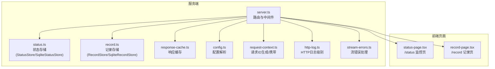
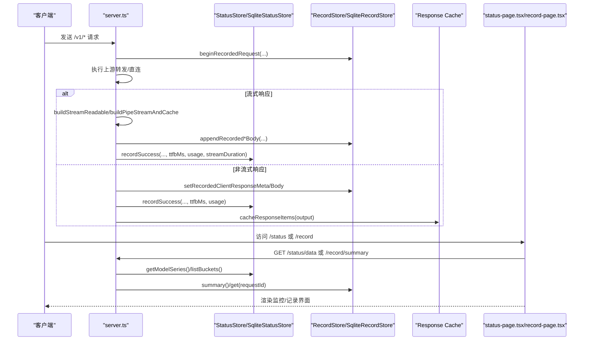
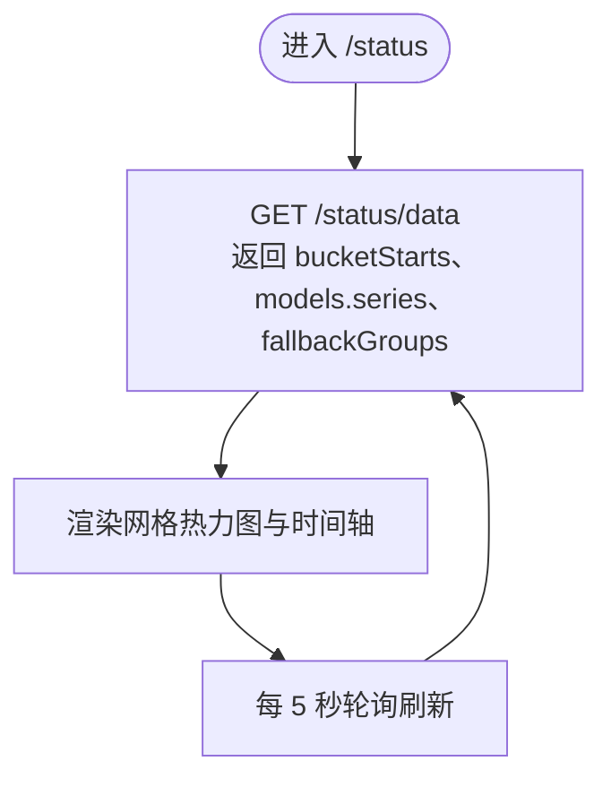
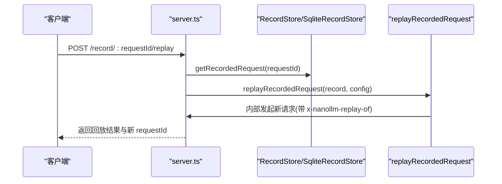
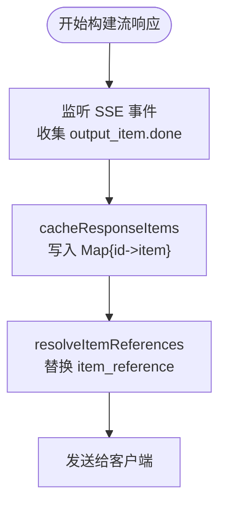
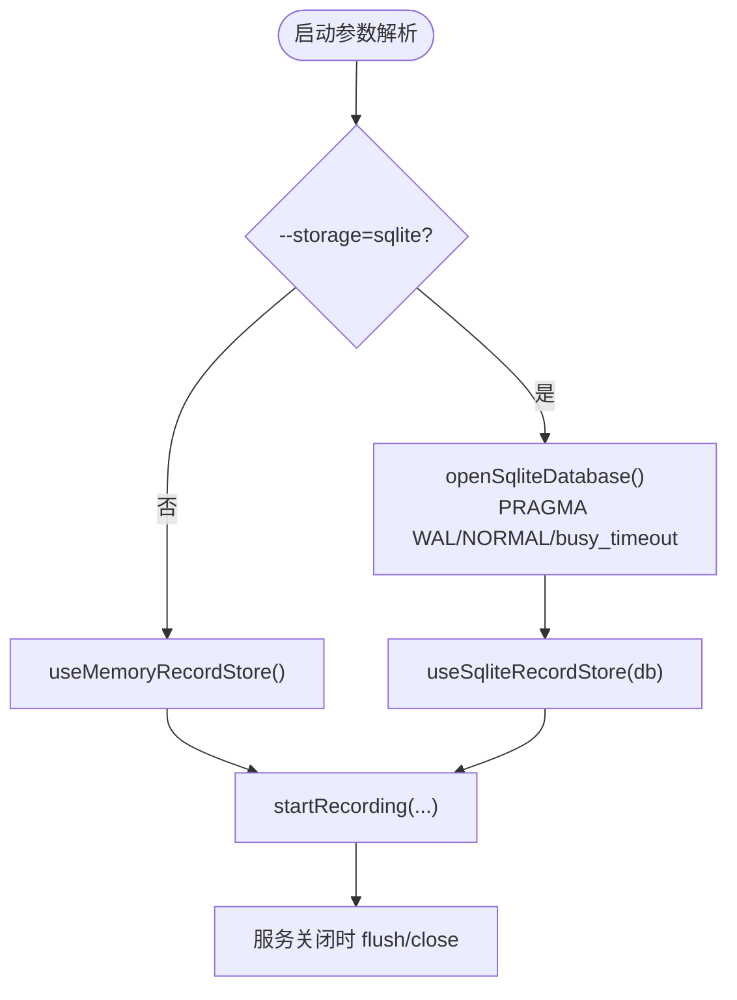
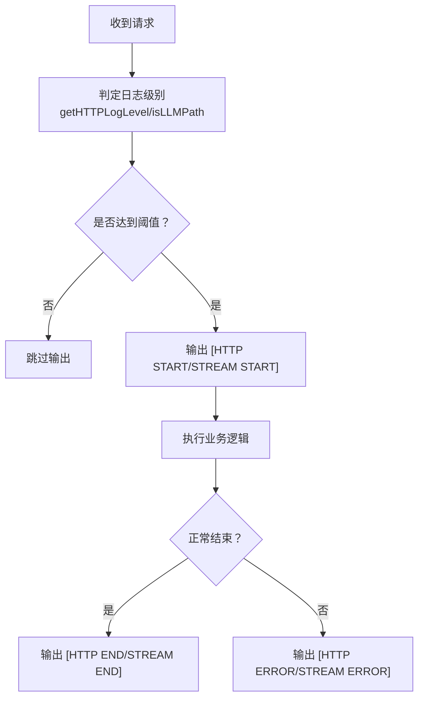
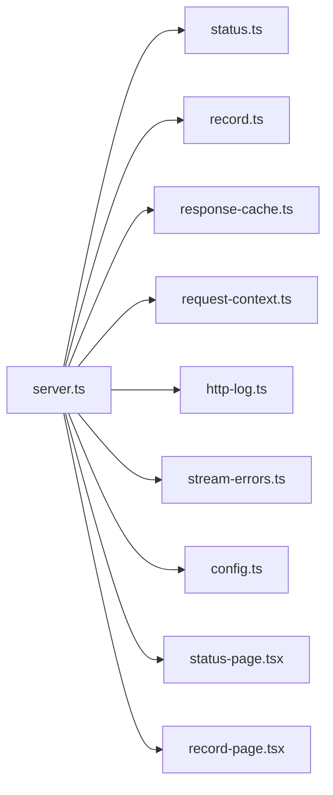

# 监控与日志

<cite>
**本文档引用的文件**
- [server.ts](file://server.ts)
- [status.ts](file://src/status.ts)
- [status-page.tsx](file://src/status-page.tsx)
- [record.ts](file://src/record.ts)
- [record-page.tsx](file://src/record-page.tsx)
- [response-cache.ts](file://src/response-cache.ts)
- [config.ts](file://src/config.ts)
- [request-context.ts](file://src/request-context.ts)
- [http-log.ts](file://src/http-log.ts)
- [stream-errors.ts](file://src/stream-errors.ts)
</cite>

## 目录
1. [简介](#简介)
2. [项目结构](#项目结构)
3. [核心组件](#核心组件)
4. [架构概览](#架构概览)
5. [详细组件分析](#详细组件分析)
6. [依赖关系分析](#依赖关系分析)
7. [性能考量](#性能考量)
8. [故障排查指南](#故障排查指南)
9. [结论](#结论)
10. [附录](#附录)

## 简介
本文件面向监控与日志系统，围绕以下目标进行系统化说明：
- /status 监控页面：模型健康状态、性能指标与统计信息的含义与解读。
- /record 请求记录页面：使用方法、调试价值与回放能力。
- 响应缓存系统：监控机制与性能统计。
- SQLite 存储配置：持久化策略与存储位置。
- 日志记录机制、错误处理策略与性能优化建议。
- 监控数据解读指南与常见问题诊断。

## 项目结构
监控与日志相关的核心模块分布如下：
- 服务器入口与路由：负责收集监控数据、记录请求、渲染页面与暴露管理端点。
- 状态存储：内存与 SQLite 双实现，用于聚合与持久化请求指标。
- 记录存储：内存与 SQLite 双实现，用于捕获请求与响应细节，支持回放。
- 前端页面：监控页与记录页，提供可视化与交互式调试工具。
- 工具模块：请求上下文、HTTP 日志级别控制、流错误处理等。

图示来源
- [server.ts:145-1374](file://server.ts#L145-L1374)
- [status.ts:84-172](file://src/status.ts#L84-L172)
- [record.ts:185-408](file://src/record.ts#L185-L408)
- [response-cache.ts:1-35](file://src/response-cache.ts#L1-L35)
- [status-page.tsx:691-745](file://src/status-page.tsx#L691-L745)
- [record-page.tsx:1676-1721](file://src/record-page.tsx#L1676-L1721)

章节来源
- [server.ts:145-1374](file://server.ts#L145-L1374)

## 核心组件
- 状态存储（StatusStore/SqliteStatusStore）
  - 聚合每 5 分钟桶内的请求总量、成功数、TTFB、总耗时、流耗时与 Token 使用量。
  - 提供健康色带（空/绿/浅绿/橙/红）与平均指标计算。
- 记录存储（RecordStore/SqliteRecordStore）
  - 捕获客户端请求、上游尝试、客户端响应与错误，支持流式增量记录与最终落盘。
  - 支持按 requestId 查询与回放。
- 响应缓存（Response Cache）
  - 针对 Responses API 的 item_reference 进行去重与内联，提升下游消费效率。
- 前端页面
  - /status：以网格热力图展示各模型在时间窗口内的健康度与指标。
  - /record：可视化请求生命周期，支持事件级流重建与回放。

章节来源
- [status.ts:9-46](file://src/status.ts#L9-L46)
- [status.ts:84-172](file://src/status.ts#L84-L172)
- [record.ts:71-112](file://src/record.ts#L71-L112)
- [record.ts:185-408](file://src/record.ts#L185-L408)
- [response-cache.ts:1-35](file://src/response-cache.ts#L1-L35)
- [status-page.tsx:12-29](file://src/status-page.tsx#L12-L29)
- [record-page.tsx:15-21](file://src/record-page.tsx#L15-L21)

## 架构概览
下图展示了从请求进入、指标采集、记录捕获到页面渲染的关键流程。

图示来源
- [server.ts:663-810](file://server.ts#L663-L810)
- [server.ts:942-1203](file://server.ts#L942-L1203)
- [status.ts:112-140](file://src/status.ts#L112-L140)
- [record.ts:256-287](file://src/record.ts#L256-L287)
- [response-cache.ts:7-34](file://src/response-cache.ts#L7-L34)
- [status-page.tsx:691-745](file://src/status-page.tsx#L691-L745)
- [record-page.tsx:1676-1721](file://src/record-page.tsx#L1676-L1721)

## 详细组件分析

### /status 监控页面
- 数据来源与含义
  - 桶划分：按 5 分钟粒度切分，保留最近 6 小时的桶，共 72 个桶。
  - 指标字段：总请求数、成功数、TTFB 总时长与样本数、总耗时与样本数、流耗时与样本数、非缓存输入 Token、缓存读取输入 Token、输出 Token。
  - 派生指标：成功率、平均 TTFB、平均总耗时、平均 Token 速率（基于流耗时与输出 Token）。
  - 健康色带：空/绿（≥100%）、浅绿（≥80%）、橙（≥50%）、红（<50%）。
- 页面行为
  - 默认显示最近 1 小时时窗，支持切换 1/3/6 小时。
  - 每 5 秒轮询刷新。
  - 支持查看回退分组与成员排序（基于失败次数）。
- 解读要点
  - 成功率下降可能指示上游不稳定或限流；结合 TTFB 与总耗时可定位是网络还是上游处理慢。
  - 平均 Token 速率异常低可能意味着上游输出稀疏或流中断。
  - 输入/缓存/输出 Token 统计可用于评估缓存命中与成本估算。

图示来源
- [server.ts:1234-1235](file://server.ts#L1234-L1235)
- [status.ts:151-171](file://src/status.ts#L151-L171)
- [status-page.tsx:691-745](file://src/status-page.tsx#L691-L745)

章节来源
- [status.ts:9-29](file://src/status.ts#L9-L29)
- [status.ts:68-82](file://src/status.ts#L68-L82)
- [status.ts:151-171](file://src/status.ts#L151-L171)
- [status-page.tsx:12-29](file://src/status-page.tsx#L12-L29)
- [status-page.tsx:380-689](file://src/status-page.tsx#L380-L689)

### /record 请求记录页面
- 功能与价值
  - 展示最近请求摘要、按 requestId 查询单次请求详情。
  - 可视化上游尝试（含请求/响应/错误），支持流事件解析与“完整响应”重建。
  - 支持对已完成请求进行回放（POST /record/:requestId/replay），便于复现问题。
- 关键流程
  - 开始记录：beginRecordedRequest。
  - 上游尝试：ensureRecordedAttempt/setRecordedAttempt*。
  - 客户端响应：setRecordedClientResponseMeta/Body。
  - 结束记录：finalizeRecordedRequest（内存模式入队持久化，SQLite 模式立即写入）。
  - 回放：replayRecordedRequest 通过内部发起新请求并设置 x-nanollm-replay-of 头。
- 调试建议
  - 使用回放快速验证修复；注意敏感头被屏蔽，鉴权使用当前配置。
  - 对流式响应，优先查看“流事件”折叠项，必要时对比“完整响应”。

图示来源
- [server.ts:1246-1260](file://server.ts#L1246-L1260)
- [server.ts:584-617](file://server.ts#L584-L617)
- [record.ts:891-961](file://src/record.ts#L891-L961)

章节来源
- [record.ts:71-112](file://src/record.ts#L71-L112)
- [record.ts:185-408](file://src/record.ts#L185-L408)
- [record.ts:891-961](file://src/record.ts#L891-L961)
- [record-page.tsx:1676-1721](file://src/record-page.tsx#L1676-L1721)

### 响应缓存系统
- 监控机制
  - 在流式管道中收集 output_item.done 事件，提取 item 并缓存。
  - resolveItemReferences 将 item_reference 替换为缓存中的实际 item，减少下游重复传输。
- 性能统计
  - 缓存容量上限：最多 5000 项，超过则按插入顺序淘汰最旧项。
  - 适用于 Responses API 的 item_reference 场景，显著降低网络开销与解析成本。

图示来源
- [server.ts:1068-1203](file://server.ts#L1068-L1203)
- [response-cache.ts:7-34](file://src/response-cache.ts#L7-L34)

章节来源
- [response-cache.ts:1-35](file://src/response-cache.ts#L1-L35)
- [server.ts:1068-1203](file://server.ts#L1068-L1203)

### SQLite 存储配置
- 启动参数
  - --storage memory：仅内存存储（默认）。
  - --storage sqlite：启用 SQLite 存储，数据库路径位于用户主目录下的 ~/.nanollm/nanollm.sqlite3。
- 初始化与事务
  - 打开数据库后设置 WAL 模式、NORMAL 同步与 5000ms 忙等待，提升并发与可靠性。
  - 记录存储采用批量提交（BEGIN/COMMIT/ROLLBACK）保证一致性。
- 生命周期
  - 服务关闭时 flushRecording 并关闭数据库连接。

图示来源
- [server.ts:90-124](file://server.ts#L90-L124)
- [server.ts:133-136](file://server.ts#L133-L136)
- [server.ts:1369-1371](file://server.ts#L1369-L1371)
- [record.ts:861-869](file://src/record.ts#L861-L869)

章节来源
- [server.ts:90-124](file://server.ts#L90-L124)
- [server.ts:133-136](file://server.ts#L133-L136)
- [record.ts:433-597](file://src/record.ts#L433-L597)

### 日志记录机制与错误处理
- HTTP 日志级别
  - LLM 路径（/v1）使用 info 级别，其他路径使用 debug 级别。
  - 受 LOG_LEVEL 环境变量控制（debug/info/error），仅输出不低于阈值的日志。
- 请求日志
  - 中间件在请求开始与结束时输出结构化日志，包含 method/path/duration/status。
  - 流式响应额外标注“[HTTP STREAM START/END/CANCEL/ERROR]”。
- 错误处理
  - 流读取错误根据 shouldIgnoreStreamReadError 判定是否忽略（如 Reader released 且已完成）。
  - 失败时记录失败指标并输出警告/错误日志。

图示来源
- [server.ts:153-178](file://server.ts#L153-L178)
- [http-log.ts:1-28](file://src/http-log.ts#L1-L28)
- [stream-errors.ts:1-16](file://src/stream-errors.ts#L1-L16)

章节来源
- [http-log.ts:1-28](file://src/http-log.ts#L1-L28)
- [server.ts:153-178](file://server.ts#L153-L178)
- [stream-errors.ts:1-16](file://src/stream-errors.ts#L1-L16)

## 依赖关系分析
- 组件耦合
  - server.ts 作为中枢，依赖状态存储、记录存储、响应缓存、请求上下文与日志模块。
  - 状态/记录存储通过接口抽象（StatusStoreLike/RecordStoreLike）支持内存与 SQLite 两种实现。
- 外部依赖
  - node:sqlite（SQLite 实现）、Hono（Web 框架）、YAML（配置解析）。

图示来源
- [server.ts:14-54](file://server.ts#L14-L54)
- [status.ts:1-8](file://src/status.ts#L1-L8)
- [record.ts:1-6](file://src/record.ts#L1-L6)
- [response-cache.ts:1-3](file://src/response-cache.ts#L1-L3)
- [request-context.ts:1-4](file://src/request-context.ts#L1-L4)
- [http-log.ts:1-3](file://src/http-log.ts#L1-L3)
- [stream-errors.ts:1-3](file://src/stream-errors.ts#L1-L3)
- [config.ts:1-6](file://src/config.ts#L1-L6)

章节来源
- [server.ts:14-54](file://server.ts#L14-L54)

## 性能考量
- 监控聚合
  - 5 分钟桶与 6 小时窗口限制了内存占用与查询复杂度。
  - 健康色带与派生指标避免了高基数列，便于前端高效渲染。
- 记录存储
  - 内存模式：活跃记录驻留 Map，完成即入持久化队列，微任务批量落盘，降低锁竞争。
  - SQLite 模式：单条 INSERT/UPDATE（ON CONFLICT）+ 批量提交，兼顾一致性与吞吐。
- 响应缓存
  - 有限容量与淘汰策略避免无限增长；仅针对 Responses API 的 item_reference 场景生效。
- 日志
  - 通过日志级别过滤与条件输出，减少生产环境噪声与 IO 压力。

## 故障排查指南
- 监控数据异常
  - 成功率骤降：检查上游可用性与配额；结合 TTFB 与总耗时判断是网络还是上游处理慢。
  - 平均 Token 速率低：确认上游输出策略与流完整性；关注流错误处理分支。
- 记录查询不到
  - 确认 requestId 是否正确（支持前缀匹配）；检查记录上限与回收策略。
  - 若使用 SQLite 模式，确认数据库文件存在且权限正确。
- 回放失败
  - 仅允许特定路径回放；若处于 in_progress 状态不可回放。
  - 注意敏感头被屏蔽，鉴权使用当前配置；必要时更新配置后重试。
- 流式错误
  - 若出现“Reader released”但已完成，属于预期可忽略；若中途取消需检查客户端行为与网络稳定性。

章节来源
- [status.ts:174-180](file://src/status.ts#L174-L180)
- [record.ts:891-961](file://src/record.ts#L891-L961)
- [server.ts:584-617](file://server.ts#L584-L617)
- [stream-errors.ts:1-16](file://src/stream-errors.ts#L1-L16)

## 结论
本系统通过统一的监控与记录框架，实现了对模型健康、性能与请求生命周期的可观测性。/status 页面提供直观的健康度与指标视图，/record 页面提供强大的调试与回放能力。SQLite 存储在可选模式下提供了持久化能力，配合响应缓存与流式错误处理，满足生产环境的性能与可靠性需求。

## 附录
- 配置项参考
  - record.max_size：记录上限，默认 10。
  - server.ttfb_timeout：全局 TTFB 超时（毫秒）。
  - server.auth.token：鉴权令牌。
  - 模型配置：name/provider/base_url/api_key/model 等。
- 命令行选项
  - --config：指定配置文件路径。
  - --storage：memory/sqlite。

章节来源
- [config.ts:5-35](file://src/config.ts#L5-L35)
- [server.ts:59-107](file://server.ts#L59-L107)