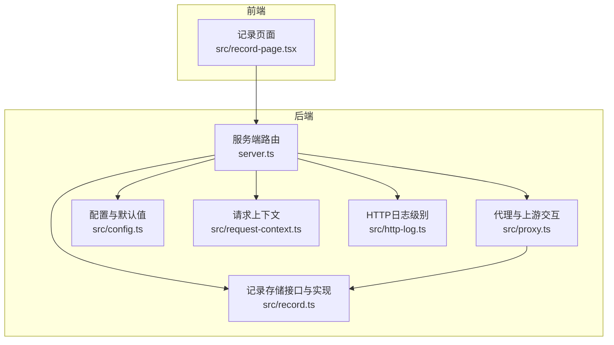
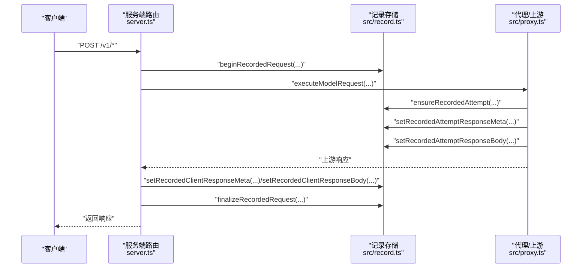
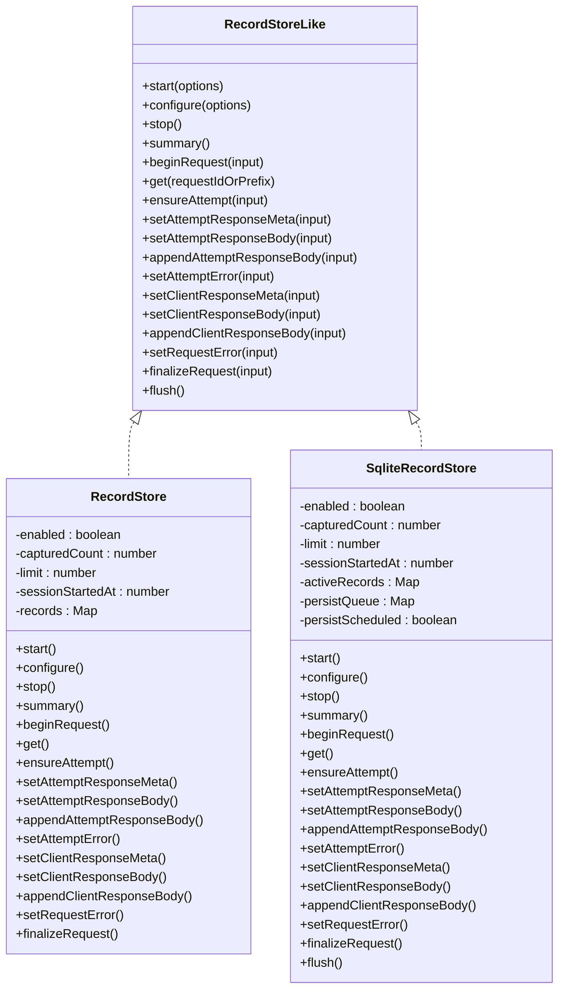
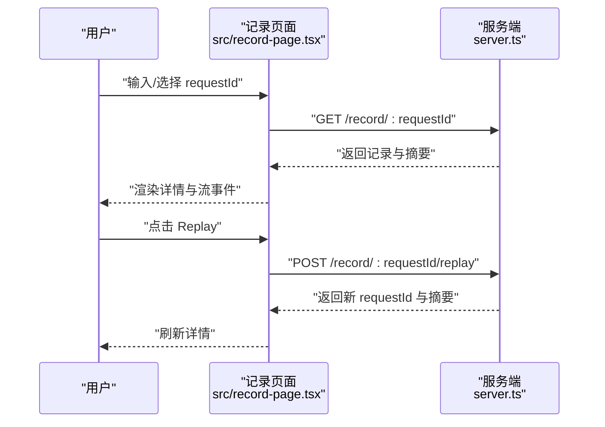
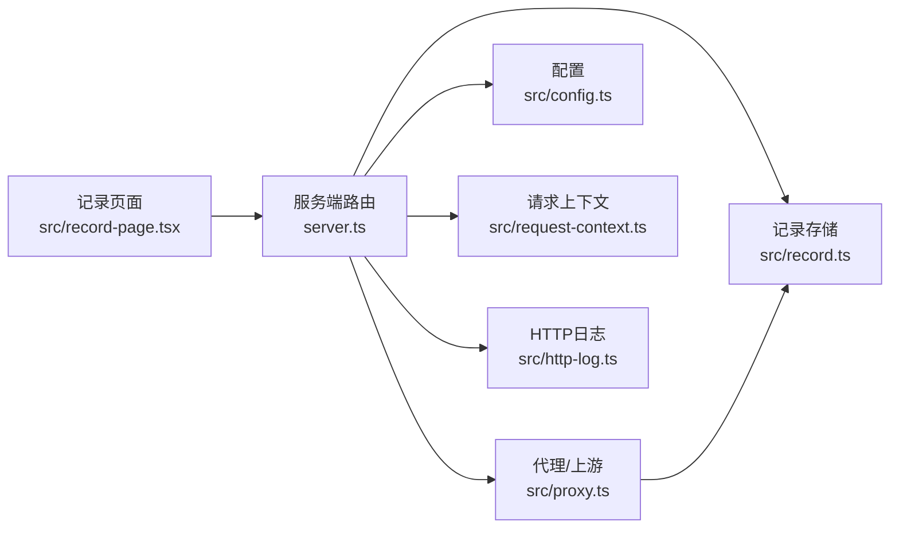

# 请求记录

<cite>
**本文档引用的文件**
- [src/record-page.tsx](file://src/record-page.tsx)
- [src/record.ts](file://src/record.ts)
- [src/proxy.ts](file://src/proxy.ts)
- [src/config.ts](file://src/config.ts)
- [src/request-context.ts](file://src/request-context.ts)
- [src/http-log.ts](file://src/http-log.ts)
- [server.ts](file://server.ts)
</cite>

## 更新摘要
**所做更改**
- 修复状态逻辑错误，确保失败状态不会被意外覆盖
- 改进请求记录的准确性，提升系统可观测性
- 强化状态管理机制，防止状态回滚或覆盖问题

## 目录
1. [简介](#简介)
2. [项目结构](#项目结构)
3. [核心组件](#核心组件)
4. [架构总览](#架构总览)
5. [详细组件分析](#详细组件分析)
6. [依赖关系分析](#依赖关系分析)
7. [性能考量](#性能考量)
8. [故障排查指南](#故障排查指南)
9. [结论](#结论)
10. [附录](#附录)

## 简介
本文件面向"请求记录系统"，围绕记录存储机制、数据结构与查询功能进行深入说明，并提供记录页面的使用方法（搜索过滤、排序与导出）、调试与故障排查指南、数据保留策略与清理机制，以及高级查询与批量操作建议。目标是帮助开发者与运维人员高效地使用与维护该系统。

**更新** 本次更新重点关注状态逻辑修复，确保失败状态的准确性和不可逆性，提升系统的整体可观测性。

## 项目结构
请求记录系统由以下关键模块组成：
- 记录存储层：内存与SQLite双实现，负责记录的生命周期管理、持久化与容量控制
- 记录页面前端：提供可视化界面，支持请求详情查看、流事件解析、重放与复制等能力
- 代理与路由：在请求处理链路中注入记录逻辑，确保从客户端到上游的全链路可追踪
- 配置与上下文：记录最大容量、请求ID生成与作用域、日志级别等基础能力

**图表来源**
- [src/record-page.tsx](file://src/record-page.tsx)
- [src/record.ts](file://src/record.ts)
- [src/proxy.ts](file://src/proxy.ts)
- [src/config.ts](file://src/config.ts)
- [src/request-context.ts](file://src/request-context.ts)
- [src/http-log.ts](file://src/http-log.ts)
- [server.ts](file://server.ts)

**章节来源**
- [src/record-page.tsx](file://src/record-page.tsx)
- [src/record.ts](file://src/record.ts)
- [src/proxy.ts](file://src/proxy.ts)
- [src/config.ts](file://src/config.ts)
- [src/request-context.ts](file://src/request-context.ts)
- [src/http-log.ts](file://src/http-log.ts)
- [server.ts](file://server.ts)

## 核心组件
- 记录存储接口与实现
  - 抽象接口定义了开始/配置/停止、摘要、请求生命周期（开始、尝试、响应、错误、完成）等方法
  - 内存实现：基于Map的内存缓存，适合开发或小规模场景
  - SQLite实现：持久化存储，支持容量裁剪、索引优化与事务提交
- 记录数据模型
  - 客户端请求：路径、头部（敏感字段脱敏）、主体、模型、来源、状态
  - 上游尝试：提供商、模型名、URL、请求/响应元信息与主体、错误信息
  - 客户端响应：状态码、头部、主体、截断标记
  - 摘要：启用状态、捕获计数、上限、会话开始时间、最近键列表
- 前端记录页面
  - 提供摘要面板、最近请求列表、请求详情、流事件解析、重放按钮与复制能力
- 路由与重放
  - 提供记录查询、摘要、重放接口；重放时忽略敏感客户端头，使用当前配置认证

**更新** 状态管理得到强化，确保失败状态的不可逆性，防止状态被后续操作覆盖。

**章节来源**
- [src/record.ts](file://src/record.ts)
- [src/record-page.tsx](file://src/record-page.tsx)
- [server.ts](file://server.ts)

## 架构总览
请求记录贯穿"接收—代理—上游—回传"全流程，通过请求上下文生成统一requestId，贯穿记录生命周期。代理层在每次上游往返中更新尝试与响应，最终在完成时持久化。

**图表来源**
- [server.ts](file://server.ts)
- [src/record.ts](file://src/record.ts)
- [src/proxy.ts](file://src/proxy.ts)

## 详细组件分析

### 记录存储与数据模型
- 数据模型要点
  - 敏感字段自动脱敏（如鉴权头），避免泄露
  - 流式响应按块追加，支持流事件解析与"完整响应"重建
  - 来源识别（Claude Code、Codex、OpenCode、Other）
  - 状态管理：进行中/成功/失败，**已修复状态逻辑错误，确保失败状态不会被意外覆盖**
- 存储策略
  - 内存实现：以Map保存，简单高效，重启丢失
  - SQLite实现：持久化，支持容量裁剪与索引；写入采用微任务队列批量提交，保证一致性
- 摘要与最近键
  - 摘要包含启用状态、捕获计数、上限、会话开始时间、可见大小与最近键列表
  - 最近键用于前端快速选择与展示

**更新** 状态逻辑修复确保：
- 失败状态一旦设置，不会被后续的成功状态覆盖
- 状态转换遵循单向原则，从"进行中"到"成功"或"失败"
- 错误处理更加可靠，提升系统可观测性

**图表来源**
- [src/record.ts](file://src/record.ts)

**章节来源**
- [src/record.ts](file://src/record.ts)

### 记录页面与查询功能
- 页面功能
  - 摘要面板：显示采样总数、上限、会话开始时间
  - 最近请求：支持折叠/展开、快捷跳转
  - 请求详情：Client Request、Attempts（含上游请求/响应）、Client Response
  - 流事件解析：将SSE流事件解析为"完整响应"与"事件列表"
  - 重放：向本地同端口发起POST重放，忽略敏感客户端头，使用当前配置认证
  - 复制：复制原始文本或重建后的JSON
- 查询与过滤
  - 支持通过requestId参数精确查询
  - 前端提供下拉选项与快捷按钮，便于快速选择最近请求
- 导出
  - 建议通过"复制"功能导出所需片段；也可结合后端接口批量导出（见附录）

**图表来源**
- [src/record-page.tsx](file://src/record-page.tsx)
- [server.ts](file://server.ts)

**章节来源**
- [src/record-page.tsx](file://src/record-page.tsx)
- [server.ts](file://server.ts)

### 代理与上游交互中的记录
- 在上游请求前调用"确保尝试"接口，记录提供商、模型名、URL与请求头/体
- 设置尝试响应元信息与主体，必要时追加流块
- 出错时记录错误消息与上游错误体
- 回传给客户端时设置客户端响应元信息与主体，并在完成后持久化

**更新** 状态逻辑修复确保代理层的状态管理更加可靠，防止状态覆盖问题。

**章节来源**
- [src/proxy.ts](file://src/proxy.ts)
- [src/record.ts](file://src/record.ts)

### 配置与请求上下文
- 默认记录上限与超时等配置
- 请求ID生成与异步作用域，确保跨模块一致的requestId
- HTTP日志级别根据路径与环境变量决定

**章节来源**
- [src/config.ts](file://src/config.ts)
- [src/request-context.ts](file://src/request-context.ts)
- [src/http-log.ts](file://src/http-log.ts)

## 依赖关系分析
- 记录存储被路由与代理共同依赖
- 代理在执行上游请求时调用记录接口，确保全链路可观测
- 前端通过服务端接口获取记录与摘要，支持重放与复制

**图表来源**
- [src/record-page.tsx](file://src/record-page.tsx)
- [src/record.ts](file://src/record.ts)
- [src/proxy.ts](file://src/proxy.ts)
- [src/config.ts](file://src/config.ts)
- [src/request-context.ts](file://src/request-context.ts)
- [src/http-log.ts](file://src/http-log.ts)
- [server.ts](file://server.ts)

**章节来源**
- [src/record-page.tsx](file://src/record-page.tsx)
- [src/record.ts](file://src/record.ts)
- [src/proxy.ts](file://src/proxy.ts)
- [src/config.ts](file://src/config.ts)
- [src/request-context.ts](file://src/request-context.ts)
- [src/http-log.ts](file://src/http-log.ts)
- [server.ts](file://server.ts)

## 性能考量
- 内存与SQLite的选择
  - 小规模/开发：内存实现，低延迟
  - 生产：SQLite实现，持久化与容量控制更稳健
- 写入策略
  - SQLite采用微任务队列批量提交，减少频繁IO
  - 删除策略优先删除最旧条目，保证上限稳定
- 流式处理
  - 流事件解析与"完整响应"重建仅在需要时进行，避免不必要的计算
- 日志级别
  - LLM相关路径默认较高日志级别，可通过环境变量调整

**更新** 状态逻辑修复不影响性能，但提升了数据准确性，减少了因状态错误导致的重复处理。

**章节来源**
- [src/record.ts](file://src/record.ts)
- [src/http-log.ts](file://src/http-log.ts)

## 故障排查指南
- 如何分析请求历史
  - 使用记录页面的"最近请求"与"请求详情"核对Client Request/Attempts/Client Response
  - 对比上游尝试的URL、状态码与错误信息，定位失败环节
  - **特别关注状态字段，确保失败状态没有被意外覆盖**
- 识别性能瓶颈
  - 关注上游TTFB与响应耗时；检查代理层的超时配置
  - 观察摘要中的捕获计数与上限，确认是否触发裁剪
- 定位问题根源
  - 若上游返回HTML或非SSE流，代理会记录错误并终止；检查上游返回类型与认证
  - 若出现"无真实内容"的SSE流，检查上游实现与缓冲限制
  - 重放失败时，确认目标路径是否允许重放、请求是否仍在进行中
  - **状态逻辑错误：检查是否有状态被意外覆盖的情况**
- 常见问题
  - 敏感头未正确脱敏：确认记录存储的头部规范化逻辑
  - 记录丢失：若使用内存实现且进程重启，记录会消失；建议切换至SQLite
  - **状态不一致：检查最近的错误处理流程，确保失败状态正确设置**

**更新** 新增状态逻辑相关的故障排查指导。

**章节来源**
- [src/proxy.ts](file://src/proxy.ts)
- [src/record.ts](file://src/record.ts)
- [server.ts](file://server.ts)

## 结论
请求记录系统通过清晰的数据模型与双存储实现，提供了从开发到生产的完整可观测性支持。前端页面直观易用，配合重放与复制能力，极大提升了调试效率。合理的容量控制与写入策略保障了性能与稳定性。

**更新** 本次状态逻辑修复显著提升了系统的可靠性，确保失败状态的准确性和不可逆性，为故障排查和系统监控提供了更可靠的依据。建议在生产环境中使用SQLite存储，并结合日志级别与监控指标进行持续优化。

## 附录

### 记录数据的保留策略与清理机制
- 容量上限
  - 通过配置项设置最大记录数，默认值可在配置模块中找到
  - 启动/配置时会裁剪超出部分；内存实现与SQLite实现均遵循相同规则
- 清理策略
  - 优先清理最旧条目；内存实现直接删除Map键，SQLite实现删除对应记录
  - 持久化采用事务提交，确保一致性
- 会话与可见性
  - 摘要包含会话开始时间与可见大小，有助于评估当前占用情况

**章节来源**
- [src/config.ts](file://src/config.ts)
- [src/record.ts](file://src/record.ts)

### 记录查询的高级用法与批量操作
- 高级查询
  - 使用"最近请求"快速筛选高频请求
  - 在"请求详情"中查看流事件，重建完整响应，辅助分析
  - **利用状态字段进行故障分类和统计分析**
- 批量操作建议
  - 复制：利用页面提供的"复制"按钮导出所需片段
  - 导出：结合后端接口批量获取摘要与记录，再进行二次处理
  - 重放：对历史记录进行重放，验证修复效果
  - **状态分析：通过批量查询分析失败状态的分布和趋势**

**更新** 新增状态相关的高级查询和分析建议。

**章节来源**
- [src/record-page.tsx](file://src/record-page.tsx)
- [server.ts](file://server.ts)