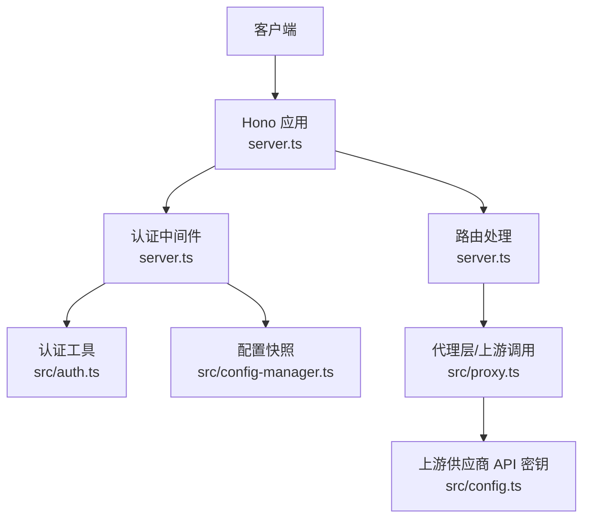
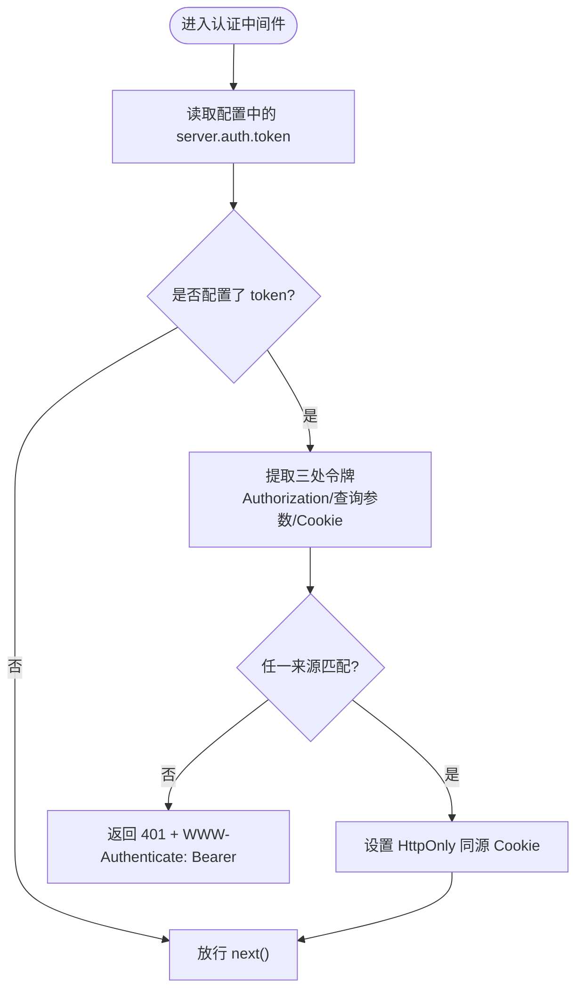
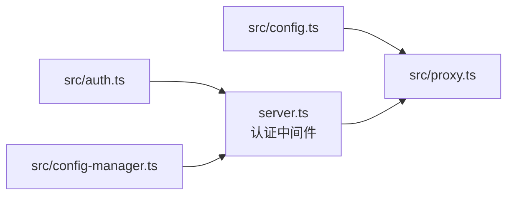

# 认证与安全

<cite>
**本文引用的文件**
- [auth.ts](file://src/auth.ts)
- [config.ts](file://src/config.ts)
- [config-manager.ts](file://src/config-manager.ts)
- [server.ts](file://server.ts)
- [proxy.ts](file://src/proxy.ts)
- [README.md](file://README.md)
</cite>

## 目录
1. [简介](#简介)
2. [项目结构](#项目结构)
3. [核心组件](#核心组件)
4. [架构总览](#架构总览)
5. [详细组件分析](#详细组件分析)
6. [依赖关系分析](#依赖关系分析)
7. [性能考量](#性能考量)
8. [故障排除指南](#故障排除指南)
9. [结论](#结论)
10. [附录](#附录)

## 简介
本文件面向认证与安全主题，系统性梳理 nanollm 网关的访问控制与安全机制，重点覆盖以下方面：
- Bearer Token 认证的工作原理与配置方法
- 一次性 URL token 的使用流程与同源认证 cookie 的管理
- 认证范围与例外规则（特别是 /health 端点）
- 安全最佳实践（密钥管理、访问控制、安全配置）
- 认证失败的常见原因与故障排除
- 认证系统与上游模型供应商 API 密钥的关系与边界

## 项目结构
围绕认证与安全的关键文件与职责如下：
- 认证工具函数：从请求头、查询参数、Cookie 中提取与比对令牌
- 服务器中间件：统一拦截除特定例外外的所有请求，进行认证校验
- 配置解析与热更新：支持运行时配置变更，含认证令牌的热更新策略
- 代理层：上游供应商 API 密钥独立于网关认证，分别管理



图表来源
- [server.ts:145-214](file://server.ts#L145-L214)
- [auth.ts:1-42](file://src/auth.ts#L1-L42)
- [config-manager.ts:58-173](file://src/config-manager.ts#L58-L173)
- [proxy.ts:63-77](file://src/proxy.ts#L63-L77)
- [config.ts:9-35](file://src/config.ts#L9-L35)

章节来源
- [server.ts:145-214](file://server.ts#L145-L214)
- [auth.ts:1-42](file://src/auth.ts#L1-L42)
- [config-manager.ts:58-173](file://src/config-manager.ts#L58-L173)
- [proxy.ts:63-77](file://src/proxy.ts#L63-L77)
- [config.ts:9-35](file://src/config.ts#L9-L35)

## 核心组件
- 认证工具模块（src/auth.ts）
  - 提取 Bearer Token：从 Authorization 头部提取 Bearer 类型的令牌
  - 安全比较：使用恒定时长比较函数，避免时序攻击
  - 构建与读取 Cookie：编码令牌作为同源认证 Cookie 值；解析 Cookie 获取令牌
- 服务器认证中间件（server.ts）
  - 统一拦截器：除 OPTIONS 预检与 /health 外，所有请求均需认证
  - 认证来源：支持 Authorization 头、查询参数 token、同源 Cookie
  - 成功认证后：设置 HttpOnly、SameSite=Lax 的同源认证 Cookie
  - 未通过认证：返回 401 并提示 Bearer 认证
- 配置与热更新（src/config.ts、src/config-manager.ts）
  - 解析配置：支持从 YAML 文档解析、环境变量注入、类型校验
  - 热更新：监听配置文件变化，支持运行时应用变更（部分字段需重启）
  - 认证令牌热更新：支持运行时更新 server.auth.token，但写回文件后需重启生效
- 代理层与上游密钥（src/proxy.ts）
  - 上游认证：根据供应商类型设置不同的认证头（如 OpenAI 的 Bearer、Anthropic 的 x-api-key）
  - 与网关认证分离：上游密钥独立于网关认证令牌，互不替代

章节来源
- [auth.ts:3-41](file://src/auth.ts#L3-L41)
- [server.ts:187-213](file://server.ts#L187-L213)
- [config.ts:202-230](file://src/config.ts#L202-L230)
- [config-manager.ts:51-56](file://src/config-manager.ts#L51-L56)
- [proxy.ts:63-77](file://src/proxy.ts#L63-L77)

## 架构总览
下图展示了认证与安全的整体交互流程，包括 Bearer 认证、一次性 URL token、同源 Cookie 以及例外规则。

```mermaid
sequenceDiagram
participant Client as "客户端"
participant App as "Hono 应用<br/>server.ts"
participant Auth as "认证中间件<br/>server.ts"
participant Util as "认证工具<br/>src/auth.ts"
participant Cfg as "配置快照<br/>src/config-manager.ts"
Client->>App : "请求 /v1/chat/completions"
App->>Auth : "进入认证中间件"
Auth->>Cfg : "读取当前配置快照"
Cfg-->>Auth : "返回 server.auth.token"
Auth->>Util : "extractBearerToken(Authorization)"
Auth->>Auth : "读取查询参数 token"
Auth->>Util : "readAuthCookie(Cookie)"
Util-->>Auth : "返回令牌或 undefined"
alt 任一来源匹配
Auth->>Client : "设置 Set-Cookie : nanollm_auth=...; HttpOnly; SameSite=Lax"
Auth-->>App : "放行 next()"
App-->>Client : "正常响应"
else 未匹配
Auth-->>Client : "401 Unauthorized + WWW-Authenticate : Bearer"
end
```

图表来源
- [server.ts:187-213](file://server.ts#L187-L213)
- [auth.ts:3-41](file://src/auth.ts#L3-L41)
- [config-manager.ts:77-79](file://src/config-manager.ts#L77-L79)

## 详细组件分析

### Bearer Token 认证机制
- 令牌提取
  - Authorization 头部支持 Bearer 前缀，忽略大小写与前后空白
- 安全比较
  - 使用恒定时长比较，避免长度不同导致的时序泄漏
- 认证来源优先级
  - 优先检查 Authorization 头，其次查询参数 token，最后检查同源 Cookie
- 成功后的 Cookie 设置
  - 设置 HttpOnly、SameSite=Lax 的同源 Cookie，便于后续同源请求免重复输入



图表来源
- [server.ts:195-213](file://server.ts#L195-L213)
- [auth.ts:3-18](file://src/auth.ts#L3-L18)

章节来源
- [auth.ts:3-18](file://src/auth.ts#L3-L18)
- [server.ts:195-213](file://server.ts#L195-L213)

### 一次性 URL token 与同源认证 Cookie
- 一次性 URL token
  - 通过查询参数 token 访问 /admin、/status、/record 等页面
  - 首次认证成功后，服务端会设置同源认证 Cookie
- 同源认证 Cookie
  - HttpOnly、SameSite=Lax，仅限同源使用
  - 后续同源请求无需再次携带 token
- 浏览器体验
  - 打开 http://localhost:3000/admin?token=YOUR_TOKEN
  - 成功后，后续访问 /status、/record 等无需重复带 token

```mermaid
sequenceDiagram
participant Browser as "浏览器"
participant App as "server.ts"
participant Auth as "认证中间件"
participant Util as "认证工具"
Browser->>App : "GET /admin?token=..."
App->>Auth : "进入认证中间件"
Auth->>Util : "isAuthorizedToken(server.auth.token, 查询参数 token)"
Util-->>Auth : "匹配成功"
Auth-->>Browser : "Set-Cookie : nanollm_auth=...; HttpOnly; SameSite=Lax"
Auth-->>App : "放行"
Browser->>App : "GET /status (无 token)"
App->>Auth : "进入认证中间件"
Auth->>Util : "isAuthorizedToken(server.auth.token, Cookie)"
Util-->>Auth : "匹配成功"
Auth-->>Browser : "放行"
```

图表来源
- [server.ts:187-213](file://server.ts#L187-L213)
- [auth.ts:20-41](file://src/auth.ts#L20-L41)

章节来源
- [server.ts:187-213](file://server.ts#L187-L213)
- [auth.ts:20-41](file://src/auth.ts#L20-L41)

### 认证范围与例外规则
- 例外端点
  - /health：无需认证，常用于健康检查
  - OPTIONS 预检：无需认证，允许跨域预检请求
- 其他受保护端点
  - /、/status、/record、/admin、/v1/models、/v1/* 等
- 影响范围
  - 配置 server.auth.token 后，除上述例外外，所有入口均需认证
  - 认证仅保护访问 nanollm 本身，不替代或覆盖各模型供应商的 API 密钥

章节来源
- [server.ts:187-213](file://server.ts#L187-L213)
- [README.md:91-124](file://README.md#L91-L124)

### 配置与热更新
- 配置解析
  - 支持 YAML 文档解析、环境变量注入、类型与范围校验
- 热更新能力
  - 监听配置文件变化，应用新配置（models、fallback、server.ttfb_timeout、record.max_size 立即生效）
  - server.port 与 server.auth.token 写回文件后需重启进程生效
- 认证令牌热更新
  - 运行时可更新 server.auth.token，但写回配置文件后需重启才真正生效

章节来源
- [config.ts:202-230](file://src/config.ts#L202-L230)
- [config-manager.ts:51-56](file://src/config-manager.ts#L51-L56)
- [README.md:9-10](file://README.md#L9-L10)

### 与上游模型供应商 API 密钥的关系与边界
- 上游密钥独立于网关认证
  - OpenAI/Responses：使用 Bearer 方式，来自 models[*].api_key
  - Anthropic：使用 x-api-key，来自 models[*].api_key
- 网关认证不转发到上游
  - 网关认证仅保护访问 nanollm 本身，不会替代或覆盖 models[*].api_key
- 关系边界
  - 客户端访问 nanollm 需要网关认证令牌
  - nanollm 访问上游供应商时使用各自的 API 密钥

章节来源
- [proxy.ts:63-77](file://src/proxy.ts#L63-L77)
- [config.ts:9-22](file://src/config.ts#L9-L22)
- [README.md:104-105](file://README.md#L104-L105)

## 依赖关系分析
- 认证中间件依赖认证工具与配置快照
- 代理层依赖模型配置中的上游密钥
- 配置热更新影响认证中间件的生效策略



图表来源
- [server.ts:12-14](file://server.ts#L12-L14)
- [auth.ts:1-42](file://src/auth.ts#L1-L42)
- [config-manager.ts:58-173](file://src/config-manager.ts#L58-L173)
- [proxy.ts:63-77](file://src/proxy.ts#L63-L77)
- [config.ts:9-35](file://src/config.ts#L9-L35)

章节来源
- [server.ts:12-14](file://server.ts#L12-L14)
- [auth.ts:1-42](file://src/auth.ts#L1-L42)
- [config-manager.ts:58-173](file://src/config-manager.ts#L58-L173)
- [proxy.ts:63-77](file://src/proxy.ts#L63-L77)
- [config.ts:9-35](file://src/config.ts#L9-L35)

## 性能考量
- 认证比较采用恒定时长比较，避免时序侧信道，性能开销极低
- 认证中间件仅做令牌提取与比较，逻辑简单，对吞吐影响可忽略
- 配置热更新采用文件哈希与去抖，避免频繁重载带来的抖动

## 故障排除指南
- 401 未授权
  - 确认 Authorization 头是否为 Bearer 类型且值正确
  - 确认查询参数 token 是否随 URL 传递
  - 确认浏览器已接收并存储同源认证 Cookie
  - 确认 /health 与 OPTIONS 请求不受认证限制
- 配置更新未生效
  - server.auth.token 写回配置文件后需重启进程才生效
  - 其他字段（models、fallback、server.ttfb_timeout、record.max_size）即时生效
- 上游调用失败
  - 检查 models[*].api_key 是否正确
  - 检查上游供应商返回的错误信息与状态码
  - 注意网关认证与上游密钥相互独立，二者缺一不可

章节来源
- [server.ts:187-213](file://server.ts#L187-L213)
- [config-manager.ts:44-49](file://src/config-manager.ts#L44-L49)
- [README.md:9-10](file://README.md#L9-L10)

## 结论
nanollm 的认证与安全体系以最小侵入的方式实现了对网关访问的保护，结合 Bearer Token、一次性 URL token 与同源 Cookie，既保证了易用性也兼顾了安全性。认证范围明确、例外规则清晰，且与上游供应商 API 密钥严格分离，确保了边界清晰与职责单一。配合配置热更新与严格的类型校验，系统在安全与运维效率之间取得了良好平衡。

## 附录
- 安全最佳实践建议
  - 令牌生成与存储
    - 使用足够强度的随机令牌，避免弱口令
    - 将令牌存放在环境变量或安全的密钥管理服务中，避免硬编码
  - 访问控制
    - 仅在受信任网络内暴露 /admin 管理端点
    - 限制 server.auth.token 的权限范围，避免过度授权
  - 安全配置
    - 仅在必要时开启 /admin 管理端点
    - 为敏感端点配置更严格的 CORS 与安全头
  - 日志与审计
    - 对认证失败事件进行日志记录与告警
    - 定期轮换令牌，缩短生命周期
  - 与上游密钥的关系
    - 网关认证与上游密钥分别管理，不可互相替代
    - 为每个供应商单独配置 API 密钥，避免混用