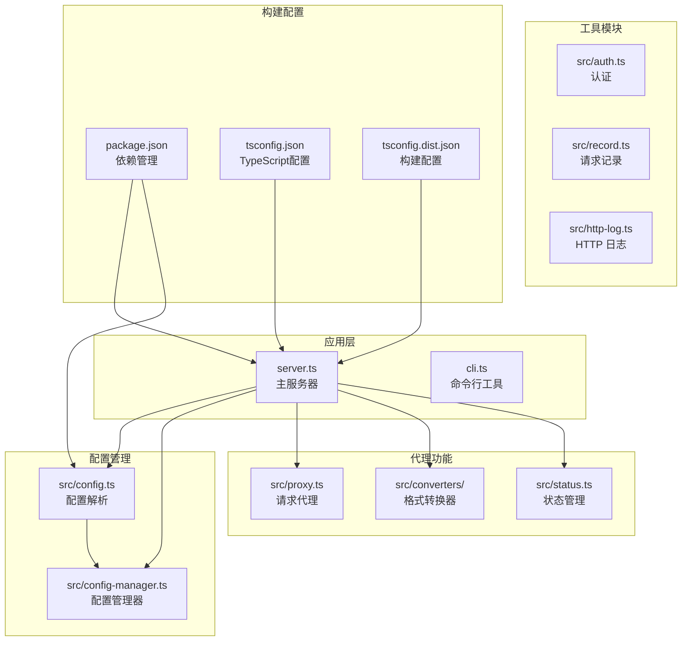
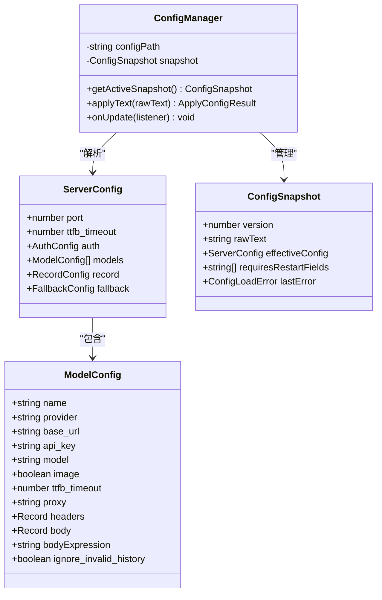
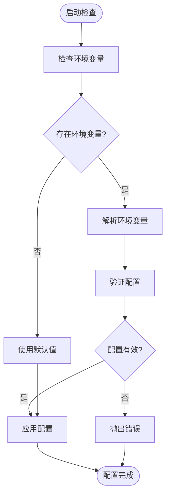
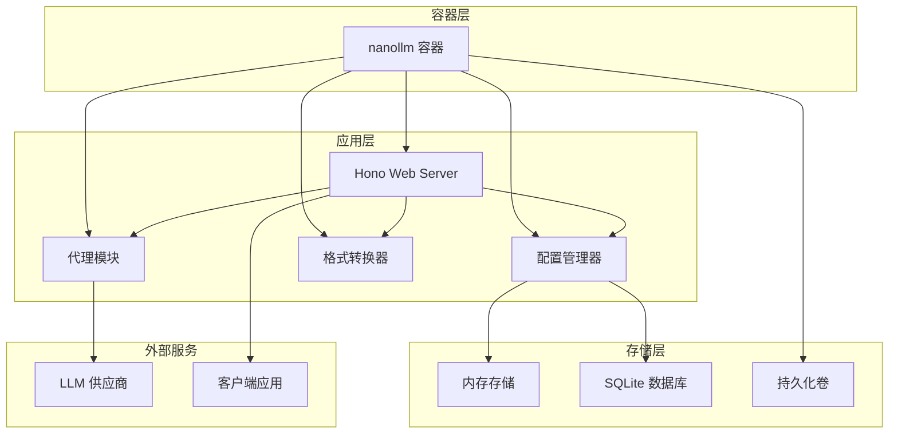
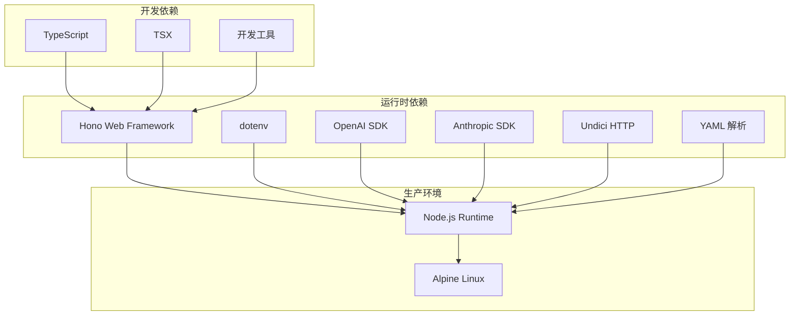
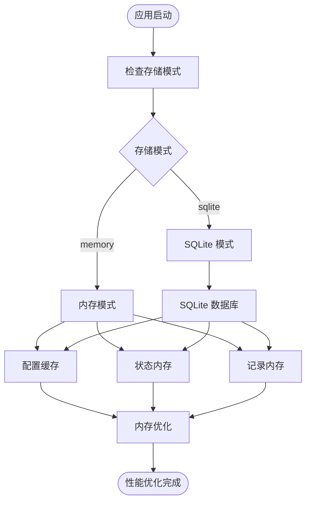
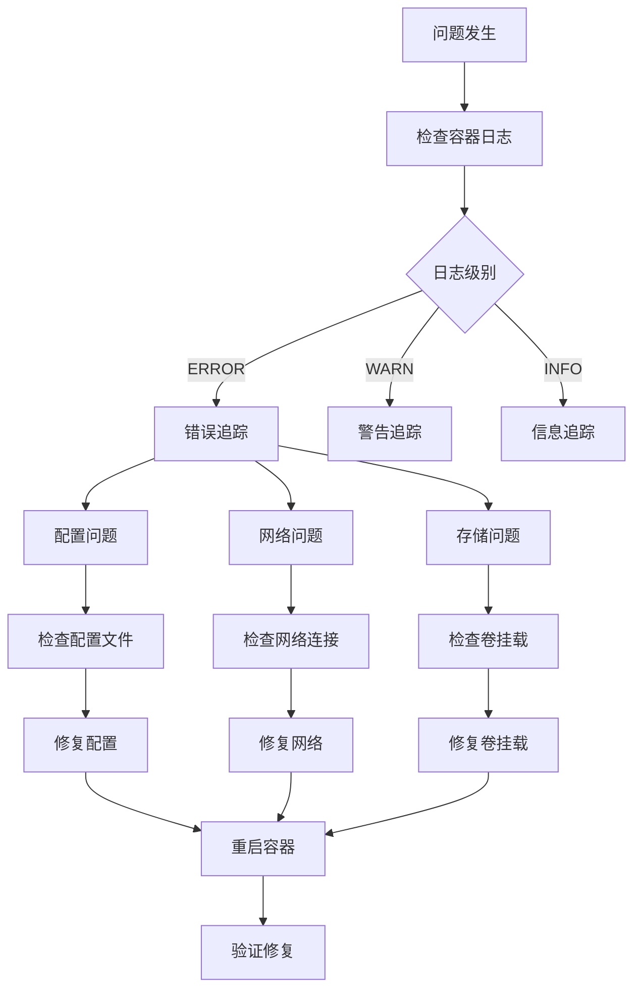
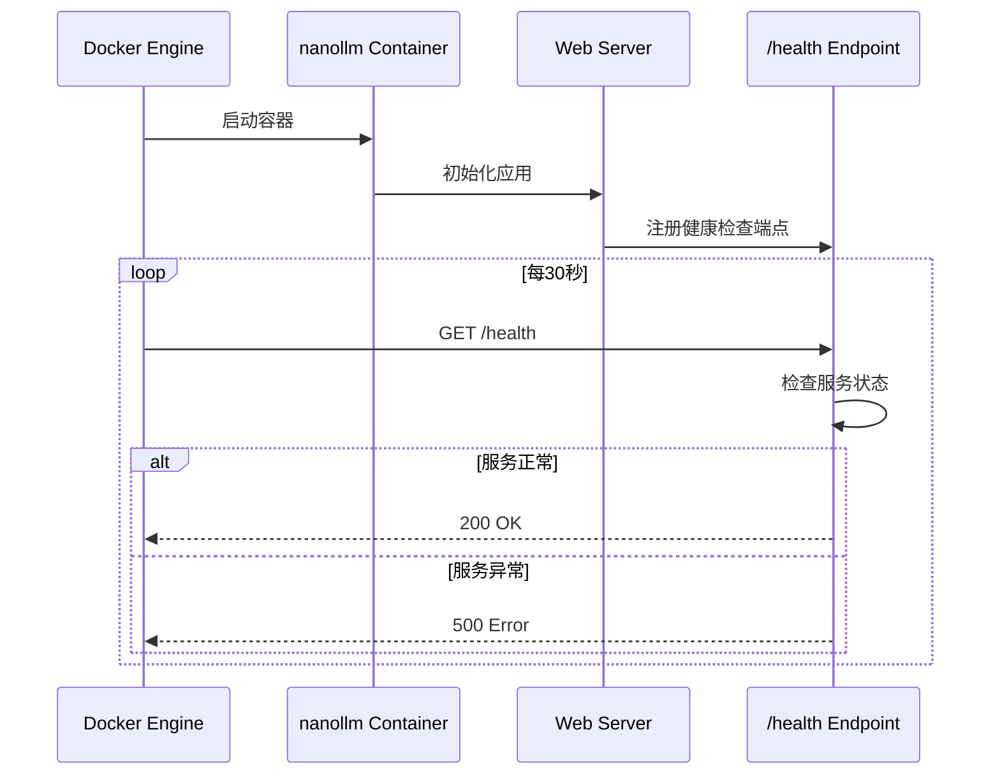

# Docker 容器化部署

<cite>
**本文档引用的文件**
- [package.json](file://package.json)
- [server.ts](file://server.ts)
- [README.md](file://README.md)
- [src/config.ts](file://src/config.ts)
- [src/config-manager.ts](file://src/config-manager.ts)
- [scripts/start-railway.sh](file://scripts/start-railway.sh)
- [tsconfig.dist.json](file://tsconfig.dist.json)
- [tsconfig.json](file://tsconfig.json)
</cite>

## 目录
1. [简介](#简介)
2. [项目结构](#项目结构)
3. [核心组件](#核心组件)
4. [架构概览](#架构概览)
5. [详细组件分析](#详细组件分析)
6. [依赖关系分析](#依赖关系分析)
7. [性能考虑](#性能考虑)
8. [故障排查指南](#故障排查指南)
9. [结论](#结论)
10. [附录](#附录)

## 简介

nanollm 是一个基于 Hono 框架的 LLM 模型代理服务器，专为轻量化和本地化设计，适合个人本地聚合多个模型的场景。该项目提供了类似 litellm 的功能，支持多种模型供应商的统一代理和管理。

本指南将详细介绍如何为 nanollm 创建 Docker 容器化部署方案，包括 Dockerfile 编写、多阶段构建配置、环境变量传递、卷挂载、网络设置、docker-compose 配置以及容器运行参数优化等内容。

## 项目结构

nanollm 项目采用模块化的 TypeScript 架构，主要包含以下核心组件：



**图表来源**
- [server.ts:1-1374](file://server.ts#L1-L1374)
- [src/config.ts:1-307](file://src/config.ts#L1-L307)
- [src/config-manager.ts:1-173](file://src/config-manager.ts#L1-L173)

**章节来源**
- [package.json:1-48](file://package.json#L1-L48)
- [tsconfig.json:1-15](file://tsconfig.json#L1-L15)
- [tsconfig.dist.json:1-11](file://tsconfig.dist.json#L1-L11)

## 核心组件

### 服务器配置系统

nanollm 的配置系统是其核心特性之一，支持动态热更新和多种配置格式：



**图表来源**
- [src/config.ts:24-35](file://src/config.ts#L24-L35)
- [src/config.ts:9-22](file://src/config.ts#L9-L22)
- [src/config-manager.ts:19-25](file://src/config-manager.ts#L19-L25)

### 环境变量处理机制

项目支持通过环境变量进行配置注入，提供了灵活的配置管理方式：



**图表来源**
- [src/config.ts:61-76](file://src/config.ts#L61-L76)
- [src/config.ts:202-230](file://src/config.ts#L202-L230)

**章节来源**
- [src/config.ts:1-307](file://src/config.ts#L1-L307)
- [src/config-manager.ts:1-173](file://src/config-manager.ts#L1-L173)

## 架构概览

nanollm 采用微服务架构，主要由以下几个核心组件构成：



**图表来源**
- [server.ts:145-146](file://server.ts#L145-L146)
- [src/config-manager.ts:58-75](file://src/config-manager.ts#L58-L75)

## 详细组件分析

### Dockerfile 多阶段构建配置

以下是推荐的 Dockerfile 多阶段构建配置：

```dockerfile
# 第一阶段：构建环境
FROM node:20-alpine AS builder

WORKDIR /app

# 复制依赖文件
COPY package.json package-lock.json ./

# 安装依赖
RUN npm ci --only=production

# 复制源代码
COPY . .

# 构建 TypeScript 代码
RUN npm run build

# 第二阶段：运行环境
FROM node:20-alpine AS runtime

# 设置工作目录
WORKDIR /app

# 创建非特权用户
RUN addgroup -r nanollm && adduser -r nanollm -G nanollm
USER nanollm

# 复制构建产物
COPY --from=builder /app/dist ./dist
COPY --from=builder /app/package.json ./package.json

# 设置环境变量
ENV NODE_ENV=production
ENV PORT=3000
ENV CONFIG_PATH=/data/config.yaml

# 创建数据目录
RUN mkdir -p /data

# 暴露端口
EXPOSE 3000

# 健康检查
HEALTHCHECK --interval=30s --timeout=3s --start-period=5s --retries=3 \
    CMD curl -f http://localhost:3000/health || exit 1

# 启动命令
CMD ["node", "dist/server.js"]
```

**章节来源**
- [package.json:13-22](file://package.json#L13-L22)
- [tsconfig.dist.json:1-11](file://tsconfig.dist.json#L1-L11)

### 环境变量配置

项目支持多种环境变量配置方式：

| 环境变量 | 默认值 | 描述 | 示例 |
|---------|--------|------|------|
| PORT | 3000 | 服务器监听端口 | 3000 |
| CONFIG_PATH | /data/config.yaml | 配置文件路径 | /data/config.yaml |
| NANOLLM_AUTH_TOKEN | 无 | 认证令牌 | your-secret-token |
| NANOLLM_STORAGE | sqlite | 存储模式 | memory |
| HOME | /data | 用户主目录 | /data |

**章节来源**
- [src/config.ts:221-222](file://src/config.ts#L221-L222)
- [scripts/start-railway.sh:4-6](file://scripts/start-railway.sh#L4-L6)

### 卷挂载配置

推荐的卷挂载配置：

```yaml
version: '3.8'

services:
  nanollm:
    image: nanollm:latest
    container_name: nanollm
    ports:
      - "3000:3000"
    volumes:
      - ./config.yaml:/data/config.yaml:ro
      - ./data:/data:rw
      - ./logs:/app/logs:rw
    environment:
      - PORT=3000
      - CONFIG_PATH=/data/config.yaml
      - NANOLLM_AUTH_TOKEN=your-secret-token
      - NANOLLM_STORAGE=sqlite
    restart: unless-stopped
    healthcheck:
      test: ["CMD", "curl", "-f", "http://localhost:3000/health"]
      interval: 30s
      timeout: 10s
      retries: 3
      start_period: 40s
```

**章节来源**
- [README.md:76-79](file://README.md#L76-L79)
- [scripts/start-railway.sh:28](file://scripts/start-railway.sh#L28)

### 网络设置

容器网络配置建议：

```mermaid
graph LR
subgraph "宿主机网络"
HostPort[3000:3000]
end
subgraph "Docker 网络"
Bridge[docker0 bridge]
ContainerNet[container network]
end
subgraph "容器内部"
Port3000[3000/tcp]
HealthCheck[/health endpoint]
end
HostPort --> Bridge
Bridge --> ContainerNet
ContainerNet --> Port3000
ContainerNet --> HealthCheck
```

**图表来源**
- [server.ts:1232](file://server.ts#L1232)

## 依赖关系分析

### 构建依赖图



**图表来源**
- [package.json:32-41](file://package.json#L32-L41)

### 运行时依赖分析

项目的主要运行时依赖包括：

- **Hono**: Web 框架，提供高性能的 HTTP 服务器
- **dotenv**: 环境变量管理
- **OpenAI**: OpenAI API 客户端
- **@anthropic-ai/sdk**: Anthropic Claude API 客户端
- **undici**: 高性能 HTTP 客户端
- **yaml**: YAML 配置文件解析

**章节来源**
- [package.json:32-41](file://package.json#L32-L41)

## 性能考虑

### 内存优化策略



**图表来源**
- [server.ts:129-130](file://server.ts#L129-L130)
- [src/config-manager.ts:58-75](file://src/config-manager.ts#L58-L75)

### 并发处理优化

nanollm 支持并发请求处理，通过以下机制实现：

1. **异步请求处理**: 使用 Promise 和 async/await 处理并发请求
2. **流式响应**: 支持 SSE 流式响应，提高实时性
3. **连接池管理**: 通过 Undici 提供高效的 HTTP 连接池
4. **超时控制**: 支持 TTFB 超时和请求超时配置

**章节来源**
- [server.ts:710-783](file://server.ts#L710-L783)
- [src/config.ts:159-160](file://src/config.ts#L159-L160)

## 故障排查指南

### 常见问题诊断



**图表来源**
- [server.ts:153-178](file://server.ts#L153-L178)

### 健康检查配置



**图表来源**
- [server.ts:1232](file://server.ts#L1232)

### 日志管理最佳实践

推荐的日志配置：

```yaml
version: '3.8'

services:
  nanollm:
    logging:
      driver: "json-file"
      options:
        max-size: "10m"
        max-file: "3"
    environment:
      - NODE_ENV=production
      - LOG_LEVEL=info
    volumes:
      - ./logs:/app/logs:rw
```

**章节来源**
- [server.ts:153-178](file://server.ts#L153-L178)

## 结论

nanollm 的 Docker 容器化部署提供了高度的灵活性和可扩展性。通过合理的多阶段构建、环境变量配置、卷挂载和网络设置，可以实现稳定可靠的生产环境部署。

关键优势包括：
- **轻量化**: 基于 Alpine Linux 的精简镜像
- **安全性**: 非特权用户运行和最小权限原则
- **可维护性**: 支持动态配置热更新
- **可观测性**: 内置健康检查和详细的日志记录

建议在生产环境中结合监控工具和备份策略，确保系统的高可用性和数据安全。

## 附录

### 完整的 docker-compose.yml 示例

```yaml
version: '3.8'

services:
  nanollm:
    build:
      context: .
      dockerfile: Dockerfile
    container_name: nanollm
    ports:
      - "3000:3000"
    volumes:
      - ./config.yaml:/data/config.yaml:ro
      - ./data:/data:rw
      - ./logs:/app/logs:rw
    environment:
      - PORT=3000
      - CONFIG_PATH=/data/config.yaml
      - NANOLLM_AUTH_TOKEN=${NANOLLM_AUTH_TOKEN}
      - NANOLLM_STORAGE=sqlite
      - NODE_ENV=production
    restart: unless-stopped
    healthcheck:
      test: ["CMD", "curl", "-f", "http://localhost:3000/health"]
      interval: 30s
      timeout: 10s
      retries: 3
      start_period: 40s
    logging:
      driver: "json-file"
      options:
        max-size: "10m"
        max-file: "3"
    deploy:
      resources:
        limits:
          cpus: '0.5'
          memory: 512M
        reservations:
          cpus: '0.25'
          memory: 256M
```

### 环境变量参考表

| 环境变量 | 类型 | 必需 | 默认值 | 描述 |
|---------|------|------|--------|------|
| PORT | number | 否 | 3000 | 服务器监听端口 |
| CONFIG_PATH | string | 否 | /data/config.yaml | 配置文件路径 |
| NANOLLM_AUTH_TOKEN | string | 否 | 无 | 认证令牌 |
| NANOLLM_STORAGE | string | 否 | sqlite | 存储模式(memory/sqlite) |
| NODE_ENV | string | 否 | production | Node.js 环境 |
| HOME | string | 否 | /data | 用户主目录 |