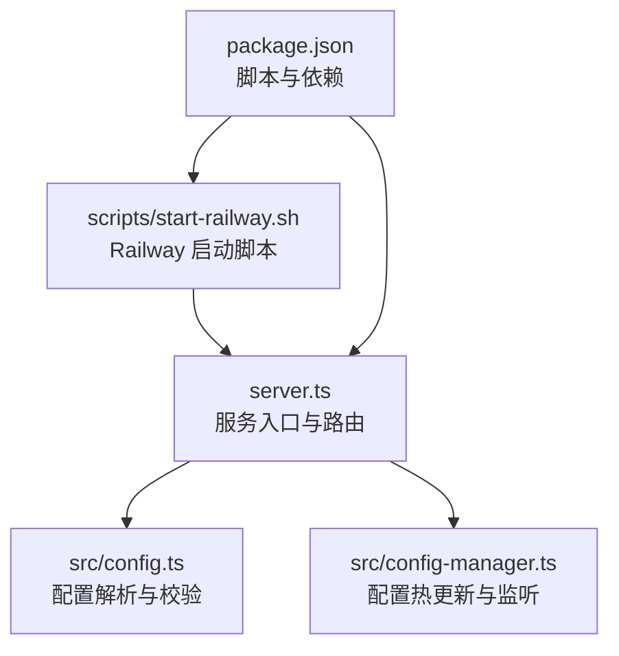
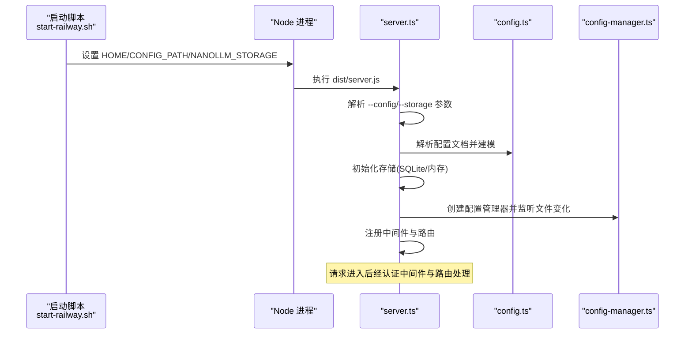
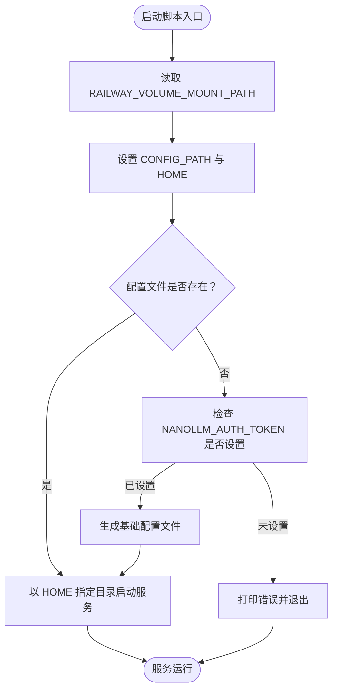
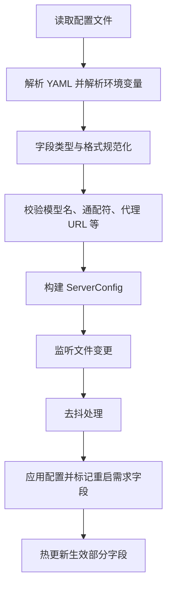
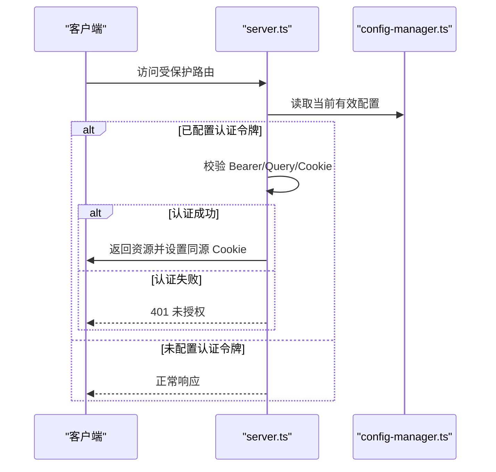
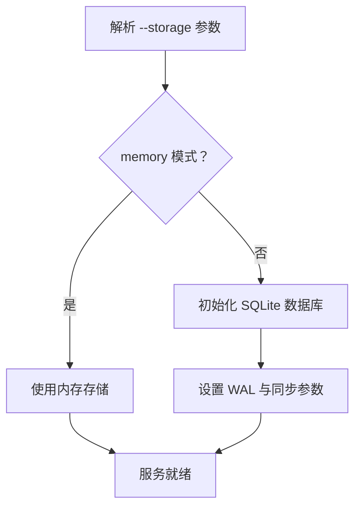
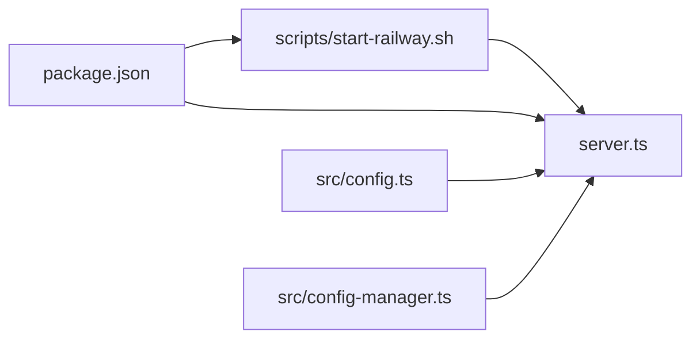

# 云平台部署

<cite>
**本文引用的文件**
- [README.md](file://README.md)
- [package.json](file://package.json)
- [scripts/start-railway.sh](file://scripts/start-railway.sh)
- [src/config.ts](file://src/config.ts)
- [src/config-manager.ts](file://src/config-manager.ts)
- [server.ts](file://server.ts)
</cite>

## 目录
1. [简介](#简介)
2. [项目结构](#项目结构)
3. [核心组件](#核心组件)
4. [架构总览](#架构总览)
5. [详细组件分析](#详细组件分析)
6. [依赖关系分析](#依赖关系分析)
7. [性能考虑](#性能考虑)
8. [故障排查指南](#故障排查指南)
9. [结论](#结论)
10. [附录](#附录)

## 简介
本指南面向在云平台上部署 nanollm 的工程师与运维人员，重点围绕 Railway 平台的部署配置进行说明，涵盖环境变量、Volume 挂载、自动初始化流程、认证与存储模式、日志与监控、性能优化建议，以及容器化部署的优势与要点。同时提供 Vercel、Render 等平台的参考配置思路，帮助快速落地。

## 项目结构
- 服务入口与启动逻辑集中在服务端主文件中，负责解析命令行参数、加载配置、初始化存储与记录器、注册路由与中间件。
- 配置系统由配置解析与热更新模块组成，支持 YAML 配置文件的读取、校验、热更新与持久化。
- Railway 提供了专用的启动脚本，用于在首次启动时根据环境变量生成初始配置并挂载 Volume 作为配置与存储目录。
- 包管理脚本中包含针对 Railway 的启动脚本别名，便于一键启动。

图表来源
- [server.ts:59-136](file://server.ts#L59-L136)
- [src/config.ts:189-238](file://src/config.ts#L189-L238)
- [src/config-manager.ts:58-75](file://src/config-manager.ts#L58-L75)
- [scripts/start-railway.sh:1-28](file://scripts/start-railway.sh#L1-L28)
- [package.json:13-22](file://package.json#L13-L22)

章节来源
- [server.ts:59-136](file://server.ts#L59-L136)
- [src/config.ts:189-238](file://src/config.ts#L189-L238)
- [src/config-manager.ts:58-75](file://src/config-manager.ts#L58-L75)
- [scripts/start-railway.sh:1-28](file://scripts/start-railway.sh#L1-L28)
- [package.json:13-22](file://package.json#L13-L22)

## 核心组件
- 配置解析与建模
  - 解析 YAML 文档，支持环境变量占位符解析、类型规范化、超时与正整数校验、代理 URL 校验、通配模型名校验与匹配。
  - 输出标准化的服务器配置对象，包含端口、认证令牌、模型列表、兜底分组与记录最大条数等。
- 配置热更新与监听
  - 基于文件变更监听实现热更新，区分启动、UI 应用与文件监听三类来源，计算是否需要重启的字段集合。
  - 对配置变更进行去抖处理，确保频繁写入时的稳定性。
- 启动与存储模式
  - 支持通过命令行参数选择存储模式（内存/SQLite），SQLite 数据库存放于用户主目录下的固定路径。
  - 启动时根据配置路径与存储模式初始化数据库连接与记录器。
- 认证与访问控制
  - 支持 Bearer Token 认证，除健康检查外的所有路由均受保护；支持一次性查询参数登录与同源 Cookie 维持会话。
- 日志与监控
  - HTTP 请求日志按路径级别输出，支持流式请求的开始事件记录；提供状态页与记录页，支持 SQLite 持久化。

章节来源
- [src/config.ts:189-238](file://src/config.ts#L189-L238)
- [src/config-manager.ts:58-173](file://src/config-manager.ts#L58-L173)
- [server.ts:126-136](file://server.ts#L126-L136)
- [server.ts:153-213](file://server.ts#L153-L213)
- [README.md:91-124](file://README.md#L91-L124)

## 架构总览
下图展示了服务启动到路由处理的关键流程，包括配置解析、存储初始化、认证中间件与路由处理链路。

图表来源
- [scripts/start-railway.sh:1-28](file://scripts/start-railway.sh#L1-L28)
- [server.ts:59-136](file://server.ts#L59-L136)
- [src/config.ts:189-238](file://src/config.ts#L189-L238)
- [src/config-manager.ts:58-75](file://src/config-manager.ts#L58-L75)

## 详细组件分析

### Railway 平台部署配置
- 环境变量
  - NANOLLM_AUTH_TOKEN：用于启用 Bearer Token 认证，首次启动前必须设置，否则启动脚本会报错退出。
  - NANOLLM_STORAGE：控制存储模式，缺省为 sqlite。
  - RAILWAY_VOLUME_MOUNT_PATH：Railway Volume 挂载路径，缺省为 /data。
  - CONFIG_PATH：配置文件绝对路径，缺省为 ${RAILWAY_VOLUME_MOUNT_PATH}/config.yaml。
- Volume 挂载
  - 建议将 RAILWAY_VOLUME_MOUNT_PATH 指向已创建的 Volume，确保配置文件与 SQLite 数据持久化。
- 自动初始化流程
  - 若 CONFIG_PATH 指定的配置文件不存在，启动脚本会检查 NANOLLM_AUTH_TOKEN 是否已设置，若缺失则拒绝启动；否则以模板形式生成基础配置文件，并在 HOME 指定的目录下启动服务。
- 启动命令
  - 使用 npm 脚本别名一键启动 Railway 版本的服务。

图表来源
- [scripts/start-railway.sh:1-28](file://scripts/start-railway.sh#L1-L28)

章节来源
- [scripts/start-railway.sh:1-28](file://scripts/start-railway.sh#L1-L28)
- [README.md:91-124](file://README.md#L91-L124)

### 配置系统与热更新
- 配置解析
  - 支持环境变量占位符解析，允许在 YAML 中使用 ${VAR} 引用进程环境变量。
  - 对超时、正整数、布尔值、代理 URL 等字段进行严格校验，保证配置合法性。
- 热更新机制
  - 监听配置文件变更，去抖后批量应用；区分启动、UI 应用与文件监听三类来源。
  - 对需要重启才能生效的字段（如端口、认证令牌）进行标记，避免运行时误判。
- 配置应用范围
  - 模型列表、兜底分组、服务器 TTFB 超时、记录最大条数等在运行时即时生效；端口与认证令牌需重启进程。

图表来源
- [src/config.ts:189-238](file://src/config.ts#L189-L238)
- [src/config-manager.ts:58-173](file://src/config-manager.ts#L58-L173)

章节来源
- [src/config.ts:189-238](file://src/config.ts#L189-L238)
- [src/config-manager.ts:58-173](file://src/config-manager.ts#L58-L173)

### 认证与访问控制
- 认证开关
  - 当配置中存在认证令牌时，除健康检查外的所有路由均需认证。
- 认证方式
  - 支持 Authorization: Bearer 头、一次性查询参数 token、同源 Cookie 维持会话。
- 管理页面
  - 首次成功认证后，服务端会写入同源 Cookie，后续无需重复携带 token。

图表来源
- [server.ts:195-213](file://server.ts#L195-L213)
- [src/config-manager.ts:77-79](file://src/config-manager.ts#L77-L79)
- [README.md:91-124](file://README.md#L91-L124)

章节来源
- [server.ts:195-213](file://server.ts#L195-L213)
- [src/config-manager.ts:77-79](file://src/config-manager.ts#L77-L79)
- [README.md:91-124](file://README.md#L91-L124)

### 存储模式与持久化
- 存储模式
  - memory：默认模式，数据仅驻留内存，进程重启后丢失。
  - sqlite：启用 SQLite 存储，状态与记录可在进程重启后保留。
- SQLite 初始化
  - 在用户主目录下创建固定路径的数据库文件，启用 WAL 模式与合理的同步策略。
- 记录与状态
  - 启动时根据配置初始化记录器；热更新时可调整记录最大条数。

图表来源
- [server.ts:88-124](file://server.ts#L88-L124)
- [server.ts:126-136](file://server.ts#L126-L136)

章节来源
- [server.ts:88-124](file://server.ts#L88-L124)
- [server.ts:126-136](file://server.ts#L126-L136)

### 日志与监控
- HTTP 日志
  - 按路径级别输出请求开始、结束与流式开始事件，便于定位延迟与异常。
- 监控与记录
  - 提供状态页与记录页，支持 SQLite 持久化记录最近请求，便于调试与审计。
- 性能观测
  - 记录桶与失败追踪结合，辅助评估模型健康与兜底策略效果。

章节来源
- [server.ts:153-178](file://server.ts#L153-L178)
- [README.md:302-309](file://README.md#L302-L309)

### 其他云平台参考配置
- Vercel
  - 使用 Hono 的原生 Node 服务器适配器，建议将配置文件与 SQLite 数据存放于 Vercel Edge Runtime 不可变区域之外的持久化存储或外部数据库。
  - 通过环境变量注入认证令牌与上游 API 密钥，避免硬编码。
- Render
  - 使用静态构建产物与 Node 服务器运行，建议将配置文件放置于应用根目录或通过环境变量指定路径。
  - 利用 Render 的卷挂载功能持久化 SQLite 数据库文件，确保状态与记录跨重启保留。
- 通用建议
  - 将敏感配置（如认证令牌、上游密钥）统一通过平台的环境变量管理。
  - 使用健康检查端点定期探测服务可用性，结合平台日志与告警联动。

[本节为概念性说明，不直接分析具体文件，故不附加章节来源]

## 依赖关系分析
- 启动脚本依赖 Node 运行时与服务主程序，通过环境变量传递配置与存储模式。
- 服务主程序依赖配置解析与热更新模块，二者共同保证配置的正确性与运行时可更新能力。
- 存储初始化依赖 SQLite 模块（在启用 sqlite 模式时），并受 Node 版本能力限制。

图表来源
- [scripts/start-railway.sh:1-28](file://scripts/start-railway.sh#L1-L28)
- [package.json:13-22](file://package.json#L13-L22)
- [server.ts:59-136](file://server.ts#L59-L136)
- [src/config.ts:189-238](file://src/config.ts#L189-L238)
- [src/config-manager.ts:58-75](file://src/config-manager.ts#L58-L75)

章节来源
- [scripts/start-railway.sh:1-28](file://scripts/start-railway.sh#L1-L28)
- [package.json:13-22](file://package.json#L13-L22)
- [server.ts:59-136](file://server.ts#L59-L136)
- [src/config.ts:189-238](file://src/config.ts#L189-L238)
- [src/config-manager.ts:58-75](file://src/config-manager.ts#L58-L75)

## 性能考虑
- 超时与重试
  - 合理设置服务器与模型级 TTFB 超时，避免长时间阻塞；利用兜底分组提升可用性。
- 流式传输
  - 保持 Hop-by-Hop 头过滤与正确的 SSE 响应头，减少不必要的缓冲与延迟。
- 存储与 IO
  - SQLite 启用 WAL 模式与合适的同步策略，降低写入竞争；在高并发场景建议评估外部数据库方案。
- 日志级别
  - 根据路径设置日志级别，避免在生产环境输出过多冗余日志。

[本节提供一般性建议，不直接分析具体文件，故不附加章节来源]

## 故障排查指南
- 启动失败（Railway）
  - 症状：首次启动提示缺少认证令牌。
  - 处理：在平台变量中设置 NANOLLM_AUTH_TOKEN 后重试。
- 配置无效或未生效
  - 症状：修改配置后部分字段未生效。
  - 处理：确认字段是否属于需要重启的范畴；检查配置文件语法与字段类型。
- 认证失败
  - 症状：401 未授权。
  - 处理：核对 Bearer Token、一次性 token 查询参数与 Cookie；确认服务端已写入同源 Cookie。
- 记录与状态异常
  - 症状：状态页或记录页为空。
  - 处理：确认是否启用 SQLite 存储；检查记录最大条数配置。

章节来源
- [scripts/start-railway.sh:10-14](file://scripts/start-railway.sh#L10-L14)
- [src/config-manager.ts:91-131](file://src/config-manager.ts#L91-L131)
- [server.ts:195-213](file://server.ts#L195-L213)
- [README.md:302-309](file://README.md#L302-L309)

## 结论
通过 Railwary 的 Volume 挂载与启动脚本，nanollm 可以在云平台上实现安全、可持久化的部署。配合环境变量管理敏感配置、利用 SQLite 持久化状态与记录，以及基于日志与监控页面的可观测性，能够满足大多数 LLM 代理服务的运行需求。对于其他平台，可参考本文的配置思路与最佳实践，结合平台特性进行适配。

## 附录
- 关键环境变量
  - NANOLLM_AUTH_TOKEN：启用 Bearer Token 认证。
  - NANOLLM_STORAGE：选择存储模式（memory/sqlite）。
  - RAILWAY_VOLUME_MOUNT_PATH：Railway Volume 挂载路径。
  - CONFIG_PATH：配置文件绝对路径。
- 常用命令
  - Railway 启动脚本别名：参见包管理脚本中的 start:railway 脚本。

章节来源
- [scripts/start-railway.sh:4-6](file://scripts/start-railway.sh#L4-L6)
- [package.json:17](file://package.json#L17)