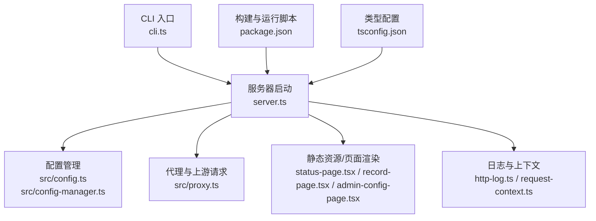
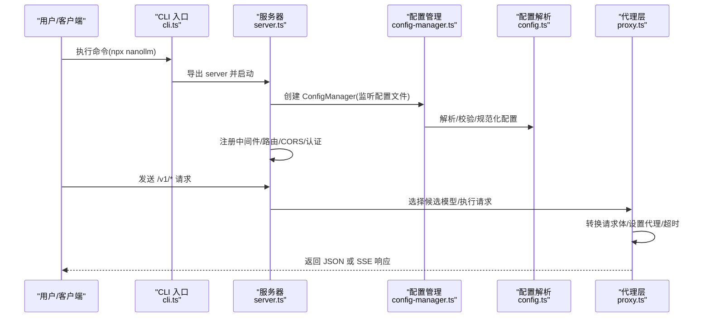
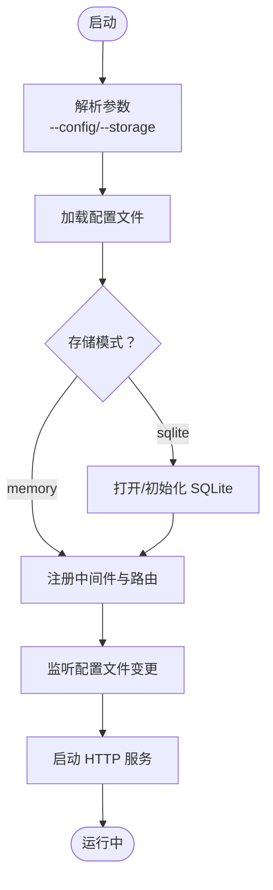
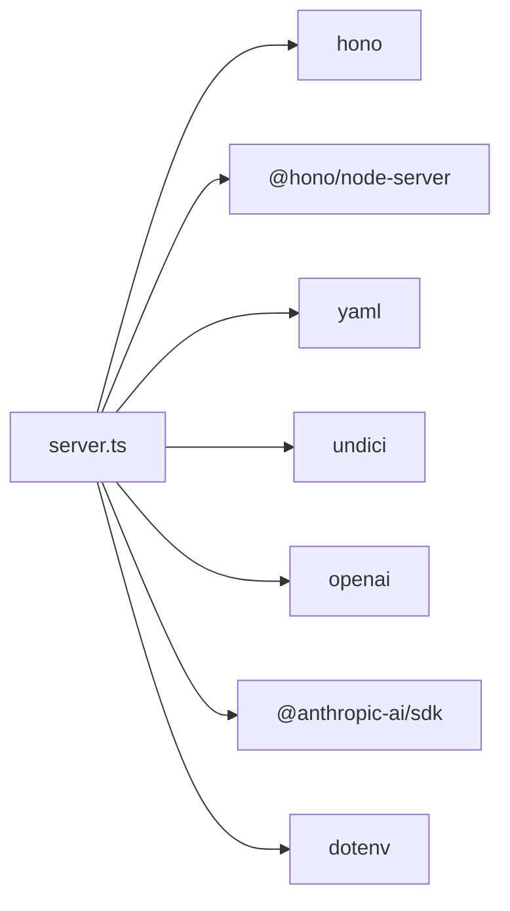

# 本地部署

<cite>
**本文引用的文件**
- [README.md](file://README.md)
- [package.json](file://package.json)
- [server.ts](file://server.ts)
- [cli.ts](file://cli.ts)
- [src/config.ts](file://src/config.ts)
- [src/config-manager.ts](file://src/config-manager.ts)
- [src/proxy.ts](file://src/proxy.ts)
- [tsconfig.json](file://tsconfig.json)
- [.github/workflows/release-binaries.yml](file://.github/workflows/release-binaries.yml)
- [scripts/start-railway.sh](file://scripts/start-railway.sh)
</cite>

## 目录
1. [简介](#简介)
2. [项目结构](#项目结构)
3. [核心组件](#核心组件)
4. [架构总览](#架构总览)
5. [详细组件分析](#详细组件分析)
6. [依赖分析](#依赖分析)
7. [性能考虑](#性能考虑)
8. [故障排查指南](#故障排查指南)
9. [结论](#结论)
10. [附录](#附录)

## 简介
本指南面向希望在本地部署 nanollm 的用户，提供从环境准备、项目克隆与安装、配置文件设置、数据库初始化到启动流程的完整说明，并针对 Windows、macOS、Linux 三大平台给出差异化注意事项。同时提供本地开发环境配置示例、调试方法与常见问题排查方案。

## 项目结构
- 顶层脚本与入口
  - CLI 入口通过二进制映射到构建产物，实际运行由 server.ts 提供 Hono 应用。
  - package.json 定义了构建、开发与测试脚本，以及运行时依赖。
- 核心运行时
  - server.ts 负责解析命令行参数、加载配置、初始化存储、注册路由与中间件、启动 HTTP 服务。
  - src/config.ts 与 src/config-manager.ts 负责配置解析、规范化、热更新与监听。
  - src/proxy.ts 负责上游请求转发、SSE 流验证、超时控制、代理与头部处理。
- 开发与打包
  - tsconfig.json 定义编译目标与模块解析策略。
  - .github/workflows/release-binaries.yml 展示了跨平台构建与发布流程，可用于理解 Node.js 版本要求与运行时差异。
  - scripts/start-railway.sh 展示了在容器/云环境中如何初始化配置与存储模式。

**图表来源**
- [cli.ts:1-5](file://cli.ts#L1-L5)
- [server.ts:126-145](file://server.ts#L126-L145)
- [src/config.ts:1-307](file://src/config.ts#L1-L307)
- [src/config-manager.ts:1-173](file://src/config-manager.ts#L1-L173)
- [src/proxy.ts:1-630](file://src/proxy.ts#L1-L630)
- [package.json:13-22](file://package.json#L13-L22)
- [tsconfig.json:1-15](file://tsconfig.json#L1-L15)

**章节来源**
- [package.json:13-22](file://package.json#L13-L22)
- [server.ts:126-145](file://server.ts#L126-L145)
- [tsconfig.json:1-15](file://tsconfig.json#L1-L15)

## 核心组件
- 配置解析与热更新
  - 解析 YAML 文档，支持环境变量占位符替换、字段类型与范围校验、默认值注入。
  - 支持热更新：models、fallback、server.ttfb_timeout、record.max_size 热生效；server.port、server.auth.token 需重启。
- 代理与上游请求
  - 统一构造上游 URL、鉴权头、代理、超时控制；支持 JSON 与 multipart 请求体转换；SSE 流验证与缓冲校验。
- 服务器与路由
  - 注册 /v1/* 与管理页面路由；统一 CORS、认证中间件；HTTP 日志与请求 ID 上下文。
- 存储与持久化
  - 支持 memory 与 sqlite 两种存储模式；sqlite 默认路径位于用户主目录下的 .nanollm/nanollm.sqlite3。

**章节来源**
- [src/config.ts:202-230](file://src/config.ts#L202-L230)
- [src/config-manager.ts:58-115](file://src/config-manager.ts#L58-L115)
- [src/proxy.ts:274-407](file://src/proxy.ts#L274-L407)
- [server.ts:145-213](file://server.ts#L145-L213)
- [server.ts:109-130](file://server.ts#L109-L130)

## 架构总览
下图展示了本地部署的关键交互：CLI 启动 -> 加载配置 -> 初始化存储 -> 注册路由 -> 处理请求 -> 代理上游 -> 返回响应。

**图表来源**
- [cli.ts:1-5](file://cli.ts#L1-L5)
- [server.ts:126-145](file://server.ts#L126-L145)
- [src/config-manager.ts:64-75](file://src/config-manager.ts#L64-L75)
- [src/config.ts:189-234](file://src/config.ts#L189-L234)
- [src/proxy.ts:274-407](file://src/proxy.ts#L274-L407)

## 详细组件分析

### 环境准备与系统依赖
- Node.js 版本
  - 发布流水线使用 Node.js 24.9.0，建议本地开发与生产均采用兼容版本。
  - 若使用内置 sqlite 数据库存储，需确保 Node.js 版本支持 node:sqlite。
- 包管理器
  - 使用 npm，推荐使用与 CI 一致的版本以避免构建差异。
- 系统依赖
  - 无额外系统库依赖，网络访问需可连接上游模型供应商域名。
  - 如需代理访问，确保代理地址格式正确（http:// 或 https://）。

**章节来源**
- [.github/workflows/release-binaries.yml:74-78](file://.github/workflows/release-binaries.yml#L74-L78)
- [src/proxy.ts:132-144](file://src/proxy.ts#L132-L144)

### 项目克隆与安装
- 克隆仓库后，在项目根目录执行安装：
  - npm ci 或 npm install
- 构建与运行
  - 构建：npm run build
  - 开发运行：npm run dev（监听 server.ts）
  - 直接运行：npm start（基于 tsx）

**章节来源**
- [package.json:13-22](file://package.json#L13-L22)

### 配置文件设置
- 配置文件位置解析顺序
  - 显式参数：--config /path/to/config.yaml
  - 环境变量：CONFIG_PATH
  - 当前目录：config.yaml
- 配置项要点
  - server.port：默认 3000，热更新需重启
  - server.ttfb_timeout：毫秒，上游首字节超时
  - server.auth.token：Bearer 认证令牌，热更新需重启
  - record.max_size：记录条数上限
  - models：name/provider/base_url/api_key/model 等
  - fallback：分组名到模型名数组
- 热更新规则
  - models、fallback、server.ttfb_timeout、record.max_size 热生效
  - server.port、server.auth.token 需重启

**章节来源**
- [server.ts:59-86](file://server.ts#L59-L86)
- [src/config.ts:202-230](file://src/config.ts#L202-L230)
- [src/config-manager.ts:44-56](file://src/config-manager.ts#L44-L56)
- [README.md:11-114](file://README.md#L11-L114)

### 数据库初始化与存储模式
- 存储模式
  - memory：默认，进程内缓存，重启丢失
  - sqlite：持久化，数据保存于 ~/.nanollm/nanollm.sqlite3
- 初始化
  - 启动时如选择 sqlite，将自动创建数据库并初始化 PRAGMA 设置
- 云/容器环境示例
  - scripts/start-railway.sh 展示了在容器中初始化配置与 HOME 目录挂载的方式

**章节来源**
- [server.ts:88-107](file://server.ts#L88-L107)
- [server.ts:109-130](file://server.ts#L109-L130)
- [scripts/start-railway.sh:4-29](file://scripts/start-railway.sh#L4-L29)

### 启动流程
- 命令行参数
  - --config：指定配置文件路径
  - --storage：memory 或 sqlite
- 启动步骤
  1) 解析配置路径与存储模式
  2) 初始化存储（sqlite 可选）
  3) 创建 ConfigManager 并监听配置文件变化
  4) 注册中间件（CORS、认证、日志）
  5) 注册路由（/v1/*、/admin、/status、/record）
  6) 启动 HTTP 服务

**图表来源**
- [server.ts:59-107](file://server.ts#L59-L107)
- [server.ts:145-213](file://server.ts#L145-L213)
- [src/config-manager.ts:146-171](file://src/config-manager.ts#L146-L171)

**章节来源**
- [server.ts:126-145](file://server.ts#L126-L145)

### 不同操作系统部署差异与注意事项
- Windows
  - 使用 PowerShell 或 WSL；确保 npm 与 Node.js 版本一致
  - 注意路径分隔符与大小写敏感性
- macOS
  - 使用终端；如需代理，确保 HTTPS_PROXY/HTTP_PROXY 环境变量正确
  - SQLite 文件位于用户主目录下
- Linux
  - 使用 Bash；如需 systemd 管理，建议配合 --storage sqlite
  - 注意防火墙与 SELinux 对网络访问的影响

[本节为通用平台差异说明，不直接分析具体文件，故无“章节来源”]

### 本地开发环境配置示例与调试方法
- 开发运行
  - npm run dev：监听 server.ts，热重载
  - npm start：基于 tsx 直接运行
- 调试技巧
  - 查看 HTTP 日志：server.ts 中间件输出请求开始/结束、耗时与状态
  - 认证调试：使用 Bearer Token 或一次性 token 参数访问管理页
  - 记录与回放：/record 页面查看最近请求，支持回放到 /v1/* 路径
  - 配置热更新：/admin 页面在线编辑，保存后立即生效（除端口与认证令牌外）

**章节来源**
- [package.json:13-22](file://package.json#L13-L22)
- [server.ts:153-178](file://server.ts#L153-L178)
- [README.md:286-309](file://README.md#L286-L309)

## 依赖分析
- 运行时依赖
  - Hono：Web 框架
  - @hono/node-server：Node.js 服务器
  - yaml：YAML 解析
  - openai、@anthropic-ai/sdk：上游 SDK
  - undici：HTTP/代理与流处理
  - dotenv：环境变量加载
- 开发依赖
  - tsx：TypeScript 运行器
  - TypeScript：类型检查与编译

**图表来源**
- [server.ts:1-56](file://server.ts#L1-L56)
- [package.json:32-41](file://package.json#L32-L41)

**章节来源**
- [package.json:32-41](file://package.json#L32-L41)

## 性能考虑
- 超时与并发
  - server.ttfb_timeout 控制上游首字节超时；各模型可独立配置 ttfb_timeout
  - SSE 流验证限制最大缓冲字节数，避免长时间无内容导致内存占用过高
- 代理与网络
  - 支持 per-model 代理优先级：模型代理 > HTTPS_PROXY > HTTP_PROXY > 直连
- 存储与记录
  - memory 模式适合开发；生产建议 sqlite，结合记录上限控制内存占用

**章节来源**
- [src/proxy.ts:296-407](file://src/proxy.ts#L296-L407)
- [src/proxy.ts:441-504](file://src/proxy.ts#L441-L504)
- [src/config.ts:89-97](file://src/config.ts#L89-L97)

## 故障排查指南
- 缺少配置文件
  - 症状：启动时报缺少配置文件
  - 处理：使用 --config 指定路径，或在当前目录放置 config.yaml
- 配置解析错误
  - 症状：保存配置后管理页报错
  - 处理：检查字段类型与范围（正整数、布尔、URL），确认环境变量占位符是否正确解析
- 认证失败
  - 症状：401 Unauthorized
  - 处理：确认 Authorization: Bearer 令牌或一次性 token 参数；确认 server.auth.token 是否已写回并重启
- 上游超时/HTML 错误页
  - 症状：SSE 非法内容或超时
  - 处理：提高 ttfb_timeout；检查上游返回是否为 HTML 错误页；确认代理与网络连通
- 端口占用
  - 症状：无法绑定端口
  - 处理：更换 server.port 或释放占用端口
- SQLite 初始化失败
  - 症状：提示无法初始化 SQLite
  - 处理：确认 Node.js 版本支持 node:sqlite；检查用户主目录权限

**章节来源**
- [server.ts:83-85](file://server.ts#L83-L85)
- [src/config.ts:99-107](file://src/config.ts#L99-L107)
- [src/proxy.ts:321-407](file://src/proxy.ts#L321-L407)
- [server.ts:109-124](file://server.ts#L109-L124)

## 结论
通过以上步骤，您可以在本地完成 nanollm 的环境准备、配置与启动，并根据平台差异进行针对性优化。建议在开发阶段使用 memory 存储快速迭代，生产阶段切换至 sqlite 并完善认证与代理配置。

## 附录
- 常用命令速查
  - 安装：npm ci
  - 构建：npm run build
  - 开发：npm run dev
  - 运行：npm start
  - 指定配置：npx nanollm --config /path/to/config.yaml
  - 指定存储：npx nanollm --storage sqlite
- 管理与监控
  - 管理页：http://localhost:3000/admin
  - 监控页：http://localhost:3000/status
  - 记录页：http://localhost:3000/record

[本节为操作速查，不直接分析具体文件，故无“章节来源”]