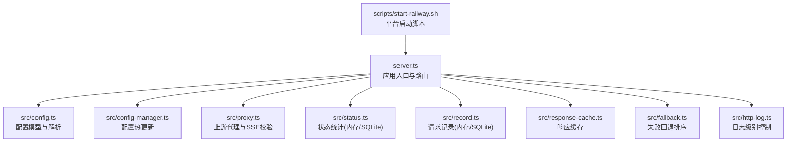
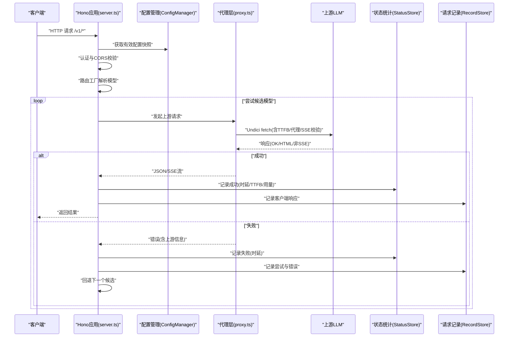
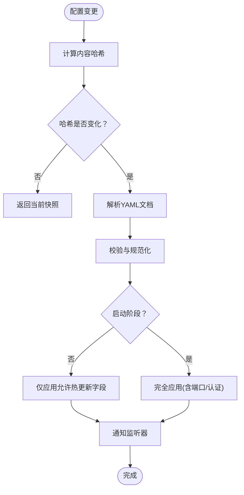
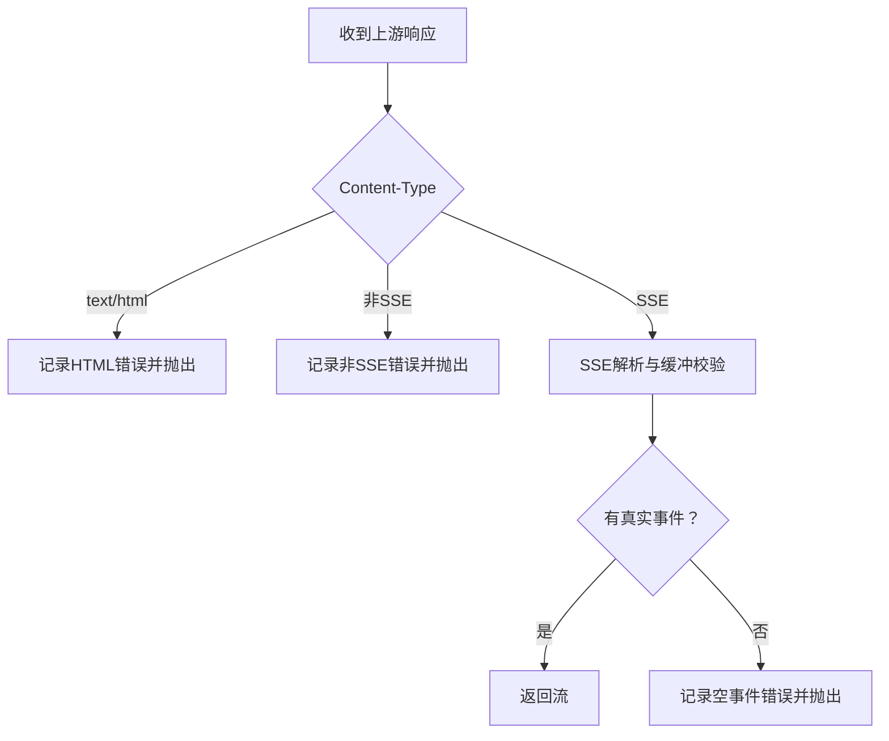
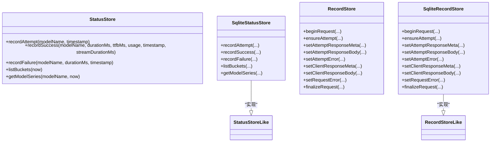
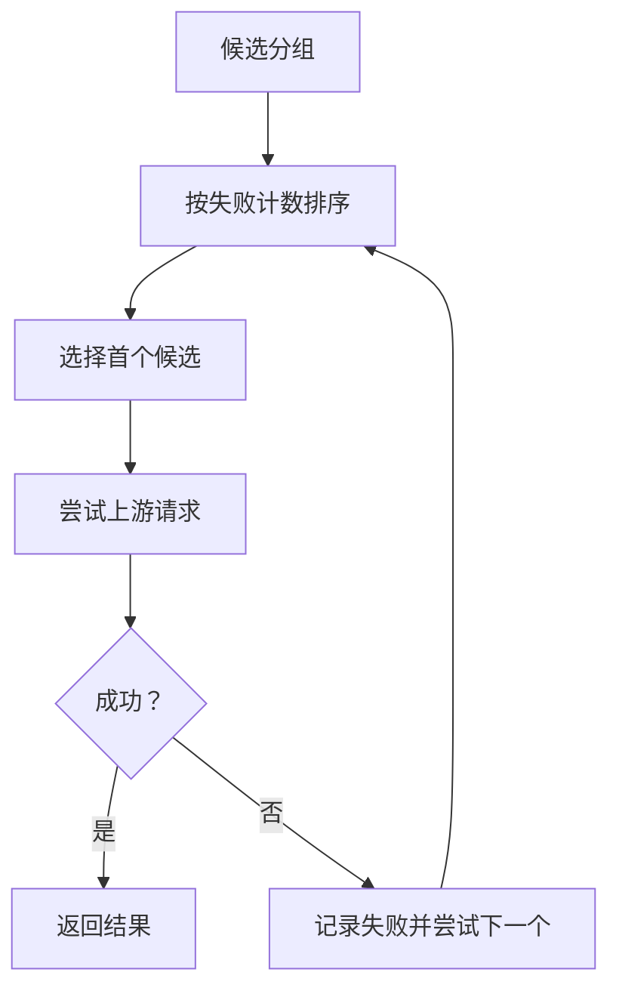
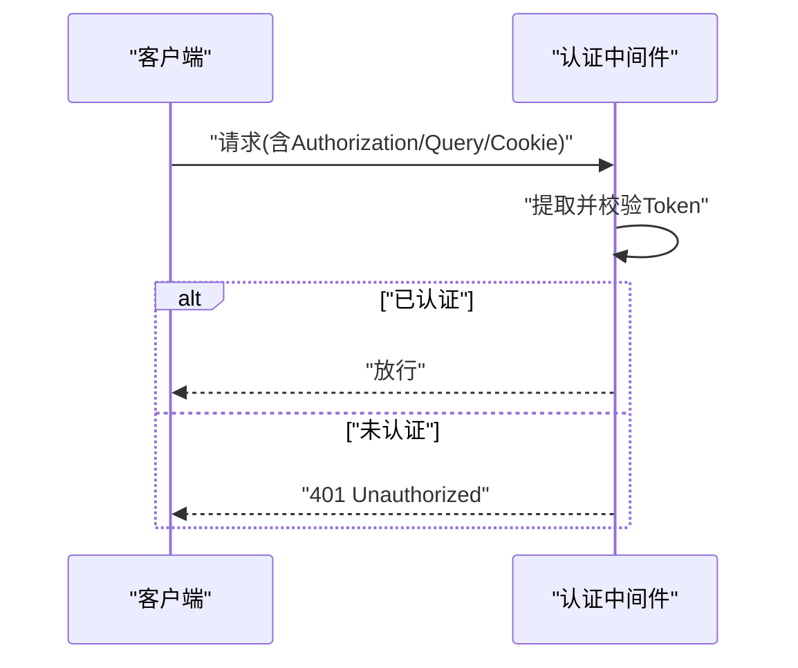
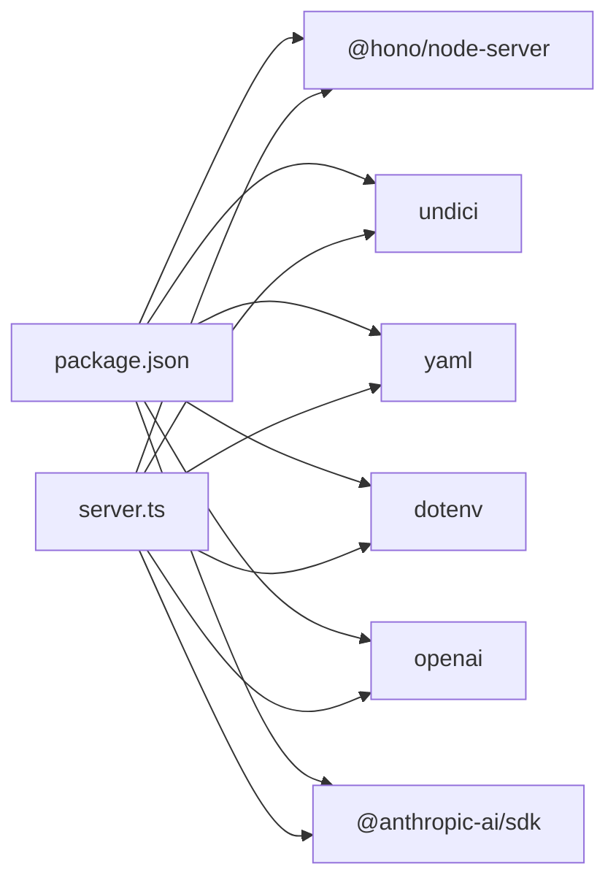

# 生产环境优化

<cite>
**本文档引用的文件**
- [README.md](file://README.md)
- [package.json](file://package.json)
- [server.ts](file://server.ts)
- [src/config.ts](file://src/config.ts)
- [src/config-manager.ts](file://src/config-manager.ts)
- [src/proxy.ts](file://src/proxy.ts)
- [src/status.ts](file://src/status.ts)
- [src/response-cache.ts](file://src/response-cache.ts)
- [src/record.ts](file://src/record.ts)
- [src/fallback.ts](file://src/fallback.ts)
- [src/http-log.ts](file://src/http-log.ts)
- [scripts/start-railway.sh](file://scripts/start-railway.sh)
</cite>

## 目录
1. [简介](#简介)
2. [项目结构](#项目结构)
3. [核心组件](#核心组件)
4. [架构总览](#架构总览)
5. [详细组件分析](#详细组件分析)
6. [依赖关系分析](#依赖关系分析)
7. [性能考虑](#性能考虑)
8. [故障排查指南](#故障排查指南)
9. [结论](#结论)
10. [附录](#附录)

## 简介
本指南面向生产环境部署与优化，围绕 nanollm LLM 代理服务的关键能力进行系统性梳理，涵盖性能调优（并发连接、内存、缓存）、资源限制与监控、负载均衡与安全加固、日志轮转与告警、以及高可用与故障转移机制。文档基于仓库现有实现与配置，结合最佳实践给出可操作的建议。

## 项目结构
- 应用入口与路由：server.ts 构建 Hono 应用，注册认证中间件、CORS、路由工厂与监控页面。
- 配置体系：src/config.ts 定义配置模型与解析逻辑；src/config-manager.ts 提供热更新与监听。
- 代理与协议转换：src/proxy.ts 统一封装上游请求、SSE 校验、超时控制与代理。
- 状态与记录：src/status.ts 提供内存/SQLite 统计桶；src/record.ts 提供请求记录与持久化。
- 缓存与回退：src/response-cache.ts 提供 Responses API 输出项缓存；src/fallback.ts 提供失败回退排序。
- 日志与可观测性：src/http-log.ts 控制 HTTP 日志级别；/status 与 /record 页面提供可视化监控。
- 平台脚本：scripts/start-railway.sh 提供 Railway 平台初始化与启动流程。

**图表来源**
- [server.ts:145-213](file://server.ts#L145-L213)
- [src/config.ts:24-50](file://src/config.ts#L24-L50)
- [src/config-manager.ts:58-75](file://src/config-manager.ts#L58-L75)
- [src/proxy.ts:278-407](file://src/proxy.ts#L278-L407)
- [src/status.ts:84-172](file://src/status.ts#L84-L172)
- [src/record.ts:185-287](file://src/record.ts#L185-L287)
- [src/response-cache.ts:4-23](file://src/response-cache.ts#L4-L23)
- [src/fallback.ts:3-21](file://src/fallback.ts#L3-L21)
- [src/http-log.ts:7-27](file://src/http-log.ts#L7-L27)
- [scripts/start-railway.sh:1-29](file://scripts/start-railway.sh#L1-L29)

**章节来源**
- [server.ts:126-136](file://server.ts#L126-L136)
- [package.json:1-48](file://package.json#L1-L48)

## 核心组件
- 配置管理与热更新：支持 models、fallback、server.ttfb_timeout、record.max_size 热更新；server.port 与 server.auth.token 需重启生效。
- 上游代理与超时：统一通过 Undici fetch 发起请求，支持代理、TTFB 超时、SSE 内容校验与错误记录。
- 状态统计：按 5 分钟桶聚合成功率、TTFB、时延与 Token 速度，支持内存与 SQLite 两种存储。
- 请求记录：记录客户端请求与上游尝试，支持敏感头脱敏与最大条目限制，支持内存与 SQLite。
- 回退策略：基于最近 5 分钟失败次数排序，优先尝试失败更少的候选模型。
- 响应缓存：针对 Responses API 输出项进行内存缓存，解决 item_reference 解析问题。
- 认证与 CORS：支持 Bearer Token 认证与跨域配置，/health 不受认证限制。

**章节来源**
- [src/config-manager.ts:109-115](file://src/config-manager.ts#L109-L115)
- [src/proxy.ts:278-407](file://src/proxy.ts#L278-L407)
- [src/status.ts:9-31](file://src/status.ts#L9-L31)
- [src/record.ts:6-31](file://src/record.ts#L6-L31)
- [src/fallback.ts:23-32](file://src/fallback.ts#L23-L32)
- [src/response-cache.ts:4-34](file://src/response-cache.ts#L4-L34)
- [server.ts:180-213](file://server.ts#L180-L213)

## 架构总览
下图展示了生产部署的关键路径：客户端请求经认证与 CORS 后进入路由工厂，根据模型名解析候选集，依次尝试上游；成功则返回 JSON 或 SSE，失败则记录并进行回退；期间统计与记录模块持续采集指标与审计信息。

**图表来源**
- [server.ts:663-800](file://server.ts#L663-L800)
- [src/proxy.ts:278-407](file://src/proxy.ts#L278-L407)
- [src/status.ts:108-140](file://src/status.ts#L108-L140)
- [src/record.ts:300-367](file://src/record.ts#L300-L367)

## 详细组件分析

### 配置与热更新
- 支持字段：models、fallback、server.ttfb_timeout、record.max_size 热更新；server.port 与 server.auth.token 需重启。
- 热更新机制：文件变更监听与去抖，哈希比对，应用时区分“启动时完全应用”与“热更新仅应用部分字段”。

**图表来源**
- [src/config-manager.ts:81-131](file://src/config-manager.ts#L81-L131)
- [src/config.ts:202-230](file://src/config.ts#L202-L230)

**章节来源**
- [src/config-manager.ts:58-75](file://src/config-manager.ts#L58-L75)
- [src/config-manager.ts:109-115](file://src/config-manager.ts#L109-L115)
- [src/config.ts:202-230](file://src/config.ts#L202-L230)

### 上游代理与超时控制
- 代理：优先使用模型级 proxy，其次 HTTPS_PROXY/HTTP_PROXY，否则直连。
- 超时：基于 ttfb_timeout 控制首字节超时，超时触发 AbortController。
- SSE 校验：对流式响应进行 SSE 事件解析与缓冲上限检查，防止 ping-only 流。
- 错误处理：捕获上游 HTML 返回、非 SSE 流、HTTP 错误码并记录。

**图表来源**
- [src/proxy.ts:376-404](file://src/proxy.ts#L376-L404)
- [src/proxy.ts:441-504](file://src/proxy.ts#L441-L504)

**章节来源**
- [src/proxy.ts:274-276](file://src/proxy.ts#L274-L276)
- [src/proxy.ts:296-325](file://src/proxy.ts#L296-L325)
- [src/proxy.ts:376-404](file://src/proxy.ts#L376-L404)

### 状态统计与记录
- 状态统计：5 分钟为桶，保留 6 小时窗口，支持内存与 SQLite 两种实现。
- 请求记录：记录客户端请求、上游尝试、客户端响应与错误，敏感头脱敏，支持内存与 SQLite。

**图表来源**
- [src/status.ts:84-172](file://src/status.ts#L84-L172)
- [src/status.ts:227-362](file://src/status.ts#L227-L362)
- [src/record.ts:185-287](file://src/record.ts#L185-L287)
- [src/record.ts:433-581](file://src/record.ts#L433-L581)

**章节来源**
- [src/status.ts:4-8](file://src/status.ts#L4-L8)
- [src/status.ts:68-82](file://src/status.ts#L68-L82)
- [src/record.ts:6-31](file://src/record.ts#L6-L31)
- [src/record.ts:147-154](file://src/record.ts#L147-L154)

### 回退与缓存
- 回退排序：基于最近 5 分钟失败次数，按 max(0, 失败数-1) 升序，失败更少者优先。
- 响应缓存：针对 Responses API 输出项进行内存缓存，超过阈值时逐出最旧项。

**图表来源**
- [src/fallback.ts:23-32](file://src/fallback.ts#L23-L32)
- [src/response-cache.ts:4-34](file://src/response-cache.ts#L4-L34)

**章节来源**
- [src/fallback.ts:1-21](file://src/fallback.ts#L1-L21)
- [src/response-cache.ts:4-34](file://src/response-cache.ts#L4-L34)

### 认证与 CORS
- 认证：Bearer Token 支持，支持查询参数与 Cookie；/health 不受认证限制。
- CORS：除 /admin 路由外，对 API 设置通配允许。

**图表来源**
- [server.ts:180-213](file://server.ts#L180-L213)

**章节来源**
- [server.ts:147-185](file://server.ts#L147-L185)
- [server.ts:195-213](file://server.ts#L195-L213)

## 依赖关系分析
- 运行时依赖：@hono/node-server、undici、yaml、dotenv、openai、@anthropic-ai/sdk 等。
- 构建与脚本：TypeScript、tsx、测试脚本；Railway 启动脚本。

**图表来源**
- [package.json:32-41](file://package.json#L32-L41)
- [server.ts:6-11](file://server.ts#L6-L11)

**章节来源**
- [package.json:32-41](file://package.json#L32-L41)

## 性能考虑

### 并发连接与超时
- TTFB 超时：通过 server.ttfb_timeout 与模型级 ttfb_timeout 控制首字节等待时间，避免长时间占用连接。
- 代理：支持模型级代理与环境变量代理，合理配置可降低网络延迟与稳定性风险。
- SSE 校验：防止上游返回空事件流导致资源浪费。

**章节来源**
- [src/config.ts:6-8](file://src/config.ts#L6-L8)
- [src/proxy.ts:296-325](file://src/proxy.ts#L296-L325)
- [src/proxy.ts:441-504](file://src/proxy.ts#L441-L504)

### 内存使用优化
- 请求记录：通过 record.max_size 控制内存中保留的记录数量，避免无限增长。
- 响应缓存：Responses API 输出项缓存上限为固定数量，逐出最旧项，防止缓存膨胀。
- 状态统计：5 分钟桶保留 6 小时窗口，内存占用可控。

**章节来源**
- [src/record.ts:185-209](file://src/record.ts#L185-L209)
- [src/response-cache.ts:4-23](file://src/response-cache.ts#L4-L23)
- [src/status.ts:4-8](file://src/status.ts#L4-L8)

### 缓存策略调整
- Responses API：利用输出项缓存减少后续请求中 item_reference 的缺失问题，提升一致性。
- 建议：在高并发场景下，确保缓存大小与内存容量匹配；必要时启用 SQLite 存储以持久化状态与记录。

**章节来源**
- [src/response-cache.ts:4-34](file://src/response-cache.ts#L4-L34)
- [src/record.ts:433-581](file://src/record.ts#L433-L581)
- [src/status.ts:227-362](file://src/status.ts#L227-L362)

### 资源限制配置（CPU、内存、存储）
- CPU：Node.js 默认线程模型，建议配合容器编排设置 CPU 限额与亲和性。
- 内存：通过 record.max_size 与响应缓存上限控制内存峰值；生产建议开启 SQLite 存储以降低内存压力。
- 存储：SQLite 文件位于用户主目录下的特定路径；可挂载持久卷至 Railway 等平台。

**章节来源**
- [scripts/start-railway.sh:4-28](file://scripts/start-railway.sh#L4-L28)
- [src/record.ts:442-458](file://src/record.ts#L442-L458)
- [src/status.ts:227-247](file://src/status.ts#L227-L247)

### 监控指标设置
- /status 页面：展示成功率、TTFB、时延与 Token 速度等指标，支持内存与 SQLite。
- /record 页面：展示最近请求记录，便于调试与审计。
- 日志级别：通过 LOG_LEVEL 控制 HTTP 日志输出级别，/v1 路径默认 info。

**章节来源**
- [README.md:302-309](file://README.md#L302-L309)
- [src/http-log.ts:7-27](file://src/http-log.ts#L7-L27)

### 负载均衡与高可用
- 负载均衡：建议在反向代理层（如 Nginx、Traefik 或云厂商 LB）前置，配置健康检查与会话亲和。
- 高可用：多实例部署，共享 SQLite 或使用外部数据库；/status 与 /record 在 SQLite 模式下可持久化近期数据。
- 故障转移：利用回退策略在单实例内自动切换候选模型；多实例间可结合外部服务发现与重试策略。

**章节来源**
- [src/fallback.ts:23-32](file://src/fallback.ts#L23-L32)
- [README.md:70-90](file://README.md#L70-L90)

### SSL/TLS 证书与安全加固
- 认证：启用 server.auth.token 后，除 /health 外均需 Bearer 认证；支持一次性 URL 与 Cookie 持久化。
- CORS：API 路由允许跨域访问，注意生产环境限制来源。
- 敏感信息：请求记录对敏感头进行脱敏；上游代理支持 HTTPS_PROXY/HTTP_PROXY，建议使用可信代理链路。

**章节来源**
- [README.md:91-124](file://README.md#L91-L124)
- [server.ts:147-185](file://server.ts#L147-L185)
- [src/record.ts:6-7](file://src/record.ts#L6-L7)

### 日志轮转、错误监控与告警
- 日志：HTTP 请求日志按路径与级别输出；建议结合系统日志轮转工具（如 logrotate）进行轮转。
- 错误监控：/record 与 /status 提供可视化错误与健康状况；建议接入外部监控系统（如 Prometheus/Grafana）。
- 告警：基于 /status 的成功率与 TTFB 指标设置阈值告警；对上游错误与超时进行告警。

**章节来源**
- [src/http-log.ts:11-27](file://src/http-log.ts#L11-L27)
- [src/record.ts:300-367](file://src/record.ts#L300-L367)
- [src/status.ts:174-180](file://src/status.ts#L174-L180)

## 故障排查指南
- 配置热更新冲突：当 baseVersion 不一致时返回 409，需刷新页面后重试。
- 认证失败：检查 Authorization 头、查询参数 token 或 Cookie 是否正确。
- 上游错误：查看 /record 中的尝试与错误详情；确认上游返回是否为 HTML 或非 SSE。
- 超时问题：适当提高 server.ttfb_timeout 或模型级 ttfb_timeout；检查代理链路。
- 回退无效：确认 fallback 分组成员与模型名匹配；检查失败计数窗口。

**章节来源**
- [server.ts:1269-1287](file://server.ts#L1269-L1287)
- [server.ts:195-213](file://server.ts#L195-L213)
- [src/proxy.ts:330-344](file://src/proxy.ts#L330-L344)
- [src/fallback.ts:12-21](file://src/fallback.ts#L12-L21)

## 结论
通过合理的配置热更新、超时与代理策略、内存与缓存控制、状态与记录持久化、回退与安全加固，以及完善的监控与告警，nanollm 可在生产环境中稳定高效地提供 LLM 代理服务。建议结合平台特性（如 Railway）与企业运维体系，进一步完善高可用与自动化运维流程。

## 附录
- 平台启动脚本：Railway 环境下自动初始化配置与 SQLite 存储模式，支持 HOME 目录挂载。
- 配置示例：参考 README 中 server、models、fallback、record 等字段说明与示例。

**章节来源**
- [scripts/start-railway.sh:1-29](file://scripts/start-railway.sh#L1-L29)
- [README.md:11-90](file://README.md#L11-L90)