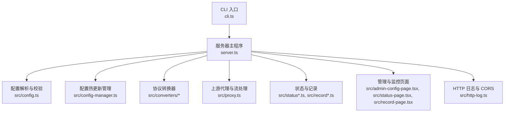
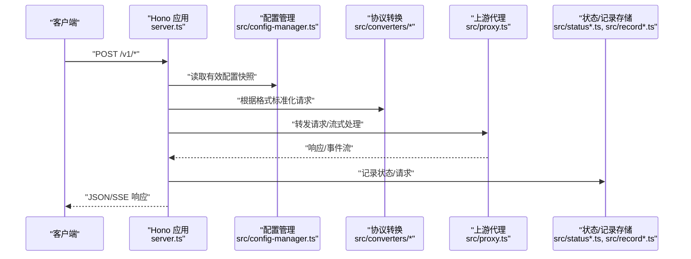
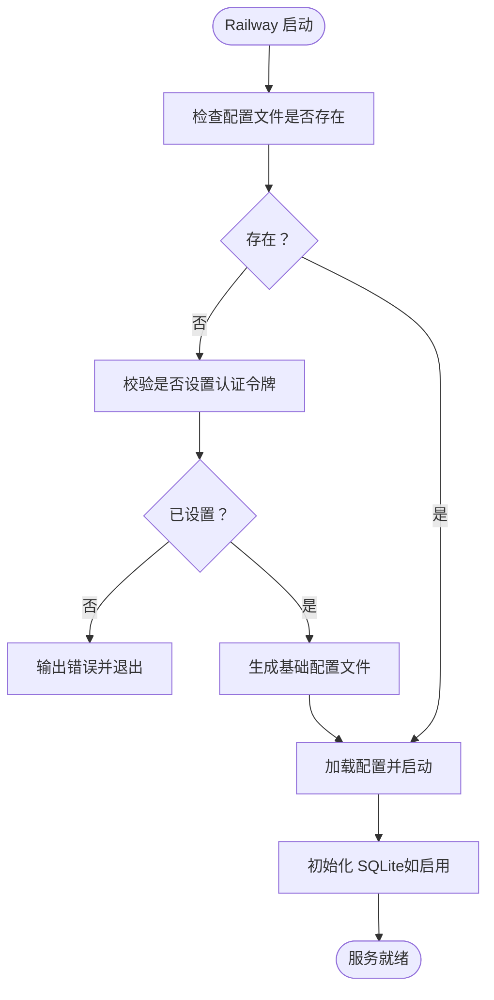
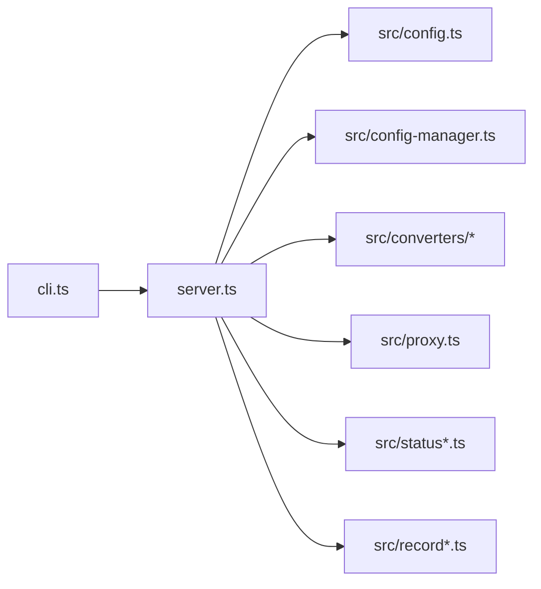

# 部署指南

<cite>
**本文引用的文件**
- [README.md](file://README.md)
- [package.json](file://package.json)
- [scripts/start-railway.sh](file://scripts/start-railway.sh)
- [server.ts](file://server.ts)
- [src/config.ts](file://src/config.ts)
- [src/config-manager.ts](file://src/config-manager.ts)
- [tsconfig.json](file://tsconfig.json)
- [tsconfig.dist.json](file://tsconfig.dist.json)
- [cli.ts](file://cli.ts)
</cite>

## 目录
1. [简介](#简介)
2. [项目结构](#项目结构)
3. [核心组件](#核心组件)
4. [架构总览](#架构总览)
5. [详细组件分析](#详细组件分析)
6. [依赖关系分析](#依赖关系分析)
7. [性能考虑](#性能考虑)
8. [故障排查指南](#故障排查指南)
9. [结论](#结论)
10. [附录](#附录)

## 简介
本指南面向不同部署场景与环境，提供从本地开发到生产上线的完整部署路径，包括：
- 本地部署：环境准备、配置文件设置、启动流程与验证
- 云平台部署：重点覆盖 Railway 平台的部署配置与最佳实践
- Docker 容器化部署：镜像构建与容器配置要点
- 生产环境最佳实践：性能调优、资源限制与监控
- 常见问题排查与不同操作系统/环境注意事项

## 项目结构
该项目基于 TypeScript/Hono 构建，通过 CLI 启动服务，支持通过命令行参数与环境变量控制配置与存储模式。核心入口为 CLI，实际服务逻辑集中在服务器主文件中，配置解析与热更新由独立模块负责。

图表来源
- [cli.ts](file://cli.ts)
- [server.ts](file://server.ts)
- [src/config.ts](file://src/config.ts)
- [src/config-manager.ts](file://src/config-manager.ts)

章节来源
- [package.json:13-22](file://package.json#L13-L22)
- [tsconfig.json:1-15](file://tsconfig.json#L1-L15)
- [tsconfig.dist.json:1-11](file://tsconfig.dist.json#L1-L11)

## 核心组件
- CLI 入口：通过二进制入口启动服务器。
- 服务器主程序：负责路由注册、鉴权、请求转发、SSE 流式响应、状态与记录管理。
- 配置系统：解析 YAML 配置、校验字段、支持环境变量注入、热更新与错误回滚。
- 代理与转换：统一协议转换（OpenAI Chat/Responses、Anthropic）、SSE 流处理、上游代理与超时控制。
- 状态与记录：内存/SQLite 存储，支持健康状态与请求记录的持久化。
- 管理与监控：本地管理页、状态页、记录页，支持配置热更新与回放调试。

章节来源
- [server.ts:126-145](file://server.ts#L126-L145)
- [src/config.ts:24-35](file://src/config.ts#L24-L35)
- [src/config-manager.ts:58-75](file://src/config-manager.ts#L58-L75)

## 架构总览
下图展示了从客户端请求到上游模型供应商的关键路径，以及配置热更新与存储层的关系。

图表来源
- [server.ts:663-800](file://server.ts#L663-L800)
- [src/config-manager.ts:77-79](file://src/config-manager.ts#L77-L79)
- [src/converters/requests.ts](file://src/converters/requests.ts)
- [src/converters/responses.ts](file://src/converters/responses.ts)
- [src/proxy.ts](file://src/proxy.ts)

## 详细组件分析

### 本地部署（开发/测试）
- 环境准备
  - Node.js 版本：满足项目类型配置（ES2022+，NodeNext 模块解析）。
  - 依赖安装：使用包管理器安装依赖。
- 配置文件设置
  - 支持通过命令行参数指定配置文件路径，或设置环境变量指向配置路径；若当前目录存在配置文件也可直接启动。
  - 支持通过环境变量注入配置值（如认证令牌）。
- 启动流程
  - 使用脚本启动开发模式或生产模式；生产模式建议先构建产物后再运行。
  - 启动后可通过管理页、状态页与记录页进行验证与调试。

章节来源
- [server.ts:59-86](file://server.ts#L59-L86)
- [src/config.ts:61-76](file://src/config.ts#L61-L76)
- [package.json:13-22](file://package.json#L13-L22)

### 云平台部署（Railway）
- 关键环境变量
  - 认证令牌：首次启动前需设置，否则初始化脚本会报错并退出。
  - 配置路径：可选，用于指定配置文件存放位置。
  - 存储模式：可选，支持 sqlite 或 memory。
  - 数据卷挂载路径：Railway 场景下用于持久化配置。
- 初始化流程
  - 若配置文件不存在，脚本会根据环境变量生成基础配置文件。
  - 启动时将 HOME 指向配置目录，确保 SQLite 数据库文件位于该目录下。
- 部署建议
  - 在 Railway 控制台设置环境变量与数据卷挂载路径。
  - 初次启动后检查服务日志，确认配置已生成并成功加载。

图表来源
- [scripts/start-railway.sh:4-28](file://scripts/start-railway.sh#L4-L28)

章节来源
- [scripts/start-railway.sh:1-29](file://scripts/start-railway.sh#L1-L29)

### Docker 容器化部署
- 镜像构建
  - 建议先执行构建脚本生成 dist 目录产物，再进行镜像打包。
  - 使用多阶段构建策略以减小镜像体积（可选）。
- 容器配置
  - 挂载配置文件与数据卷：将配置文件映射到容器内的配置路径，数据卷用于持久化 SQLite。
  - 设置环境变量：认证令牌、配置路径、存储模式等。
  - 端口暴露：根据配置中的端口进行映射。
- 注意事项
  - 确保容器内用户具备读写权限。
  - 如使用 SQLite，需保证数据卷挂载路径正确且持久化。

章节来源
- [package.json:13-22](file://package.json#L13-L22)
- [tsconfig.dist.json:1-11](file://tsconfig.dist.json#L1-L11)
- [scripts/start-railway.sh:4-6](file://scripts/start-railway.sh#L4-L6)

### 生产环境最佳实践
- 性能调优
  - 合理设置 TTFB 超时与上游代理，避免长时间阻塞。
  - 对于流式响应，确保正确的头部与缓冲策略。
- 资源限制
  - 通过进程管理器（如 PM2、systemd）限制内存与 CPU 使用。
  - 合理设置文件句柄与并发连接数。
- 监控与日志
  - 启用状态页与记录页，结合 SQLite 存储实现跨进程持久化。
  - 结合平台日志系统收集请求耗时、错误与流式事件。
- 安全加固
  - 强制开启认证令牌，避免明文暴露。
  - 限制管理页面访问范围，不建议对外暴露。

章节来源
- [server.ts:153-178](file://server.ts#L153-L178)
- [README.md:302-309](file://README.md#L302-L309)

## 依赖关系分析
- CLI 依赖服务器主程序；服务器主程序依赖配置解析与热更新模块、协议转换器、代理与存储模块。
- 配置热更新通过监听文件变更实现，支持在不重启进程的情况下应用部分配置。
- 存储层支持内存与 SQLite，SQLite 需要 Node.js 版本支持 node:sqlite。

图表来源
- [cli.ts](file://cli.ts)
- [server.ts](file://server.ts)
- [src/config.ts](file://src/config.ts)
- [src/config-manager.ts](file://src/config-manager.ts)

章节来源
- [server.ts:1-56](file://server.ts#L1-L56)
- [src/config-manager.ts:1-50](file://src/config-manager.ts#L1-L50)

## 性能考虑
- 首字节超时（TTFB）：可在服务器级别与模型级别分别设置，避免上游慢响应拖垮整体性能。
- 流式处理：SSE 响应需正确设置头部与缓冲策略，减少延迟与内存占用。
- 记录与状态：合理设置记录条数上限，避免内存膨胀；SQLite 模式下注意 WAL 与忙等待配置。
- 代理与网络：优先使用模型级代理，其次环境变量代理，避免不必要的直连。

章节来源
- [src/config.ts:89-107](file://src/config.ts#L89-L107)
- [server.ts:714-720](file://server.ts#L714-L720)
- [server.ts:730-755](file://server.ts#L730-L755)

## 故障排查指南
- 缺少配置文件
  - 症状：启动时报缺少配置文件。
  - 处理：通过命令行参数或环境变量指定配置路径，或将配置文件放置于当前目录。
- 认证失败
  - 症状：401 未授权。
  - 处理：确认认证令牌配置与请求头携带方式；管理页支持一次性 token 入口。
- 配置热更新无效
  - 症状：修改配置后未生效。
  - 处理：确认修改的是支持热更新的字段；对于需要重启的字段，需重启进程。
- SQLite 初始化失败
  - 症状：提示无法初始化 SQLite。
  - 处理：切换为 memory 模式或使用支持 node:sqlite 的 Node.js 版本。
- Railway 启动失败
  - 症状：首次启动因缺少认证令牌而退出。
  - 处理：在平台变量中设置认证令牌后再启动。

章节来源
- [server.ts:83-85](file://server.ts#L83-L85)
- [server.ts:195-213](file://server.ts#L195-L213)
- [src/config-manager.ts:109-111](file://src/config-manager.ts#L109-L111)
- [server.ts:109-124](file://server.ts#L109-L124)
- [scripts/start-railway.sh:11-14](file://scripts/start-railway.sh#L11-L14)

## 结论
本指南提供了从本地到云平台与容器化的完整部署路径，并结合配置热更新、存储模式与监控页面给出生产环境建议。Railway 场景下，通过环境变量与数据卷即可快速完成初始化与持久化；Docker 场景下建议明确挂载与权限设置。遇到问题时，可依据故障排查章节逐项定位。

## 附录
- 常用命令与脚本
  - 开发模式：使用开发脚本启动。
  - 生产模式：先构建产物，再运行服务器主程序。
  - Railway：使用提供的启动脚本完成初始化与启动。
- 配置文件关键字段
  - 服务器端口、首字节超时、认证令牌、记录最大条数。
  - 模型列表与兜底分组、上游地址与密钥、代理与头部/请求体定制。
- 环境变量
  - PORT：覆盖服务器端口。
  - CONFIG_PATH：覆盖配置文件路径。
  - NANOLLM_AUTH_TOKEN：Railway 首次启动必需。
  - RAILWAY_VOLUME_MOUNT_PATH：Railway 数据卷挂载路径。
  - NANOLLM_STORAGE：存储模式（sqlite/memory）。

章节来源
- [package.json:13-22](file://package.json#L13-L22)
- [server.ts:221-222](file://server.ts#L221-L222)
- [src/config.ts:220-229](file://src/config.ts#L220-L229)
- [scripts/start-railway.sh:4-6](file://scripts/start-railway.sh#L4-L6)