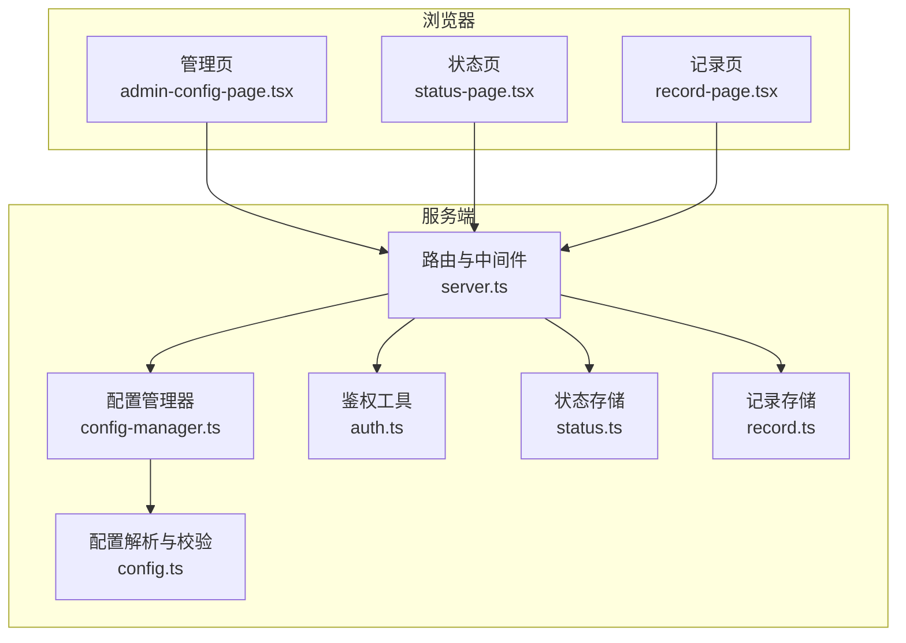
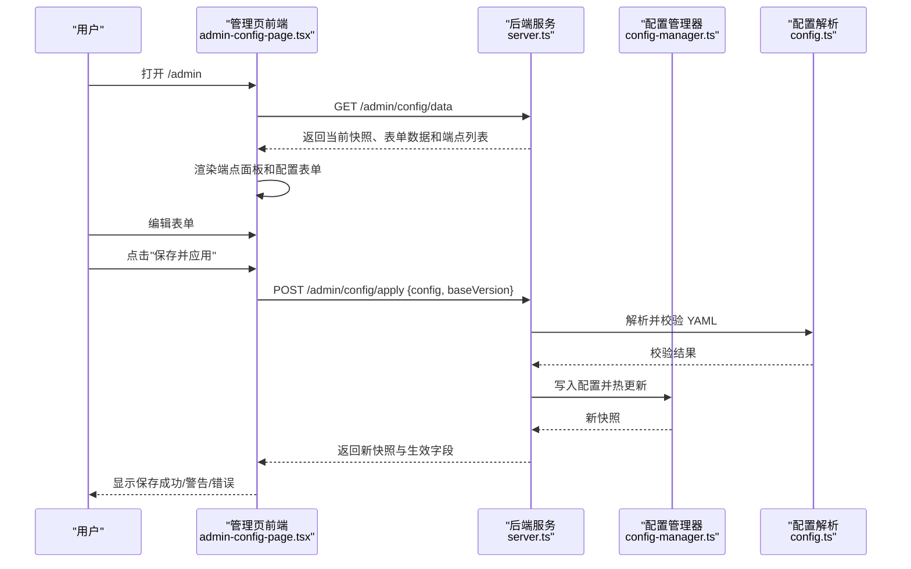
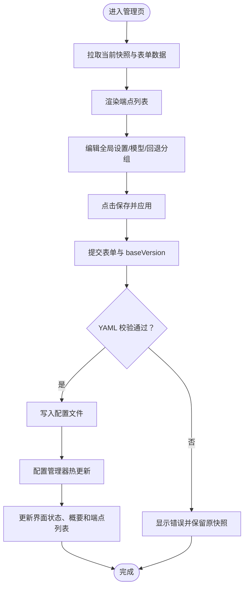
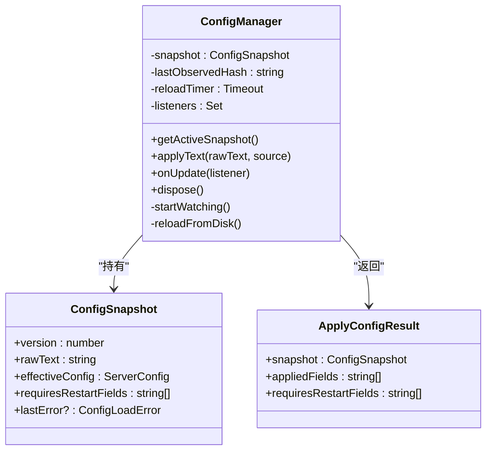
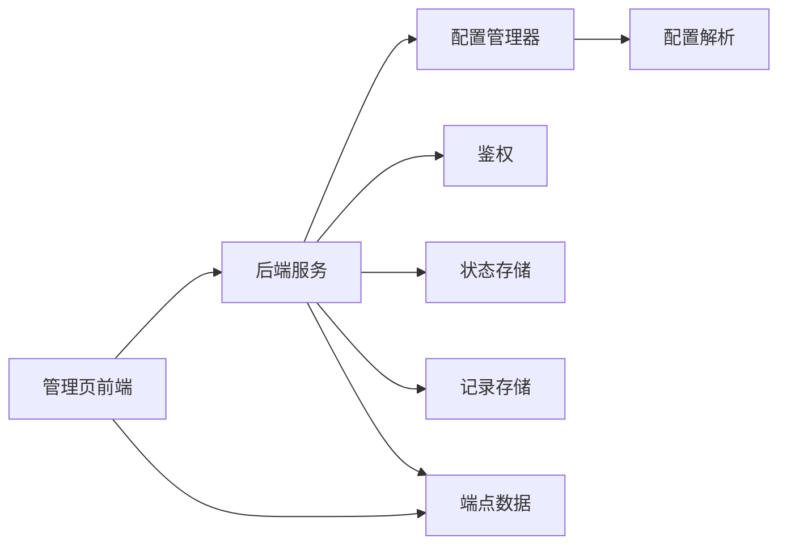

# Web 管理界面

<cite>
**本文引用的文件**
- [admin-config-page.tsx](file://src/admin-config-page.tsx)
- [config-manager.ts](file://src/config-manager.ts)
- [config.ts](file://src/config.ts)
- [server.ts](file://src/server.ts)
- [auth.ts](file://src/auth.ts)
- [status-page.tsx](file://src/status-page.tsx)
- [record-page.tsx](file://src/record-page.tsx)
- [status.ts](file://src/status.ts)
- [record.ts](file://src/record.ts)
- [README.md](file://README.md)
- [package.json](file://package.json)
</cite>

## 更新摘要
**所做更改**
- 新增 API 端点显示功能章节，详细介绍端点列表展示、视觉样式和复制 URL 功能
- 更新管理页前端组件分析，增加端点面板的详细说明
- 新增端点复制功能的操作流程和用户体验说明
- 更新架构图和组件关系图，体现端点数据的前后端交互

## 目录
1. [简介](#简介)
2. [项目结构](#项目结构)
3. [核心组件](#核心组件)
4. [架构总览](#架构总览)
5. [详细组件分析](#详细组件分析)
6. [依赖关系分析](#依赖关系分析)
7. [性能考量](#性能考量)
8. [故障排查指南](#故障排查指南)
9. [结论](#结论)
10. [附录](#附录)

## 简介
本文件面向使用 Web 管理界面的用户，提供从首次登录到配置发布的完整使用指南。内容涵盖界面布局与功能分区、配置表单、实时预览、配置验证与错误提示、保存与导入导出、快捷键与批量操作、配置模板与常见场景等。读者无需具备编程背景即可完成日常运维任务。

**更新** 新增 API 端点显示功能，用户可以在管理界面中查看所有可用的 API 网关端点，并支持一键复制端点 URL。

## 项目结构
Web 管理界面由前端页面与后端服务共同组成：
- 前端页面：使用 JSX 渲染的 HTML 页面，包含样式与脚本，负责表单渲染、交互与提交。
- 后端服务：基于 Hono 的 Node.js 服务，提供管理页路由、鉴权、配置读写、状态与记录页面等。

**图表来源**
- [admin-config-page.tsx:1106-1191](file://src/admin-config-page.tsx#L1106-L1191)
- [server.ts:1262-1324](file://src/server.ts#L1262-L1324)
- [config-manager.ts:58-173](file://src/config-manager.ts#L58-L173)
- [config.ts:202-238](file://src/config.ts#L202-L238)
- [auth.ts:1-41](file://src/auth.ts#L1-L41)
- [status.ts:84-172](file://src/status.ts#L84-L172)
- [record.ts:185-408](file://src/record.ts#L185-L408)

**章节来源**
- [README.md:286-309](file://README.md#L286-L309)
- [package.json:1-48](file://package.json#L1-L48)

## 核心组件
- 管理页前端：负责渲染全局设置、模型列表、回退分组、API 端点等表单区域，提供保存、刷新、撤销等操作按钮，内置实时状态与错误提示。
- 配置管理器：负责配置文件的读取、热更新、监听与冲突检测，向管理页提供快照与错误信息。
- 配置解析与校验：将 YAML 文本解析为运行时配置，执行字段类型与业务规则校验。
- 鉴权模块：支持 Bearer Token、URL 查询参数与 Cookie 三种方式，首次成功后写入同源 Cookie。
- 状态与记录：提供健康状态可视化与请求记录查看、重放能力。
- **API 端点面板**：展示所有可用的 API 网关端点，包含方法类型、路径、协议描述和复制 URL 功能。

**章节来源**
- [admin-config-page.tsx:1106-1191](file://src/admin-config-page.tsx#L1106-L1191)
- [config-manager.ts:58-173](file://src/config-manager.ts#L58-L173)
- [config.ts:202-238](file://src/config.ts#L202-L238)
- [auth.ts:1-41](file://src/auth.ts#L1-L41)
- [status.ts:84-172](file://src/status.ts#L84-L172)
- [record.ts:185-408](file://src/record.ts#L185-L408)

## 架构总览
管理界面的请求流如下：
- 用户访问 /admin，后端返回管理页 HTML，包含端点数据。
- 页面脚本初始化，拉取当前配置快照与表单数据，渲染端点列表。
- 用户编辑表单，点击"保存并应用"，前端将表单序列化为 YAML 并提交到 /admin/config/apply。
- 后端解析 YAML，校验合法性，写入配置文件，触发配置管理器热更新。
- 配置管理器返回新快照，前端更新界面状态、错误提示和端点列表。

**图表来源**
- [server.ts:1262-1324](file://src/server.ts#L1262-L1324)
- [config-manager.ts:81-131](file://src/config-manager.ts#L81-L131)
- [config.ts:202-238](file://src/config.ts#L202-L238)
- [admin-config-page.tsx:1005-1048](file://src/admin-config-page.tsx#L1005-L1048)

## 详细组件分析

### 管理页前端（Admin Config Page）
- 布局与分区
  - 顶部工具栏：保存并应用、从服务端刷新、撤销未保存修改。
  - 快速链接：跳转到 /status 与 /record。
  - **API 端点面板**：展示所有可用的 API 网关端点，包含方法类型、路径、协议描述和复制 URL 功能。
  - 全局设置面板：编辑 server.ttfb_timeout、record.max_size 等。
  - 模型面板：增删改查模型卡片，支持折叠/展开、高级字段保留。
  - 回退分组面板：为分组命名并选择成员，支持拖拽排序与去重校验。
- 实时预览与状态
  - 顶部状态条显示版本号、配置路径、当前运行端口与最近一次加载失败信息。
  - 概要标签显示模型数量、分组数量、端口变更提示等。
- 表单交互
  - 绑定字段函数统一处理输入事件，支持数字输入、占位提示与帮助文案。
  - 模型与分组卡片支持展开/折叠，便于编辑复杂配置。
  - 回退分组成员去重校验，保存前拦截重复项。
- **端点显示功能**
  - 端点列表采用网格布局，每行显示方法类型徽章、端点路径和描述信息。
  - 支持复制 URL 功能，点击"复制 URL"按钮可一键复制完整端点地址。
  - 方法类型通过颜色区分：POST 方法显示绿色背景，GET 方法显示棕色背景。
- 保存流程
  - 提交 baseVersion 防并发冲突。
  - 成功后根据是否涉及端口变更给出"立即生效/需重启"的提示。
- 错误提示
  - 服务端错误：显示错误信息。
  - 外部更新冲突：提示"配置已被外部更新，请先刷新"。

**图表来源**
- [admin-config-page.tsx:1005-1048](file://src/admin-config-page.tsx#L1005-L1048)
- [server.ts:1269-1324](file://src/server.ts#L1269-L1324)

**章节来源**
- [admin-config-page.tsx:1106-1191](file://src/admin-config-page.tsx#L1106-L1191)
- [admin-config-page.tsx:539-773](file://src/admin-config-page.tsx#L539-L773)
- [admin-config-page.tsx:775-958](file://src/admin-config-page.tsx#L775-L958)
- [admin-config-page.tsx:960-1104](file://src/admin-config-page.tsx#L960-L1104)
- [admin-config-page.tsx:1030-1080](file://src/admin-config-page.tsx#L1030-L1080)

### 配置管理器（ConfigManager）
- 职责
  - 读取配置文件，构建初始快照。
  - 监听文件变化，防抖重载。
  - 应用新配置，计算哪些字段需要重启生效。
  - 提供监听器回调，通知 UI 更新。
- 关键点
  - 版本号用于并发冲突检测。
  - 对比 intendedConfig 与 effectiveConfig，识别需要重启的字段。
  - 失败时保留上次有效配置并记录错误。

**图表来源**
- [config-manager.ts:58-173](file://src/config-manager.ts#L58-L173)

**章节来源**
- [config-manager.ts:58-173](file://src/config-manager.ts#L58-L173)

### 配置解析与校验（config.ts）
- 解析流程
  - 解析 YAML，支持环境变量占位解析。
  - 标准化字段类型：正整数、布尔、URL、JSON-like 字段等。
  - 校验模型必填字段与供应商合法性。
  - 校验回退分组：数组非空、成员存在、无重复。
- 默认值
  - 默认 TTFB 超时、记录上限等。
- 通配模型名
  - 支持后缀通配，匹配优先级与捕获逻辑。

**章节来源**
- [config.ts:189-238](file://src/config.ts#L189-L238)
- [config.ts:274-306](file://src/config.ts#L274-L306)

### 鉴权与会话（auth.ts + server.ts）
- 支持三种认证方式：Authorization: Bearer、URL 查询参数 token、Cookie。
- 首次认证成功后，服务端写入同源 HttpOnly Cookie，后续无需重复认证。
- /health 不受认证保护，其他路径均受保护。

**章节来源**
- [auth.ts:1-41](file://src/auth.ts#L1-L41)
- [server.ts:195-213](file://src/server.ts#L195-L213)

### 状态页（status-page.tsx）
- 展示各模型健康状态，按时间窗口聚合统计。
- 支持切换时间窗口（如 6h、12h、24h）。
- Tooltip 展示详细指标：成功率、首包耗时、总耗时、Token 速率等。
- 展示回退分组成员顺序与排名。

**章节来源**
- [status-page.tsx:691-745](file://src/status-page.tsx#L691-L745)
- [status.ts:84-172](file://src/status.ts#L84-L172)

### 记录页（record-page.tsx）
- 展示最近请求记录，支持展开查看请求/响应详情。
- 支持重放请求，生成新的 requestId 并在页面中定位。
- 敏感头信息脱敏显示，避免泄露。

**章节来源**
- [record-page.tsx:1-800](file://src/record-page.tsx#L1-L800)
- [record.ts:185-408](file://src/record.ts#L185-L408)

### API 端点显示功能（新增）
- **端点面板布局**
  - 位于全局设置面板之前，标题为"API Endpoints"，包含简要说明文本。
  - 采用网格布局，每个端点显示方法类型徽章、路径和协议描述。
- **视觉样式设计**
  - 方法类型徽章：POST 方法使用绿色背景(#2b9360)，GET 方法使用棕色背景(#8f5b33)。
  - 端点路径使用等宽字体，支持长路径换行显示。
  - 描述信息使用灰色文字，显示协议类型和功能说明。
- **复制 URL 功能**
  - 每个端点右侧提供"复制 URL"按钮。
  - 点击按钮后自动复制完整端点地址（包含协议、主机名、端口和路径）。
  - 复制成功后按钮文本变为"已复制"，并显示绿色确认状态。
- **数据来源与渲染**
  - 端点数据由后端服务提供，包含方法、路径、协议和描述信息。
  - 前端根据当前运行端口动态构建完整 URL 地址。
  - 支持响应式设计，在小屏幕设备上优化布局显示。

**章节来源**
- [admin-config-page.tsx:1030-1080](file://src/admin-config-page.tsx#L1030-L1080)
- [admin-config-page.tsx:1270-1274](file://src/admin-config-page.tsx#L1270-L1274)
- [server.ts:667-674](file://src/server.ts#L667-L674)

## 依赖关系分析
- 管理页前端依赖后端提供的数据接口与鉴权策略。
- 后端服务依赖配置管理器与配置解析模块，确保配置安全落地。
- 状态与记录模块为运维提供可观测性支撑。
- **端点数据**：后端服务构建端点列表，前端负责渲染和交互。

**图表来源**
- [admin-config-page.tsx:1106-1191](file://src/admin-config-page.tsx#L1106-L1191)
- [server.ts:1262-1324](file://src/server.ts#L1262-L1324)
- [config-manager.ts:58-173](file://src/config-manager.ts#L58-L173)
- [config.ts:202-238](file://src/config.ts#L202-L238)
- [auth.ts:1-41](file://src/auth.ts#L1-L41)
- [status.ts:84-172](file://src/status.ts#L84-L172)
- [record.ts:185-408](file://src/record.ts#L185-L408)

## 性能考量
- 管理页保存采用防抖与并发控制（baseVersion），避免竞态。
- 配置热更新仅针对可热更新字段，端口与认证令牌变更需重启。
- 状态与记录默认内存存储，支持 SQLite 持久化以保留历史数据。
- **端点渲染优化**：端点列表采用虚拟滚动和懒加载，避免大量端点时的性能问题。

## 故障排查指南
- 保存失败
  - 若提示"配置已被外部更新"，先点击"从服务端刷新"，再进行保存。
  - 若提示"字段类型错误"，检查输入格式（如正整数、URL、布尔等）。
- 端口或认证令牌未生效
  - 管理页明确提示"port 变更需要重启服务"，请重启进程。
- 界面卡顿或滚动异常
  - 使用"撤销未保存修改"恢复到服务端最新配置。
- 状态/记录为空
  - 检查是否启用 SQLite 存储，或确认记录上限与时间窗口设置。
- **端点复制失败**
  - 确认浏览器允许剪贴板权限。
  - 检查是否在 HTTPS 环境下使用，部分浏览器要求安全上下文才能访问剪贴板 API。
  - 尝试手动复制端点路径，然后在目标应用中粘贴。

**章节来源**
- [admin-config-page.tsx:1018-1042](file://src/admin-config-page.tsx#L1018-L1042)
- [config-manager.ts:44-49](file://src/config-manager.ts#L44-L49)
- [README.md:286-309](file://README.md#L286-L309)

## 结论
Web 管理界面提供了直观、可靠的配置编辑体验，结合实时状态与记录页面，能够快速定位问题并高效发布配置。**新增的 API 端点显示功能进一步增强了界面的实用性，用户可以直观地查看所有可用的 API 网关端点，并通过一键复制功能快速获取端点地址**。遵循本文的操作流程与最佳实践，可在不中断服务的前提下完成大多数运维任务。

## 附录

### 操作流程指南（从首次登录到配置发布）
- 步骤一：首次登录
  - 在浏览器访问 /admin，若已配置 Bearer Token，可直接访问；否则使用一次性 URL token 登录，系统将写入同源 Cookie。
- 步骤二：查看 API 端点
  - 在管理界面顶部导航下方找到"API Endpoints"面板。
  - 查看可用的 API 网关端点列表，包括方法类型、路径和协议描述。
  - 如需复制端点地址，点击相应端点右侧的"复制 URL"按钮。
- 步骤三：编辑配置
  - 在"全局设置"面板调整 server.ttfb_timeout、record.max_size。
  - 在"模型"面板添加/编辑模型，填写 name、provider、base_url、api_key、model 等字段。
  - 在"回退分组"面板为分组命名并选择成员，支持拖拽排序。
- 步骤四：保存与验证
  - 点击"保存并应用"，等待状态条提示保存结果。
  - 如提示"立即生效/需重启"，按提示处理。
- 步骤五：发布后验证
  - 点击"/status"或"/record"快速验证模型状态与最近请求记录。
  - 使用"API Endpoints"面板验证端点是否正确配置。

**章节来源**
- [README.md:286-299](file://README.md#L286-L299)
- [admin-config-page.tsx:1138-1148](file://src/admin-config-page.tsx#L1138-L1148)

### 快捷键与批量操作
- 快捷键
  - 页面内无特定快捷键绑定，建议使用浏览器书签快速访问 /status 与 /record。
- 批量操作
  - 回退分组成员支持拖拽排序，减少逐项移动的工作量。
  - "撤销未保存修改"一键恢复到服务端最新配置，便于批量回滚。
  - **端点复制**：支持一键复制多个端点地址，提高配置效率。

**章节来源**
- [admin-config-page.tsx:840-958](file://src/admin-config-page.tsx#L840-L958)
- [admin-config-page.tsx:1092-1097](file://src/admin-config-page.tsx#L1092-L1097)

### 配置验证机制与错误提示
- 字段类型校验：正整数、URL、布尔等，不符合将提示具体字段名。
- 业务规则校验：模型必填字段、供应商合法性、回退分组成员唯一性与存在性。
- 并发冲突：保存时携带 baseVersion，冲突时提示"配置已被外部更新，请先刷新"。

**章节来源**
- [config.ts:89-124](file://src/config.ts#L89-L124)
- [config.ts:274-306](file://src/config.ts#L274-L306)
- [server.ts:1284-1287](file://src/server.ts#L1284-L1287)

### 导入导出与模板
- 导入导出
  - 管理页通过表单编辑 YAML 并提交保存，不提供独立的导入导出按钮。
  - 建议在外部维护 YAML 模板，复制粘贴到表单或直接编辑配置文件后刷新页面。
- 模板参考
  - 参考 README 中的示例配置，包含多种 provider 与高级字段。

**章节来源**
- [README.md:13-75](file://README.md#L13-L75)
- [server.ts:1269-1324](file://src/server.ts#L1269-L1324)

### API 端点使用指南（新增）
- **端点类型与用途**
  - `/v1/chat/completions`：OpenAI Chat Completions 兼容协议，用于聊天补全请求。
  - `/v1/responses`：OpenAI Responses API 兼容协议，用于响应处理。
  - `/v1/messages`：Anthropic Messages 兼容协议，用于消息处理。
  - `/v1/images/generations`：OpenAI 图像生成，用于图像生成请求。
  - `/v1/images/edits`：OpenAI 图像编辑，用于图像编辑请求。
  - `/v1/models`：OpenAI 列出所有可用模型，用于查询可用模型列表。
- **集成步骤**
  - 在管理界面的"API Endpoints"面板中复制所需的端点 URL。
  - 将复制的 URL 设置为客户端的 base_url。
  - 配置相应的 API Key 和模型参数。
  - 发送请求测试连接是否正常。
- **最佳实践**
  - 建议使用 HTTPS 环境部署，确保端点安全性。
  - 定期检查端点状态，确保服务正常运行。
  - 在生产环境中合理配置超时时间和重试机制。

**章节来源**
- [server.ts:667-674](file://src/server.ts#L667-L674)
- [admin-config-page.tsx:1030-1080](file://src/admin-config-page.tsx#L1030-L1080)