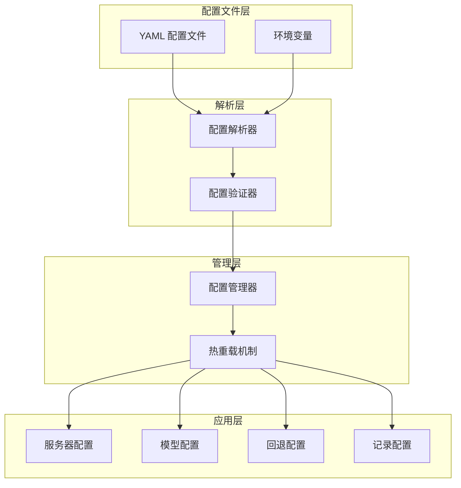
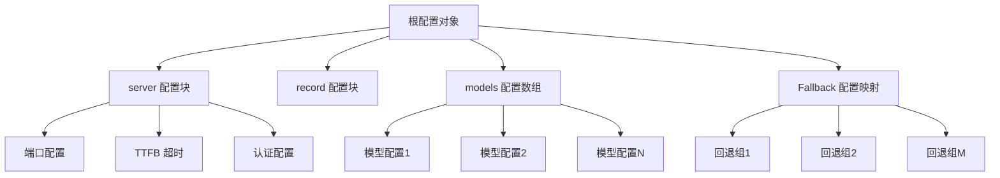
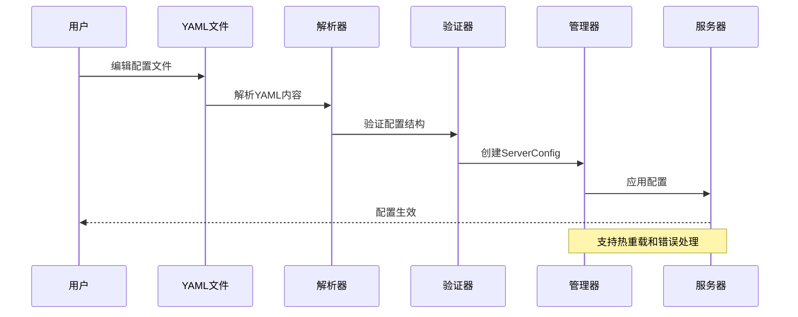
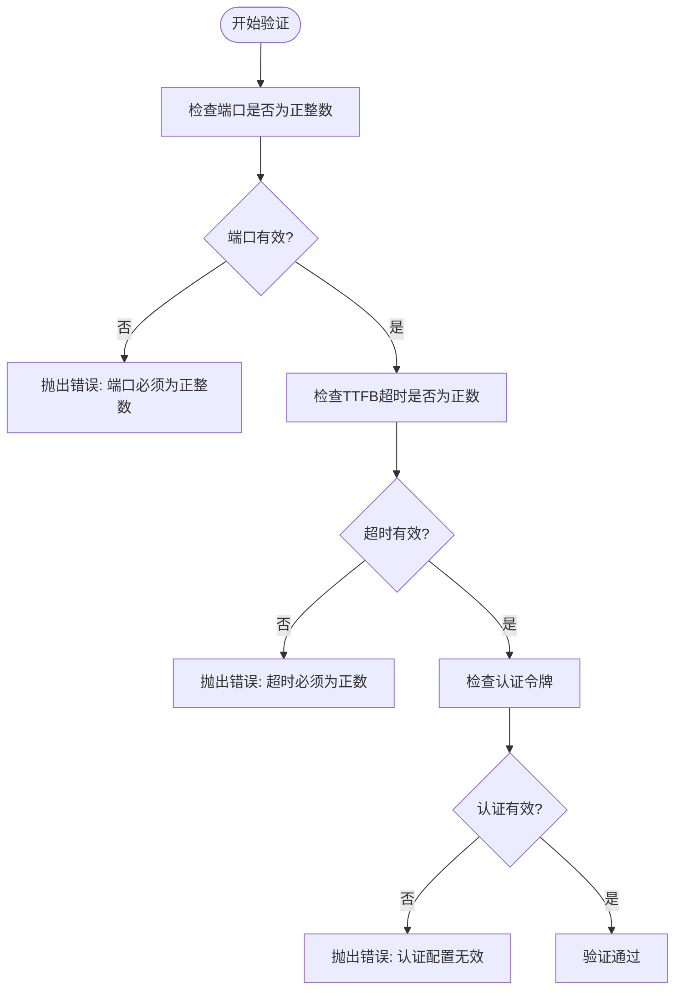
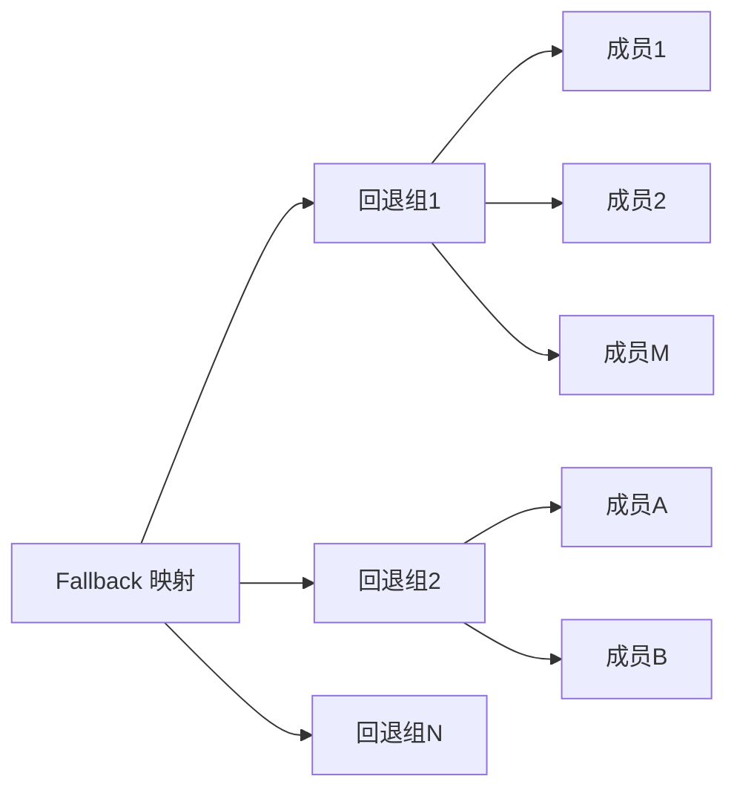
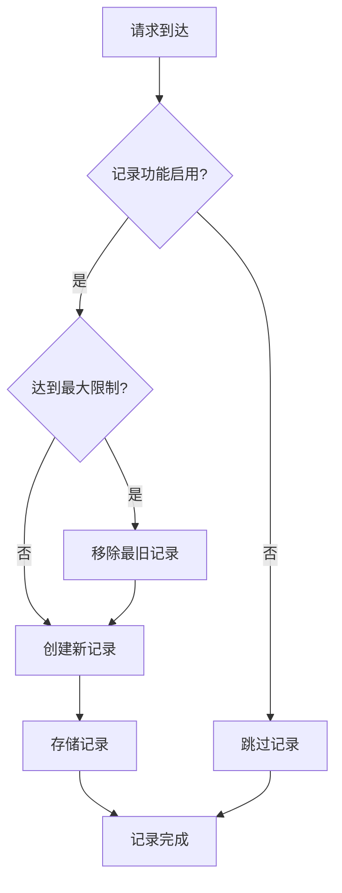
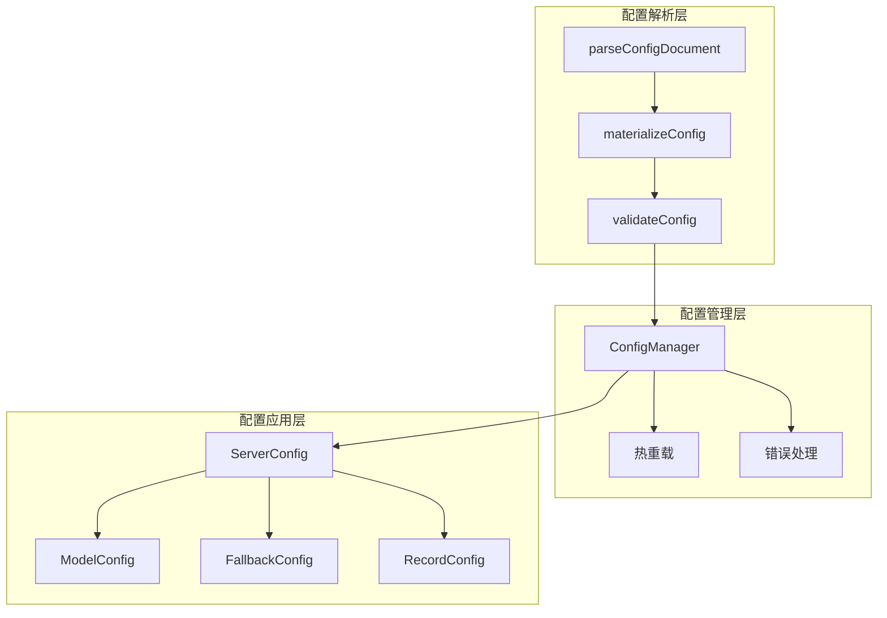

# 基础配置结构

<cite>
**本文档引用的文件**
- [config.ts](file://src/config.ts)
- [config-manager.ts](file://src/config-manager.ts)
- [fallback.ts](file://src/fallback.ts)
- [record.ts](file://src/record.ts)
- [README.md](file://README.md)
- [server.ts](file://server.ts)
</cite>

## 目录
1. [简介](#简介)
2. [项目结构概览](#项目结构概览)
3. [核心配置组件](#核心配置组件)
4. [架构总览](#架构总览)
5. [详细组件分析](#详细组件分析)
6. [依赖关系分析](#依赖关系分析)
7. [性能考虑](#性能考虑)
8. [故障排除指南](#故障排除指南)
9. [结论](#结论)

## 简介

基础配置结构是 nanollm 项目的核心，它定义了如何通过 YAML 配置文件来管理模型代理服务的各种参数。本文档深入解释了 YAML 配置文件的整体结构，包括 server、models、fallback、record 等主要配置块的作用和必需字段，详细说明每个配置项的数据类型、默认值和取值范围，并提供完整的配置示例和最佳实践。

## 项目结构概览

nanollm 项目的配置系统由多个相互协作的模块组成，形成了一个完整的配置管理生态系统：



**图表来源**
- [config.ts:189-238](file://src/config.ts#L189-L238)
- [config-manager.ts:58-172](file://src/config-manager.ts#L58-L172)

**章节来源**
- [config.ts:1-307](file://src/config.ts#L1-L307)
- [config-manager.ts:1-173](file://src/config-manager.ts#L1-L173)

## 核心配置组件

### 配置文件总体结构

配置文件采用 YAML 格式，包含四个主要顶级配置块：



**图表来源**
- [config.ts:24-42](file://src/config.ts#L24-L42)

### 数据类型和默认值

配置系统支持以下主要数据类型：

| 类型 | 描述 | 默认值 | 示例 |
|------|------|--------|------|
| `number` | 数值类型 | 无 | `port: 3000` |
| `string` | 字符串类型 | 空字符串 | `name: "gpt-4"` |
| `boolean` | 布尔类型 | `false` | `image: true` |
| `object` | 对象类型 | `{}` | `headers: {}` |
| `array` | 数组类型 | `[]` | `fallback: []` |

**章节来源**
- [config.ts:9-35](file://src/config.ts#L9-L35)

## 架构总览

配置系统采用分层架构设计，确保配置的正确性、安全性和可维护性：



**图表来源**
- [config.ts:189-238](file://src/config.ts#L189-L238)
- [config-manager.ts:81-131](file://src/config-manager.ts#L81-L131)

## 详细组件分析

### Server 配置块

Server 配置块定义了服务器的基本运行参数：

#### 必需字段

| 字段名 | 类型 | 默认值 | 描述 |
|--------|------|--------|------|
| `port` | `number` | `3000` | 服务器监听端口号 |
| `ttfb_timeout` | `number` | `5000` | 首字节超时时间（毫秒） |
| `auth.token` | `string` | `undefined` | Bearer 认证令牌 |

#### 可选字段

| 字段名 | 类型 | 默认值 | 描述 |
|--------|------|--------|------|
| `auth` | `object` | `{}` | 认证配置对象 |

#### 字段验证规则



**图表来源**
- [config.ts:202-230](file://src/config.ts#L202-L230)

**章节来源**
- [config.ts:24-35](file://src/config.ts#L24-L35)
- [config.ts:202-230](file://src/config.ts#L202-L230)

### Models 配置数组

Models 配置数组定义了可用的模型列表，每个模型配置包含以下字段：

#### 基础模型字段

| 字段名 | 类型 | 必需 | 描述 |
|--------|------|------|------|
| `name` | `string` | 是 | 模型唯一标识符 |
| `provider` | `string` | 是 | 提供商类型 |
| `base_url` | `string` | 是 | 上游API基础URL |
| `api_key` | `string` | 是 | API密钥 |
| `model` | `string` | 是 | 上游模型名称 |

#### 高级模型字段

| 字段名 | 类型 | 默认值 | 描述 |
|--------|------|--------|------|
| `image` | `boolean` | `true` | 图片支持标志（仅对 openai-chat 有效） |
| `ttfb_timeout` | `number` | `undefined` | 模型特定的TTFB超时 |
| `proxy` | `string` | `undefined` | HTTP代理URL |
| `headers` | `object` | `undefined` | 自定义请求头 |
| `body` | `object` | `undefined` | 自定义请求体 |
| `bodyExpression` | `string` | `undefined` | 动态请求体表达式 |
| `ignore_invalid_history` | `boolean` | `true` | 忽略无效历史标志 |

#### Provider 类型限制

支持的提供商类型包括：
- `openai-chat`: OpenAI Chat Completions 接口
- `openai-responses`: OpenAI Responses 接口
- `anthropic`: Anthropic Messages 接口
- `openai-image`: OpenAI Image 接口

**章节来源**
- [config.ts:9-22](file://src/config.ts#L9-L22)
- [config.ts:209-217](file://src/config.ts#L209-L217)

### Fallback 配置映射

Fallback 配置定义了模型回退组，用于在主模型失败时自动切换到备用模型：

#### 结构定义



**图表来源**
- [config.ts:31-31](file://src/config.ts#L31-L31)

#### 验证规则

| 规则 | 描述 | 错误信息 |
|------|------|----------|
| 成员数组验证 | 回退组必须是非空数组 | `"回退组必须是非空模型数组"` |
| 成员唯一性 | 组名不能与模型名重复 | `"回退组名不能与模型名重复"` |
| 成员存在性 | 所有成员必须存在于模型列表中 | `"回退组引用了未知模型"` |
| 成员去重 | 组内成员不能重复 | `"回退组包含重复模型"` |

**章节来源**
- [config.ts:274-306](file://src/config.ts#L274-L306)

### Record 配置块

Record 配置控制请求记录功能：

#### 字段定义

| 字段名 | 类型 | 默认值 | 描述 |
|--------|------|--------|------|
| `max_size` | `number` | `10` | 最大记录数量 |

#### 记录存储策略



**图表来源**
- [record.ts:185-217](file://src/record.ts#L185-L217)

**章节来源**
- [config.ts:32-34](file://src/config.ts#L32-L34)
- [record.ts:185-217](file://src/record.ts#L185-L217)

## 依赖关系分析

配置系统各组件之间存在紧密的依赖关系：



**图表来源**
- [config.ts:189-238](file://src/config.ts#L189-L238)
- [config-manager.ts:58-172](file://src/config-manager.ts#L58-L172)

### 关键依赖链

1. **解析依赖**: `parseConfigDocument` → `materializeConfig` → `validateConfig`
2. **管理依赖**: `ConfigManager` → `HotReload` → `ErrorHandling`
3. **应用依赖**: `ServerConfig` → `ModelConfig` → `FallbackConfig`

**章节来源**
- [config.ts:189-238](file://src/config.ts#L189-L238)
- [config-manager.ts:58-172](file://src/config-manager.ts#L58-L172)

## 性能考虑

配置系统在设计时充分考虑了性能因素：

### 配置解析性能

- **延迟解析**: 使用惰性解析策略，只在需要时解析配置
- **缓存机制**: 配置哈希缓存，避免重复解析
- **增量更新**: 支持部分字段热更新，减少重启需求

### 内存使用优化

- **记录限制**: 默认最多保留10条记录，防止内存泄漏
- **智能清理**: 自动清理过期记录和重复数据
- **存储选择**: 支持内存和SQLite两种存储模式

### 并发处理

- **线程安全**: 配置管理器使用锁机制保证并发安全
- **异步操作**: 热重载采用异步处理，不影响主线程
- **错误隔离**: 单个配置错误不影响其他配置项

## 故障排除指南

### 常见配置错误及解决方案

#### 1. 配置语法错误

**错误表现**: 配置文件无法解析，启动失败

**可能原因**:
- YAML 语法错误
- 缩进不正确
- 字段名拼写错误

**解决方法**:
1. 使用在线 YAML 验证器检查语法
2. 确保正确的缩进（2个空格）
3. 验证字段名大小写

#### 2. 数据类型错误

**错误表现**: 配置应用时报类型错误

**常见类型错误**:
- 端口设置为负数或小数
- 超时时间设置为非数字
- 布尔值设置为无效字符串

**解决方法**:
```yaml
# 正确的数值设置
server:
  port: 3000        # 必须为正整数
  ttfb_timeout: 5000 # 必须为正数
  
# 正确的布尔值设置
models:
  - name: gpt-4
    provider: openai-chat
    base_url: https://api.openai.com/v1
    api_key: YOUR_KEY
    model: gpt-4
    image: true      # 必须为布尔值
    ignore_invalid_history: false
```

#### 3. 模型配置错误

**错误表现**: 模型无法正常工作

**常见问题**:
- 缺少必需字段
- Provider 类型不支持
- API 密钥无效

**解决方法**:
```yaml
# 完整的模型配置示例
models:
  - name: gpt-4           # 必需
    provider: openai-chat # 必需 (openai-chat/openai-responses/anthropic/openai-image)
    base_url: https://api.openai.com/v1  # 必需
    api_key: YOUR_API_KEY # 必需
    model: gpt-4          # 必需
    image: true           # 可选，默认true
    ttfb_timeout: 5000    # 可选
    proxy: http://127.0.0.1:7890 # 可选
    headers:              # 可选
      user-agent: nanollm
    body:                 # 可选
      temperature: 1
    bodyExpression: |     # 可选
      ({...body})
```

#### 4. 回退配置错误

**错误表现**: 回退功能不工作

**常见问题**:
- 回退组成员不存在
- 组名与模型名冲突
- 成员重复

**解决方法**:
```yaml
# 正确的回退配置
models:
  - name: gpt-4
    provider: openai-chat
    base_url: https://api.openai.com/v1
    api_key: YOUR_KEY
    model: gpt-4
    
  - name: gpt-3.5
    provider: openai-chat
    base_url: https://api.openai.com/v1
    api_key: YOUR_KEY
    model: gpt-3.5

fallback:
  gpt-primary:        # 回退组名
    - gpt-4           # 成员1
    - gpt-3.5         # 成员2
```

#### 5. 环境变量问题

**错误表现**: 环境变量未正确解析

**解决方法**:
```yaml
# 使用环境变量
models:
  - name: gpt-4
    provider: openai-chat
    base_url: https://api.openai.com/v1
    api_key: ${OPENAI_API_KEY}  # 环境变量
    model: gpt-4
```

### 配置热重载问题

**问题**: 修改配置后未立即生效

**解决方法**:
1. 检查配置文件权限
2. 确认文件编码为 UTF-8
3. 验证配置语法正确性
4. 查看日志输出确认热重载状态

**章节来源**
- [config.ts:89-144](file://src/config.ts#L89-L144)
- [config-manager.ts:146-171](file://src/config-manager.ts#L146-L171)

## 结论

基础配置结构为 nanollm 项目提供了强大而灵活的配置管理能力。通过清晰的配置层次结构、严格的验证机制和智能的热重载功能，用户可以轻松地管理和维护复杂的模型代理服务配置。

关键优势包括：
- **类型安全**: 完整的类型定义和验证
- **灵活性**: 支持多种提供商和配置选项
- **可靠性**: 完善的错误处理和恢复机制
- **易用性**: 直观的配置结构和丰富的示例

建议在实际使用中：
1. 从简单的配置开始，逐步增加复杂性
2. 使用环境变量管理敏感信息
3. 定期备份配置文件
4. 利用热重载功能进行零停机更新

通过遵循本文档的指导和最佳实践，用户可以充分发挥 nanollm 配置系统的潜力，构建稳定可靠的模型代理服务。