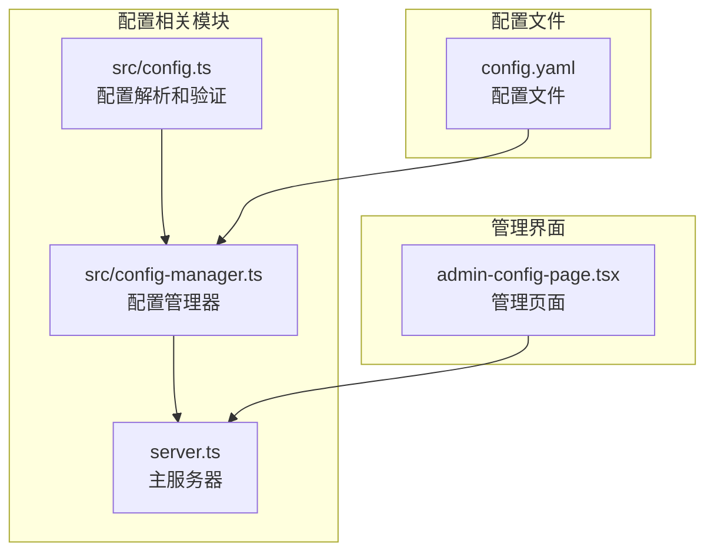
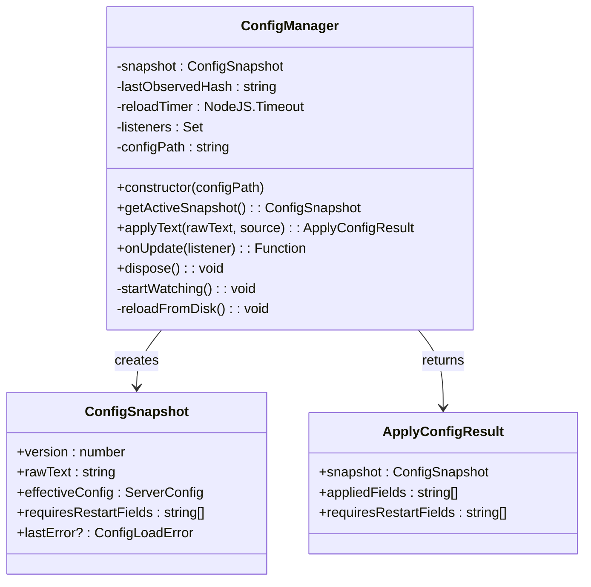
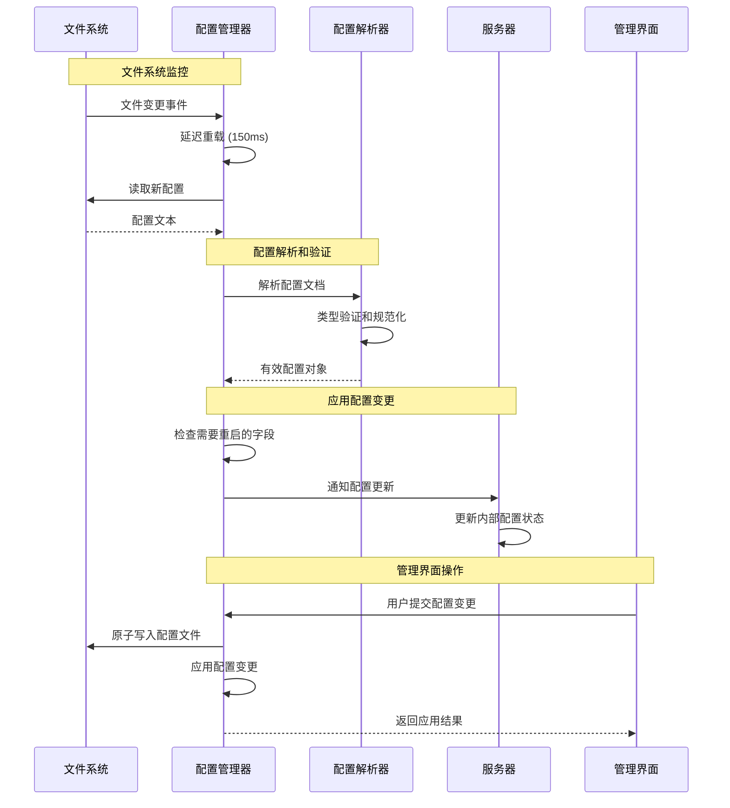
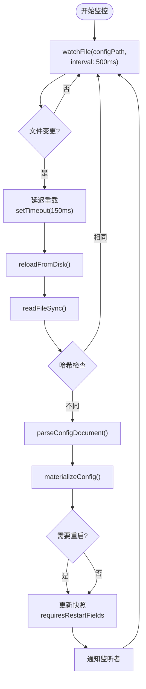
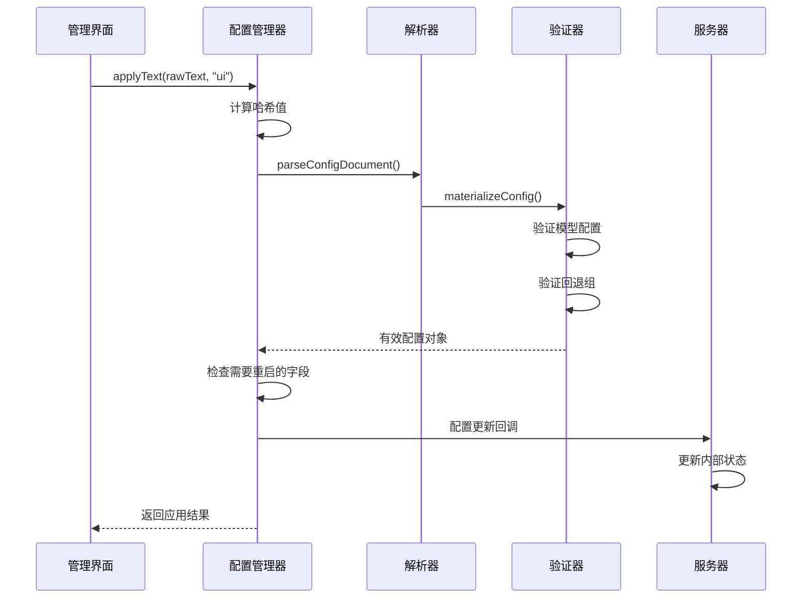
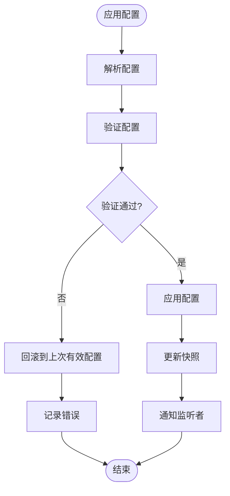
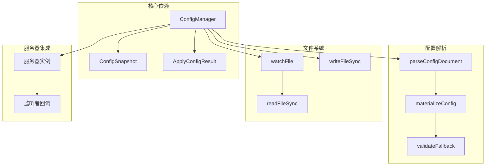
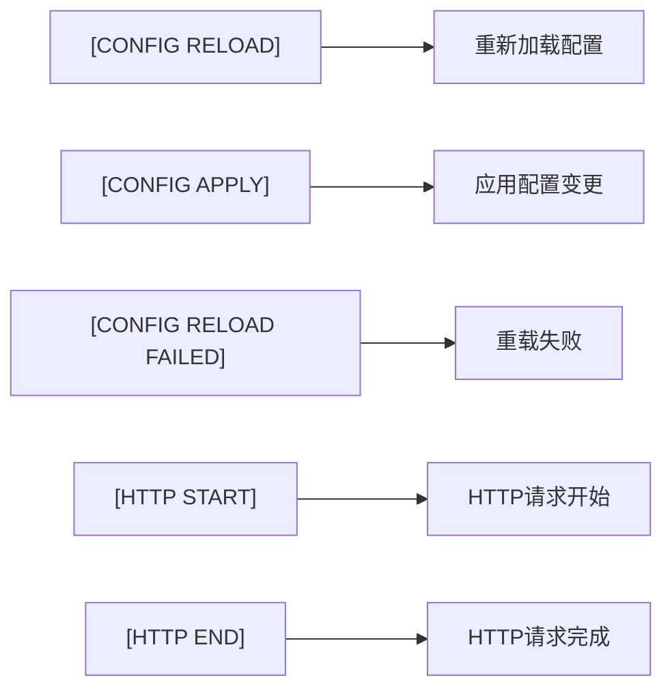

# 配置热更新机制

<cite>
**本文档引用的文件**
- [src/config.ts](file://src/config.ts)
- [src/config-manager.ts](file://src/config-manager.ts)
- [server.ts](file://server.ts)
- [README.md](file://README.md)
</cite>

## 目录
1. [简介](#简介)
2. [项目结构](#项目结构)
3. [核心组件](#核心组件)
4. [架构概览](#架构概览)
5. [详细组件分析](#详细组件分析)
6. [依赖关系分析](#依赖关系分析)
7. [性能考虑](#性能考虑)
8. [故障排除指南](#故障排除指南)
9. [最佳实践](#最佳实践)
10. [结论](#结论)

## 简介

nanollm 是一个轻量级的 LLM 模型代理服务，支持配置文件的热更新机制。该机制允许在不重启服务的情况下动态更新配置，包括模型配置、回退策略、超时设置等。本文档深入解释了配置热更新的实现原理、工作机制和最佳实践。

## 项目结构

配置热更新功能主要涉及以下核心文件：



**图表来源**
- [src/config.ts:1-307](file://src/config.ts#L1-L307)
- [src/config-manager.ts:1-173](file://src/config-manager.ts#L1-L173)
- [server.ts:1-1374](file://server.ts#L1-L1374)

**章节来源**
- [src/config.ts:1-307](file://src/config.ts#L1-L307)
- [src/config-manager.ts:1-173](file://src/config-manager.ts#L1-L173)
- [server.ts:1-1374](file://server.ts#L1-L1374)

## 核心组件

### 配置管理器 (ConfigManager)

ConfigManager 是配置热更新的核心组件，负责监控配置文件变化、解析新配置、应用变更并通知监听者。



**图表来源**
- [src/config-manager.ts:58-173](file://src/config-manager.ts#L58-L173)

### 配置解析器

配置解析器负责将 YAML 配置文件转换为可执行的配置对象，并进行类型验证和规范化处理。

**章节来源**
- [src/config-manager.ts:58-173](file://src/config-manager.ts#L58-L173)
- [src/config.ts:189-238](file://src/config.ts#L189-L238)

## 架构概览

配置热更新的整体架构如下：



**图表来源**
- [src/config-manager.ts:146-173](file://src/config-manager.ts#L146-L173)
- [src/config-manager.ts:81-131](file://src/config-manager.ts#L81-L131)
- [server.ts:137-144](file://server.ts#L137-L144)

## 详细组件分析

### 文件监控机制

配置管理器使用 Node.js 的 `fs.watchFile` API 来监控配置文件的变化：



**图表来源**
- [src/config-manager.ts:146-173](file://src/config-manager.ts#L146-L173)
- [src/config-manager.ts:161-171](file://src/config-manager.ts#L161-L171)

### 配置应用流程

配置应用过程包含多个验证步骤：



**图表来源**
- [src/config-manager.ts:81-131](file://src/config-manager.ts#L81-L131)
- [src/config.ts:202-230](file://src/config.ts#L202-L230)

### 支持热更新的配置项

根据代码实现，以下配置项支持热更新：

| 配置项 | 类型 | 热更新支持 | 描述 |
|--------|------|------------|------|
| `models` | 数组 | ✅ | 模型配置数组，包括名称、提供商、基础URL、API密钥等 |
| `fallback` | 对象 | ✅ | 回退分组配置，定义模型分组 |
| `server.ttfb_timeout` | 数字 | ✅ | 服务器超时设置，毫秒单位 |
| `record.max_size` | 数字 | ✅ | 记录最大数量 |

**章节来源**
- [src/config-manager.ts:109](file://src/config-manager.ts#L109)
- [README.md:9](file://README.md#L9)

### 需要重启的服务配置项

以下配置项需要重启服务才能生效：

| 配置项 | 类型 | 需要重启 | 描述 |
|--------|------|----------|------|
| `server.port` | 数字 | ✅ | 服务器监听端口 |
| `server.auth.token` | 字符串 | ✅ | 认证令牌 |

**章节来源**
- [src/config-manager.ts:44-49](file://src/config-manager.ts#L44-L49)
- [README.md:102](file://README.md#L102)

### 数据一致性保证

配置热更新实现了以下数据一致性保证：

1. **原子性**: 使用原子写入确保配置文件更新的完整性
2. **一致性**: 在应用新配置之前进行完整验证
3. **回滚机制**: 验证失败时自动回滚到上一个有效配置



**图表来源**
- [src/config-manager.ts:116-131](file://src/config-manager.ts#L116-L131)

**章节来源**
- [src/config-manager.ts:116-131](file://src/config-manager.ts#L116-L131)

## 依赖关系分析

配置热更新机制的依赖关系如下：



**图表来源**
- [src/config-manager.ts:1-173](file://src/config-manager.ts#L1-L173)
- [src/config.ts:189-307](file://src/config.ts#L189-L307)

**章节来源**
- [src/config-manager.ts:1-173](file://src/config-manager.ts#L1-L173)
- [src/config.ts:1-307](file://src/config.ts#L1-L307)

## 性能考虑

配置热更新机制在性能方面的设计考虑：

1. **文件监控间隔**: 使用 500ms 的监控间隔平衡响应速度和系统开销
2. **重载延迟**: 150ms 的重载延迟避免频繁的重复变更触发
3. **哈希检查**: 通过 SHA256 哈希快速判断配置是否真正发生变化
4. **增量应用**: 仅应用已知支持热更新的配置字段

**章节来源**
- [src/config-manager.ts:33-34](file://src/config-manager.ts#L33-L34)
- [src/config-manager.ts:146-159](file://src/config-manager.ts#L146-L159)

## 故障排除指南

### 常见问题及解决方案

#### 配置验证失败

**症状**: 管理界面显示配置错误，但服务继续运行

**原因**: 新配置不符合验证规则

**解决方法**:
1. 检查配置文件格式是否正确
2. 验证必需字段是否存在
3. 确认数值类型的范围和格式

**日志示例**:
```
[CONFIG APPLY] source=ui models=3 fallback_groups=1 record_max_size=10
[CONFIG RELOAD FAILED] 配置验证失败: 缺少必需字段 'base_url'
```

#### 文件权限问题

**症状**: 配置文件无法写入或读取

**原因**: 文件权限不足

**解决方法**:
1. 检查配置文件的读写权限
2. 确认运行用户具有相应权限
3. 验证文件路径的可访问性

#### 并发冲突

**症状**: 配置版本冲突错误

**原因**: 多个用户同时修改配置

**解决方法**:
1. 重新加载最新的配置
2. 合并各自的修改
3. 重新提交配置

**章节来源**
- [src/config-manager.ts:116-131](file://src/config-manager.ts#L116-L131)
- [server.ts:1295-1304](file://server.ts#L1295-L1304)

### 日志分析

配置热更新过程会产生以下关键日志：



**章节来源**
- [src/config-manager.ts:167](file://src/config-manager.ts#L167)
- [server.ts:139-143](file://server.ts#L139-L143)

## 最佳实践

### 配置更新策略

1. **渐进式更新**: 先在测试环境中验证配置，再应用到生产环境
2. **备份策略**: 在修改重要配置前备份当前配置文件
3. **监控变更**: 密切关注配置更新后的系统行为

### 配置设计原则

1. **最小化变更**: 每次只修改必要的配置项
2. **向后兼容**: 确保新配置与现有工作负载兼容
3. **文档记录**: 详细记录每次配置变更的原因和影响

### 安全考虑

1. **敏感信息保护**: 避免在配置文件中存储明文密码
2. **权限控制**: 限制配置文件的访问权限
3. **审计日志**: 记录重要的配置变更操作

### 维护建议

1. **定期审查**: 定期检查配置的有效性和效率
2. **性能监控**: 监控配置变更对系统性能的影响
3. **故障预案**: 制定配置变更失败的回滚计划

**章节来源**
- [README.md:286-309](file://README.md#L286-L309)

## 结论

nanollm 的配置热更新机制通过精心设计的架构实现了高可用的配置管理。该机制支持大部分配置项的实时更新，同时通过严格的验证和回滚机制确保了系统的稳定性。

关键特性包括：
- **实时监控**: 基于文件系统事件的即时检测
- **智能验证**: 完整的配置验证和类型检查
- **安全回滚**: 验证失败时的自动回滚机制
- **细粒度控制**: 支持热更新和需要重启的配置项区分

通过遵循最佳实践和故障排除指南，用户可以安全、高效地管理 nanollm 的配置，确保服务的持续稳定运行。