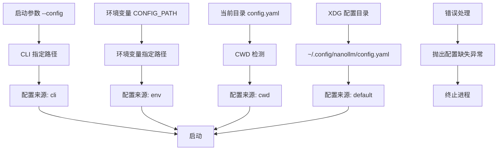
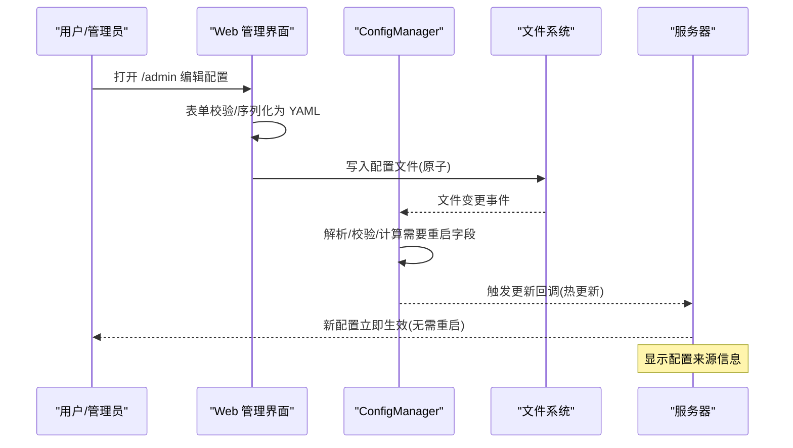
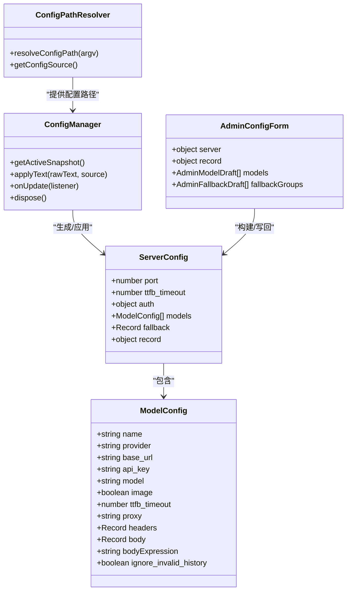

# 配置管理

<cite>
**本文引用的文件**
- [config.ts](file://src/config.ts)
- [config-manager.ts](file://src/config-manager.ts)
- [admin-config-page.tsx](file://src/admin-config-page.tsx)
- [record.ts](file://src/record.ts)
- [fallback.ts](file://src/fallback.ts)
- [server.ts](file://server.ts)
- [README.md](file://README.md)
</cite>

## 更新摘要
**所做更改**
- 新增配置路径解析系统章节，详细说明XDG基础目录规范支持
- 新增配置来源检测功能说明，展示配置文件发现机制
- 更新配置管理架构图，反映新的路径解析和来源检测功能
- 增强配置热更新机制说明，包含配置来源信息显示
- 新增配置路径解析优先级规则和最佳实践

## 目录
1. [简介](#简介)
2. [配置路径解析系统](#配置路径解析系统)
3. [配置来源检测机制](#配置来源检测机制)
4. [核心组件](#核心组件)
5. [架构总览](#架构总览)
6. [详细组件分析](#详细组件分析)
7. [依赖关系分析](#依赖关系分析)
8. [性能考量](#性能考量)
9. [故障排查指南](#故障排查指南)
10. [结论](#结论)
11. [附录](#附录)

## 简介
本文件系统性阐述 nanollm 的配置管理系统，覆盖 YAML 配置结构、热更新机制、Web 管理界面使用、配置优先级与通配符、模型别名、错误处理与最佳实践等内容。特别强调新增的配置路径解析系统和配置来源检测功能，支持 XDG 基础目录规范，提供更透明的配置发现机制。

## 配置路径解析系统

### XDG 基础目录规范支持
nanollm 现已完全支持 XDG 基础目录规范，遵循 Linux/Unix 系统的标准配置文件存放约定：

- **默认配置路径**：`$XDG_CONFIG_HOME/nanollm/config.yaml` 或 `$HOME/.config/nanollm/config.yaml`
- **环境变量优先级**：`XDG_CONFIG_HOME` 环境变量可自定义配置根目录
- **跨平台兼容**：Windows 和 macOS 系统同样遵循 XDG 规范

### 配置文件查找优先级
系统按照以下优先级自动查找配置文件：



**图表来源**
- [server.ts:59-92](file://server.ts#L59-L92)

### 配置来源检测功能
每个配置文件都有明确的来源标识，便于运维人员了解配置来自何处：

- **cli**：通过命令行参数 `--config` 指定
- **env**：通过环境变量 `CONFIG_PATH` 指定  
- **cwd**：当前工作目录下的 `config.yaml`
- **default**：XDG 默认配置路径

**章节来源**
- [server.ts:59-92](file://server.ts#L59-L92)
- [admin-config-page.tsx:508-537](file://src/admin-config-page.tsx#L508-L537)

## 配置来源检测机制

### 实时来源显示
Web 管理界面实时显示当前配置文件的来源信息：

- **版本号**：当前配置版本
- **配置路径**：实际加载的配置文件路径
- **运行端口**：当前进程监听端口
- **来源标签**：显示配置文件来源类型

### 配置应用日志
系统在配置应用时输出详细的来源信息：

```bash
[CONFIG APPLY] source=cli models=3 fallback_groups=1 record_max_size=100
[CONFIG APPLY] source=file-watch models=3 fallback_groups=1 record_max_size=100
[CONFIG APPLY] source=ui models=4 fallback_groups=1 record_max_size=100
```

**章节来源**
- [server.ts:145-152](file://server.ts#L145-L152)
- [admin-config-page.tsx:508-537](file://src/admin-config-page.tsx#L508-L537)

## 核心组件
- 配置模型与解析
  - 定义了 ServerConfig、ModelConfig、ParsedConfigDocument 等类型，提供解析、校验与规范化流程。
  - 支持环境变量占位符解析、JSON-like 字段解析、超时与布尔值等标准化。
- 配置热更新
  - ConfigManager 负责监听文件变化、去抖重载、计算需要重启的字段、触发回调。
  - 支持 UI 应用、文件监听、启动时三种来源。
- Web 管理界面
  - 提供表单编辑 server、record、models、fallbackGroups，保存时转换为 YAML 并校验，原子写回。
  - 展示当前快照版本、错误信息、需要重启的字段提示，包含配置来源信息。
- 记录与回放
  - 记录最近请求、尝试、响应，支持回放与持久化存储。
- 回退与失败追踪
  - 基于最近失败窗口的回退排序，提升可用性。

**章节来源**
- [config.ts:9-35](file://src/config.ts#L9-L35)
- [config-manager.ts:58-173](file://src/config-manager.ts#L58-L173)
- [admin-config-page.tsx:373-800](file://src/admin-config-page.tsx#L373-L800)
- [record.ts:1-961](file://src/record.ts#L1-L961)
- [fallback.ts:1-33](file://src/fallback.ts#L1-L33)
- [server.ts:1260-1324](file://server.ts#L1260-L1324)

## 架构总览
配置管理的端到端流程如下：



**图表来源**
- [server.ts:1269-1324](file://server.ts#L1269-L1324)
- [config-manager.ts:146-171](file://src/config-manager.ts#L146-L171)
- [admin-config-page.tsx:588-612](file://src/admin-config-page.tsx#L588-L612)

## 详细组件分析

### 配置模型与解析（config.ts）
- 数据结构
  - ServerConfig：包含 port、ttfb_timeout、auth、models、fallback、record。
  - ModelConfig：name/provider/base_url/api_key/model/image/ttfb_timeout/proxy/headers/body/bodyExpression/ignore_invalid_history。
- 解析与校验
  - 支持环境变量占位符 ${VAR} 的解析。
  - JSON-like 字段自动尝试 JSON.parse。
  - 对数值进行正数/正整数/布尔值/URL 等严格校验。
  - 校验模型 provider 是否为 openai-chat/openai-responses/anthropic/openai-image。
- 名称解析与通配符
  - 支持模型名后缀通配符"*"，仅允许出现在末尾且最多一次。
  - 精确名 > 精确通配 > 最长前缀通配 > "*"兜底。
  - 通配命中时，下游 model 中的"*"会被捕获部分替换。
- 回退组校验
  - fallback 组名必须唯一，成员必须存在于已配置模型中，且不可重复。

**章节来源**
- [config.ts:9-35](file://src/config.ts#L9-L35)
- [config.ts:146-175](file://src/config.ts#L146-L175)
- [config.ts:177-187](file://src/config.ts#L177-L187)
- [config.ts:240-267](file://src/config.ts#L240-L267)
- [config.ts:274-306](file://src/config.ts#L274-L306)

### 配置热更新机制（config-manager.ts）
- 快照与版本
  - ConfigSnapshot 包含 version/rawText/effectiveConfig/requiresRestartFields/lastError。
  - 每次应用都会递增 version。
- 热更新策略
  - startup：直接采用解析结果。
  - ui/file-watch：使用 materializeHotConfig，保留当前 port 与 auth token，仅应用可热更新字段。
  - 可热更新字段：models、fallback、server.ttfb_timeout、record.max_size。
  - 需要重启字段：server.port、server.auth.token。
- 监听与去抖
  - 文件变更事件触发定时器去抖，避免频繁重载。
  - 哈希比较避免重复应用相同内容。
- 回调通知
  - onUpdate 注册的监听者接收 appliedFields 与 requiresRestartFields。

**章节来源**
- [config-manager.ts:19-31](file://src/config-manager.ts#L19-L31)
- [config-manager.ts:51-56](file://src/config-manager.ts#L51-L56)
- [config-manager.ts:81-131](file://src/config-manager.ts#L81-L131)
- [config-manager.ts:146-171](file://src/config-manager.ts#L146-L171)

### Web 管理界面（admin-config-page.tsx）
- 表单结构
  - 全局字段：server.ttfb_timeout、record.max_size。
  - 模型卡片：name/provider/base_url/api_key/model，支持展开高级字段。
  - 回退分组：组名与成员列表，支持拖拽排序。
- 保存流程
  - dehydrateForm -> buildYamlTextFromAdminForm -> parseConfigText 校验 -> writeConfigAtomic 原子写入 -> applyText(ui) 热更新。
  - 保留已有模型上的未展开高级字段。
- 错误与状态
  - 显示 lastError 与版本/端口/最近一次加载失败等摘要，包含配置来源信息。
  - 保存按钮禁用期间防止并发提交。
- 交互细节
  - 输入校验、占位提示、模型名联动更新回退成员。

**章节来源**
- [admin-config-page.tsx:373-800](file://src/admin-config-page.tsx#L373-L800)
- [server.ts:1269-1324](file://server.ts#L1269-L1324)

### 记录与回放（record.ts）
- 记录内容
  - 客户端请求/响应、上游尝试请求/响应、错误信息、流式片段追加。
  - 敏感头自动脱敏，Body 自动 JSON 解析与克隆。
- 存储模式
  - 内存模式：进程内缓存，重启丢失。
  - SQLite 模式：持久化最近 record.max_size 条记录。
- 回放
  - 通过 /record/:requestId/replay 对指定记录发起重放请求，忽略敏感头，上游鉴权使用当前配置。

**章节来源**
- [record.ts:1-961](file://src/record.ts#L1-L961)
- [server.ts:1236-1260](file://server.ts#L1236-L1260)

### 失败追踪与回退排序（fallback.ts）
- 失败追踪
  - 5 分钟失败窗口，记录失败时间戳。
- 成员排序
  - 按最近失败次数-1 的分数升序，分数相同时保持配置顺序。
- 与回退组配合
  - 在候选模型选择阶段，按排序结果依次尝试。

**章节来源**
- [fallback.ts:1-33](file://src/fallback.ts#L1-L33)
- [server.ts:487-498](file://server.ts#L487-L498)

### 服务器集成（server.ts）
- 路由与鉴权
  - /admin、/status、/record、/v1/* 等路径受鉴权控制。
  - 支持 Bearer Token、查询参数 token、同源 Cookie 三种方式。
- 配置应用
  - 启动时根据配置初始化记录上限；监听配置更新，动态调整 record.max_size。
- 路由代理
  - 根据请求模型名解析候选模型，执行协议转换或直通，支持流式与非流式。
  - 回退失败时记录失败并继续尝试。

**章节来源**
- [server.ts:131-144](file://server.ts#L131-L144)
- [server.ts:180-213](file://server.ts#L180-L213)
- [server.ts:487-498](file://server.ts#L487-L498)
- [server.ts:663-810](file://server.ts#L663-L810)

## 依赖关系分析



**图表来源**
- [config.ts:9-35](file://src/config.ts#L9-L35)
- [config-manager.ts:58-173](file://src/config-manager.ts#L58-L173)
- [server.ts:287-413](file://server.ts#L287-L413)
- [server.ts:59-92](file://server.ts#L59-L92)

**章节来源**
- [config.ts:9-35](file://src/config.ts#L9-L35)
- [config-manager.ts:58-173](file://src/config-manager.ts#L58-L173)
- [server.ts:287-413](file://server.ts#L287-L413)
- [server.ts:59-92](file://server.ts#L59-L92)

## 性能考量
- 热更新去抖与哈希对比
  - 文件变更事件触发 150ms 去抖，避免频繁重载；通过 SHA256 哈希判断内容是否变化。
- 流式代理与缓存
  - 流式代理过程中按事件收集输出项并缓存，减少重复计算。
- 记录上限与淘汰
  - 内存模式下基于 LRU 淘汰，SQLite 模式下按时间与键排序淘汰。
- 回退排序
  - 失败窗口内按失败次数排序，降低失败概率高的上游重试成本。

**章节来源**
- [config-manager.ts:33-49](file://src/config-manager.ts#L33-L49)
- [record.ts:192-208](file://src/record.ts#L192-L208)
- [fallback.ts:23-32](file://src/fallback.ts#L23-L32)

## 故障排查指南
- 常见错误与定位
  - 模型缺失字段：如缺少 name/provider/base_url/model，解析时会抛出明确错误。
  - provider 非法：仅允许 openai-chat/openai-responses/anthropic/openai-image。
  - 通配符非法：* 出现次数超过 1 次或不在末尾。
  - 回退组成员未知：成员必须存在于已配置模型中。
  - 需要重启字段：server.port/server.auth.token 写回后需重启进程。
  - 配置路径解析失败：检查 XDG_CONFIG_HOME 环境变量和文件权限。
- Web 管理界面
  - 保存失败会返回错误信息与当前快照；点击"从服务端刷新"可重新加载最新配置。
  - 若外部修改了配置文件，服务会自动检测并加载；非法内容会保留上一份有效配置。
  - 配置来源信息显示在页面顶部，便于诊断配置问题。
- 记录与回放
  - 使用 /record 查看最近请求；通过 /record/:requestId/replay 重放请求，注意敏感头不会重放。

**章节来源**
- [config.ts:209-217](file://src/config.ts#L209-L217)
- [config.ts:182-187](file://src/config.ts#L182-L187)
- [config.ts:274-306](file://src/config.ts#L274-L306)
- [server.ts:1269-1324](file://server.ts#L1269-L1324)
- [record.ts:588-617](file://src/record.ts#L588-L617)
- [admin-config-page.tsx:508-537](file://src/admin-config-page.tsx#L508-L537)

## 结论
nanollm 的配置管理以"可热更新、强校验、可观测"为核心设计，结合 Web 管理界面与记录回放能力，实现了低风险、高效率的配置运维体验。新增的配置路径解析系统和配置来源检测功能进一步增强了系统的透明度和易用性，支持 XDG 基础目录规范，提供更直观的配置发现机制。通过严格的字段校验、通配符与回退策略，以及失败追踪与排序，系统在复杂多模型场景下仍能保持稳定与高效。

## 附录

### YAML 配置结构与字段说明
- server
  - port：监听端口（需重启生效）
  - ttfb_timeout：首字节超时（毫秒，正整数）
  - auth.token：Bearer 认证令牌（需重启生效）
- record
  - max_size：记录上限（正整数）
- models[]
  - name：模型标识（必填）
  - provider：上游协议（openai-chat/openai-responses/anthropic/openai-image）
  - base_url：上游基础地址
  - api_key：上游密钥
  - model：上游真实模型名
  - image：openai-chat 图片兼容开关（默认 true）
  - ttfb_timeout：覆盖 server.ttfb_timeout
  - proxy：HTTP/HTTPS 代理 URL
  - headers/body/bodyExpression：请求头/请求体/动态体表达式
  - ignore_invalid_history：Anthropic 转换时忽略无效 thinking 历史
- fallback
  - 键为公共模型名（可作为回退组名），值为模型名数组

**章节来源**
- [config.ts:24-42](file://src/config.ts#L24-L42)
- [README.md:11-75](file://README.md#L11-L75)

### 配置热更新生效范围与重启字段
- 可热更新字段
  - models、fallback、server.ttfb_timeout、record.max_size
- 需要重启字段
  - server.port、server.auth.token
- Web 管理界面提示
  - 保存后 UI 会显示"port 修改需重启"的提示

**章节来源**
- [config-manager.ts:44-49](file://src/config-manager.ts#L44-L49)
- [config-manager.ts:109-111](file://src/config-manager.ts#L109-L111)
- [admin-config-page.tsx:518-519](file://src/admin-config-page.tsx#L518-L519)

### 通配符与模型别名
- 通配符规则
  - 仅允许"*"出现在末尾且最多一次；优先级：精确名 > 精确通配 > 最长前缀通配 > "*"
  - 通配命中时，下游 model 中的"*"会被捕获部分替换
- 别名
  - fallback 中的组名即为公共模型别名，可直接使用

**章节来源**
- [config.ts:177-187](file://src/config.ts#L177-L187)
- [config.ts:240-267](file://src/config.ts#L240-L267)
- [README.md:185-238](file://README.md#L185-L238)

### Web 管理界面使用步骤
- 打开 /admin
- 编辑全局字段、模型与回退分组
- 点击"保存并应用"
  - 表单转换为 YAML 并校验
  - 原子写回配置文件
  - 热更新生效（除需重启字段外）
- 如需撤销或刷新，使用"撤销未保存修改"或"从服务端刷新"

**章节来源**
- [admin-config-page.tsx:588-612](file://src/admin-config-page.tsx#L588-L612)
- [server.ts:1269-1324](file://server.ts#L1269-L1324)
- [README.md:286-301](file://README.md#L286-L301)

### 配置示例与最佳实践
- 示例参考
  - README 提供了 chat/responses/messages/openai-image 的示例与 bodyExpression、ignore_invalid_history、proxy 等高级用法。
- 最佳实践
  - 使用回退组组织相似模型，结合失败追踪自动切换。
  - 为不同模型设置合理的 ttfb_timeout，避免长时间阻塞。
  - 使用通配符统一管理同类模型，减少重复配置。
  - 记录上限按调试需求调整，生产环境建议开启 SQLite 以持久化。
  - 利用 XDG 基础目录规范，在用户主目录下管理配置文件。
  - 通过配置来源检测功能监控配置文件的实际位置和来源。

**章节来源**
- [README.md:11-75](file://README.md#L11-L75)
- [README.md:125-144](file://README.md#L125-L144)
- [README.md:146-161](file://README.md#L146-L161)
- [README.md:162-184](file://README.md#L162-L184)
- [README.md:185-238](file://README.md#L185-L238)
- [README.md:271-277](file://README.md#L271-L277)

### 配置路径解析最佳实践
- **开发环境**：使用 `--config` 参数指定配置文件路径
- **生产环境**：遵循 XDG 规范，将配置文件放置在 `$XDG_CONFIG_HOME/nanollm/config.yaml`
- **容器部署**：通过环境变量 `CONFIG_PATH` 指定配置文件位置
- **多环境管理**：为不同环境准备独立的配置文件，通过命令行参数切换
- **权限管理**：确保配置文件具有适当的读取权限，避免权限不足导致的启动失败

**章节来源**
- [server.ts:59-92](file://server.ts#L59-L92)
- [admin-config-page.tsx:508-537](file://src/admin-config-page.tsx#L508-L537)