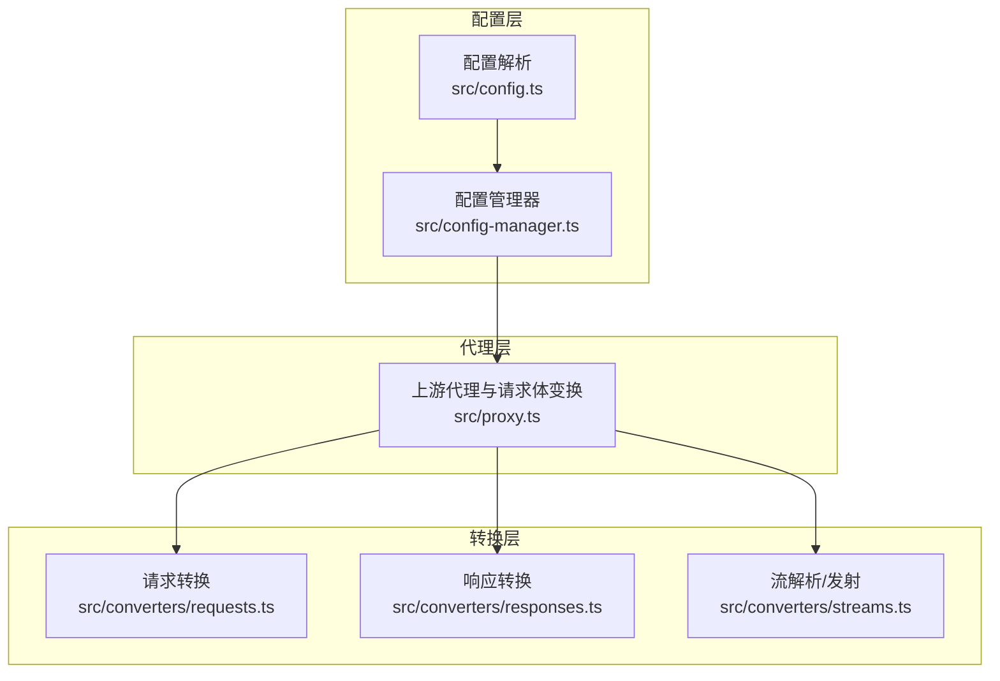
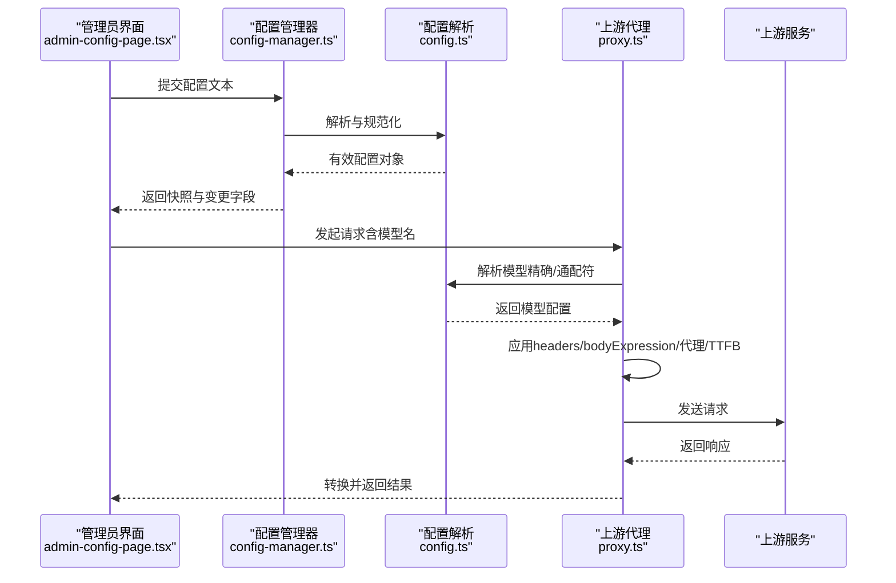
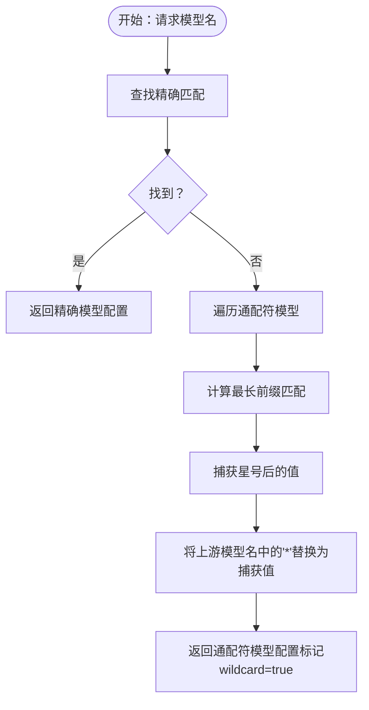
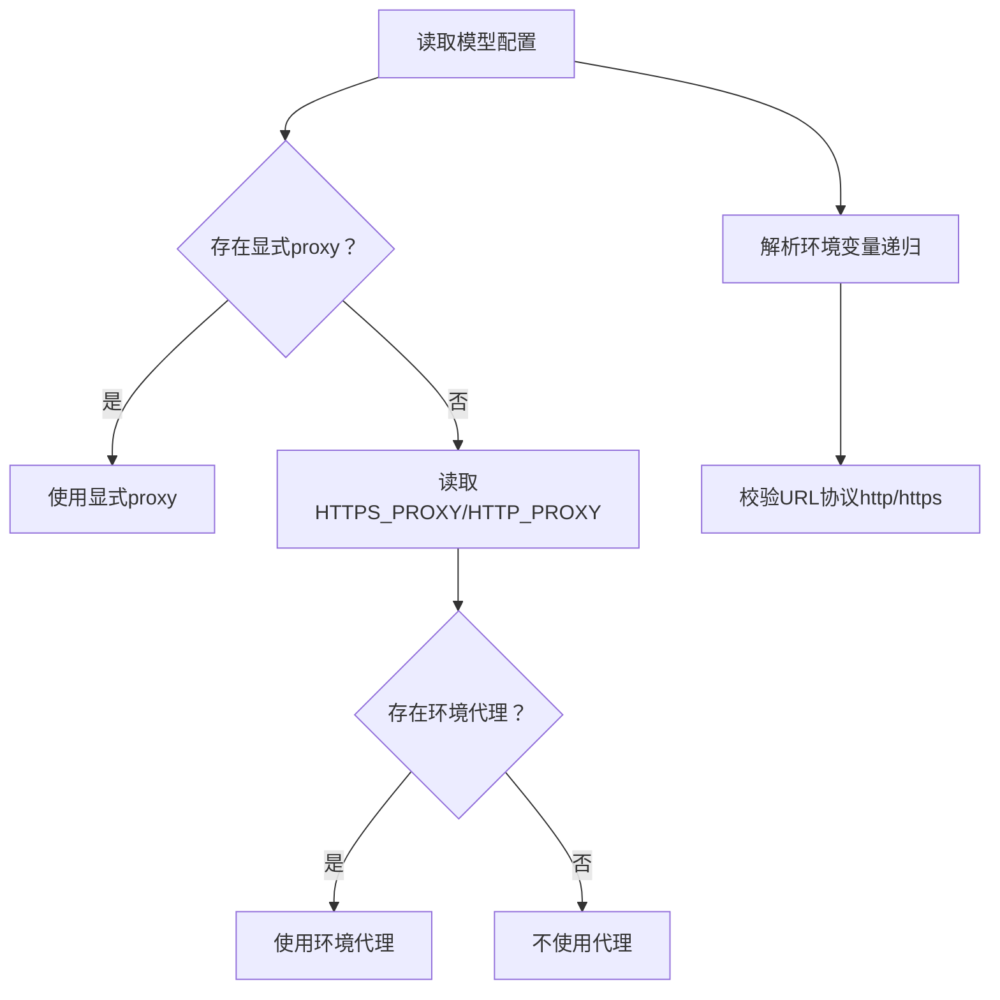
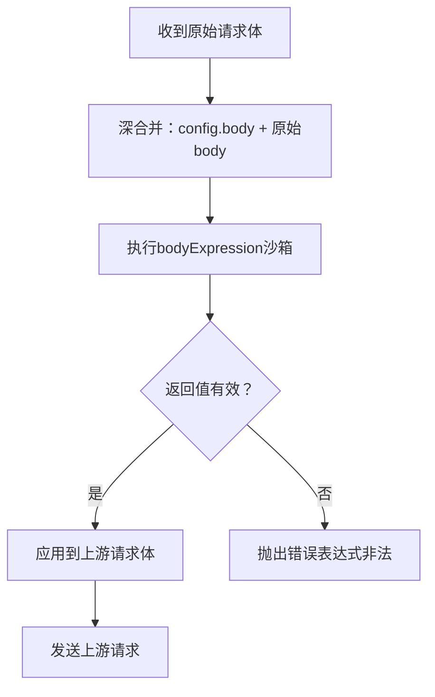
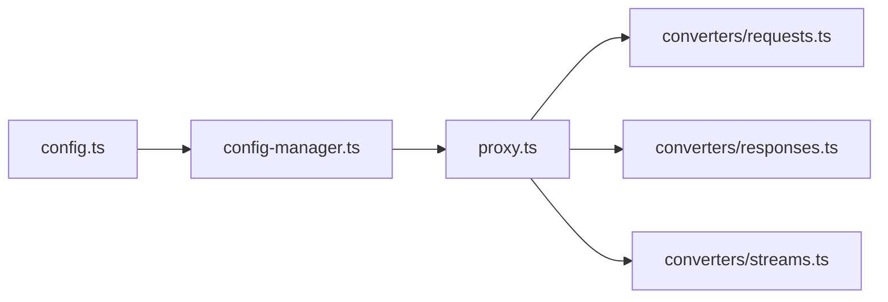

# 高级配置选项

<cite>
**本文档引用的文件**
- [src/config.ts](file://src/config.ts)
- [src/config-manager.ts](file://src/config-manager.ts)
- [src/proxy.ts](file://src/proxy.ts)
- [src/converters/requests.ts](file://src/converters/requests.ts)
- [src/converters/responses.ts](file://src/converters/responses.ts)
- [src/converters/streams.ts](file://src/converters/streams.ts)
- [src/admin-config-page.tsx](file://src/admin-config-page.tsx)
- [tests/run.ts](file://tests/run.ts)
</cite>

## 目录
1. [简介](#简介)
2. [项目结构](#项目结构)
3. [核心组件](#核心组件)
4. [架构总览](#架构总览)
5. [详细组件分析](#详细组件分析)
6. [依赖关系分析](#依赖关系分析)
7. [性能考虑](#性能考虑)
8. [故障排除指南](#故障排除指南)
9. [结论](#结论)
10. [附录](#附录)

## 简介
本文件面向需要精细控制与扩展行为的高级用户，系统性阐述模型配置中的高级特性与工作机制，包括：
- 通配符模型名称与请求解析
- 代理配置与环境变量解析
- 自定义头部与请求体表达式
- JSON-like 值处理与类型规范化
- 超时配置与图像模型支持
- 历史记录忽略策略
- 复杂场景示例（多模型组合、条件路由、动态参数替换）
- 配置验证规则与错误处理

## 项目结构
围绕高级配置的核心模块如下：
- 配置解析与规范化：src/config.ts
- 运行时热重载与监听：src/config-manager.ts
- 上游转发与请求体变换：src/proxy.ts
- 请求/响应/流转换器：src/converters/*

图表来源
- [src/config.ts:202-230](file://src/config.ts#L202-L230)
- [src/config-manager.ts:58-75](file://src/config-manager.ts#L58-L75)
- [src/proxy.ts:274-285](file://src/proxy.ts#L274-L285)
- [src/converters/requests.ts:38-81](file://src/converters/requests.ts#L38-L81)
- [src/converters/responses.ts:26-54](file://src/converters/responses.ts#L26-L54)
- [src/converters/streams.ts:106-114](file://src/converters/streams.ts#L106-L114)

章节来源
- [src/config.ts:1-307](file://src/config.ts#L1-L307)
- [src/config-manager.ts:1-173](file://src/config-manager.ts#L1-L173)
- [src/proxy.ts:1-630](file://src/proxy.ts#L1-L630)
- [src/converters/requests.ts:1-800](file://src/converters/requests.ts#L1-L800)
- [src/converters/responses.ts:1-318](file://src/converters/responses.ts#L1-L318)
- [src/converters/streams.ts:1-800](file://src/converters/streams.ts#L1-L800)

## 核心组件
- 模型配置接口与默认值
  - 字段：name、provider、base_url、api_key、model、image、ttfb_timeout、proxy、headers、body、bodyExpression、ignore_invalid_history
  - 默认值：记录最大条数、默认TTFB超时、图像模型TTFB超时
- 配置解析与规范化
  - 环境变量解析：${VAR} 替换
  - JSON-like 值解析：字符串尝试JSON.parse
  - 类型规范化：超时、正整数、布尔、代理URL校验
  - 模型级别默认值与合并
- 请求解析与通配符匹配
  - 精确匹配优先于通配符
  - 最长前缀通配符匹配，并对上游模型名进行占位符替换
- 代理与超时
  - 支持显式模型代理或环境代理变量
  - TTFB超时可按模型覆盖
- 请求体表达式
  - 使用沙箱执行表达式，允许对原始请求体进行深度变换
- 图像模型支持
  - provider=openai-image 的路径与超时默认值
- 历史记录忽略
  - Anthropic 请求转换时可忽略无效历史片段

章节来源
- [src/config.ts:9-22](file://src/config.ts#L9-L22)
- [src/config.ts:57-76](file://src/config.ts#L57-L76)
- [src/config.ts:78-87](file://src/config.ts#L78-L87)
- [src/config.ts:89-124](file://src/config.ts#L89-L124)
- [src/config.ts:146-175](file://src/config.ts#L146-L175)
- [src/config.ts:240-267](file://src/config.ts#L240-L267)
- [src/proxy.ts:274-276](file://src/proxy.ts#L274-L276)
- [src/proxy.ts:120-147](file://src/proxy.ts#L120-L147)
- [src/proxy.ts:41-59](file://src/proxy.ts#L41-L59)

## 架构总览
下图展示从配置到上游调用的关键流程，以及高级配置点如何介入。

图表来源
- [src/admin-config-page.tsx:373-488](file://src/admin-config-page.tsx#L373-L488)
- [src/config-manager.ts:81-131](file://src/config-manager.ts#L81-L131)
- [src/config.ts:202-230](file://src/config.ts#L202-L230)
- [src/proxy.ts:274-407](file://src/proxy.ts#L274-L407)

## 详细组件分析

### 通配符模型名称与请求解析
- 规则
  - 仅允许星号“*”出现在末尾且最多出现一次
  - 精确匹配优先于通配符匹配
  - 选择最长前缀的通配符模型，并将“*”替换为实际捕获值
- 公共模型名暴露
  - fallback 组名与所有模型 name 合并为公开模型集合
- 示例要点
  - gpt-5.* 优先于 gpt-* 匹配
  - gpt-5.6 → mirror/6/6（同时替换多个“*”）

图表来源
- [src/config.ts:240-267](file://src/config.ts#L240-L267)
- [src/config.ts:177-187](file://src/config.ts#L177-L187)
- [src/config.ts:57-59](file://src/config.ts#L57-L59)

章节来源
- [src/config.ts:177-187](file://src/config.ts#L177-L187)
- [src/config.ts:240-267](file://src/config.ts#L240-L267)
- [tests/run.ts:2873-2996](file://tests/run.ts#L2873-L2996)

### 代理配置与环境变量解析
- 代理解析顺序
  - 显式模型 proxy 字段
  - HTTPS_PROXY / HTTP_PROXY 环境变量
- 环境变量解析
  - 文本中 ${VAR} 形式的变量替换
  - 递归应用于字符串、数组、对象
- 代理URL规范
  - 必须为 http: 或 https: 协议
- 超时配置
  - server.ttfb_timeout 与模型级 ttfb_timeout 叠加
  - provider=openai-image 时使用专用默认超时

图表来源
- [src/proxy.ts:274-276](file://src/proxy.ts#L274-L276)
- [src/config.ts:61-76](file://src/config.ts#L61-L76)
- [src/config.ts:126-144](file://src/config.ts#L126-L144)
- [src/config.ts:159-160](file://src/config.ts#L159-L160)

章节来源
- [src/proxy.ts:274-276](file://src/proxy.ts#L274-L276)
- [src/config.ts:61-76](file://src/config.ts#L61-L76)
- [src/config.ts:126-144](file://src/config.ts#L126-L144)
- [src/config.ts:159-160](file://src/config.ts#L159-L160)

### 自定义头部与请求体表达式
- 自定义头部
  - 在 headers 中设置键值对，最终合并到上游请求头
- 请求体表达式
  - bodyExpression 以沙箱执行，接收 body 作为上下文
  - 表达式必须同步返回，且不能返回 undefined
  - 先应用 body（深合并），再应用 bodyExpression
- JSON-like 值
  - 字符串尝试 JSON.parse，非字符串保持原样
- OpenAI Responses 特殊处理
  - store=false 作为默认项（非透传场景）
  - 对未存储项 ID 的清理逻辑

图表来源
- [src/proxy.ts:115-151](file://src/proxy.ts#L115-L151)
- [src/proxy.ts:155-167](file://src/proxy.ts#L155-L167)
- [src/proxy.ts:120-147](file://src/proxy.ts#L120-L147)
- [src/config.ts:78-87](file://src/config.ts#L78-L87)

章节来源
- [src/proxy.ts:115-151](file://src/proxy.ts#L115-L151)
- [src/proxy.ts:120-147](file://src/proxy.ts#L120-L147)
- [src/config.ts:78-87](file://src/config.ts#L78-L87)
- [tests/run.ts:3565-3597](file://tests/run.ts#L3565-L3597)

### JSON-like 值处理与类型规范化
- JSON-like 值
  - 字符串两端去空格后尝试 JSON.parse
  - 成功则使用解析结果，否则保持原字符串
- 类型规范化
  - 超时：必须为正数
  - 正整数：必须为正整数
  - 布尔：支持 true/false 字符串
  - 代理URL：必须为 http/https
- 作用域
  - 服务器级与模型级字段均受上述规则约束

章节来源
- [src/config.ts:78-87](file://src/config.ts#L78-L87)
- [src/config.ts:89-124](file://src/config.ts#L89-L124)
- [src/config.ts:126-144](file://src/config.ts#L126-L144)

### 超时配置与图像模型支持
- 超时
  - server.ttfb_timeout 为全局默认
  - 模型级 ttfb_timeout 可覆盖
  - provider=openai-image 使用专用默认超时
- 图像模型
  - provider=openai-image 时，上游路径为 /images/{operation}
  - 默认超时更大，适配图像生成/编辑较长耗时

章节来源
- [src/config.ts:6-7](file://src/config.ts#L6-L7)
- [src/config.ts:159-160](file://src/config.ts#L159-L160)
- [src/proxy.ts:45-59](file://src/proxy.ts#L45-L59)

### 历史记录忽略与Anthropic兼容
- ignore_invalid_history
  - Anthropic 请求转换时可忽略无效历史片段
  - 用于兼容不同历史格式与避免上游拒绝

章节来源
- [src/config.ts:162](file://src/config.ts#L162)
- [src/converters/requests.ts:340-376](file://src/converters/requests.ts#L340-L376)

### 复杂场景示例与最佳实践
- 多模型组合
  - 使用通配符模型实现版本化路由（如 gpt-5.* → mirror/*/*）
  - fallback 组合多个模型，实现降级与负载均衡
- 条件路由
  - 精确模型优先，随后最长前缀通配符匹配
  - 结合 bodyExpression 动态注入条件参数
- 动态参数替换
  - 通过通配符捕获值替换上游模型名中的“*”
  - 在 bodyExpression 中基于捕获值构造消息或元数据

章节来源
- [src/config.ts:240-267](file://src/config.ts#L240-L267)
- [tests/run.ts:2962-2996](file://tests/run.ts#L2962-L2996)
- [tests/run.ts:3565-3597](file://tests/run.ts#L3565-L3597)

## 依赖关系分析
- 配置层
  - config.ts 定义接口、解析与规范化
  - config-manager.ts 负责热重载与变更检测
- 代理层
  - proxy.ts 依赖 config.ts 的模型配置与 streams.ts 的流解析
- 转换层
  - requests.ts/responses.ts/streams.ts 依赖 shared 工具与上下文

图表来源
- [src/config.ts:202-230](file://src/config.ts#L202-L230)
- [src/config-manager.ts:58-75](file://src/config-manager.ts#L58-L75)
- [src/proxy.ts:274-407](file://src/proxy.ts#L274-L407)
- [src/converters/requests.ts:38-81](file://src/converters/requests.ts#L38-L81)
- [src/converters/responses.ts:26-54](file://src/converters/responses.ts#L26-L54)
- [src/converters/streams.ts:106-114](file://src/converters/streams.ts#L106-L114)

章节来源
- [src/config.ts:202-230](file://src/config.ts#L202-L230)
- [src/config-manager.ts:58-75](file://src/config-manager.ts#L58-L75)
- [src/proxy.ts:274-407](file://src/proxy.ts#L274-L407)

## 性能考虑
- 通配符匹配
  - 最长前缀优先，减少不必要的遍历
- 流验证
  - SSE 流在缓冲超过阈值前进行有效性检查，避免无意义传输
- 超时控制
  - 按模型粒度设置 TTFB 超时，平衡延迟与稳定性
- 代理与网络
  - 优先使用显式代理，避免不必要的环境变量解析

## 故障排除指南
- 常见错误与定位
  - 无效通配符名称：确保“*”仅出现一次且位于末尾
  - 重复模型/分组名：检查模型 name 与 fallback 组名唯一性
  - 代理URL非法：确认协议为 http/https
  - 超时/正整数/布尔类型错误：检查数值范围与类型
  - bodyExpression 返回 undefined 或异步：确保同步返回且非 undefined
- 错误处理机制
  - 配置解析阶段抛出明确错误信息
  - 热重载时记录 lastError 并保留上次有效配置
  - 上游请求阶段对 HTML 响应、非SSE流等异常进行拦截与记录

章节来源
- [src/config.ts:182-187](file://src/config.ts#L182-L187)
- [src/config.ts:274-306](file://src/config.ts#L274-L306)
- [src/config.ts:126-144](file://src/config.ts#L126-L144)
- [src/proxy.ts:328-404](file://src/proxy.ts#L328-L404)
- [src/config-manager.ts:116-130](file://src/config-manager.ts#L116-L130)

## 结论
通过通配符模型、代理与超时、自定义头部与请求体表达式、JSON-like 值处理、图像模型支持与历史记录忽略等高级能力，系统实现了灵活而强大的模型路由与请求变换机制。配合严格的配置验证与热重载能力，可在生产环境中安全地演进与优化模型配置。

## 附录
- 配置字段速查
  - 模型级：name、provider、base_url、api_key、model、image、ttfb_timeout、proxy、headers、body、bodyExpression、ignore_invalid_history
  - 服务器级：port、ttfb_timeout、auth.token
  - 记录级：record.max_size
  - 分组：fallback（组名 → 模型数组）
- 管理界面提示
  - 保存后即时生效的字段：server.ttfb_timeout、record.max_size
  - 需要重启的字段：server.port（由配置管理器检测）

章节来源
- [src/config.ts:24-42](file://src/config.ts#L24-L42)
- [src/admin-config-page.tsx:588-612](file://src/admin-config-page.tsx#L588-L612)
- [src/config-manager.ts:44-49](file://src/config-manager.ts#L44-L49)