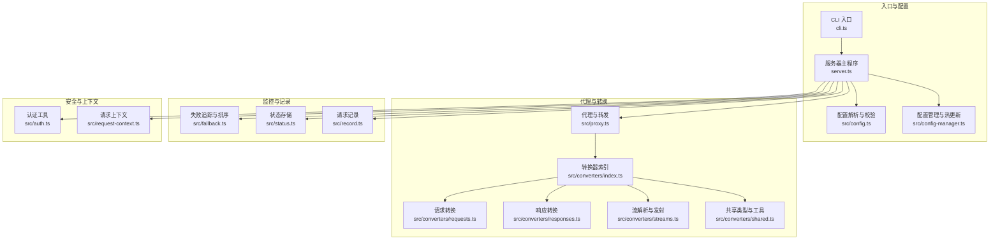
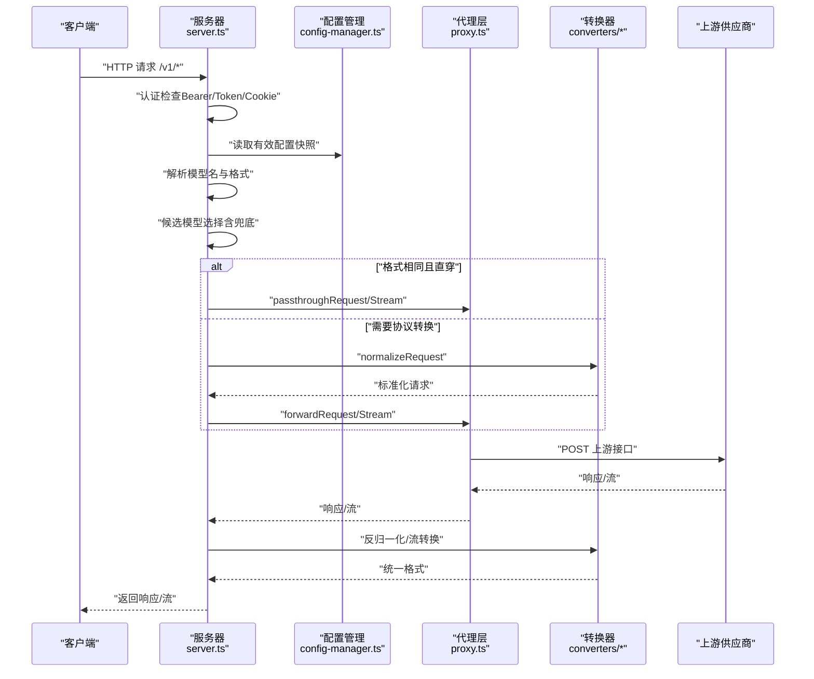
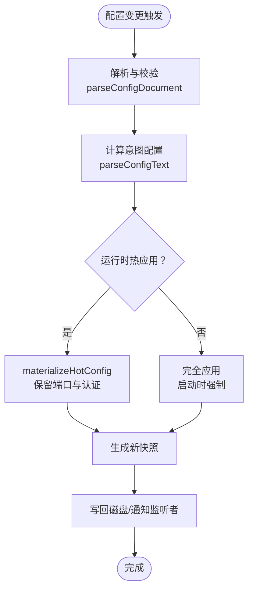
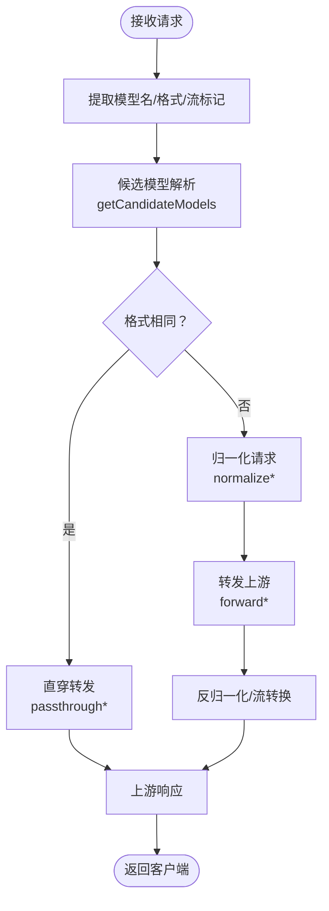
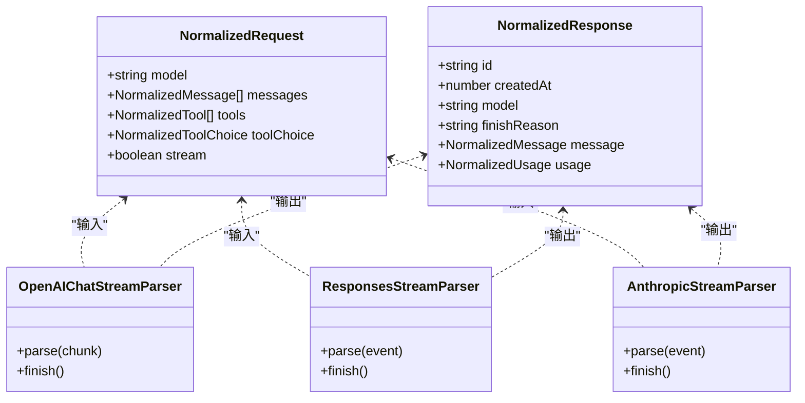
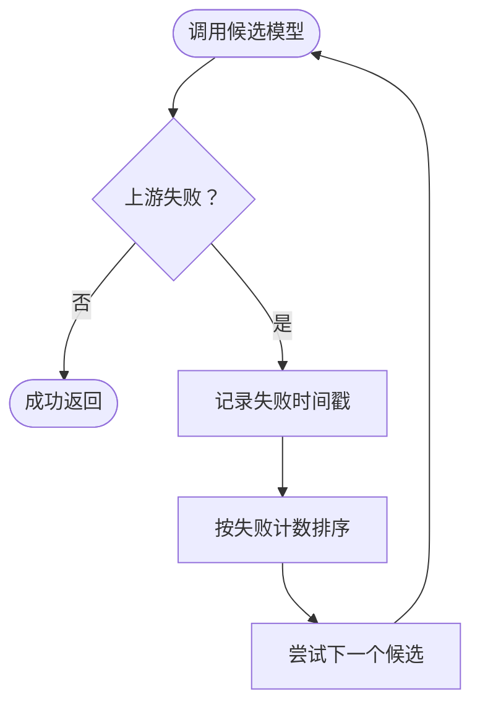
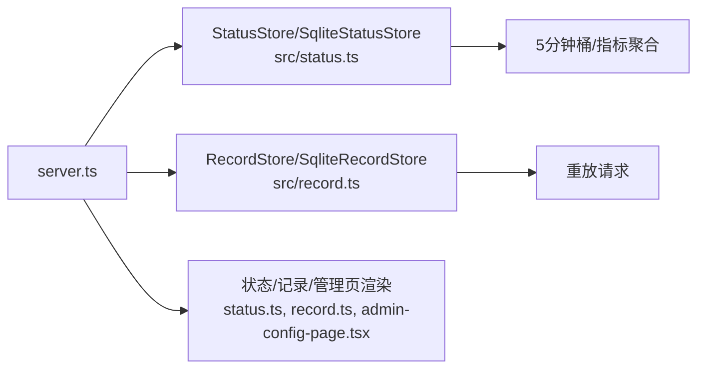
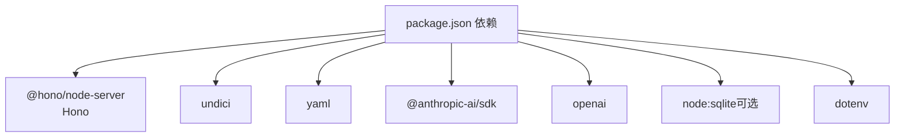

# 项目概述

<cite>
**本文档引用的文件**
- [README.md](file://README.md)
- [package.json](file://package.json)
- [server.ts](file://server.ts)
- [cli.ts](file://cli.ts)
- [src/config.ts](file://src/config.ts)
- [src/config-manager.ts](file://src/config-manager.ts)
- [src/proxy.ts](file://src/proxy.ts)
- [src/fallback.ts](file://src/fallback.ts)
- [src/status.ts](file://src/status.ts)
- [src/record.ts](file://src/record.ts)
- [src/converters/index.ts](file://src/converters/index.ts)
- [src/converters/requests.ts](file://src/converters/requests.ts)
- [src/converters/responses.ts](file://src/converters/responses.ts)
- [src/converters/streams.ts](file://src/converters/streams.ts)
- [src/converters/shared.ts](file://src/converters/shared.ts)
- [src/auth.ts](file://src/auth.ts)
- [src/request-context.ts](file://src/request-context.ts)
</cite>

## 目录
1. [简介](#简介)
2. [项目结构](#项目结构)
3. [核心组件](#核心组件)
4. [架构总览](#架构总览)
5. [详细组件分析](#详细组件分析)
6. [依赖关系分析](#依赖关系分析)
7. [性能考虑](#性能考虑)
8. [故障排除指南](#故障排除指南)
9. [结论](#结论)
10. [附录](#附录)

## 简介
nanollm 是一个轻量级的 LLM 模型代理服务，旨在简化本地化和多模型聚合场景下的统一接入。它提供与 OpenAI 兼容的 `/v1` 接口，支持多种模型供应商（OpenAI Chat、OpenAI Responses、Anthropic Messages），并内置配置热更新、认证、监控与调试记录能力。其核心价值在于：
- 统一多模型供应商接口，屏蔽协议差异
- 支持配置热更新与本地管理页，无需重启即可应用多数变更
- 提供兜底策略与失败追踪，提升稳定性
- 内建监控与记录，便于问题定位与性能分析

## 项目结构
项目采用模块化设计，核心由以下层次构成：
- CLI 入口与服务器启动：解析命令行参数、加载配置、初始化路由与中间件
- 配置系统：解析 YAML 配置、热更新监听、字段校验与生效范围判定
- 代理层：根据请求模型与格式，进行协议归一化/反归一化与上游转发
- 转换器：统一抽象 OpenAI Chat/Responses、Anthropic Messages 的消息与流格式
- 监控与记录：状态存储、请求记录与可视化页面
- 认证与上下文：请求 ID、认证令牌与 Cookie 管理

**图表来源**
- [cli.ts:1-5](file://cli.ts#L1-L5)
- [server.ts:1-1374](file://server.ts#L1-L1374)
- [src/config.ts:1-307](file://src/config.ts#L1-L307)
- [src/config-manager.ts:1-173](file://src/config-manager.ts#L1-L173)
- [src/proxy.ts:1-630](file://src/proxy.ts#L1-L630)
- [src/converters/index.ts:1-99](file://src/converters/index.ts#L1-L99)
- [src/converters/requests.ts:1-1239](file://src/converters/requests.ts#L1-L1239)
- [src/converters/responses.ts:1-318](file://src/converters/responses.ts#L1-L318)
- [src/converters/streams.ts:1-1270](file://src/converters/streams.ts#L1-L1270)
- [src/converters/shared.ts:1-385](file://src/converters/shared.ts#L1-L385)
- [src/fallback.ts:1-33](file://src/fallback.ts#L1-L33)
- [src/status.ts:1-363](file://src/status.ts#L1-L363)
- [src/record.ts:1-961](file://src/record.ts#L1-L961)
- [src/auth.ts:1-42](file://src/auth.ts#L1-L42)
- [src/request-context.ts:1-48](file://src/request-context.ts#L1-L48)

**章节来源**
- [README.md:1-309](file://README.md#L1-L309)
- [package.json:1-48](file://package.json#L1-L48)
- [server.ts:1-1374](file://server.ts#L1-L1374)

## 核心组件
- 配置系统
  - 解析 YAML 配置，校验字段合法性，支持环境变量注入与默认值
  - 支持模型、兜底分组、服务器参数与记录参数的热更新
- 代理与转发
  - 根据请求模型与格式，决定是否直穿或进行协议转换
  - 支持请求体深度合并与动态表达式改写，支持代理与超时控制
- 转换器
  - 归一化 OpenAI Chat/Responses、Anthropic Messages 的消息结构
  - 流式解析与发射，统一事件语义
- 兜底与失败追踪
  - 基于最近失败次数的排序策略，降低抖动
- 监控与记录
  - 内存/SQLite 状态存储，记录最近请求与重放能力
- 认证与上下文
  - Bearer Token 认证，Cookie 会话持久化，请求 ID 追踪

**章节来源**
- [src/config.ts:1-307](file://src/config.ts#L1-L307)
- [src/config-manager.ts:1-173](file://src/config-manager.ts#L1-L173)
- [src/proxy.ts:1-630](file://src/proxy.ts#L1-L630)
- [src/converters/index.ts:1-99](file://src/converters/index.ts#L1-L99)
- [src/fallback.ts:1-33](file://src/fallback.ts#L1-L33)
- [src/status.ts:1-363](file://src/status.ts#L1-L363)
- [src/record.ts:1-961](file://src/record.ts#L1-L961)
- [src/auth.ts:1-42](file://src/auth.ts#L1-L42)
- [src/request-context.ts:1-48](file://src/request-context.ts#L1-L48)

## 架构总览
下图展示了从客户端请求到上游模型供应商的关键路径，包括认证、配置解析、模型选择、协议转换与流式处理。

**图表来源**
- [server.ts:663-800](file://server.ts#L663-L800)
- [src/config-manager.ts:77-116](file://src/config-manager.ts#L77-L116)
- [src/proxy.ts:569-630](file://src/proxy.ts#L569-L630)
- [src/converters/requests.ts:38-164](file://src/converters/requests.ts#L38-L164)
- [src/converters/responses.ts:26-162](file://src/converters/responses.ts#L26-L162)

## 详细组件分析

### 配置系统与热更新
- 配置解析
  - 支持 server、record、models、fallback 等字段
  - 自动解析环境变量占位符，校验数值与 URL 类型
- 热更新机制
  - 文件监听与去抖，仅在内容变化时应用
  - 对不同字段区分“立即生效”与“需重启”的范围
- 配置管理器
  - 维护版本号、错误状态与监听回调
  - 提供“启动时强制应用”与“运行时热应用”的两种模式

**图表来源**
- [src/config-manager.ts:81-131](file://src/config-manager.ts#L81-L131)
- [src/config.ts:194-234](file://src/config.ts#L194-L234)

**章节来源**
- [src/config.ts:189-234](file://src/config.ts#L189-L234)
- [src/config-manager.ts:58-116](file://src/config-manager.ts#L58-L116)

### 代理与转发流程
- 模型选择
  - 精确匹配 → 兜底分组成员排序（基于最近失败次数）
  - 通配模型名支持，捕获后替换下游模型名
- 协议转换
  - 相同格式：直穿，减少转换开销
  - 不同格式：先归一化为内部结构，再反归一化为上游所需格式
- 请求体改写
  - 深度合并 body 与 bodyExpression 表达式
  - 支持 multipart/form-data 与 JSON 的特殊处理
- 超时与代理
  - per-model 与全局 TTFB 超时
  - 支持模型级代理优先于环境变量代理

**图表来源**
- [server.ts:487-530](file://server.ts#L487-L530)
- [src/proxy.ts:169-248](file://src/proxy.ts#L169-L248)
- [src/proxy.ts:569-630](file://src/proxy.ts#L569-L630)

**章节来源**
- [server.ts:487-530](file://server.ts#L487-L530)
- [src/proxy.ts:169-248](file://src/proxy.ts#L169-L248)
- [src/proxy.ts:569-630](file://src/proxy.ts#L569-L630)

### 转换器与流处理
- 请求转换
  - OpenAI Chat/Responses ↔ Anthropic Messages 的消息结构映射
  - 工具函数与自定义工具的序列化/反序列化
- 响应转换
  - 统一 finish_reason 与 usage 的归一化
- 流处理
  - SSE 解析器与事件序列化
  - 三类流解析器与发射器，保证跨供应商的一致事件语义

**图表来源**
- [src/converters/shared.ts:63-109](file://src/converters/shared.ts#L63-L109)
- [src/converters/streams.ts:118-251](file://src/converters/streams.ts#L118-L251)
- [src/converters/streams.ts:255-410](file://src/converters/streams.ts#L255-L410)
- [src/converters/streams.ts:414-490](file://src/converters/streams.ts#L414-L490)

**章节来源**
- [src/converters/requests.ts:38-164](file://src/converters/requests.ts#L38-L164)
- [src/converters/responses.ts:26-162](file://src/converters/responses.ts#L26-L162)
- [src/converters/streams.ts:118-490](file://src/converters/streams.ts#L118-L490)

### 兜底与失败追踪
- 失败追踪窗口为 5 分钟，记录失败时间戳
- 兜底成员排序：失败数减一后的升序，相同则按配置顺序
- 通过候选模型列表与排序结果，实现“最可能成功的上游优先”

**图表来源**
- [src/fallback.ts:3-33](file://src/fallback.ts#L3-L33)
- [server.ts:709-783](file://server.ts#L709-L783)

**章节来源**
- [src/fallback.ts:3-33](file://src/fallback.ts#L3-L33)
- [server.ts:709-783](file://server.ts#L709-L783)

### 监控与记录
- 状态存储
  - 内存版与 SQLite 版，支持 5 分钟粒度桶与保留期
  - 提供成功率、平均 TTFB、平均耗时、Token 速度等指标
- 请求记录
  - 支持内存与 SQLite，可配置最大条数
  - 记录客户端请求与上游尝试详情，支持重放
- 可视化页面
  - /status 展示健康状态
  - /record 展示最近请求
  - /admin 提供配置管理页

**图表来源**
- [src/status.ts:84-172](file://src/status.ts#L84-L172)
- [src/status.ts:227-362](file://src/status.ts#L227-L362)
- [src/record.ts:185-408](file://src/record.ts#L185-L408)
- [src/record.ts:433-676](file://src/record.ts#L433-L676)

**章节来源**
- [src/status.ts:1-363](file://src/status.ts#L1-L363)
- [src/record.ts:1-961](file://src/record.ts#L1-L961)

### 认证与请求上下文
- 认证
  - 支持 Authorization Bearer、查询参数 token 与同源 Cookie
  - 使用定时安全比较，避免时序攻击
- 请求上下文
  - 异步本地存储，携带 requestId 与 Responses 自定义工具名集合
  - 日志格式化包含时间戳与请求 ID 前缀

**章节来源**
- [src/auth.ts:1-42](file://src/auth.ts#L1-L42)
- [src/request-context.ts:1-48](file://src/request-context.ts#L1-L48)

## 依赖关系分析
- 运行时依赖
  - Hono 作为 Web 框架，提供路由与中间件
  - Undici 作为 HTTP 客户端，支持流与代理
  - YAML 解析与 SQLite（可选）持久化
- 开发依赖
  - TypeScript 编译与类型检查
  - TSX 开发服务器与测试脚本

**图表来源**
- [package.json:32-41](file://package.json#L32-L41)

**章节来源**
- [package.json:1-48](file://package.json#L1-L48)

## 性能考虑
- 代理直穿优化
  - 当请求格式与上游一致时，避免不必要的转换，减少 CPU 与内存占用
- 流式验证
  - SSE 流首包验证，过滤 ping-only 或空内容，避免无效传输
- 超时控制
  - per-model 与全局 TTFB 超时，防止慢上游阻塞
- 记录与状态
  - 内存模式适合开发与小规模使用；SQLite 模式适合生产与持久化需求
- 并发与资源
  - 使用异步本地存储与流式处理，降低阻塞风险

[本节为通用指导，不直接分析具体文件]

## 故障排除指南
- 认证失败
  - 确认 Authorization 头、查询参数 token 或 Cookie 是否正确
  - 注意定时安全比较，避免长度不等导致的误判
- 配置热更新无效
  - 检查字段是否属于“需重启”范围（如 server.port、server.auth.token）
  - 查看配置管理器的错误状态与日志
- 上游返回 HTML 错误页
  - 代理层会识别并报错，检查 base_url 与鉴权头
- SSE 流异常
  - 首包缓冲阈值限制，确认上游确实产生有效事件
- 记录与状态丢失
  - 默认内存模式在进程退出后清空；使用 SQLite 模式持久化

**章节来源**
- [src/auth.ts:11-18](file://src/auth.ts#L11-L18)
- [src/config-manager.ts:116-130](file://src/config-manager.ts#L116-L130)
- [src/proxy.ts:377-404](file://src/proxy.ts#L377-L404)
- [src/record.ts:441-498](file://src/record.ts#L441-L498)

## 结论
nanollm 通过统一的代理与转换层，将多供应商、多格式的 LLM 接口整合为一致的 `/v1` 入口，配合热更新、认证、监控与记录能力，适用于个人与小型团队的本地化与多模型聚合场景。其轻量与易用性使其成为 litellm 的有力补充，尤其在需要细粒度控制与本地部署时更具优势。

[本节为总结性内容，不直接分析具体文件]

## 附录

### 快速开始
- 安装与运行
  - 使用 npx 直接运行，或安装后使用二进制命令
  - 支持通过 --config 指定配置文件路径，或通过 CONFIG_PATH 环境变量
  - 支持 --storage sqlite 以启用 SQLite 持久化
- 基本配置
  - 在 config.yaml 中配置 server、models、fallback、record 等字段
  - 通过 /admin 页面进行可视化配置与热更新
- 访问与调试
  - /status 查看健康状态
  - /record 查看最近请求与重放
  - /v1/models 列出可用模型

**章节来源**
- [README.md:11-309](file://README.md#L11-L309)
- [server.ts:59-107](file://server.ts#L59-L107)
- [package.json:13-22](file://package.json#L13-L22)